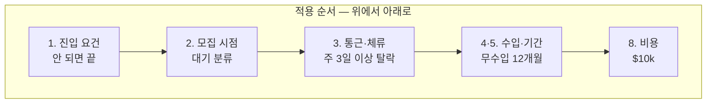

# 판단 기준과 탈락선

**확정일**: 2026-08-30 (M7 실습 1)
**출처**: 사용자 직접 응답 (2026-08-30) + M1~M6 조사 사실

## 왜 기준을 먼저 정하는가

**후보를 보면서 기준을 만들면 이미 마음에 든 것에 맞는 기준이 나온다.**

이 Topic에서 그 위험이 특히 컸다. M4·M5가 끝난 시점에 **열려 있는 문이 BBCC 하나뿐**이었다. 이 상태에서 기준을 만들면 무의식적으로 *"BBCC가 통과하는 기준"* 을 쓰게 된다 — 그리고 그건 판단이 아니라 합리화다.

그래서 **후보를 보지 않고 사용자에게 탈락선을 먼저 물었다.** 아래 8항목은 대입 전에 확정된 것이다.

## ⚠️ 확정 과정에서 전제가 뒤집혔다

`topic_starter`에는 이렇게 적혀 있었다.

> *"현재 이주 계획은 없다."*

M5는 이 문장을 근거로 BBCC를 **"이주 필요·무수입으로 조건이 가장 무겁다"** 고 평가했다. M6도 그 전제 위에서 "이주 장벽을 없앨 수 있는가"를 조사했다.

**사용자 확인 결과 전제가 달랐다.**

| 항목 | topic_starter 기반 추정 | **실제 (2026-08-30 확인)** |
|---|---|---|
| 체류·이주 | 이주 불가 → 원격만 | **주 1~2회 통학까지 가능** |
| 수입 공백 | (미확인) | **6개월~1년까지 감당** |
| 병행 | (미확인) | **풀타임 전환 수용** |
| 신체 요구 | (미확인) | **건설 숙련직까지 수용** |

> **"이주 계획이 없다"는 "180마일을 못 간다"가 아니었다.** 이주와 통학은 다른 축인데 한 문장으로 묶여 있었고, 두 모듈이 그 위에서 판단을 쌓았다.

이 확인 하나로 **BBCC의 가장 큰 장벽이 사라졌다.**

## 판단 기준 8항목

### 1. 진입 요건 충족 — 최우선

| | |
|---|---|
| **탈락선** | 학위·해당 분야 경력·군 복무·보안 인가(clearance)를 **요구**하면 탈락 |
| 근거 | 사용자는 IT 학위·데이터센터 경력·군 경력·clearance 모두 없음 |
| 확인된 사실 | 일반 DCT 공고는 **2+년 경력** 요구 (M5). WBLP는 학위·경력 요건 없음 (M2) |

**가장 먼저 적용한다.** 요건이 안 되면 나머지 항목은 볼 필요가 없다.

### 2. 모집 시점 — 탈락이 아니라 **분류**

| | |
|---|---|
| **판정** | 현재 접수 불가 + 재개일 미정 → **`대기`** (탈락 아님) |
| **탈락선** | 프로그램 자체가 **종료·폐지**된 경우만 탈락 |
| 근거 | 규칙 1 — 마감이 로드맵을 앞지르면 순서를 바꾼다. 닫힌 문은 다시 열린다 |

**닫혀 있다고 지우면 재개했을 때 다시 조사해야 한다.** 대기 목록에 알림과 함께 남긴다.

### 3. 통근·체류 부담

| | |
|---|---|
| **탈락선** | **주 3일 이상 현지 체류**가 필요하면 탈락 |
| **허용** | 주 1~2회 통학 · 학기당 1~2주 집중 체류 |
| 거리 상한 | 거주지(Bonney Lake) 기준 **편도 200마일** |
| 근거 | 사용자 응답 (2026-08-30) |

**BBCC(Moses Lake) 편도 180마일은 이 기준을 통과한다.** 다만 왕복 360마일·약 5~6시간이므로 **주 3일 이상이면 탈락**이다. → M6 문의 질문 1·3번의 답이 이 판정을 확정한다.

### 4. 훈련 중 수입

| | |
|---|---|
| **탈락선** | **무수입 기간 12개월 초과** 시 탈락 |
| 허용 | 12개월 이내 무수입 · 유급 견습은 제한 없음 |
| 근거 | 사용자 응답. M3 — *"Apprenticeships are jobs!"* 등록 견습만 훈련 중 수입이 있다 |

**BBCC 30학점(1년 이내)이 사정권 안에 들어온다.**

### 5. 소요 기간

| | |
|---|---|
| **탈락선** | **무수입 상태로 2년 초과** 시 탈락 |
| 예외 | **유급**이면 기간 제한 없음 (전기 견습 4~5년도 허용) |
| 근거 | 항목 4와 연동. 수입이 있으면 기간은 문제가 아니다 |

### 6. 신체 요구 — **탈락선 없음**

| | |
|---|---|
| **판정** | 교대근무 · 약 18kg 인양 · 건설 현장 **모두 수용** |
| 근거 | 사용자 응답 |

**규칙 3(두 트랙 같은 깊이)이 M7까지 유지된 것이 여기서 값을 했다.** 신체 요구로 건설 숙련직을 미리 걸렀다면 이 항목에서 후보 절반이 근거 없이 사라졌을 것이다.

### 7. 기존 활동 병행 — **탈락선 없음**

| | |
|---|---|
| **판정** | **풀타임 수용** — 이 일이 주업이 되는 것을 전제 |
| 근거 | 사용자 응답 |

파트타임만 가능했다면 BBCC 30학점·전기 견습 모두 탈락했을 항목이다.

### 8. 비용

| | |
|---|---|
| **탈락선** | 자부담 총액 **$10,000 초과** 시 탈락 |
| 완화 | 장학금·보조금이 확인되면 그 금액을 차감해 판정 |
| 근거 | 명시적 응답 없음 → **보수적 가정.** 확인 필요 항목으로 표시 |
| 확인된 사실 | Microsoft 장학금이 BBCC 등록금·교재·응시료 커버 (M2). **실액 미확인** (M5부터 이월) |

> ⚠️ **8번만 사용자에게 확인하지 않은 항목이다.** 다른 7개는 직접 응답이고 이것만 추정이다. 대입 결과가 이 항목 때문에 갈리면 **반드시 사용자에게 되물어야 한다.**

## 우선순위

**6·7번은 탈락선이 없으므로 순서에서 뺐다** — 아무것도 거르지 않는다. 다만 기록은 남긴다. **탈락선이 없다는 것 자체가 정보다**(무엇이 제약이 아닌지를 안다).

## 이 기준의 한계

- **8번(비용)은 추정이다.** 나머지 7개와 신뢰도가 다르다
- **3번의 "주 1~2회"는 지속 가능성을 검증하지 않았다.** 왕복 360마일을 1년간 유지할 수 있는지는 해 봐야 안다. 한 학기 뒤 재평가 항목으로 남긴다
- **가족·건강 등 이 목록에 없는 요인**은 다루지 않았다. 판단 시 별도로 고려해야 한다
