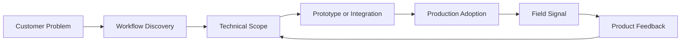

# FDE Definition

## Two-Sentence Definition

A Forward Deployed Engineer (FDE) is a customer-facing engineer who works close to the customer's operational environment to turn ambiguous business problems into working software, data, or AI systems. The role combines engineering, product feedback, consulting-style problem framing, and deployment ownership, with the goal of driving real production adoption rather than only building demos.

## Short Definition

An FDE is an engineer deployed close to the customer to discover the real workflow, build or adapt a technical solution, deploy it into use, and bring the lessons back to the product team.

## What Makes FDE Different

| Role | Primary Focus | Typical Output | Difference from FDE |
|---|---|---|---|
| Software Engineer | Build product features and systems | Code, services, infrastructure | Usually less embedded in customer workflow |
| Consultant | Diagnose business problems and recommend change | Strategy, process design, reports | Usually less responsible for production code |
| Solutions Engineer | Support sales and technical validation | Demos, proof of concept, technical answers | Often closer to pre-sales than long-term deployment |
| Solutions Architect | Design technical architecture | Architecture, integration plan | May not own hands-on implementation and adoption |
| FDE | Make the product work in the customer's real environment | Prototype, integration, rollout, feedback loop | Owns the path from field problem to production adoption |

## The FDE Responsibility Loop

## Key Concepts

### Forward Deployed

"Forward deployed" means the engineer is close to the customer's operating context. This does not always mean sitting physically onsite, but it does mean working from the customer's actual constraints, data, processes, and adoption barriers.

### Production Adoption

FDE work is judged by whether the system becomes useful in real workflow. A polished demo is not enough. The solution must survive permissions, messy data, unclear ownership, user training, latency, cost, security, and handoff.

### Field Signal

The customer environment produces signals that the product team cannot easily see from headquarters. These signals include missing features, unclear APIs, broken assumptions, adoption blockers, eval failures, and patterns that can become reusable product capabilities.

### Hybrid Role

FDE is a hybrid role. It includes engineering, customer communication, product judgment, system design, deployment, and sometimes GTM support. The blend differs by company, but the core is the same: turn field problems into working systems.

## AI-Era Definition

In AI companies, an FDE often helps customers move from "we tried the model" to "this AI workflow runs in our business process." That requires understanding LLM behavior, RAG, agent workflows, evals, data boundaries, observability, security, and adoption metrics.

## Practical Test

If a role repeatedly involves the following verbs, it is likely FDE-like:

- discover customer workflow
- scope ambiguous problems
- build prototypes
- integrate with customer systems
- evaluate model or system behavior
- unblock deployment
- drive adoption
- generalize customer learnings into product feedback

If the role mainly involves presenting slides, coordinating stakeholders, or running demos without implementation and deployment responsibility, it is probably FDE-adjacent rather than core FDE.

