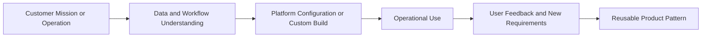

# Palantir FDE Origin

## Why Palantir Matters

Palantir is one of the companies most strongly associated with the Forward Deployed Engineer model. Its work with government agencies, defense, finance, and large enterprises required more than shipping a generic software product. The product had to be adapted to messy operational workflows, sensitive data, complex permissions, and urgent decision-making contexts.

That environment created a role pattern: engineers who could work close to the customer, understand operational problems, build or configure technical solutions, and feed learnings back into the platform.

## Core Palantir-Style Pattern

## Key Elements

### Embedded Delivery

The team works close to the customer. This proximity helps the engineer see problems that would not appear in a normal requirements document: hidden workflow dependencies, data quality issues, user trust barriers, political constraints, and operational urgency.

### Operational Workflow

The goal is not just analytics or reporting. The goal is to affect decisions and actions inside the customer's operation. A solution is useful only if it changes how people work.

### Platform Plus Field Work

Palantir's model combines a platform with forward deployed work. The platform provides reusable capability, but field teams adapt it to real customer environments.

### Reusable Pattern

A strong FDE does not only solve one customer's problem. They identify what should become a product feature, playbook, integration pattern, or repeatable deployment method.

## FDE vs Deployment Strategist

Palantir also uses roles such as Deployment Strategist. The exact boundaries can vary, but the general distinction is useful:

| Role | Typical Emphasis |
|---|---|
| FDE | Hands-on technical implementation, data/system modeling, engineering problem solving |
| Deployment Strategist | Customer mission, operating model, stakeholder alignment, deployment strategy |

In practice, both roles may overlap. The important point is that Palantir-style deployment is not purely technical and not purely advisory. It combines operational understanding with technical execution.

## How This Connects to AI FDE

Modern AI companies face a similar adoption problem. Customers can access powerful models, but they still need help with:

- identifying the right workflow
- preparing data and context
- designing safe integration
- measuring model behavior
- handling security and compliance
- training users
- feeding field learnings back into product

This is why the FDE pattern reappears in AI companies. The product is different, but the adoption gap is similar.

## Main Lesson

The Palantir origin shows that FDE is not a job title invented for branding. It is a response to a real enterprise problem: complex software does not create value until it fits the customer's operational workflow.

