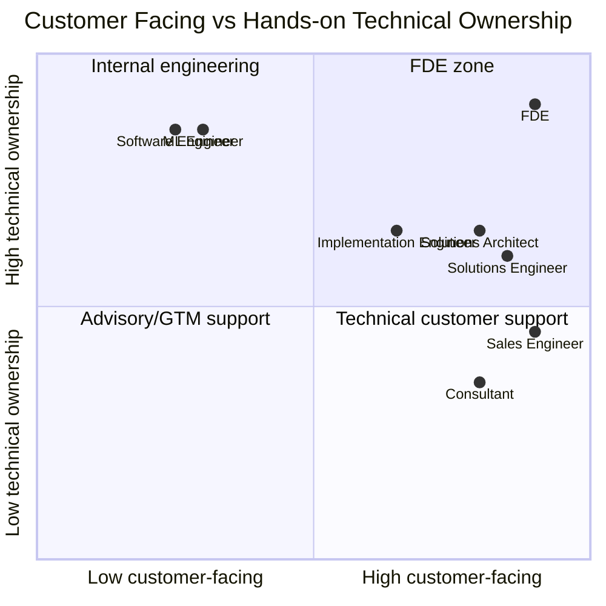

# Role Taxonomy

## Two Axes

FDE and adjacent roles can be understood along two axes:

1. **Customer-facing intensity**: How directly does the role work with customers or external stakeholders?
2. **Hands-on technical ownership**: How much does the role build, integrate, debug, or deploy systems?

FDE sits high on both axes. It is customer-facing and technically hands-on.

## Role Comparison

| Role | Customer-Facing | Hands-On Technical | Typical Output | FDE Difference |
|---|---:|---:|---|---|
| Software Engineer | Low to medium | High | Product code, systems | Less embedded in customer workflow |
| ML Engineer | Low to medium | High | Models, pipelines, ML systems | Less focused on customer deployment and adoption |
| Applied AI Engineer | Medium | High | AI applications, prototypes, integrations | May be FDE-like if customer-facing is strong |
| Solutions Engineer | High | Medium | Demos, technical validation, pre-sales support | Often less responsible for production deployment |
| Sales Engineer | High | Low to medium | Sales support, demos, objection handling | More GTM than deployment |
| Solutions Architect | High | Medium | Architecture, integration plan | May not own implementation details |
| Consultant | High | Low to medium | Strategy, process, operating model | Often less code and deployment ownership |
| Implementation Engineer | Medium to high | Medium | Configuration, integration, rollout | May be narrower than FDE |
| FDE | High | High | Prototype, integration, deployment, feedback loop | Combines field context and technical ownership |

## 2x2 Role Map

## Role Boundaries

### FDE vs Solutions Engineer

Solutions engineers often support pre-sales, demos, and technical validation. FDEs may support sales, but the core responsibility is deeper deployment and adoption.

### FDE vs Consultant

Consultants diagnose and recommend. FDEs must also build or deeply guide technical implementation.

### FDE vs Applied AI Engineer

Applied AI engineers build AI applications. If the role is embedded in customer workflows and owns adoption, it becomes FDE-like.

### FDE vs Solutions Architect

Solutions architects design systems and integrations. FDEs are usually more involved in building, debugging, and learning from field deployment.

## Practical Rule

A role is closer to FDE when it includes:

- ambiguous customer problem discovery
- hands-on technical implementation
- integration with real customer systems
- eval or production quality responsibility
- rollout and adoption support
- product feedback from field work

It is less FDE-like when it is mainly:

- sales demo
- account management
- slide-based advisory work
- internal product engineering without customer context
- project coordination without technical ownership

