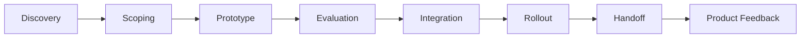

# AI FDE Delivery Lifecycle

## Lifecycle Overview

## 1. Discovery

The FDE first understands the customer's real workflow. This includes users, pain points, data sources, tools, permissions, business outcomes, and adoption blockers. The goal is not to collect every requirement. The goal is to identify the workflow where AI can create measurable value.

Key outputs:

- workflow map
- stakeholder map
- pain point list
- data readiness notes
- initial success metric

## 2. Scoping

Scoping turns a broad customer desire into a constrained pilot. Good FDE scoping defines what will be built, what will not be built, what data is required, how success will be measured, and what risks must be controlled.

Key outputs:

- pilot scope
- use case definition
- integration boundary
- risk checklist
- expected success metric

## 3. Prototype

The prototype proves whether the workflow can work. It may be a web app, notebook, API integration, RAG assistant, agent workflow, or internal tool. The point is to learn quickly while preserving the path to production.

Key outputs:

- working demo
- demo script
- architecture sketch
- feedback log

## 4. Evaluation

AI systems require evaluation before production use. The FDE defines golden examples, scoring rubrics, failure modes, human review criteria, and regression checks.

Key outputs:

- eval dataset
- quality metrics
- failure taxonomy
- human review policy

## 5. Integration

Integration connects the AI workflow to customer systems. This is where APIs, auth, data pipelines, logging, permissions, latency, and cost become concrete.

Key outputs:

- integration plan
- API/data map
- security review notes
- observability plan

## 6. Rollout

Rollout moves from pilot to real users. The FDE supports training, documentation, change management, feedback collection, and metric tracking.

Key outputs:

- rollout plan
- enablement material
- adoption dashboard
- issue tracker

## 7. Handoff

Handoff ensures the solution can continue without the FDE being the only operator. The customer and internal product/support teams need documentation, ownership, monitoring, and escalation paths.

Key outputs:

- runbook
- owner list
- support path
- product feedback summary

## Main Principle

The FDE lifecycle is not linear once and done. It loops. Evaluation may send the project back to scoping. Rollout may reveal missing product features. Customer feedback may become reusable product direction.

