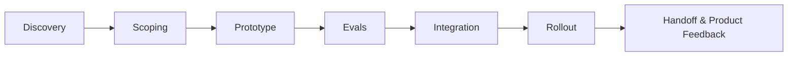

# AI FDE Delivery Lifecycle

## 1. 전체 흐름

AI FDE의 프로젝트는 보통 아래 7단계로 진행된다.



이 lifecycle은 OpenAI식 FDE가 말하는 discovery, technical scoping, system design, build, production rollout과 연결된다. Scale AI와 Cursor 사례를 보면 eval, integration, observability, workflow hardening이 특히 중요하다.

### M4와의 연결

M4에서 FDE와 Applied AI Engineer, Solutions Engineer, Solutions Architect를 구분할 때 핵심 기준은 책임의 끝이었다. M5에서는 그 책임의 끝을 더 구체적으로 본다. FDE는 AI 기능을 만드는 데서 끝나지 않고, 고객 workflow 안에서 실제 사용되고 측정되고 운영되는 상태까지 lifecycle을 끌고 간다.

## 2. Step 1 - Discovery

### 목적

고객이 진짜로 해결해야 하는 workflow bottleneck을 찾는다. 이 단계에서 FDE는 "AI로 무엇을 할 수 있나"보다 "고객 업무에서 반복되고 비싸고 품질 문제가 큰 작업은 무엇인가"를 먼저 본다.

### 입력

- 고객의 현재 업무 프로세스
- 사용자 인터뷰
- 시스템/데이터 접근 가능성
- 보안/권한/규제 제약
- 기존 tool stack
- 성공 기준에 대한 가설

### 산출물

- workflow map
- user pain point list
- candidate use case list
- feasibility/risk memo
- stakeholder map

### 실패 위험

- 고객이 말한 요구사항을 그대로 구현한다.
- AI 적용 가능성만 보고 business value를 검증하지 않는다.
- 실제 사용자가 아니라 executive sponsor만 인터뷰한다.

## 3. Step 2 - Scoping

### 목적

모호한 문제를 2-6주 안에 검증 가능한 technical scope로 줄인다. FDE는 이 단계에서 무엇을 만들지뿐 아니라 무엇을 만들지 않을지도 정해야 한다.

### 입력

- discovery 결과
- 사용 가능한 데이터와 API
- 고객 보안/컴플라이언스 요구사항
- target user와 success metric

### 산출물

- problem statement
- user workflow before/after
- architecture sketch
- MVP scope
- non-goals
- evaluation plan
- rollout assumption

### 실패 위험

- MVP가 너무 크다.
- success metric이 없다.
- 데이터 접근과 권한 문제가 뒤늦게 발견된다.
- 모델 성능을 어떻게 판단할지 정하지 않은 채 prototype부터 만든다.

## 4. Step 3 - Prototype

### 목적

고객이 실제로 만져보고 판단할 수 있는 첫 working version을 만든다. prototype은 presentation이 아니라 workflow 검증 도구다.

### 일반 구성

- simple UI 또는 internal tool
- LLM API 또는 agent orchestration
- RAG/data connector
- auth/permission mock 또는 제한된 권한 모델
- logging
- sample eval set

### 산출물

- clickable demo
- architecture note
- assumptions list
- known limitations
- next iteration backlog

### 실패 위험

- demo는 멋지지만 실제 데이터와 연결되지 않는다.
- 모델 응답 품질을 체계적으로 평가하지 않는다.
- 고객 workflow에서 누가 언제 쓰는지 불명확하다.

## 5. Step 4 - Evals

### 목적

AI system이 고객 업무 목표를 달성하는지 측정한다. AI FDE에게 eval은 nice-to-have가 아니라 production rollout의 안전장치다.

### eval 종류

| eval 유형 | 질문 |
|---|---|
| Task success eval | 모델/agent가 업무를 완료했는가? |
| Retrieval eval | 필요한 문서/데이터를 찾았는가? |
| Groundedness eval | 답변이 출처에 근거하는가? |
| Safety eval | 금지된 정보나 위험한 행동을 하지 않는가? |
| Human review eval | 사람이 보기에 실제 업무에 쓸 수 있는가? |
| Regression eval | 새 버전이 이전보다 나빠지지 않았는가? |

### 산출물

- eval dataset
- scoring rubric
- baseline result
- failure category
- acceptance threshold
- regression test plan

### 실패 위험

- "좋아 보인다"는 감각 평가에 의존한다.
- rare but high-risk failure를 놓친다.
- 고객 domain expert의 review 없이 general benchmark만 본다.

## 6. Step 5 - Integration

### 목적

prototype을 고객의 실제 data, identity, permission, workflow system과 연결한다.

### 통합 대상

- SSO/identity provider
- document repository
- data warehouse
- CRM/ERP/ticketing system
- internal API
- notification system
- audit/logging system

### 산출물

- integration architecture
- data flow diagram
- permission model
- error handling plan
- deployment runbook
- security review notes

### 실패 위험

- prototype permission 모델이 production에서 깨진다.
- 데이터 freshness와 source-of-truth가 불명확하다.
- 고객 내부 시스템 rate limit, latency, schema change를 고려하지 않는다.

## 7. Step 6 - Rollout

### 목적

실제 사용자가 반복적으로 쓰게 만든다. rollout은 launch announcement가 아니라 behavior change를 만드는 과정이다.

### rollout 구성

- pilot user group
- onboarding/training
- success metric tracking
- feedback channel
- escalation path
- weekly adoption review

### 산출물

- rollout plan
- training material
- adoption dashboard
- issue tracker
- support playbook
- go/no-go decision memo

### 실패 위험

- pilot user가 실제 target user와 다르다.
- 사용자는 tool을 켰지만 workflow는 바뀌지 않는다.
- failure feedback이 product team에 전달되지 않는다.

## 8. Step 7 - Handoff & Product Feedback

### 목적

고객이 운영 가능한 상태로 넘기고, 현장 학습을 reusable pattern으로 만든다.

### 산출물

- handoff documentation
- ownership matrix
- monitoring dashboard
- known issue list
- reusable playbook
- product feedback memo
- next account replication plan

### 실패 위험

- FDE가 떠나면 시스템이 유지되지 않는다.
- 고객별 custom work가 제품 학습으로 환류되지 않는다.
- 성공 사례가 다음 고객에게 재사용되지 않는다.

## 9. AI FDE lifecycle의 핵심 판단

| 단계 | FDE가 내려야 하는 핵심 결정 |
|---|---|
| Discovery | 이 문제가 AI로 풀 가치가 있는가? |
| Scoping | 어디까지가 MVP이고 무엇을 제외할 것인가? |
| Prototype | 어떤 최소 시스템이 workflow를 검증할 수 있는가? |
| Evals | 무엇을 기준으로 "충분히 좋다"고 말할 것인가? |
| Integration | 고객의 실제 데이터/권한/시스템에 어떻게 안전하게 붙일 것인가? |
| Rollout | 누가 반복적으로 쓰고 어떤 행동이 바뀌어야 하는가? |
| Handoff | 이 경험을 고객 운영과 제품 개선으로 어떻게 남길 것인가? |

## 10. Demo-to-Production Gap

AI demo가 빠르게 만들어지는 시대일수록 FDE의 가치는 demo 이후의 gap을 메우는 데 있다. 아래 표는 prototype에서는 쉽게 넘어가지만 production에서는 반드시 해결해야 하는 차이를 정리한 것이다.

| 영역 | Demo 상태 | Production 상태 |
|---|---|---|
| 데이터 | 샘플 문서 또는 CSV | 실제 source-of-truth, freshness, 권한 반영 |
| 인증/권한 | 단일 테스트 계정 | SSO, role-based access, audit log |
| 품질 평가 | 몇 개 예시를 눈으로 확인 | eval set, threshold, regression test |
| 실패 처리 | 실패하면 다시 시도 | fallback, retry, escalation, disable path |
| 비용/지연 | 크게 고려하지 않음 | p50/p95 latency, cost per task, budget guardrail |
| 운영 | 만든 사람이 직접 봄 | runbook, owner, support workflow |
| adoption | demo에서 반응 확인 | 반복 사용, workflow change, business metric 추적 |

이 gap을 이해하면 "AI를 만들 수 있다"와 "AI FDE로 일할 수 있다"의 차이가 보인다. Applied AI Engineer가 내부 제품 기능을 잘 만드는 역할이라면, FDE는 고객 환경의 이 gap을 직접 발견하고 줄이는 역할에 가깝다.

## 11. Lifecycle 실습: 사내 문서 AI Assistant

아래 가상 시나리오를 lifecycle에 적용한다.

**시나리오**: 한 엔터프라이즈 고객이 사내 정책 문서, 계약서, 지원 티켓을 검색하고 답변하는 AI assistant를 원한다.

| 단계 | 학습자가 작성할 내용 |
|---|---|
| Discovery | 실제 사용자는 누구이며 어떤 질문을 반복하는가? |
| Scoping | 2-6주 MVP에서 포함할 문서와 제외할 문서는 무엇인가? |
| Prototype | 어떤 UI, retrieval, model, logging이 최소로 필요한가? |
| Evals | 좋은 답변, 틀린 답변, 위험한 답변을 어떻게 구분할 것인가? |
| Integration | 문서 권한, SSO, source freshness를 어떻게 반영할 것인가? |
| Rollout | pilot user, training, adoption metric은 무엇인가? |
| Handoff | 운영 owner, runbook, product feedback memo는 어떻게 남길 것인가? |

성공 기준은 "챗봇이 답을 한다"가 아니다. 고객이 기존 검색/문의 workflow보다 더 빠르고 안전하게 업무를 처리하고, 실패 유형이 eval과 product backlog로 누적되는 상태가 성공 기준이다.

## 12. AI에게 지시하는 연습

M5의 학습 목적은 모든 기술을 암기하는 것이 아니라, AI와 전문가에게 정확한 지시를 내릴 수 있는 판단 기준을 갖추는 것이다. 아래 프롬프트를 사용해 본다.

```text
너는 AI FDE입니다. 엔터프라이즈 고객의 사내 문서 기반 AI assistant를 production pilot으로 가져가야 합니다. Discovery, Scoping, Prototype, Evals, Integration, Rollout, Handoff 단계별로 필요한 산출물, 주요 위험, go/no-go 기준을 표로 작성해 주세요. 특히 permission model, eval threshold, observability, adoption metric을 반드시 포함해 주세요.
```

결과를 평가할 때는 단계가 빠졌는지보다, 각 단계의 판단 기준이 production adoption까지 이어지는지를 본다.

## 13. 결론

AI FDE의 가치는 demo 속도가 아니라 production adoption까지 가는 판단력에 있다. 좋은 FDE는 모델을 잘 쓰는 사람을 넘어, 고객 workflow를 이해하고, 시스템을 만들고, 품질을 평가하고, 보안과 운영을 고려하며, 제품팀이 재사용할 수 있는 field learning을 남기는 사람이다.
