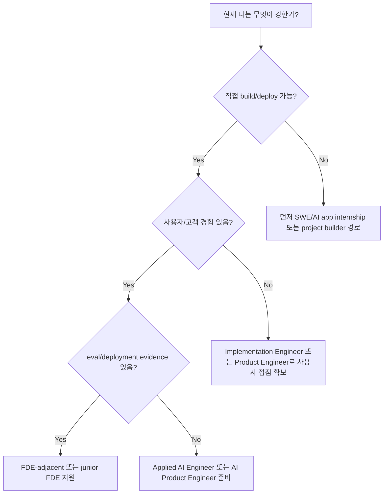

# Six-Month Junior FDE Preparation Plan

## 계획의 전제

이 계획은 학생/주니어가 6개월 안에 senior FDE 공고를 바로 충족한다는 뜻이 아니다. 목표는 FDE형 증거를 만드는 것이다. 즉 고객 문제를 정의하고, AI workflow를 만들고, 배포하고, eval로 품질을 측정하고, feedback을 받아 개선한 기록을 남긴다.

## 6개월 목표

6개월이 끝났을 때 다음 산출물이 있어야 한다.

- AI workflow project 3개
- 각 프로젝트별 README, architecture note, eval report
- 사용자 또는 가상 고객 문제 정의서
- deployment URL 또는 실행 가능한 demo
- 2분 portfolio pitch
- FDE-adjacent role 지원용 resume bullet 6-8개

## 월별 계획

| 월 | 목표 | 핵심 활동 | 산출물 |
|---:|---|---|---|
| 1개월차 | 기본기 정렬 | Python 또는 TypeScript 선택, API app, GitHub README, 간단한 배포 | `hello-ai-workflow` mini project |
| 2개월차 | RAG 업무봇 | 문서 ingestion, retrieval, answer generation, source citation, 30개 eval set | RAG 업무봇 v1 |
| 3개월차 | Workflow automation | ticket/email/document workflow 중 하나를 자동화하고 human-in-the-loop를 설계 | automation workflow demo |
| 4개월차 | Eval dashboard | failure taxonomy, golden dataset, before/after score, latency/cost tracking | eval dashboard |
| 5개월차 | Customer discovery | 실제 사용자 2-3명 인터뷰, workflow map, adoption blocker, iteration | discovery report + v2 개선 |
| 6개월차 | Portfolio packaging | 프로젝트 3개를 FDE narrative로 정리하고 resume/LinkedIn/2분 pitch 작성 | portfolio hub + resume bullets |

## 주차별 실행 예시

### 1개월차: 기본기 정렬

| 주 | 작업 | 성공 기준 |
|---:|---|---|
| 1주 | Python/FastAPI 또는 TypeScript/Next.js 선택 | API endpoint 2개 구현 |
| 2주 | LLM API 호출과 structured output | JSON output validation 성공 |
| 3주 | 간단한 UI 또는 CLI 작성 | 사용자가 입력하고 결과를 확인 |
| 4주 | 배포와 README 작성 | 배포 URL 또는 실행 가이드 완성 |

### 2-3개월차: 첫 FDE형 프로젝트

RAG 업무봇과 workflow automation은 단순 기능 구현이 아니라 고객 문제를 먼저 정해야 한다. 예를 들어 "회의록에서 action item을 찾는다"보다 "팀장이 매주 놓치는 follow-up을 줄인다"가 더 FDE형 문제 정의다.

| 작업 | FDE형 기준 |
|---|---|
| 문제 정의 | 누가, 어떤 workflow에서, 어떤 반복 문제를 겪는지 설명 |
| 데이터 연결 | 문서, ticket, email, spreadsheet 등 실제 업무 데이터 형태 사용 |
| AI 기능 | retrieval, summarization, classification, tool call 중 하나 이상 |
| Eval | 정답 예시, 실패 유형, scoring rubric 포함 |
| 배포 | 다른 사람이 따라 실행하거나 써볼 수 있음 |

### 4-5개월차: 품질과 사용자 feedback

M6 공고에서 evals, observability, security가 강하게 반복됐다. 주니어는 대규모 production monitoring을 만들기 어렵지만, 작은 프로젝트에서도 품질 측정 습관을 보여줄 수 있다.

| 역량 | 작은 증거 |
|---|---|
| Evals | 30-50개 test cases, pass/fail 기준, 개선 전후 비교 |
| Observability | request log, latency log, error category |
| Security | env secret 관리, PII 제거, permission assumption 명시 |
| Feedback | 사용자 2-3명의 문제/불편/개선 요구 기록 |

### 6개월차: 지원 자료 패키징

마지막 달에는 새 기능보다 서사를 만든다. 채용자는 "무엇을 만들었는가"보다 "어떤 고객 문제를 어떻게 production에 가깝게 해결했는가"를 보고 싶어 한다.

## Resume Bullet 템플릿

```text
Built and deployed [AI workflow] for [user/customer type], integrating [data/tools] with [LLM/RAG/agent pattern]; designed [eval/monitoring method] and improved [metric] from [before] to [after].
```

```text
Scoped ambiguous [workflow problem] through [number] user interviews, translated requirements into [technical system], and documented reusable deployment playbook for [similar use cases].
```

## Entry Path Decision Tree



## 6개월 후 지원 가능 역할

| 준비 상태 | 지원 가능 역할 |
|---|---|
| 프로젝트 3개 + 배포 + eval + 사용자 feedback | FDE-adjacent, Applied AI Engineer, Forward Deployed Software Engineer junior variant |
| 프로젝트 2개 + 배포는 있으나 고객 경험 부족 | Product Engineer, AI App Engineer, SWE internship |
| 고객 경험은 강하나 coding 약함 | Solutions Engineer, Technical Consultant, AI Adoption role |
| domain expertise 강함 | Vertical AI Specialist, Implementation Consultant, Domain Solutions role |

## 매월 회고 질문

- 이번 달 산출물이 실제 사용자의 workflow 문제를 해결했는가?
- AI 기능의 품질을 측정할 수 있는가?
- 배포, 보안, 운영 리스크를 하나라도 명시했는가?
- 다음 달에 더 FDE형으로 만들려면 고객 접점과 production habit 중 무엇을 보강해야 하는가?
