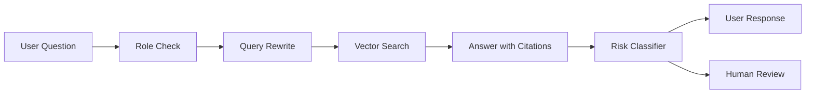
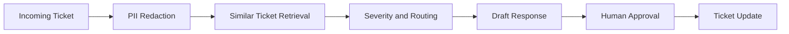
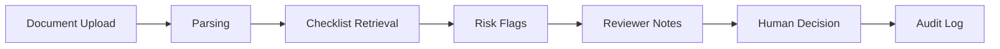

# FDE Portfolio Project Specs

## Project 1: Enterprise Policy RAG Assistant

### Scenario

A B2B SaaS company has scattered policy documents across internal tools. Employees repeatedly ask the same security, legal, and approval questions. The assistant retrieves policy passages and answers with citations.

### Architecture

### Eval

- citation accuracy
- escalation accuracy
- answer usefulness
- hallucination rate

### Success Metric

- reduce repeated policy tickets by 25%
- keep unsupported answers below 5%

## Project 2: Customer Support Triage Agent

### Scenario

An enterprise support team receives hundreds of tickets per day. Triage is slow, severity labels are inconsistent, and owner routing is unreliable.

### Architecture

### Eval

- severity precision
- routing accuracy
- human override rate
- SLA impact

### Success Metric

- reduce triage time by 30%
- miss zero P1 tickets

## Project 3: Regulated Workflow Review Copilot

### Scenario

A regulated organization reviews contracts, claims, reports, or clinical notes. Review quality varies by reviewer and audit trails are weak.

### Architecture

### Eval

- missing item recall
- false positive rate
- audit completeness
- review time reduction

### Success Metric

- detect 90% of checklist issues
- reduce review time by 25%
- preserve human final decision

## Common Demo Structure

1. Explain the customer problem.
2. Show the current workflow bottleneck.
3. Run the AI workflow demo.
4. Explain architecture and evals.
5. Discuss rollout, metric, and risks.

