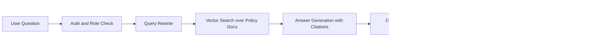
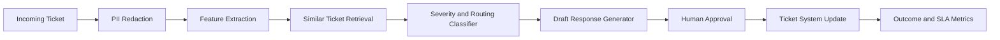
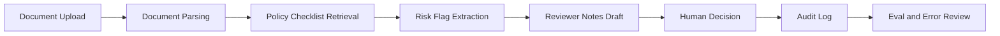

# FDE 포트폴리오 프로젝트 3개 Spec

## 프로젝트 1: Enterprise Policy RAG Assistant

### Customer Scenario

고객은 3,000명 규모의 B2B SaaS 기업이다. 직원들은 보안 정책, 계약 승인 기준, 데이터 처리 규정을 찾기 위해 Slack, Notion, Google Drive, PDF 문서를 반복 검색한다. Legal/Ops 팀은 같은 질문에 반복 답변하고, 잘못된 정책 해석으로 승인 지연과 보안 리스크가 발생한다.

### Proposed AI Workflow

사용자는 자연어로 정책 질문을 입력한다. 시스템은 문서 검색, 근거 chunk 반환, 답변 생성, confidence 표시, escalation 필요 여부 판단을 수행한다. 민감한 질문은 human review queue로 넘기고, 답변에는 반드시 source citation을 붙인다.

### Architecture

### Stack

| Layer | Suggested Stack |
|---|---|
| Frontend | Next.js or Streamlit |
| Backend | FastAPI or Node.js |
| Data | Markdown/PDF policy docs, chunked text |
| Retrieval | Postgres pgvector, Chroma, or Pinecone |
| LLM | OpenAI/Anthropic API abstraction |
| Eval | golden question set, citation accuracy, escalation accuracy |
| Observability | request log, failed answer log, user feedback |

### Eval Plan

| Eval 항목 | 측정 방법 | 성공 기준 |
|---|---|---|
| Citation accuracy | 답변 근거가 실제 문서와 맞는지 수동 채점 | 90% 이상 |
| Escalation accuracy | 민감/불확실 질문을 human review로 넘기는지 확인 | 85% 이상 |
| Answer usefulness | 내부 사용자 5명이 1-5점 평가 | 평균 4.0 이상 |
| Hallucination rate | 근거 없는 답변 비율 측정 | 5% 이하 |

### Rollout Plan

1. Week 1: Legal/Ops 문서 30개로 internal pilot.
2. Week 2: golden question 50개로 eval baseline 작성.
3. Week 3: Slack 또는 web UI로 10명 pilot.
4. Week 4: feedback 기반 prompt/retrieval 개선, escalation policy 확정.

### Success Metric

- 반복 정책 질문 처리 시간 40% 감소
- Legal/Ops 수동 답변 ticket 25% 감소
- citation 없는 답변 0건 유지

## 프로젝트 2: Customer Support Triage Agent

### Customer Scenario

고객은 enterprise support ticket을 처리하는 B2B 인프라 회사다. 하루 500건 이상의 ticket이 들어오며, severity 분류와 담당팀 라우팅이 느려 SLA 위반이 발생한다. 기존 keyword rule은 신규 제품 이슈와 복합 장애를 잘 분류하지 못한다.

### Proposed AI Workflow

시스템은 ticket 제목, 본문, 고객 등급, 과거 유사 ticket을 읽고 severity, category, owner team, suggested first response를 제안한다. high-risk ticket은 자동 처리하지 않고 human approval을 요구한다.

### Architecture

### Stack

| Layer | Suggested Stack |
|---|---|
| Ticket Input | Zendesk/Jira mock export |
| Backend | Python FastAPI |
| Classification | LLM structured output with fallback rules |
| Retrieval | historical ticket embeddings |
| Eval | labeled ticket set, confusion matrix |
| Dashboard | Streamlit or lightweight React |

### Eval Plan

| Eval 항목 | 측정 방법 | 성공 기준 |
|---|---|---|
| Severity precision | P0/P1 ticket 분류 정확도 | 95% 이상 |
| Routing accuracy | owner team 예측 정확도 | 85% 이상 |
| SLA impact | triage time before/after 비교 | 30% 이상 감소 |
| Human override rate | 담당자가 AI 제안을 수정한 비율 | 20% 이하 |

### Rollout Plan

1. Historical ticket 200개로 offline eval.
2. 1개 product line에서 shadow mode 실행.
3. human approval mode로 2주 pilot.
4. low-risk category부터 semi-automation 적용.

### Success Metric

- 평균 triage time 30% 감소
- P1 ticket 누락 0건
- support manager가 매주 error review 가능

## 프로젝트 3: Regulated Workflow Review Copilot

### Customer Scenario

고객은 금융/보험/헬스케어처럼 규제가 강한 조직이다. 현업 담당자는 계약서, claim, clinical note, compliance report를 검토하며 누락 항목과 정책 위반 가능성을 찾아야 한다. 검토 품질은 담당자 숙련도에 따라 달라지고 audit trail이 약하다.

### Proposed AI Workflow

사용자가 문서를 업로드하면 시스템은 checklists, policy references, risk flags, required human review notes를 생성한다. AI는 최종 결정을 내리지 않고 reviewer가 확인해야 할 evidence와 missing item을 구조화한다.

### Architecture

### Stack

| Layer | Suggested Stack |
|---|---|
| Input | PDF/text upload, sample anonymized documents |
| Parser | document text extraction |
| LLM | structured risk extraction |
| Policy Base | checklist markdown + retrieval |
| Review UI | side-by-side document and AI notes |
| Governance | audit log, reviewer confirmation |

### Eval Plan

| Eval 항목 | 측정 방법 | 성공 기준 |
|---|---|---|
| Missing item recall | 누락 항목을 찾아낸 비율 | 90% 이상 |
| False positive rate | 불필요한 risk flag 비율 | 15% 이하 |
| Audit completeness | reviewer decision과 근거 기록 여부 | 100% |
| Review time | 수동 검토 대비 시간 차이 | 25% 이상 감소 |

### Rollout Plan

1. anonymized sample 50개로 checklist 검증.
2. reviewer 3명과 side-by-side evaluation.
3. audit log format 확정.
4. human-in-the-loop only mode로 pilot.

### Success Metric

- 누락 항목 발견율 90% 이상
- review time 25% 감소
- human final decision 원칙 유지

## Demo Script 공통 구조

1. 고객 문제를 30초 안에 설명한다.
2. 기존 workflow의 병목을 보여준다.
3. AI workflow demo를 3분 안에 실행한다.
4. architecture와 eval을 1분 안에 설명한다.
5. rollout risk와 success metric을 1분 안에 말한다.

