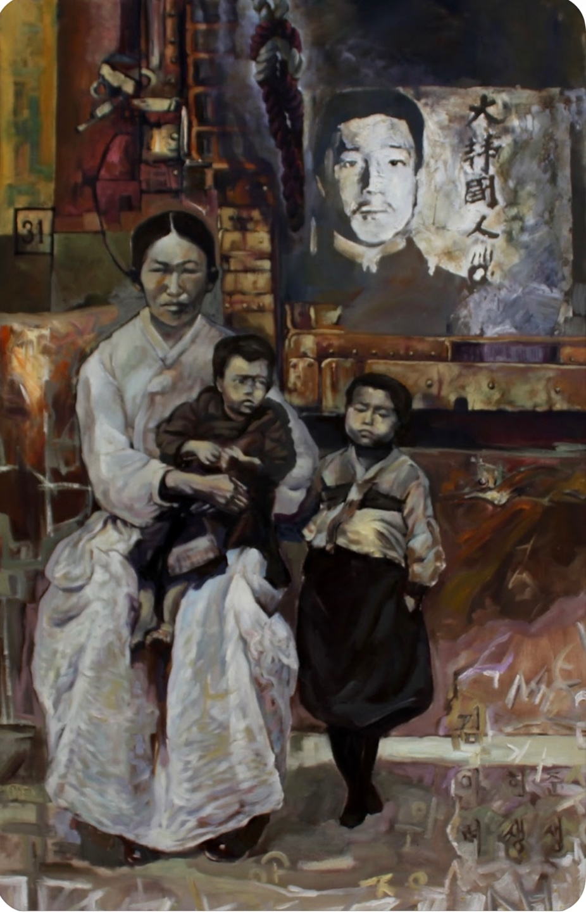
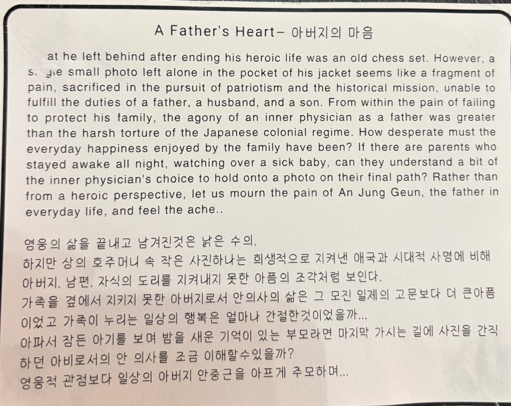
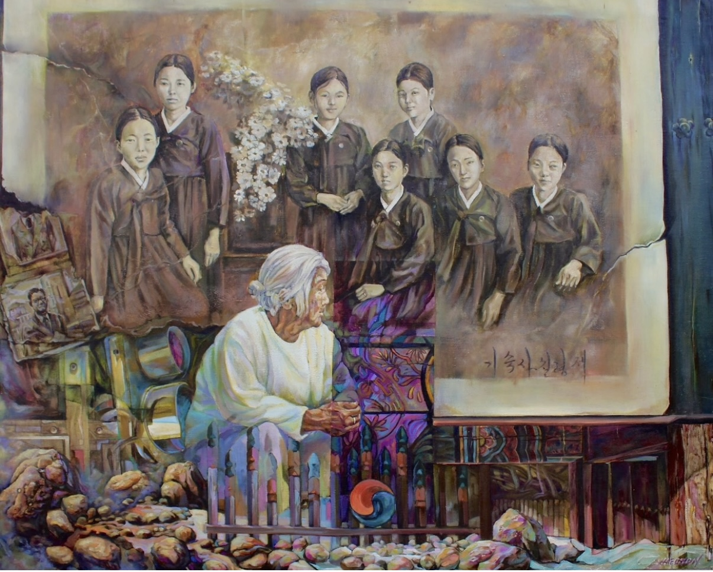
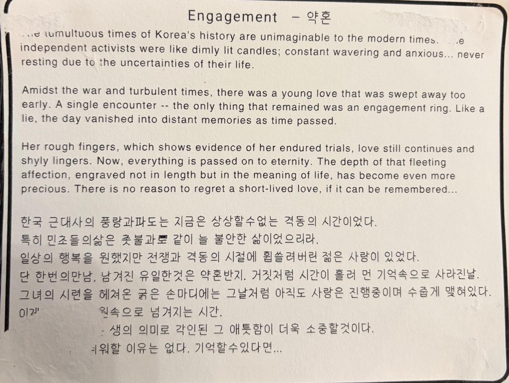
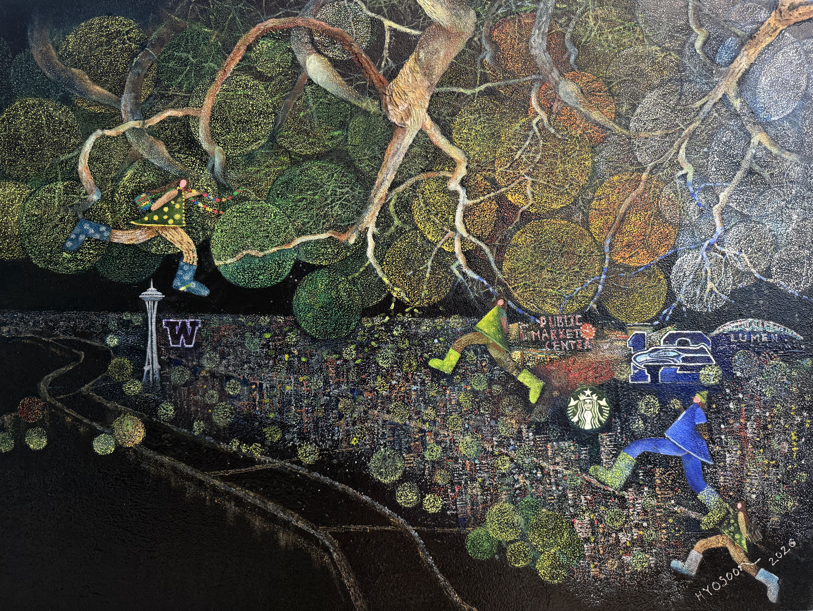

## 수신 맥락

이 자료는 Hyosoon Jung 님이 8.15 준비 TF 카카오톡 방에 올려 준 전시 작품 관련 자료입니다. 2026년 광복절 행사 전시에 이해천 작가님의 작품 두 점과 Hyosoon Jung 님의 작품 한 점을 함께 전시할 수 있는지 검토하기 위한 입력 자료입니다.

## 첨부 이미지

| 파일 | 설명 |
|------|------|
| [20260727_LeeHaecheon_AnJungGeun-Family-Photo.jpg](artworks/20260727_LeeHaecheon_AnJungGeun-Family-Photo.jpg) | 이해천 작가 작품 자료로 전달된 안중근 의사 가족 사진 관련 이미지 |
| [20260727_LeeHaecheon_A-Fathers-Heart.jpg](artworks/20260727_LeeHaecheon_A-Fathers-Heart.jpg) | 안중근 의사 가족 사진 설명으로 전달된 이미지 |
| [20260727_LeeHaecheon_Engagement.jpg](artworks/20260727_LeeHaecheon_Engagement.jpg) | 이해천 작가 작품 자료로 전달된 이미지 |
| [20260727_LeeHaecheon_Engagement-Description.jpg](artworks/20260727_LeeHaecheon_Engagement-Description.jpg) | Engagement 작품 설명으로 전달된 이미지 |
| [20260727_HyosoonJung_Settle-Story-46-From-Korea.jpg](artworks/20260727_HyosoonJung_Settle-Story-46-From-Korea.jpg) | Hyosoon Jung 작품 이미지, `Settle Story 46. From Korea` |

## 전시 작품 이미지

### 이해천 작가 작품 자료 1 - 안중근 의사 가족 사진

**설명 이미지**: 안중근 의사 가족 사진 설명으로 전달된 자료입니다.

### 이해천 작가 작품 자료 2 - Engagement

**설명 이미지**: Engagement 작품 설명으로 전달된 자료입니다.

### Hyosoon Jung 작품 - Settle Story 46. From Korea

## Hyosoon Jung 전달 메시지

> 안녕하세요  
> 이번 8.15 행사 전시될  
> 이해천 작가님의 작품 두점과  
> 보내주신 작가 노트입니다.  
> 작가노트는 재가 type 할것이고요.
>
> 그리고 함께 전시될 계획인  
> 제 작품한점과  
> 작가노트를  대신한  그림으로 쓴 제 글을 보냅니다.
>
> 과거와  
> 현재 AI를  
> 살고 있는 Seattle 하늘아래의  
> 삶을 조명한 다는 생각으로 보아주시면 되실 것 같습니다.
>
> 제작품과 글이 맘에 들지 않으시면  
> 처음 계획대로 이해천 작가님의  
> 작품 두점만 전시하는 걸로 하갰습니다. 의견부탁드립니다.

## Hyosoon Jung 작품 정보

| 항목 | 내용 |
|------|------|
| Artist | Hyosoon Jung |
| Title | Settle Story 46. From Korea |
| Medium | Oil with mixed media on canvas |
| Size | 38 x 50 inch |

## Hyosoon Jung 작품 노트

> 시애틀의 하늘아래를 내려본다  
> 하늘을 찌르듯 선 Space Needle  
> 세월을 품은 워싱턴 주립대학의 길  
> 새벽을 깨우는 파이크 플레이스의 발걸음,  
> 첫 향기를 피워 올리는 스타벅스의 커피.  
> 그 풍경 속에  
> 누구도 크게 바라보지 않았던  
> 한 사람의 그림자가 있었다
>
> 엄마  
> 직장인  
> 낯선 땅에서  
> 자신의 이름을 잃지 않으려  
> 묵묵히 걸어온 한 이민자
>
> 눈물은 바람에 말리고  
> 외로움은 미소 속에 감추며  
> 오늘을 견디면  
> 내일은 아이에게 더 넓은 하늘을  
> 보여줄 수 있으리라 믿었다  
> 그 아이는 어느덧  
> 서른여섯 살이 되었고,  
> 엄마의 걸음도  
> 비로소 조금씩 느려졌다  
> 이제는 안다.  
> 인생은  
> 누군가를 앞지르는 일이 아니라,  
> 마침내 자신의 평화를 찾아가는  
> 긴 순례였음을…
>
> 광복은  
> 나라를 되찾는 날만이 아니라  
> 두려움에서 자유로워지고  
> 낯선 세상 속에서도  
> 자신의 존엄을 잃지 않는  
> 매일의 선택임을…
>
> 그리고  
> 2026년의 광복은  
> 또 다른 질문 앞에 서 있다  
> AI가 세상을 바꾸는 시대  
> 기계가 수많은 답을 말해도  
> 사람의 양심까지 대신할 수는 없다  
> 정보는 넘쳐나도  
> 생각은 스스로 해야 하고  
> 기술은 빨라져도  
> 영혼의 방향은  
> 우리 스스로 결정해야 한다
>
> 진정한 독립은  
> 기계를 거부하는 것이 아니라  
> 기계를 다스리는  
> 사람의 마음을 지키는 일  
> 그것이  
> AI 시대의 새로운 광복정신이다
>
> 오늘,  
> 시애틀의 한 캔버스에는  
> 한 엄마의 뒷모습이 그려져 있다  
> 그 뒷모습은  
> 수많은 이민자의 삶이며,  
> 수많은 어머니의 기도이며  
> 대한민국이 이어온  
> 자유의 역사이기도 하다  
> 나는 이제  
> 앞만 보고 달리지 않는다  
> 평화를 품고  
> 감사를 품고  
> 사람다움을 품고  
> 내일을 향해 걷는다..
>
> 광복은 끝난 역사가 아니라  
> 오늘도 계속되는 선택이며  
> 자유는  
> 나라의 경계에서만이 아니라  
> 한 사람의 마음속에서  
> 매일 새롭게 피어난다..
>
> 광복은 나라를 되찾은 날이었고  
> 이민은 나를 잃지 않기 위한 길이었다  
> 이제 AI 시대의 광복은  
> 사람다움을 끝까지 지켜내는 우리의 용기이다…

## 기획안 반영 메모

구체 작품 정보가 들어왔으므로 기존 기획안의 그림 전시 섹션을 업데이트해야 합니다. 특히 전시 작품을 이해천 작가 2점과 Hyosoon Jung 님 작품 1점으로 구성할지 결정하고, `QR 인터랙티브 가이드`, `AI 시대 광복정신`, `시애틀 이민자의 삶` 메시지를 작품별 설명과 어떻게 연결할지 다시 정리해야 합니다.
