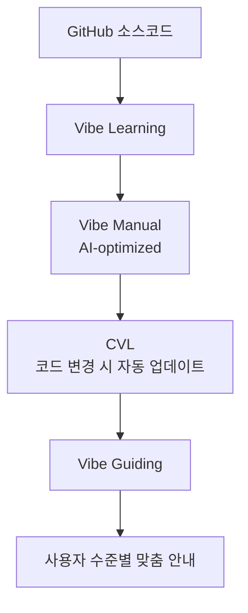

## Context

**왜 이 계획이 필요한가**

Vibe Learning 방법론은 이미 VibeLearn AI라는 실제 시스템으로 구현되어 있다 (`C:\AI_study\2026\BeYouLifeUpWithUs\`). Vibe Guiding은 그 다음 레이어 — "Build the Brain" 위에 "Activate the Brain"을 얹는 것이다.

GOBI 팀은 Changsoo에게 User Manual 작성자 역할을 기대하고 있다. Changsoo의 목표는 그 매뉴얼을 AI가 소비하는 Context로 만들고, 궁극적으로 각 사용자를 맞춤 안내하는 Vibe Guiding 시스템으로 진화시키는 것이다. 이것은 충돌이 아니라 레이어 관계다.

```
매뉴얼 (팀 기대) → 가이딩 (Changsoo 확장) → 제품 통합 (최종 목표)
```

**핵심 인사이트**: VibeLearn AI가 "Topic에 대해 학습하는 AI"라면, Vibe Guiding은 "학습한 내용을 바탕으로 사용자를 안내하는 AI"다.

→ **관련 전략 문서**: [[2026-04-03 GOBI Collaboration Alignment]]
→ **시스템 전체 구조**: [[2026-04-03 GOBI Vibe Guiding 시스템 맵]]

---

## 구현할 시스템: Vibe Guiding AI for GOBI

### 대상 제품

- Gobi Desktop (Mac/Windows)
- Gobi Space (웹)
- Gobi CLI
- Gobi Mobile
- Astra

### 핵심 파이프라인



---

## Phase 1: Vibe Manual 구축 (팀 기대 충족)

**목표**: GOBI 5개 제품에 대한 AI-optimized Vibe Manual을 작성한다.

### 1-1. 사전 정보 수집

먼저 아래를 파악해야 실질적인 매뉴얼 작성이 가능하다.

| 항목 | 방법 | 현재 상태 |
|------|------|---------|
| `docs.gobihq.com` 내용 파악 | 직접 접속 | 미완료 |
| Gobi Specs 시트 — Core Concept 컬럼 | Greg 협업 | 미완료 |
| Astra 제품 이해 | 팀 문의 또는 GitHub | 미완료 |
| gobi-cli / ai4pkm / ai4pkm-cli 접근 | Mika 초대 확인 | 미완료 |

### 1-2. Topic 설정 (VibeLearn AI 패턴 적용)

VibeLearn AI의 4단계 워크플로우를 그대로 적용한다.

```
Topic Setup → Roadmap → Daily Learning → Complete
```

**Topic 폴더 구조** (제품별 독립 Topic):
```
Ingest/CatchUpAI_VL/Topics/
  ├── GOBI-Desktop/
  │     ├── topic_info.md
  │     ├── roadmap.md
  │     ├── 01-Core-Concepts/
  │     ├── 02-User-Flows/
  │     ├── 03-Vibe-Manual/    ← 최종 산출물
  │     └── vl_worklog/
  ├── GOBI-Space/
  ├── GOBI-CLI/
  ├── GOBI-Mobile/
  └── Astra/
```

### 1-3. Vibe Manual 설계 원칙

**전통 매뉴얼 ❌ vs Vibe Manual ✅**:

```
❌ "GOBI Desktop을 사용하려면 먼저 Vault를 연결해야 합니다."

✅ 목표: GOBI Desktop 시작하기
   Step 1: 앱 열기
   Step 2: Vault 연결 → local path 입력
   Step 3: "create brain update" 음성 명령
   ✓ 완료 신호: Brain Update 알림
```

**AI 소비 최적화 3원칙**:
- **Structured**: 목표 → 단계 → 완료 신호
- **Atomic**: 각 단계 독립적으로 실행 가능
- **Context-rich**: 사용자 수준 / 상황별 분기 포함

### 1-4. Gobi Specs 시트 Core Concept 채우기

Greg과 협업하여 각 제품 탭의 Core Concept 컬럼을 채운다. 이것이 Vibe Manual의 핵심 인풋이 된다.

---

## Phase 2: Vibe Guiding 시스템 확장

**목표**: Phase 1의 Vibe Manual을 동적 가이딩 시스템으로 전환한다.

### 2-1. Guiding 엔진 설계

```
User Context (수준 / 목표 / 현재 상태)
          +
Vibe Manual (Structured Context)
          ↓
Vibe Guiding AI
          ↓
Just-in-time 맞춤 안내 (GPS 내비게이션처럼)
```

**사용자 수준별 분기 예시 (Gobi Desktop)**:

| 사용자 | 질문: "어떻게 시작해?" | 가이드 |
|--------|---------------------|--------|
| 초보 | Vault가 뭔지 모름 | Vault 개념부터 설명 |
| 중급 | Vault 연결 알지만 Brain은 모름 | Brain Update 단계로 바로 안내 |
| 고급 | 자동화 원함 | CVL + pre-commit hook 설정 |

### 2-2. PCM 레이어 구현

PCM (Personal Context Management) — AI가 사용자 정보를 동적으로 관리한다.

```
user_context.md:
  - 사용 제품: Gobi Desktop
  - 수준: 초보 (Vault 연결 완료)
  - 마지막 액션: Brain Update 실행
  - 다음 권장: Space 연결
```

VibeLearn AI의 `topic_info.md` + `worklog` 패턴을 가이딩용으로 확장한다.

→ **PCM 개념**: [[2026-04-03 PCM vs PKM]]

### 2-3. CVL (Continuous Vibe Learning) 연동

코드 변경 감지 → 매뉴얼 자동 업데이트 파이프라인:

```
GitHub Push (gobi-desktop)
      ↓
Pre-commit hook → 변경된 기능 감지
      ↓
Vibe Manual 해당 섹션 자동 업데이트
      ↓
Vibe Guiding 재학습
```

---

## Phase 3: 제품 통합 (GOBI Applets)

**목표**: Vibe Guiding을 GOBI 제품 내에 직접 통합한다.

### 3-1. GOBI Applets 연동

- Gobi Desktop의 Applets 기능으로 Vibe Guiding 플로우 실행
- "I want to..." 음성 입력 → Vibe Guiding이 단계별 안내

### 3-2. 협업 전략

Mika, Greg, Jin에게 포지셔닝:
> "매뉴얼 레이어부터 완성한 다음, 그것을 가이딩으로 자연스럽게 진화시키겠습니다."

Phase 1 납품 후 가이딩 데모로 설득.

---

## 선행 학습: Topic으로서의 Vibe Guiding

VibeLearn AI 방식으로 Vibe Guiding 자체를 하나의 Topic으로 학습한다.

| 모듈 | 내용 | 상태 |
|------|------|------|
| M1 | Vibe Guiding 철학 이해 (Substack 7편) | ✅ 완료 |
| M2 | GOBI 제품 이해 + Vibe Manual 설계 | 🔲 사전 정보 수집 후 시작 |
| M3 | 가이딩 엔진 구현 + CVL 연동 | 🔲 |
| M4 | 제품 통합 + 데모 (Capstone) | 🔲 |

---

## 즉시 시작할 첫 번째 액션

1. **docs.gobihq.com** 접속 — 현재 작성된 Core Concepts 파악
2. **Gobi Specs 시트** — 각 제품별 Spec 목록 + Core Concept 현황 파악
3. **GOBI-Desktop Topic 설정** — `topic_info.md` + `roadmap.md` 작성
4. **첫 Vibe Manual 초안** — Gobi Desktop Getting Started (가장 친숙한 제품부터)

---

## 테스트 및 검증 이력

- **2026-04-13**: [[2026-04-13 Gobi Desktop Vibe Guiding 기능 수준 테스트]]
	- 결과: 대화 기반 안내는 가능하나 정밀도가 부족하여 실제 작업 완수 실패. 실시간 정보 반영 및 컨텍스트 최적화 필요성 확인.

## 검증 기준

- **Phase 1**: 팀(Jin/Greg/Mika)에게 Vibe Manual 공유 후 피드백 수령
- **Phase 2**: Claude Code가 Vibe Manual을 읽고 사용자 질문에 단계별 안내 제공 (데모)
- **Phase 3**: Gobi Desktop Applet에서 음성으로 Vibe Guiding 트리거

---

**작성**: 2026-04-05
**방법론**: VibeLearn AI
