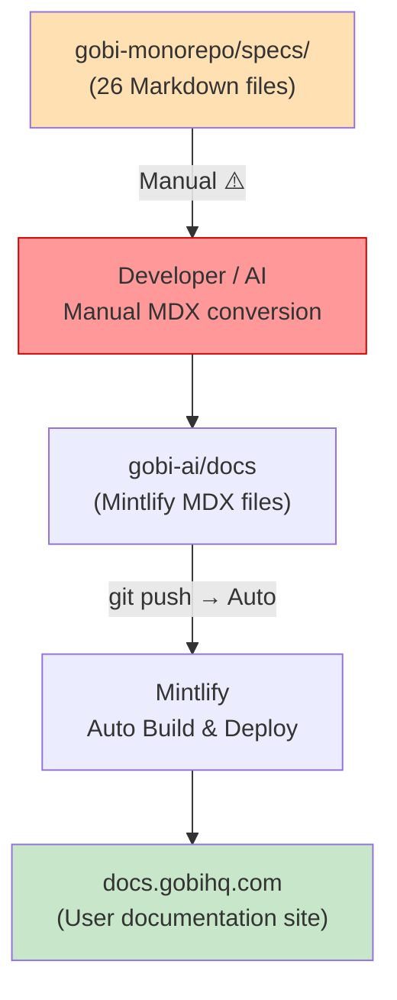
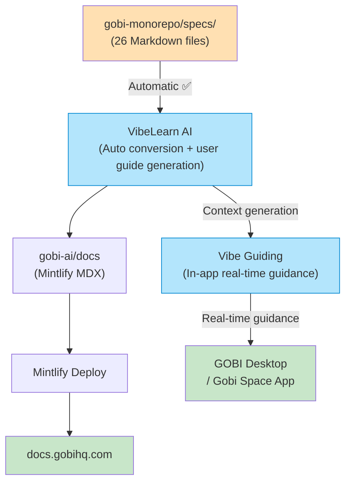

# GOBI Documentation Pipeline Diagram

**Created**: 2026-04-06

---

## Current Pipeline



### Step-by-Step Details

| Step | Auto / Manual | Owner | Tool |
|------|--------------|-------|------|
| Write spec (gobi-monorepo/specs) | Manual | Dev team (Mika, Greg) + AI (CODE_TO_SPECS) | Claude Code |
| Convert specs → MDX | **Manual** ⚠️ | TBD | — |
| gobi-ai/docs push → docs.gobihq.com | Automatic | — | Mintlify |

---

## Identified Gap (Manual Conversion Step)

```
specs/05-second-brain-agent.md  ──┐
specs/06-voice-interaction.md   ──┤──► ??? ──► docs/products/desktop.mdx
specs/07-capture.md             ──┘
```

- specs are feature-centric (cross-cutting); docs are product-centric (per-product) — different structures
- Direct 1:1 mapping is not possible; restructuring is required
- **This is the opportunity for Vibe Guiding / VibeLearn AI to automate the conversion**

---

## Proposed Pipeline After Vibe Guiding Integration



---

## CODE_TO_SPECS vs SPECS_TO_GUIDE

```
Current (gobi-monorepo):              Proposed (VibeLearn AI):
Code → CODE_TO_SPECS → Specs          Specs → SPECS_TO_GUIDE → User Guides
                                                              → Vibe Guiding Context
```

The dev team has already implemented the AI-driven direction of generating specs from code.
**Automating the reverse direction (specs → guides) with VibeLearn AI completes the full pipeline.**
