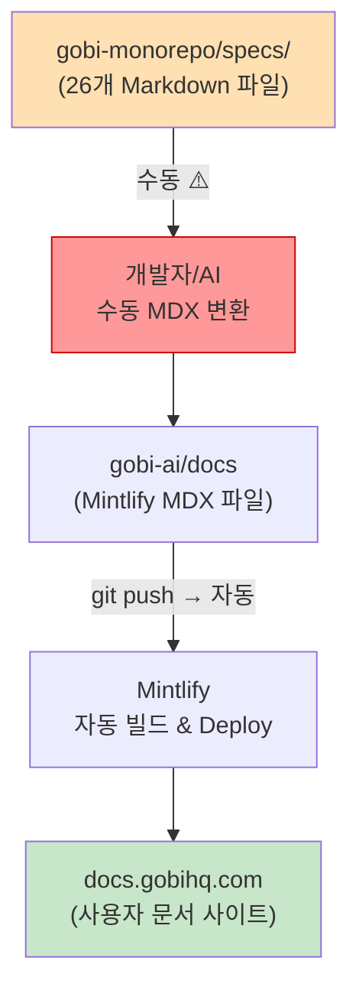
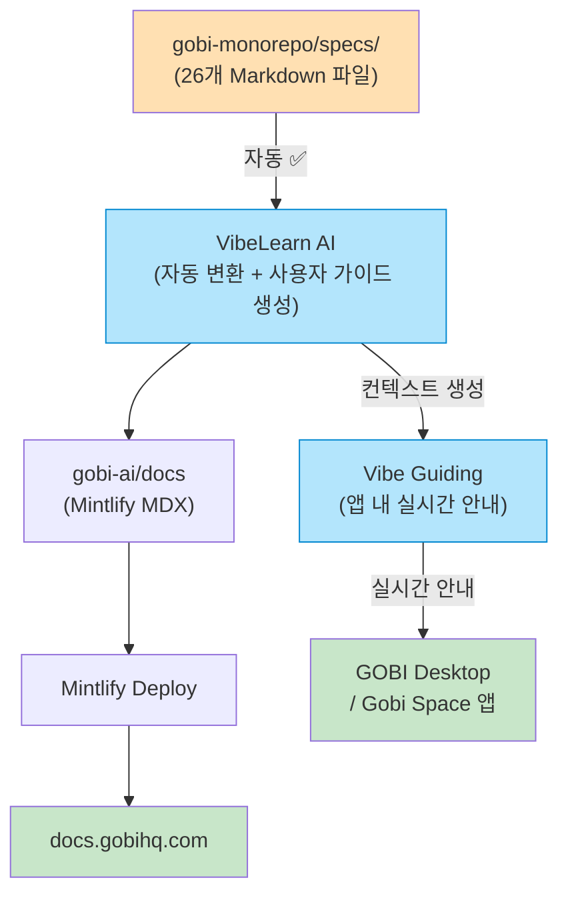

# GOBI 문서화 파이프라인 다이어그램

**작성일**: 2026-04-06

---

## 현재 파이프라인



### 단계별 상세

| 단계 | 자동/수동 | 담당 | 도구 |
|------|----------|------|------|
| spec 작성 (gobi-monorepo/specs) | 수동 | 개발팀 (Mika, Greg) + AI (CODE_TO_SPECS) | Claude Code |
| specs → MDX 변환 | **수동** ⚠️ | 미정 | — |
| gobi-ai/docs push → docs.gobihq.com | 자동 | — | Mintlify |

---

## 발견된 갭 (수동 변환 단계)

```
specs/05-second-brain-agent.md  ──┐
specs/06-voice-interaction.md   ──┤──► ??? ──► docs/products/desktop.mdx
specs/07-capture.md             ──┘
```

- specs는 기능별(cross-cutting), docs는 제품별(per-product) — 구조가 다름
- 직접 1:1 변환 불가, 재구성 필요
- **Vibe Guiding/VibeLearn AI가 이 변환을 자동화할 수 있는 기회**

---

## Vibe Guiding 통합 후 파이프라인 (제안)



---

## CODE_TO_SPECS vs SPECS_TO_GUIDE

```
현재 (gobi-monorepo):          제안 (VibeLearn AI):
코드 → CODE_TO_SPECS → Specs   Specs → SPECS_TO_GUIDE → 사용자 가이드
                                                        → Vibe Guiding 컨텍스트
```

개발팀이 이미 AI로 코드에서 스펙을 생성하는 방향을 구현함.
**역방향(스펙 → 가이드)을 VibeLearn AI로 자동화**하면 전체 파이프라인이 완성됨.
