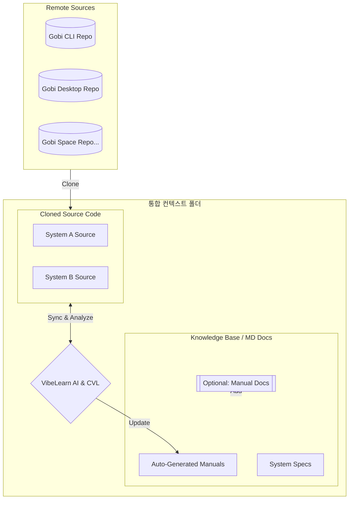
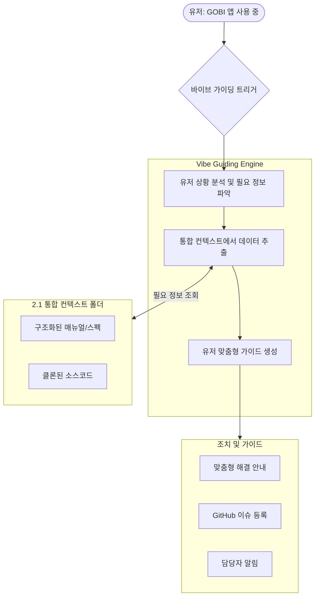

# GOBI 프로젝트를 위한 Vibe Guiding 아키텍처 제안 (초안)

본 문서는 GOBI 프로젝트에 Vibe Guiding을 성공적으로 접목하기 위한 초기 아키텍처와 접근 방식을 정의한 제안서입니다. 이 내용은 현재의 브레인 덤프(Brain Dump)를 기반으로 작성되었으며, 향후 고비 모노레포(Monorepo) 및 시스템 스펙 검토를 통해 구체화될 예정입니다.

## 1. 개요 (Overview)

Vibe Guiding의 목표는 단순한 챗봇 답변을 넘어, 사용자의 상황(Context)을 이해하고 실시간으로 최적의 안내를 제공하는 것입니다. 이를 위해 지식 관리 시스템(VibeLearn AI)과 실시간 가이드 엔진(Vibe Guiding)을 결합한 통합 아키텍처를 제안합니다.

## 2. 핵심 아키텍처 구조

### 2.1 통합 컨텍스트 폴더 및 실시간 동기화 (Unified Context & Sync)
로컬 또는 별도의 서버에 Vibe Guiding이 참조할 모든 정보를 집대성하고, 소스코드의 변화를 실시간으로 반영하는 전용 공간을 구축합니다.

*   **구성 및 포함 내용**:
    *   **GOBI 시스템 소스코드**: 가이드 대상이 되는 모든 리포지토리 클론(Clone).
    *   **VibeLearn AI & CVL**: 소스코드 변경을 감지하여 매뉴얼을 자동으로 갱신하는 **Continuous Vibe Learning(CVL)** 프로세스 적용.
    *   **자동 생성 매뉴얼 (MD)**: VibeLearn AI가 분석하여 생성한 항상 최신 상태의 매뉴얼 및 스펙 문서.
    *   **추가 컨텍스트**: 별도의 설계 문서, 시스템 스펙, 사용자 가이드 등 Vibe Guiding의 지식 기반이 되는 모든 데이터.

### 2.2 바이브 가이딩 (Vibe Guiding)
바이브 가이딩은 본 시스템의 핵심 엔진으로, 향후 집중적으로 개발될 예정인 핵심 기능들을 포함합니다. 유저가 고비 어플리케이션을 사용하는 실시간 상황에서 자율적인 안내를 제공하기 위해 다음의 세 가지 주요 기능을 구현합니다.

1.  **유저 상황 분석 및 필요 정보 파악**: 유저의 현재 작업 맥락과 숙련도를 분석하여, 어떤 정보를 제공했을 때 가장 실질적인 도움이 될지를 실시간으로 판단합니다.
2.  **트리거링 및 데이터 추출**: 파악된 필요 정보를 바탕으로 '통합 컨텍스트 폴더'에서 최적의 데이터를 가져올 수 있는 정교한 프롬프트를 생성하고 가이드 엔진을 트리거링합니다.
3.  **유저 맞춤형 가이드 제공**: 추출된 전문 지식을 유저의 상황에 맞게 재구성하여, 즉각적으로 실행 가능한 형태의 답변과 안내를 유저에게 전달합니다.

## 3. 바이브 가이딩 작동 원리 (Vibe Guiding Operational Flow)

Vibe Guiding은 유저의 실시간 맥락을 포착하여 '통합 컨텍스트 폴더'의 지식을 최적의 형태로 전달합니다. 전체적인 작동 흐름은 다음과 같습니다.

1.  **유저 상황 포착 및 분석**: 유저가 에러를 겪거나 도움이 필요한 시점을 트리거링 엔진이 포착하여, 유저의 숙련도와 작업 맥락을 분석합니다.
2.  **단계적 데이터 추출 (Retrieval Strategy)**:
    *   **1차 검색 (Primary)**: `통합 컨텍스트 폴더` 내의 구조화된 매뉴얼 및 스펙(MD 파일)에서 우선적으로 해답을 찾습니다.
    *   **2차 분석 (Secondary)**: 문서 기반 가이드로 부족할 경우, 클론된 소스코드를 직접 분석하여 구체적인 기술적 원인을 파악합니다.
3.  **조치 및 가이드 (Action)**: 분석된 정보를 바탕으로 유저에게 즉각적인 해결책을 안내하며, 필요에 따라 GitHub 이슈 등록이나 담당자 알림을 자동 수행합니다.

## 4. 핵심 개발 과제: 트리거링 메커니즘 (Triggering Mechanism)

현재 Vibe Guiding은 정보를 검색하고 답변을 생성하는 단계에 집중되어 있습니다. 향후 핵심 개발 과제는 **"언제 가이드를 시작할 것인가"**를 결정하는 트리거링 기능을 구현하는 것입니다.

*   **사용자 정보 취합**: 현재 시스템 사용 현황, 유저의 숙련도, 현재 직면한 문제점 파악.
*   **도움 필요 상황 캐치**: 유저가 특정 동작에서 막히거나 에러가 발생한 시점을 정확히 포착하여 가이드 엔진 가동.

## 5. 단계별 실행 계획

1.  **1단계: 데이터 통합**: 별도 폴더 내 모든 시스템 클론 및 VibeLearn AI를 통한 지식 베이스(Knowledge Base) 구축.
2.  **2단계: 트리거링 엔진 개발**: 사용자 상황을 인지하고 적시에 가이드를 시작하는 로직 구현.
3.  **3단계: 피드백 루프 구축**: 가이드 결과에 따른 이슈 등록 및 시스템 개선 연동.

---
*본 문서는 Vibe Guiding의 기본 접근 방식을 정리한 초안이며, 고비 개발팀(Mika, Greg)과의 지속적인 소통을 통해 업데이트될 예정입니다.*
