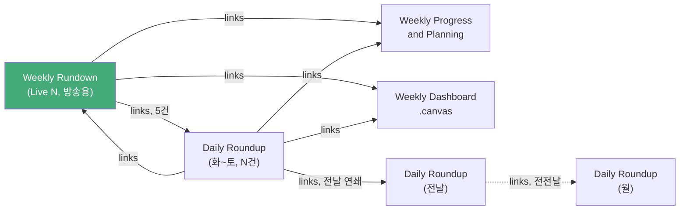

# 4종 방송 문서 관계 지도

**모듈**: M1 - 개념 정의와 Rundown 파싱 계약
**실습**: 실습 1 — 4종 문서 관계 지도 그리기

---

## 검증에 사용한 실제 파일

- `AI/Roundup/2026-07-26 - Live21 Weekly Rundown.md`
- `AI/Roundup/2026-08-01 - Daily Roundup.md`

## 확인한 사실

1. Live21 Rundown의 frontmatter `links:`는 같은 주의 **Weekly Progress**, **Weekly Dashboard**, **Daily Roundup 5건(7/28~8/1)**, 그리고 **Weekly 회고 문서**, **Research 문서**까지 가리킨다.
2. 8/1 Daily Roundup의 frontmatter `links:`는 반대로 **Live21 Rundown**, **Weekly Progress**, **Weekly Dashboard**, **전날(7/31) Daily Roundup**을 가리킨다.
3. 즉 Rundown ↔ Daily Roundup은 **양방향 링크**다. 단방향 계층 구조가 아니다.

## 관계 다이어그램

## Live-CoMC-App 설계에 대한 시사점

- 앱이 "이번 주 방송을 진행"할 때는 **Rundown을 유일한 시작점(entry point)**으로 삼는 것이 맞다 — Rundown이 이미 그 주 모든 Daily Roundup·Weekly 문서를 링크하고 있으므로, 앱이 별도로 "이번 주 관련 문서가 무엇인지" 추론할 필요가 없다.
- 역방향(Daily Roundup에서 Rundown으로 거슬러 올라가는 것)은 앱의 MVP 범위 밖이다. M2에서 App Boundary 문서화 시 "Rundown 단일 문서만 신뢰 소스로 삼는다"를 명시적 제외 항목으로 등재한다.
- `.canvas` 형식인 Weekly Dashboard는 링크로는 존재하지만, 계획서 원칙대로 **파싱 대상에서 제외**(md가 정본)한다.
