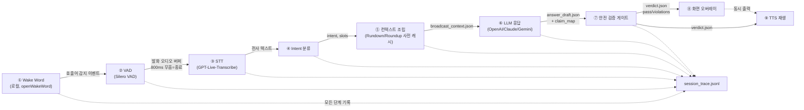

# 파이프라인 다이어그램 — 9단계 데이터 흐름

**모듈**: M2 - 파이프라인 아키텍처와 App Boundary 확정
**실습**: 실습 1 — 파이프라인 다이어그램 작성

---

## 9단계

## 단계별 데이터 요약

| # | 단계 | 입력 | 출력 | 비고 |
|---|---|---|---|---|
| ① | Wake Word | 상시 마이크 스트림 | 호출어 감지 이벤트(타임스탬프) | 로컬 실행, 클라우드 호출 없음 |
| ② | VAD | 감지 이벤트 이후 오디오 | 발화 구간 오디오 버퍼 | 800ms 무음 = 발화 종료 판정 |
| ③ | STT | 오디오 버퍼 | 전사 텍스트 | **wake word 이후에만 호출** — 3시간 내내 스트리밍하지 않음 |
| ④ | Intent 분류 | 전사 텍스트 | `intent`, `slots`, `ambiguity_flags[]` | M3에서 스키마 확정 |
| ⑤ | 컨텍스트 조립 | intent + Rundown 파싱 결과 | `broadcast_context.json` | `status_map`, `coverage_items` — 금칙 섹션은 이 단계에서 이미 제거된 상태 |
| ⑥ | LLM 응답 | 컨텍스트 + 안전 정책 | `answer_draft.json` (`claim_map` 포함) | 3사 프로바이더 중 선택, Structured Output 강제 |
| ⑦ | 안전 검증 게이트 | `answer_draft.json` | `verdict.json` (`pass`, `dropped_sentences[]`) | 규칙 기반, LLM 자기평가 아님 |
| ⑧ | 화면 오버레이 | `verdict.json.final_text` | `overlay.json` | OBS Browser Source가 폴링 |
| ⑨ | TTS 재생 | `verdict.json.final_text` | `spoken.json` + 오디오 바이트 | ⑧과 동시 실행, 재생 중 wake 게이트 폐쇄(에코 루프 차단) |

## M1과의 연결

⑤ 컨텍스트 조립 단계에서 사용하는 `broadcast_context.json`은 M1에서 검증한 파서 규칙(파트 헤딩, 커버리지 줄, 금칙 섹션 제외)의 직접 출력이다. M1의 `forbidden-sections.md`에서 확인한 `excluded_sections[]`/`conditional_sections[]` 구분이 이 단계에서 그대로 적용된다.
