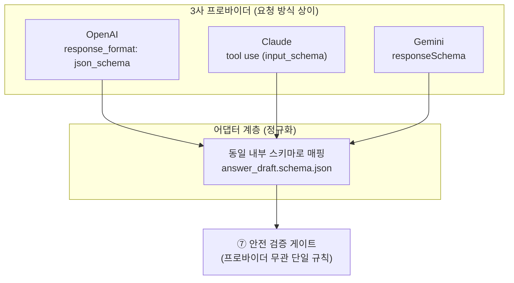

# claim_map · coverage_state · 스키마 정규화 — 핵심 개념

**모듈**: M3 - 데이터 계약과 안전 정책 스펙
**개념 학습 (활동 1)**: 7종 스키마를 왜 그렇게 설계하는지에 대한 근거

---

## 왜 이 세 개념이 M3의 뼈대인가

M3의 산출물은 "데이터 계약"이다. 계약이 지켜야 할 목적은 단 하나 — **근거 없는 발화가 라이브 방송에 나가는 사고를 구조적으로 차단**하는 것이다. 이 목적을 세 개의 개념이 나눠 담는다: `claim_map`은 "말한 모든 문장에 근거를 강제"하고, `coverage_state`는 "애초에 말해도 되는 범위인지"를 판정하며, 스키마 정규화는 "어느 LLM을 쓰든 같은 계약을 강제"한다. 앞의 둘은 안전, 마지막 하나는 이식성을 담당한다.

## 1. claim_map — 문장별 근거 강제

`claim_map`은 LLM이 생성한 응답(`answer_draft.json`)의 **문장 하나하나에 근거를 붙이도록 강제하는 필드**다. 구조는 다음과 같다.

```json
{ "sentence_idx": 0, "evidence_path": "AI/Roundup/2026-07-26 - Live21 Weekly Rundown.md", "evidence_quote": "①AI로 라방 보조 MC 앱 만들기" }
```

핵심은 `evidence_quote`가 **컨텍스트에 실제로 존재하는 문자열의 부분 인용**이어야 한다는 점이다. 안전 검증 게이트(파이프라인 ⑦단계)는 각 문장의 `evidence_quote`가 `broadcast_context.json` 안에 실제로 나타나는지 문자열 대조로 확인하고, 없으면 그 문장을 `dropped_sentences[]`로 버린다.

> **원칙**: 근거는 "LLM이 그렇다고 말해서"가 아니라 "컨텍스트에 그 문자열이 실제로 있어서" 성립한다. 검증은 규칙(문자열 매칭)이지 LLM 자기평가가 아니다 — M2 `app-boundary.md`의 컴포넌트별 금지 규칙과 동일한 전제.

이 때문에 `claim_map`이 안전장치의 **근간(foundation)**이다. 커버리지 화이트리스트(안전장치 2층)가 "무엇을 말할 수 있는가"의 범위를 정한다면, `claim_map`은 "실제로 말한 각 문장이 그 범위 안의 근거에 매여 있는가"를 문장 단위로 검사한다. 범위 통과와 문장별 근거는 별개의 층위이며, 둘 다 있어야 환각(hallucination)이 발화로 이어지지 않는다.

## 2. coverage_state — 발화 허용 범위의 3분류

`coverage_state`는 현재 파트의 커버리지 줄(M1에서 확정한 개념)이 어떤 상태인지를 나타내는 3분류다. M1 `case-table.md`의 케이스 6·7·8에서 실측한 분류를 그대로 계약으로 옮긴다.

| 상태 | 의미 | 출처 케이스 | 파이프라인 처리 |
|---|---|---|---|
| `defined` | `①②③...` 항목이 명시됨 | 케이스 6 (Live21 3부) | `coverage_items[]`를 화이트리스트로 사용 |
| `directive` | 항목 + 줄 끝 운영 지시문 | 케이스 7 (Live21 3부 줄 끝) | 항목은 화이트리스트, 지시문은 `directive_note`로 분리 저장·발화 제외 |
| `undefined` | 커버리지 줄 없음/미정 | 케이스 8 (볼트 내 실물 0) | **응답 생성 자체를 차단하는 신호** |

`undefined`가 왜 "차단 신호"인가: 커버리지 줄이 곧 발화 허용 화이트리스트의 유일한 입력이므로(M1 `coverage-and-parts.md`), 그것이 비어 있으면 **말해도 되는 것이 정의되지 않은 상태**다. 이때 앱은 컨텍스트를 조립하지 않고, LLM 호출 이전에 "이 파트는 커버리지가 정의되지 않았습니다"라고 진행자에게 되묻는다(HITL). "정보가 볼트에 있으니 적당히 말한다"가 아니라 "허용 범위가 없으면 침묵한다"가 기본값이다.

> **실측 주석 (M1 인계)**: `undefined`의 실물은 볼트에서 발견되지 않았다 — 방송 전날 최종 정리(`status: 최종본`) 시점에만 Rundown이 저장되기 때문으로 추정. 스키마상 상태값은 유지하되 과도한 엔지니어링은 피하고, "실측 빈도 0"을 기록해 둔다.

여기에 M1 `forbidden-sections.md`가 발견한 조건부 케이스가 더해진다. `### 대기 목록 (시간이 남으면)`은 완전 금칙이 아니라 **조건부 발화 허용**이다. 이는 `coverage_state`가 아니라 `conditional_sections[]`(조건 문자열 보존) + `current_part_id`·남은 시간 조건으로 M8에서 기계화한다 — M3 스키마는 그 조건을 담을 자리(`condition` 필드)만 미리 확보한다.

## 3. 스키마 정규화 — 3사 Structured Output 흡수

같은 `answer_draft.json`을 만들어야 하지만, 3사 LLM의 구조화 출력 방식이 다르다.



어댑터 계층의 목적은 **검증 게이트가 프로바이더를 몰라도 되게** 만드는 것이다. 게이트는 언제나 같은 `answer_draft.schema.json` 하나만 검사하고, 프로바이더 교체(M2에서 확정한 "프로바이더 교체 가능 구조")는 어댑터 안에서만 흡수된다. 상세 변환 규칙·폴백 흐름도는 실습 3 `guides/llm-schema-normalization.md`에서 확정한다(다음 세션).

## 파이프라인·M1과의 연결

이 세 개념은 M2 9단계 파이프라인의 특정 지점에 각각 박힌다.

- `coverage_state`: ⑤ 컨텍스트 조립 — `undefined`면 이 단계에서 멈추고 HITL로 되묻는다.
- `claim_map`: ⑥ LLM 응답 — `answer_draft.json`에 필수로 포함, Structured Output으로 강제.
- 스키마 정규화: ⑥의 프로바이더 어댑터 계층.
- 검증: ⑦ 안전 검증 게이트 — `claim_map`을 문자열 대조로 검사해 `verdict.json` 생성.

즉 M1이 "무엇이 발화 허용 범위인가"(커버리지·금칙)를 문서 파싱 계약으로 확정했다면, M3는 그 범위를 **런타임 데이터가 지나가는 7개 관문의 JSON 계약**으로 번역한다. 다음 문서 [../examples/schemas/](../examples/schemas/)의 7종 스키마가 그 관문들이다.
