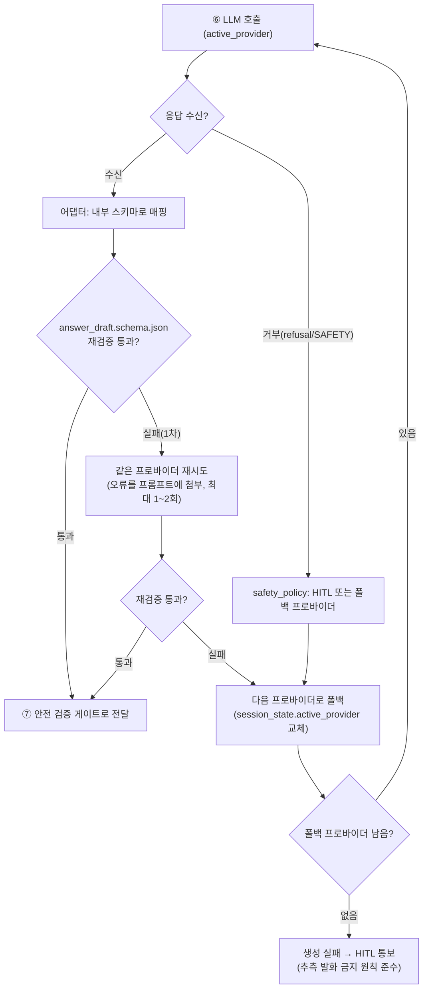

# LLM 3사 스키마 정규화 설계

**모듈**: M3 - 데이터 계약과 안전 정책 스펙
**실습 3**: OpenAI / Claude / Gemini의 Structured Output을 하나의 `answer_draft.schema.json`으로 흡수하는 어댑터 설계

---

## 문제 정의

파이프라인 ⑥ LLM 응답 단계는 프로바이더 교체 가능(M2 확정)해야 하고, 안전 검증 게이트 ⑦은 **프로바이더를 몰라야** 한다. 그러려면 3사가 서로 다른 방식으로 구조화 출력을 강제하더라도 결과는 모두 동일한 `answer_draft.json`(문장 배열 + `claim_map`)으로 수렴해야 한다. 이 문서는 3사 요청 방식을 비교하고, 공통 내부 스키마로의 매핑 규칙과 위반 시 폴백 흐름을 확정한다.

## 3사 Structured Output 방식 비교

| 항목                           | OpenAI                                                                           | Claude (Anthropic)                                                                                              | Gemini (Google)                                                |
| ---------------------------- | -------------------------------------------------------------------------------- | --------------------------------------------------------------------------------------------------------------- | -------------------------------------------------------------- |
| 1차 방식                        | `response_format` = `json_schema`                                                | ① Tool use(`input_schema`+`strict`) / ② `output_config.format`                                                  | `generationConfig.responseSchema`                              |
| 강제 파라미터                      | `response_format: {type:"json_schema", json_schema:{name, schema, strict:true}}` | ① 도구에 `strict:true` + `tool_choice:{type:"tool",name}` / ② `output_config:{format:{type:"json_schema",schema}}` | `responseMimeType:"application/json"` + `responseSchema:{...}` |
| 스키마 언어                       | JSON Schema (서브셋)                                                                | JSON Schema (서브셋)                                                                                               | OpenAPI 3.0 Schema (서브셋)                                       |
| `additionalProperties:false` | **필수**                                                                           | **필수**                                                                                                          | 미지원(무시) — 순서는 `propertyOrdering`로                              |
| 전 필드 required 요구             | 예(strict)                                                                        | 권장                                                                                                              | 아니오                                                            |
| 결과 위치                        | `choices[0].message.content`(JSON 문자열)                                           | ① `tool_use.input`(파싱된 객체) / ② 첫 text 블록의 JSON                                                                  | `candidates[0].content.parts[0].text`(JSON 문자열)                |
| 거부/미준수 신호                    | `finish_reason:"content_filter"` 등                                               | `stop_reason:"refusal"`                                                                                         | `finishReason:"SAFETY"`/`"RECITATION"`                         |

### 요청 방식 요약 (핵심 필드만, 개념 표기)

```
# OpenAI
response_format = { "type":"json_schema",
  "json_schema": { "name":"answer_draft", "strict":true, "schema": <ANSWER_DRAFT_SCHEMA> } }

# Claude — ① Tool use(강제)  ※ claude-api 스킬 기준
tools = [{ "name":"emit_answer_draft", "strict":true, "input_schema": <ANSWER_DRAFT_SCHEMA> }]
tool_choice = { "type":"tool", "name":"emit_answer_draft" }
#   또는 ② 네이티브
output_config = { "format": { "type":"json_schema", "schema": <ANSWER_DRAFT_SCHEMA> } }
#   (구 output_format 파라미터는 deprecated — output_config.format 사용)

# Gemini
generationConfig = { "responseMimeType":"application/json",
                     "responseSchema": <ANSWER_DRAFT_SCHEMA_OPENAPI> }
```

## 내부 스키마로의 매핑 규칙

목표 계약은 [../examples/schemas/answer_draft.schema.json](../examples/schemas/answer_draft.schema.json). 어댑터는 프로바이더 응답을 이 스키마로 변환한 뒤 **동일 검증기**(`validate.py`의 Draft202012Validator)로 재검증한다.

| 내부 필드 | OpenAI 매핑 | Claude 매핑 | Gemini 매핑 |
|---|---|---|---|
| (원본) | `message.content` JSON 파싱 | ① `tool_use.input`(이미 객체) / ② text JSON 파싱 | `parts[0].text` JSON 파싱 |
| `provider` | 어댑터가 `"openai"` 주입 | `"claude"` 주입 | `"gemini"` 주입 |
| `sentences[]` | 그대로 | 그대로 | 그대로 |
| `claim_map[]` | 그대로 | 그대로 | 그대로 |
| `coverage_state` | 그대로 | 그대로 | 그대로 |
| `length_sentences` | 없으면 `len(sentences)`로 보정 | 동일 | 동일 |
| `created_at` | 어댑터가 수신 시각 주입 | 동일 | 동일 |

### 스키마 제약 서브셋 차이 (핵심 주의점)

`answer_draft.schema.json`은 `minItems`, `minimum`, `minLength` 같은 수치·길이 제약과 `additionalProperties:false`를 쓴다. 그런데 프로바이더별 강제 스키마가 이를 다 받지는 않는다:

- **Claude 네이티브 structured outputs**는 `minimum/maximum/minLength/maxLength` 등 수치·문자열 제약을 **미지원**(Python/TS SDK는 스키마에서 제거하고 클라이언트에서 검증). `additionalProperties:false`·`enum`·`const`·`$ref`·문자열 포맷은 지원.
- **Gemini**는 OpenAPI 서브셋이라 `additionalProperties`를 무시하고 순서는 `propertyOrdering`으로 다룬다.

**결론**: 프로바이더에 넘기는 스키마는 "각 사가 받는 서브셋"으로 다운그레이드하되, **진짜 계약 강제는 어댑터 뒤단의 `answer_draft.schema.json` 재검증에서 한다.** 즉 프로바이더 구조화 출력은 "대략 맞게 유도", 최종 합격/불합격은 내부 검증기가 판정. 이 이중 구조가 3사 제약 차이를 흡수한다.

## 스키마 위반 시 재시도 → 폴백 흐름



**폴백 순서**: `session_state.active_provider`를 교체하며 진행하되, 순서는 설정값(예: Claude → OpenAI → Gemini)으로 고정한다. 각 전환은 `session_trace.jsonl`에 기록해 어느 프로바이더가 몇 번 실패했는지 사후 추적 가능하게 한다(M2 파이프라인의 trace 원칙).

**중요 원칙**: 모든 프로바이더가 실패하면 **임의 발화로 메우지 않고** HITL로 넘긴다 — M1의 "커버리지 없으면 침묵", `safety_policy.json`의 `no_speculation`과 일관.

## 어댑터 계층 설계 요약 (M5 구현 기준)

- **입력**: `broadcast_context.json` + 선택된 프로바이더.
- **출력**: 검증 통과한 `answer_draft.json` 또는 폴백/HITL 신호.
- **책임 경계**: 프로바이더별 요청 빌드·응답 파싱은 어댑터 안에서만. 검증 게이트(⑦)는 어댑터가 내놓은 표준 `answer_draft.json` 하나만 본다.
- **검증 재사용**: 어댑터 뒤단 재검증은 M3 `examples/validate.py`의 스키마·검증 로직을 그대로 재사용(별도 구현 금지).
- **모델 ID는 설정값**: 프로바이더별 모델 문자열(예: Claude `claude-opus-5`)은 설정에서 주입 — 어댑터 코드에 하드코딩하지 않는다.

## 다음 단계

이 설계는 M5(STT + 멀티 LLM 하네스)에서 실제 어댑터로 구현된다. 그때 3사 실제 API 응답으로 위 매핑·폴백을 검증한다.

← 개념: [../concepts/claim-evidence-model.md](../concepts/claim-evidence-model.md) · 스키마: [../examples/schemas/answer_draft.schema.json](../examples/schemas/answer_draft.schema.json)
