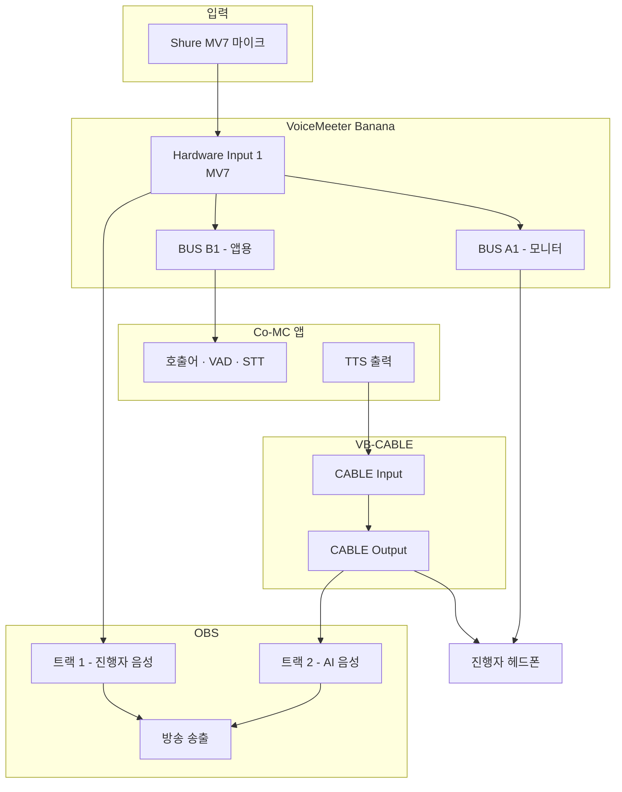

## 상태 (2026-08-23 방송 종료 후 세션)

설계를 실측으로 수정했고, 배선은 **성립을 확인**했다. OBS 구성은 **중간까지**.

| # | 항목 | 상태 |
|---|---|---|
| 1 | VoiceMeeter 필요 여부 판정 | ✅ **불필요로 판명** (아래 「설계 수정」) |
| 2 | VB-CABLE 설치 | ✅ 완료 (서명 검증 Valid) |
| 3 | 마이크 동시 열기 검증 | ✅ 성립 (A=B=0.0317) |
| 4 | 가상 케이블 통과 검증 | ✅ 성립 (440Hz → 440.2Hz, 무손실) |
| 5 | 재생 지연 실측 | ✅ **케이블 314ms** (5회, 312~321ms) |
| 6 | OBS 프로필·씬 격리 | ✅ `CoMC-Test` 신설, 방송용 `Untitled` 무손상 |
| 7 | OBS 오디오 소스 2개 + 트랙 배정 | ✅ 진행자=트랙1, AI=트랙2 |
| 8 | OBS 모니터링 장치 | ✅ `Headphones (Shure MV7)` |
| 9 | **트랙 2 개별 뮤트 검증** | ⬜ **미완 — 다음 세션 재개 지점** |
| 10 | 방송용 트랙 배치 전환 | ⬜ 미완 (아래 「방송용 배치」) |
| 11 | 재측정 3종 (M4 에코 / M5 WER / M6) | ⬜ 미완 |

### ✅ Windows 기본 장치 복구 완료 (2026-08-28)

VB-CABLE 설치 프로그램이 **자기를 Windows 기본 입출력 장치로 바꾼다.**
2026-08-23 세션에서 되돌리지 못한 채 종료했고, **닷새 뒤 실제로 사고가 났다** —
아래 「2026-08-28 재발 기록」 참조. 현재는 복구됐다.

| | 2026-08-28 사고 시점 | 복구 후 |
|---|---|---|
| 출력 | `Speaker (Realtek)` ✅ | `Speaker (Realtek)` ✅ |
| 입력 | **`CABLE Output`** ❌ | `Microphone (Shure MV7)` ✅ |

**입력만 바뀌어 있었다.** 출력은 어느 시점엔가 되돌아왔거나 애초에 안 바뀌었다.
드라이버를 재설치·업데이트하면 또 바뀐다. 아래 점검 명령을 방송 전 습관으로 둔다.

```bash
python -c "import sounddevice as sd; di,do=sd.default.device; \
print('출력', sd.query_devices(do)['name']); print('입력', sd.query_devices(di)['name'])"
```

`CABLE` 이 보이면 Windows 설정 → 시스템 → 소리에서 되돌린다.
**`CABLE Input` 은 앱이 명시적으로 지정할 때만 쓰는 장치다** — 기본값이 되면
시스템 소리가 전부 케이블로 새고, 다른 앱이 마이크를 열면 MV7 대신 케이블을 잡는다.

### 방송용 배치 (다음 세션에서 전환)

지금 배치(진행자=1, AI=2)는 **트랙 분리 검증용**이다. 실제 방송에서는 다르다.

OBS 고급 모드는 **송출과 녹화가 트랙을 다르게 쓴다.**

- 스트리밍 → `TrackIndex` 하나만 (현재 트랙 1) → **지금 배치로는 AI 음성이 방송에 안 나간다**
- 녹화 → `RecTracks` 비트마스크 (현재 트랙 1+2)

방송에 두 목소리를 다 내보내면서 후편집 분리도 남기려면 이렇게 바꾼다.

| 소스 | 트랙 | 역할 |
|---|---|---|
| 진행자 마이크 | **1 + 3** | 1=송출 믹스, 3=진행자만 |
| AI 음성 | **1 + 2** | 1=송출 믹스, 2=AI만 |

**실시간 차단 수단은 트랙 뮤트가 아니라 믹서의 소스 뮤트다.**
`AI 음성` 소스의 스피커 아이콘 한 번 클릭이면 모든 트랙에서 즉시 빠지고
진행자 목소리는 살아 있다. 트랙 분리는 *녹화본을 나중에 나누기* 위한 것이고,
*실시간 킬 스위치*는 소스 뮤트다 — 둘의 역할이 다르다.

또한 `CoMC-Test` 씬 컬렉션에는 영상 소스가 없어 실제 방송에 쓸 수 없다.
실전 투입 시에는 방송용 컬렉션(`Untitled`)에 `AI 음성` 소스를 추가해야 하고,
그 프로필은 Simple 모드라 고급 모드 전환 판단이 다시 필요하다.

### OBS 격리 구조 (오늘 만든 것)

| 용도 | Profile | Scene Collection | 비고 |
|---|---|---|---|
| 평소 방송·미팅 | `Untitled` | `Untitled` | 화면 캡처 6개, Simple — **손대지 않음** |
| Co-MC 실험 | `CoMC-Test` | `CoMC-Test` | 오디오 2트랙, 고급 |

상단 메뉴 Profile / Scene Collection 에서 오간다. 실험이 방송 설정을 건드리지 않는다.

> 참고: `Untitled` 프로필의 `basic.ini` 에는 YouTube OAuth `RefreshToken` 이 평문으로
> 들어 있다(OBS 의 기본 저장 방식). 이 파일을 공유하거나 화면에 띄우지 말 것.

---

---

## ⚠️ 설계 수정 — VoiceMeeter 는 필요 없다 (2026-08-23 실측)

이 문서의 최초 설계는 **VoiceMeeter Banana + VB-CABLE 두 개 설치**를 전제했다.
방송 종료 후 실제 장비로 검증해 보니 **전제 하나가 틀렸다.**

### 틀린 전제

> "앱이 마이크를 직접 잡으면 OBS 와 배타 모드로 충돌할 수 있다.
>  VoiceMeeter 를 거치는 이유의 절반이 이 충돌 회피다."

`audio_routing_probe.py --shared-test` 로 같은 MV7 에 InputStream 두 개를 동시에 열었다.

```
장치: [24] Microphone (Shure MV7)  (Windows WASAPI, 48000Hz)
스트림 A 열림
스트림 B 열림  ← 동시 열기 성공
피크 레벨  A=0.0317   B=0.0317
✓ 두 스트림 모두 실제 오디오를 받았다
```

**WASAPI 공유 모드에서 마이크는 여러 앱이 동시에 열 수 있다.**
배타 모드 충돌은 이 장비·이 드라이버에서는 일어나지 않는다.
따라서 **마이크 분배기(VoiceMeeter)가 필요 없다** — 앱과 OBS 가 각자 MV7 을 직접 잡으면 된다.

설치 하나가 줄었다. 방송 중 살아 있어야 할 구성요소도 하나 줄었다.

### 그래도 가상 케이블은 필요하다

마이크는 나눠 쓸 수 있지만 **TTS 출력을 OBS 의 별도 트랙으로 보내는 경로**는 여전히 필요하다.
후보가 둘이었다.

| | ShurePlus MOTIV Mix | VB-CABLE |
|---|---|---|
| 설치·재부팅 | 불필요 (이미 설치됨) | 필요 |
| 케이블을 잇는 주체 | **앱**(200MB Electron)이 실행 중이어야 함 | **드라이버** 자체 루프백 |
| 방송 중 그게 죽으면 | AI 음성 끊김 | 영향 없음 |
| 구성 지점 | MOTIV Mix 믹서 라우팅 | OBS 장치 선택만 |

MOTIV 가상 쌍은 드라이버만으로는 이어지지 않는다. 톤 통과 시험에서 확인했다.

```
재생 → [20] MOTIV Mix Virtual Input
캡처 ← [22] MOTIV Mix Virtual Output
440Hz 톤 3.0초 → 캡처 피크 0.0000   ✗ 무음
```

MOTIV Mix 앱이 실행 중이 아니면 두 장치는 서로 연결되지 않는다.

**VB-CABLE 을 선택했다.** 드라이버 레벨 루프백이라 앱이 필요 없고, M2 App Boundary 의
원칙("앱이 폭주해도 방송은 산다")과 같은 방향이다. 진행자가 리소스 문제로 MOTIV Mix 를
방송 중에 켜지 않는다는 점도 근거가 됐다 — 라우팅 때문에 다시 상주시키면
원래 피하려던 부담이 돌아온다.

### 수정된 구성

```
MV7 ──┬─→ OBS 트랙 1        (직접 캡처)
      └─→ 앱                (WASAPI 공유 모드로 동시 캡처)

TTS ─→ CABLE Input ─(드라이버 루프백)─→ CABLE Output ─→ OBS 트랙 2
                                                      └─→ 진행자 모니터
```

아래 「구성 절차」의 **1번(VoiceMeeter)은 건너뛴다.** 2번·3번만 수행한다.

## 다음 세션 실행 순서

**총 약 3시간. 방송 일정이 없는 날에 통째로 잡을 것.** 중간에 끊으면
재부팅 이후 상태가 애매해지고, 재측정은 라우팅 구성 직후에 해야 조건이 같다.

| # | 단계 | 소요 | 방송 없는 시간 필수? |
|---|---|---|---|
| 1 | VoiceMeeter Banana + VB-CABLE 설치 → **재부팅** | 30분 | ⛔ 예 (재부팅) |
| 2 | 라우팅 구성 (아래 「구성 절차」) | 40분 | ⛔ 예 |
| 3 | 검증 5단계 (아래 「검증」) — **M6 DoD 마지막 1건** | 20분 | ⛔ 예 (스피커·마이크) |
| 4 | 재측정 3종 (아래 「라우팅이 바뀌면 다시 재야 하는 것」) | 90분 | ⛔ 예 |

### 시작 전 확인

```bash
# 설치 여부 (재부팅 후)
python -c "import sounddevice as sd; [print(d['name']) for d in sd.query_devices()]"
```

`VoiceMeeter` 와 `CABLE Input` / `CABLE Output` 이 보여야 다음으로 간다.

### 4단계 재측정 명령

라우팅 구성이 끝나면 곧바로 아래를 돌린다. **순서를 지킬 것** —
앞 단계가 깨진 상태에서 뒤를 재면 원인을 분리할 수 없다.

```bash
# ① M4 에코 게이트 — 신호 경로가 바뀌었으므로 기존 오탐률이 유효하지 않다
cd 04-WakeWord-VAD-Harness/examples
python echo_probe.py --list-devices
python echo_probe.py --mode echo --gate off --device "VoiceMeeter Out B1" --output-device <스피커>
python echo_probe.py --mode echo --gate on  --device "VoiceMeeter Out B1" --output-device <스피커>

# ② M5 WER — VoiceMeeter 경유로 리샘플링이 한 번 더 들어간다
cd ../../05-STT-LLM-Harness/examples
python record_utterances.py --device "VoiceMeeter Out B1" --condition routed
python stt_probe.py --condition routed
#   → stt_result_routed.json 으로 따로 쌓인다. clean(WER 23.3% / CER 16.7%)과 비교

# ③ M6 첫 청크 + 가상 케이블 버퍼  ← 가장 중요
cd ../../06-TTS-Audio-Routing-Harness/examples
python tts_compare.py --repeats 5
```

**① 은 결과가 "N/A" 로 끝날 수 있다.** `--gate off` 에서 감지가 0건이면 그건
차단 성공이 아니라 **스피커 소리가 마이크에 닿지 않은 것**이고, 실험 자체가 무효다
(`echo_probe.py` 주석에 명시돼 있다). 라우팅을 마치면 TTS 는 VB-CABLE 과 헤드폰으로만
가므로 스피커를 거치지 않는다 — **M5에서 BGM 조건이 N/A 가 된 것과 같은 이유로
에코 게이트도 이 셋업에서는 불필요해질 수 있다.** 반드시 `off` 를 먼저 돌려
에코가 실재하는지부터 확인할 것. 그 결과에 따라 M4 게이트의 존치 여부가 갈린다.

**② 를 `--condition clean` 으로 돌리면 안 된다.** M5 기준선을 덮어쓴다.
`routed` 조건을 이 세션에서 추가해 두었다 — 결과 파일이 분리된다.

**③ 의 버퍼 지연은 `tts_compare.py` 가 재지 못한다** (파일 쓰기 기준이므로).
오늘 잰 588ms 는 "파일이 만들어지기까지"이고, 스피커에서 소리가 나기까지가 아니다.
**재생 시각을 따로 재는 코드가 필요하다** — 이것이 다음 세션의 유일한 신규 구현이다.
나머지는 기존 스크립트를 조건만 바꿔 다시 돌리는 일이다.

### 끝나면

- `06-TTS-Audio-Routing-Harness/README.md` 의 DoD 라우팅 항목 체크
- Roadmap 진행표 M6 행을 ✅ 100% 로
- `wait-filler-design.md` 의 `T_filler` 를 실측값으로 갱신
- WorkLog 작성 (`vl_worklog/YYYYMMDD_M6_Live-CoMC-App.md` 이어쓰기 또는 신규)

---

## 왜 트랙을 나누는가

한 문장으로: **앱이 폭주해도 방송을 살리기 위해서다.**

TTS 출력과 마이크가 같은 트랙에 섞여 있으면, AI 가 이상한 말을 하기 시작했을 때
쓸 수 있는 수단이 "전체 음소거"밖에 없다. 그건 진행자의 목소리까지 끊는다.
트랙이 나뉘어 있으면 **TTS 트랙만 내리고 방송은 계속**할 수 있다.

이것은 M2에서 확정한 App Boundary 의 오디오판이다. 앱은 자기 트랙 안에서만 사고를 낼 수 있어야 한다.

두 번째 이유는 M4에서 실측한 에코다. TTS 출력이 스피커로 나가 마이크로 되돌아오면
호출어 오탐과 VAD 오작동을 만든다. 경로가 나뉘어야 에코 게이트가 어디를 막을지 정해진다.

## 신호 흐름



핵심은 **마이크와 TTS 가 OBS 에서 서로 다른 트랙으로 들어간다**는 것 하나다.
나머지는 그것을 만들기 위한 배선이다.

## 설치

둘 다 재부팅이 필요하다. 방송 일정이 없는 시간에 한다.

| 도구 | 용도 | 비고 |
|---|---|---|
| VoiceMeeter Banana | 마이크를 앱과 OBS 에 동시 분배 | 무료(도네이션웨어). 재부팅 필요 |
| VB-CABLE | TTS 출력을 OBS 별도 트랙으로 보내는 가상 케이블 | 무료. 재부팅 필요 |

설치 확인은 명령 한 줄로 된다.

```bash
python -c "import sounddevice as sd; [print(i, d['name']) for i, d in enumerate(sd.query_devices())]"
```

`VoiceMeeter` 와 `CABLE Input` / `CABLE Output` 이 목록에 보이면 설치된 것이다.
M4에서 만든 장치 이름 해석 규약을 그대로 쓴다 — 장치 인덱스는 재부팅마다 바뀌므로
**이름으로 찾고 인덱스로 고정하지 않는다.**

## 구성 절차

### 1. VoiceMeeter — 마이크 분배

1. Hardware Input 1 에 MV7 을 잡는다 (WDM 또는 KS. MME 는 지연이 크다)
2. Hardware Input 1 에서 **A1** 과 **B1** 을 켠다
   - A1 → 진행자 헤드폰 모니터
   - B1 → 가상 출력. 앱이 이 스트림을 입력으로 받는다
3. 앱(`record_utterances.py`, 호출어 감지)의 입력 장치를 `VoiceMeeter Out B1` 로 지정

**주의**: 앱이 마이크를 직접 잡으면 OBS 와 배타 모드로 충돌할 수 있다.
VoiceMeeter 를 거치는 이유의 절반이 이 충돌 회피다.

### 2. VB-CABLE — TTS 를 별도 트랙으로

1. 앱의 TTS 재생 출력 장치를 `CABLE Input` 으로 지정
2. OBS 에 오디오 입력 캡처 소스를 추가하고 장치를 `CABLE Output` 으로 지정
3. 진행자 모니터에도 들려야 하므로, VB-CABLE 의 `CABLE Output` 을 VoiceMeeter 의
   Hardware Input 2 로 받아 A1(헤드폰)으로 보낸다

3번을 빠뜨리면 **진행자가 AI 발화를 듣지 못한다.** 시청자만 듣고 진행자는 모르는
상태가 되어 대화가 어긋난다. 배선 실수 중 가장 잦고 가장 치명적인 지점이다.

### 3. OBS — 트랙 분리

1. 설정 → 출력 → 고급 → 오디오 트랙을 2개 이상 활성화
2. 마이크 소스: 트랙 1 만 체크
3. `CABLE Output` 소스: 트랙 2 만 체크
4. 녹화/송출 설정에서 트랙 1·2 를 모두 포함

## 검증

구성이 끝나면 아래를 **순서대로** 확인한다. 순서가 중요하다 —
앞 단계가 안 되는데 뒤를 보면 원인을 찾을 수 없다.

| # | 확인 | 통과 기준 |
|---|---|---|
| 1 | 마이크 → OBS 트랙 1 | 말할 때 트랙 1 미터만 움직인다 |
| 2 | TTS → OBS 트랙 2 | 합성 재생 시 트랙 2 미터만 움직인다 |
| 3 | 진행자 모니터 | 헤드폰에서 자기 목소리와 AI 목소리가 **둘 다** 들린다 |
| 4 | **트랙 2 개별 뮤트** | 트랙 2 를 내려도 트랙 1(진행자)은 살아 있다 ← **실습 3 검증 기준** |
| 5 | 에코 게이트 | TTS 재생 중 호출어 감지가 트리거되지 않는다 (M4 게이트 on) |

4번이 이 실습의 존재 이유다. 나머지는 4번을 가능하게 만드는 준비다.

5번은 M4에서 이미 측정한 항목이다(게이트 off 5건 오탐 → on 0건). 다만 그때는
같은 장치 안에서 잰 것이고, 라우팅을 나눈 뒤에는 **경로가 달라졌으므로 다시 확인해야 한다.**

## 라우팅이 바뀌면 다시 재야 하는 것

- M4 에코 게이트 오탐률 — 신호 경로가 바뀌면 유효하지 않다
- M5 STT WER — 마이크가 VoiceMeeter 를 경유하면 리샘플링이 한 번 더 들어간다.
  WER 이 달라질 수 있다
- M6 TTS 첫 청크 지연 — 파일 쓰기 기준으로 쟀다. 실제 재생 경로에는
  가상 케이블 버퍼 지연이 더해진다. **이 값이 필러 트리거 시각(`T_filler`)에 직접 영향을 준다**

세 번째가 특히 중요하다. 오늘 잰 588ms 는 **파일이 만들어지기까지**이고,
스피커에서 소리가 나기까지는 아니다. 가상 케이블 버퍼가 얼마를 더하는지는 측정해야 안다.

## 참조

- 장치 이름 해석 규약: [../../04-WakeWord-VAD-Harness/README.md](../../04-WakeWord-VAD-Harness/README.md)
- 에코 게이트 실측: [../../vl_worklog/20260815_M4_Live-CoMC-App.md](../../vl_worklog/20260815_M4_Live-CoMC-App.md)
- TTS 실측: [tts-comparison.md](tts-comparison.md)
- 필러 설계: [wait-filler-design.md](wait-filler-design.md)
