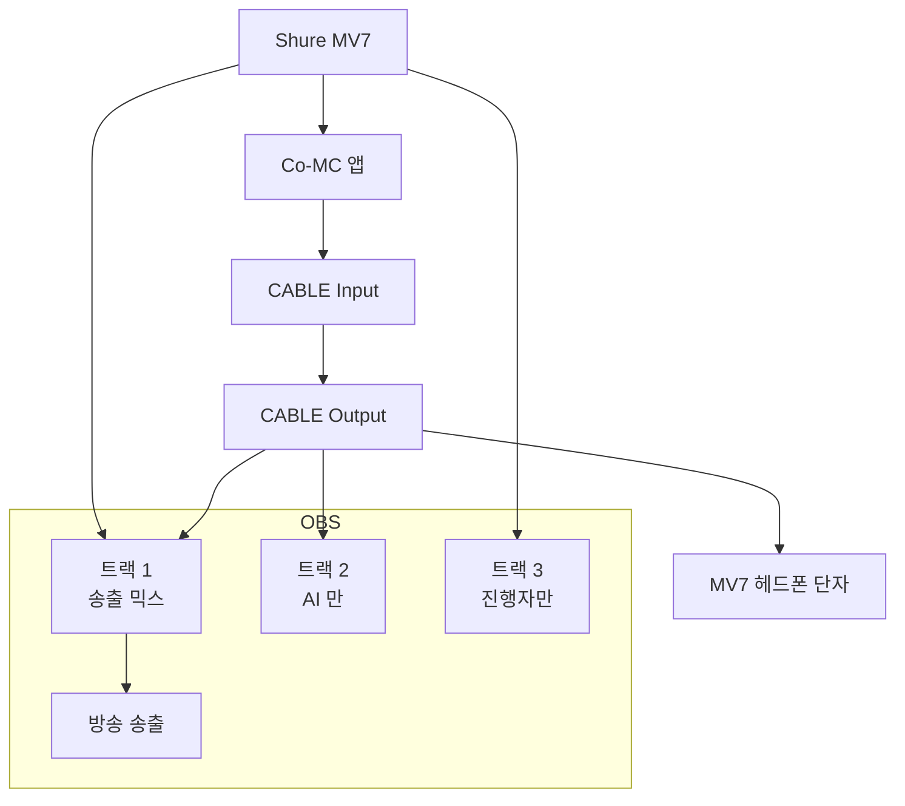

## 이 문서의 용도

VB-CABLE 을 설치한 뒤로 오디오 장치가 늘어나 **어느 것을 어디에 물려야 하는지**가
헷갈리기 쉬워졌다. 상황은 둘뿐이다.

- **모드 A** — 평상시. 온라인 미팅 녹화, 유튜브 시청, 일반 작업. **AI 없음**
- **모드 B** — 라이브 방송에서 AI 와 공동 진행. **AI 음성이 방송에 나감**

각 모드에서 **무엇을 어떻게 두는지**만 적는다. 왜 그런지는
[audio-routing-setup.md](audio-routing-setup.md) 에 있다.

---

## 🔑 먼저 외울 것 하나

> **Windows 기본 장치는 두 모드에서 똑같다.**
> `CABLE` 은 **절대 기본 장치가 되면 안 된다.**

| Windows 설정 → 시스템 → 소리 | 항상 이 값 |
|---|---|
| **출력(Output)** | 스피커 또는 헤드폰 (`CABLE Input` ❌) |
| **입력(Input)** | `Microphone (Shure MV7)` (`CABLE Output` ❌) |

`CABLE Input` 은 **앱이 이름으로 직접 지정할 때만** 쓰는 통로다.
OBS 도, 우리 TTS 코드도 이름으로 찾아 쓴다. 기본값일 이유가 없다.

⚠️ **VB-CABLE 설치 프로그램은 자기를 기본 장치로 바꿔 놓는다.**
재설치하거나 드라이버를 업데이트하면 또 바뀐다. 이상하면 여기부터 확인한다.

### 30초 점검 명령

```bash
cd 06-TTS-Audio-Routing-Harness/examples
python -c "import sounddevice as sd; di,do=sd.default.device; print('출력', sd.query_devices(do)['name']); print('입력', sd.query_devices(di)['name'])"
```

`CABLE` 이 보이면 Windows 설정에서 되돌린다.

---

## 모드 A — 평상시 (온라인 미팅 녹화)

**AI 를 쓰지 않는 모든 상황.** 예전에 하던 것과 완전히 동일하다.

### 체크리스트

- [ ] **Windows 소리** — 출력=헤드폰/스피커, 입력=`Microphone (Shure MV7)`
- [ ] **OBS → Profile** = `Untitled`
- [ ] **OBS → Scene Collection** = `Untitled`
- [ ] 미팅 앱(Zoom·Teams·Meet) — 마이크 `Shure MV7`, 스피커 헤드폰

### 이게 전부다

VB-CABLE 은 **아무것도 하지 않는다.** 설치돼 있어도 아무 데도 연결돼 있지 않으면
그냥 놀고 있는 장치다. 지우거나 끌 필요 없다.

`Untitled` 프로필·씬 컬렉션에는 예전 화면 캡처 6개(`SAMSUNG`, `Notebook`,
`Window Capture`, `Browser`, `HP`, `BigHug`)가 **그대로 있다.**
Co-MC 실험 때문에 손댄 적 없다.

> **화면이 검게 나오면** Scene Collection 이 `CoMC-Test` 로 되어 있는 것이다.
> 그 컬렉션에는 영상 소스가 없다(오디오만). 상단 메뉴에서 `Untitled` 로 바꾼다.
> **Profile 과 Scene Collection 은 따로 움직인다 — 둘 다 바꿔야 한다.**

---

## 모드 B — AI 공동진행 라이브 방송

**⚠️ 아직 완성되지 않았다.** 배선과 지연은 검증했지만
트랙 뮤트 검증과 방송용 씬 구성이 남아 있다. 아래 「남은 결정」 참조.

### 신호 흐름



마이크는 앱과 OBS 가 **동시에** 잡는다(WASAPI 공유 모드, 실측 확인).
분배기는 필요 없다.

### 체크리스트

**① Windows** *(모드 A 와 동일)*
- [ ] 출력=헤드폰/스피커, 입력=`Microphone (Shure MV7)`

**② OBS 프로필·씬**
- [ ] Profile = 고급 모드 프로필 (현재 `CoMC-Test`)
- [ ] Scene Collection = 방송용 화면이 있는 컬렉션 ← **남은 결정 참조**

**③ OBS 오디오 소스 2개**

| 소스 이름 | 장치 | 트랙 |
|---|---|---|
| `진행자 마이크` | `Microphone (Shure MV7)` | **1 + 3** |
| `AI 음성` | `CABLE Output (VB-Audio Virtual Cable)` | **1 + 2** |

- [ ] 트랙 1 = 송출 믹스 (두 목소리 다) — **여기 빠지면 방송에 안 나간다**
- [ ] 트랙 2 = AI 만, 트랙 3 = 진행자만 (녹화 후편집용)

**④ 모니터링** *(진행자가 AI 발화를 들어야 한다)*
- [ ] `AI 음성` 행 → Audio Monitoring = **`Monitoring Enabled`**
- [ ] Settings → Audio → Advanced → Monitoring Device = **`Headphones (Shure MV7)`**

> 스피커로 두면 **AI 음성 → 스피커 → MV7** 에코 루프가 생긴다.
> Galaxy Buds2 Pro 는 블루투스 지연 150~300ms 가 케이블 314ms 위에 더해진다.
> **MV7 헤드폰 단자가 유일하게 맞는 선택이다.**

**⑤ 앱 쪽**
- [ ] TTS 출력 장치 = `CABLE Input` (코드가 이름으로 찾는다. 인덱스 고정 금지)
- [ ] 마이크 입력 = `Microphone (Shure MV7)`

### 🚨 방송 중 AI 를 즉시 끄는 법

**믹서에서 `AI 음성` 소스의 스피커 아이콘을 클릭한다. 한 번이면 된다.**

즉시 모든 트랙에서 빠지고 **진행자 목소리는 그대로 살아 있다.**
AI 가 이상한 말을 시작하면 이것부터 누른다.

> 트랙 뮤트가 아니다. 트랙 분리는 **녹화본을 나중에 나누기** 위한 것이고,
> **실시간 차단은 소스 뮤트**다. 역할이 다르다.
> 방송 전에 이 아이콘 위치를 손이 기억하도록 한 번 눌러 보고 시작할 것.

### 지연을 미리 알고 있을 것

발화가 끝나고 AI 목소리가 나오기까지 **약 4.7~5.7초** 걸린다(실측 합산).

| 구간 | 소요 |
|---|---|
| STT | 1,160ms |
| LLM | 2,600ms |
| TTS 합성 | 588ms(스트리밍) ~ 1,584ms(파일) |
| 케이블 → 발성 | 314ms |

**침묵이 4초 넘게 흐른다.** 방송에서는 긴 시간이다.
대기 필러를 넣어도 1.5초만 덮으므로 나머지는 그대로 남는다
([wait-filler-design.md](wait-filler-design.md)).
→ **질문을 던지고 다른 말을 이어가다가 답이 오면 받는** 진행 방식이 필요하다.

---

## 두 모드 비교 (한눈에)

| | 모드 A — 평상시 | 모드 B — AI 공동진행 |
|---|---|---|
| Windows 출력 | 헤드폰/스피커 | 헤드폰/스피커 *(동일)* |
| Windows 입력 | MV7 | MV7 *(동일)* |
| OBS Profile | `Untitled` (Simple) | 고급 모드 프로필 |
| OBS Scene Collection | `Untitled` | 방송용 (미정) |
| 오디오 소스 | 기존 그대로 | 진행자 마이크 + AI 음성 |
| VB-CABLE | 안 씀 (놀고 있음) | TTS 통로로 사용 |
| OBS 모니터링 장치 | 상관없음 | **MV7 헤드폰 필수** |
| 준비 시간 | 0분 (그냥 켜면 됨) | 체크리스트 5분 |

**바뀌는 것은 OBS 안쪽뿐이다.** Windows 설정은 두 모드가 같다.
이것만 기억하면 헷갈릴 일이 없다.

---

## 2026-08-28 재발 기록 — 이 문서가 맞았다

Co-MC 실험 닷새 뒤, 사용자가 라이브 방송과 온라인 미팅 녹화가 안 된다고 보고했다.
증상은 세 가지였다.

| 증상 | 실제 원인 |
|---|---|
| 화면이 검게 나온다 | Scene Collection 이 `CoMC-Test` (영상 소스 0개) |
| 컴퓨터 소리가 안 잡힌다 | 같은 이유 — 그 컬렉션엔 데스크톱 오디오가 없다 |
| 일요일 방송이 될지 모르겠다 | **Windows 기본 입력이 `CABLE Output`** — `Untitled` 프로필은 마이크를 "기본 장치"로 잡으므로 **무음 송출 위험** |

**세 번째가 진짜 사고였다.** 앞의 둘은 프로필만 되돌리면 끝나지만,
이건 되돌리지 않았으면 방송 중에야 알았을 문제다.

### 조치 (2026-08-28)

- [x] Windows 입력 기본 장치 → `Microphone (Shure MV7)` 복구
- [x] Mono audio 끄기 (켜져 있었다 — 데스크톱 오디오가 모노로 녹음될 뻔했다)
- [x] OBS Profile → `Untitled`, **Scene Collection → `Untitled`** (둘을 따로 바꿔야 한다는 점에서 한 번 막혔다)
- [x] 소스 6개·데스크톱 오디오·마이크 미터 동작 확인
- [ ] **출력의 "기본 통신 장치"가 아직 `CABLE Input`** — `mmsys.cpl` → 재생 탭에서 변경 필요. Zoom·Teams 계열이 이 장치를 쓰면 상대 목소리가 안 들린다
- [ ] OBS 오디오 장치를 "기본"이 아니라 **이름으로 고정** (`Speaker (Realtek(R) Audio)` / `Microphone (Shure MV7)`)

### 이 사건에서 배운 것

**격리 설계는 작동했다.** `Untitled` 프로필·씬 컬렉션은 아무 손상 없이 그대로였고,
메뉴 두 번으로 복구됐다. 실험이 방송 설정을 망가뜨리지 않는다는 전제는 지켜졌다.

**깨진 것은 OBS 밖이었다.** VB-CABLE 이 바꾼 것은 Windows 기본 장치이고,
이건 프로필 격리가 막아주지 못한다. **OBS 안쪽만 나눠서는 부족하다** —
Windows 설정도 점검 대상에 넣어야 한다. 위 「🔑 먼저 외울 것 하나」가
그래서 이 문서 맨 앞에 있다.

**"기본 장치"에 의존하는 설정이 사고의 증폭기였다.** `Untitled` 프로필이
마이크를 이름으로 지정했다면 Windows 기본값이 뭐로 바뀌든 무관했다.
장치는 이름으로 못 박는다.

## 남은 결정 (다음 세션)

### ① 모드 B 의 씬 컬렉션을 어떻게 할 것인가

`CoMC-Test` 컬렉션에는 **영상 소스가 없어** 실제 방송에 쓸 수 없다.
두 가지 길이 있고 아직 정하지 않았다.

| 선택지 | 장점 | 단점 |
|---|---|---|
| **(가)** `Untitled` 컬렉션에 `AI 음성` 소스를 추가하고, `Untitled` 프로필을 고급 모드로 전환 | 화면 구성이 이미 완성돼 있다 | 방송용 프로필의 인코더·비트레이트를 고급 모드에서 다시 맞춰야 한다 |
| **(나)** `CoMC-Test` 컬렉션에 방송용 화면 소스를 복제 | 방송용 설정을 건드리지 않는다 | 화면 구성을 다시 만들어야 하고, 이후 두 곳을 따로 관리해야 한다 |

**(가) 를 권한다** — 화면 구성을 두 벌 관리하는 비용이 인코더 재설정보다 크다.
다만 전환은 **방송 없는 날**에 하고, 전환 직후 짧게 테스트 송출을 해봐야 한다.

### ② M6 DoD 마지막 1건

트랙 2 개별 뮤트 검증. 톤을 흘려보내 트랙 2 미터만 움직이는지,
트랙 2 를 내려도 트랙 1 이 살아 있는지 확인하면 끝난다. 20분.

### ③ 재측정 3종

경로가 바뀌었으므로 기존 수치가 유효하지 않다.
특히 **M4 에코 게이트는 존치 여부가 갈린다** — 모니터링이 MV7 헤드폰이면
스피커를 거치지 않으므로 에코가 실재하지 않을 수 있다.
`--gate off` 를 먼저 돌려 에코가 있는지부터 확인할 것.

---

## 참조

- 배선 근거와 실측: [audio-routing-setup.md](audio-routing-setup.md)
- 지연 예산과 필러: [wait-filler-design.md](wait-filler-design.md)
- TTS 프로바이더 비교: [tts-comparison.md](tts-comparison.md)
- 이 세션 기록: [../../vl_worklog/20260823_M6b_Live-CoMC-App.md](../../vl_worklog/20260823_M6b_Live-CoMC-App.md)
