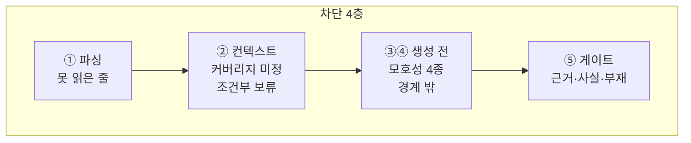
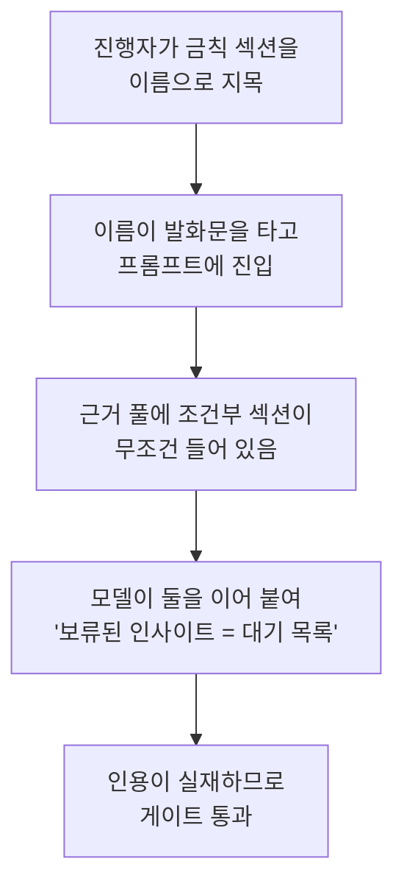

# 검증 규칙 — 무엇을 어떤 근거로 막는가

**작성**: 2026-08-30 (M8)
**대상 코드**: `07-CoMC-Engine-POC/src/05_verify_and_gate.py` · `04_compose_answer.py` · `03_classify_intent.py` · `02_resolve_context.py`

## 차단은 한 곳에서 일어나지 않는다

M7 까지는 "생성 전 차단"과 "생성 후 게이트" 두 층으로 생각했다. M8 시나리오를 돌려 보니 **네 층**이었고, 층마다 막을 수 있는 것이 다르다.



**앞 층에서 막을수록 좋다.** 뒤로 갈수록 이미 만들어진 것을 지우는 일이 되고, 만들어 둔 답은 언젠가 새어 나간다.

## ① 파싱 — 못 읽은 것과 비어 있는 것을 가른다

| 규칙 | 내용 |
|---|---|
| `parse_anomalies` | 커버리지 줄을 못 읽으면 기록하고 화면에 띄운다 |

**M8 이전에는 파싱 실패가 `undefined` 로 떨어졌다.** `undefined` 는 HITL 로 넘어가므로 **안전해 보인다.** 그래서 아무도 눈치채지 못한다 — 파이프라인은 성공을 보고하고, 파트는 조용히 발화 항목 0개가 된다.

> **비어 있는 것(진짜 미편성)은 정상이고, 못 읽은 것은 버그다. 같은 값으로 뭉뚱그리면 버그가 정상으로 위장된다.**

실제로 이 위장 때문에 Live22·Live25 에서 **발화 항목 18개가 사라져 있었다** (아래 「발견」 참조).

## ② 컨텍스트 — 아예 만들지 않는다

| 규칙 | 조건 | 동작 |
|---|---|---|
| `coverage.undefined_blocks` | `coverage_state == "undefined"` | 컨텍스트를 만들지 않고 종료 |
| `conditional.time_gated` | 조건부 섹션 | **기본 제외**. `--allow-conditional` 로만 편입 |
| `forbidden.excluded_removed` | 금칙 헤딩이 근거에 섞임 | 중단 (불변식 위반) |

**조건부 섹션의 기본값이 '제외'인 이유.** 조건이 `시간이 남으면` 같은 형태라 코드가 판정할 수 없다. **판정할 수 없는 조건의 기본값은 '충족되지 않음'이어야 한다** — 모르면 넣지 않는다.

M8 이전에는 무조건 들어갔고, Live21 의 `대기 목록 (시간이 남으면)` 이 근거로 실려 **금칙 섹션을 묻는 질문에 그럴듯한 답을 만드는 재료**가 됐다.

보류한 것은 `withheld_conditional` 에 이유와 함께 남긴다. **무엇을 왜 뺐는지 남지 않으면 '원래 없었다'와 구분되지 않는다.**

## ③④ 생성 전 — 만들기 전에 멈춘다

| 플래그 | 조건 | 되물을 말 |
|---|---|---|
| `no_coverage` | 커버리지 미정 | 이 파트에서 다루실 항목을 알려주세요 |
| `quantity_mismatch` | 요청 수량 ≠ 화이트리스트 개수 | 어떤 항목을 다루실 건가요? |
| `completion_confusion` | 완료 항목을 미래형으로 요청 | 이미 완료된 항목입니다 |
| **`forbidden_topic_requested`** | **발화가 금칙 섹션을 이름으로 지목** | **이번 방송에 편성되어 있지 않습니다** |

마지막 것이 **M8 에서 새로 추가**됐다. 이유는 아래 「발견 2」에 적었다.

여기에 더해 `out_of_scope`(M2 경계 밖)·`unknown`·제어 명령은 생성 대상이 아니다.

## ⑤ 게이트 — 규칙 기반 대조만

LLM 을 부르지 않는다. M2 App Boundary 의 *"안전 검증 게이트 — 검증을 LLM 자기평가에 위임하는 것"* 이 금지 항목이기 때문이다. **답을 만든 쪽에게 채점을 맡길 수는 없다.**

검사 순서가 중요하다. 길이 컷을 마지막에 두지 않으면 **근거 없는 문장이 살아남고 근거 있는 문장이 잘린다.**

| # | 규칙 | 탈락 사유 |
|---|---|---|
| 1 | 모든 문장이 `claim_map` 에 있는가 | `no_evidence` |
| 2 | 인용이 근거 풀에 실재하는가 | `evidence_not_found` |
| 3 | 화이트리스트·근거와 어휘가 겹치는가 | `coverage_violation` |
| 4 | **부재 주장이 화이트리스트와 모순인가** | **`absence_contradicts_coverage`** |
| 5 | **숫자·고유명사가 신뢰 출처에 있는가** | **`fact_not_in_evidence`** |
| 6 | 남은 문장이 상한을 넘는가 | `length_hardcut` |

4·5 가 M8 추가분이다.

### 4. 부재 주장 — 근거로 지지될 수 없는 종류의 문장

> **"없다"를 증명하는 인용은 존재할 수 없다.**

근거 풀은 *문서에 있는 것*의 모음이다. 없다는 사실은 거기 적혀 있지 않다. 그런데 모델은 아무 인용이나 붙이고, **인용이 실재하므로 게이트는 통과시킨다.**

M7 이 이것을 인사이트로 남겼고, M8 시나리오가 실물로 재현했다.

```
문장  "따라서 데이터센터 인력 프로그램은 오늘 실험 항목에 포함되어 있지 않습니다."
근거  "★ 실험 1 — AI로 라이브 방송 보조 MC 앱 만들기"
결과  통과 (M7 게이트)
```

인용은 실재하지만 **그 인용은 데이터센터에 대해 아무 말도 하지 않는다.** 이때 결론이 우연히 참이었다는 점이 더 위험하다 — 같은 메커니즘이 거짓을 만들 때도 똑같은 확신으로 통과한다.

**해법은 금지가 아니라 근거의 종류를 바꾸는 것이다.** 앱이 *"그건 오늘 안 다룹니다"* 라고 말하는 것 자체는 옳고 유용하다. 다만 그 근거는 인용이 아니라 **화이트리스트가 닫힌 집합이라는 사실**이다.

| 부재 주장의 주제 | 판정 | 근거 |
|---|---|---|
| 화이트리스트 **밖** | 허용 | 화이트리스트 닫힘 → `absence_by_closure` 에 기록 |
| 화이트리스트 **안** | **드롭** | 화이트리스트와 정면 모순 |

주제 판정은 커버리지 항목의 어휘가 문장에 **얼마나 통째로** 들어왔는지로 본다(60% 이상). 처음에는 "겹침이 있고 남는 토큰이 없으면 모순"으로 했는데, 부재 문장에는 `다루지`·`않습니다` 같은 토큰이 항상 남아 **한 번도 잡히지 않았다.**

### 5. 숫자·고유명사 — 자기 근거 안에 실재하는가

환각이 가장 아프게 드러나는 지점이다. 문장이 근거와 잘 겹쳐도 **숫자 하나만 틀리면** 시청자에게 틀린 정보가 나간다.

**대조 대상은 근거 인용만이 아니다.** 처음에 그렇게 했더니 정상 문장이 떨어졌다.

```
문장  "오늘 3번 파트는 'AI로 라이브 방송 보조 MC 앱 만들기'를 다룹니다."
드롭  숫자 '3' 이 근거에 없음
```

맞는 말이지만 그 3은 환각이 아니라 **`current_part_id`** 다. M7 실습 5에서 권위값으로 확정한 세션 상태이고, 근거 풀보다 믿을 수 있다.

| 신뢰 출처 | 이유 |
|---|---|
| 그 문장이 인용한 근거 | 문서에 적힌 것 |
| 커버리지 화이트리스트 | 정의상 말해도 되는 것 |
| `current_part_id` | M7 권위값 |
| 항목·근거 개수 | 세어서 나오는 값 |

**근거 풀 *전체*와는 대조하지 않는다.** 다른 문장의 근거에서 숫자를 빌려 올 수 있게 되고, 그러면 *"어느 근거에든 5가 있으니 5를 말해도 된다"* 가 되어 검사가 무의미해진다.

**한글 수사(`두 가지`)는 검사하지 않는다.** 근거를 세어서 나오는 값이라 인용에 없는 것이 정상이다. 그것까지 잡으면 정상 문장을 떨어뜨린다.

## ⑥ 렌더 — 모드가 소리를 가른다

| 모드 | 화면 | 소리 |
|---|---|---|
| `LIVE` | 갱신 | 즉시 (`spoken.json`) |
| `REVIEW` | 갱신 | **보류** (`spoken_pending.json` → `--approve`) |
| `MUTE` | 갱신 | 없음 |

**화면은 세 모드 모두에서 갱신한다.** 진행자가 무엇을 말하려 했는지는 보여야 승인도 하고 판단도 한다. 모드가 가르는 것은 소리다.

**모드는 파일(`mode.json`)에 둔다.** 프로세스 인자로 두면 모드를 바꾸려고 재시작해야 하는데, **사고가 난 순간에 재시작은 할 수 없는 일이다.** 파일이면 다음 발화가 알아서 새 모드를 읽는다.

### 두 가지 안전 장치

**① 모드 파일이 깨지면 `REVIEW` 로 떨어진다.**

| 상태 | 모드 |
|---|---|
| 파일 없음 | `LIVE` (아직 설정한 적 없음) |
| 파일 손상 | **`REVIEW`** |

깨진 상태에서 `LIVE` 로 떨어지면 **모르는 상태로 말하기 시작한다.** 실패의 기본 방향은 침묵 쪽이어야 한다.

**② 모드를 내리면 지난 `spoken.json` 을 지운다.**

지우지 않으면 TTS 폴러가 그것을 다시 읽어 **모드를 내렸는데 옛 발화가 나가는** 사고가 난다.

## 발견 — M8 에서 실물이 뒤집은 것

### 발견 1: 파서가 발화 항목 18개를 조용히 지우고 있었다

시나리오용 실물을 넓히려고 Live22·Live25 를 파싱했더니 셋 다 실패했다. **크래시도 경고도 없었다.**

| 회차·파트 | 원인 | 수정 전 | 수정 후 |
|---|---|---|---|
| Live22 2부 | 볼드 안 수식어 `**…커버리지 (2026-08-09 방송 후 실제)**:` | `undefined` 0개 | `defined` **3개** |
| Live25 1부 | 파트 헤딩에 괄호 시간 표기 없음 | **파트 인식 실패** | `defined` 1개 |
| Live25 2부 | 같음 | **파트 인식 실패** | `defined` **14개** |
| Live25 주간 영상 | `미편성 — …` 을 항목으로 읽음 | **`defined` 1개 (오탐)** | `undefined` 0개 ✅ |

**마지막 줄이 반대 방향의 실패다.** `미편성 — 이번 회차 슬라이드에 없음` 이 통째로 **발화 허용 항목**이 되어 있었다. 항목 소실(말 못 함)보다 나쁘다 — **말하면 안 되는 것에 허가를 내주는 쪽**이기 때문이다.

세 규칙 모두 Live20·21 만 보고 만든 것이었다. **실물 2회차로 만든 규칙은 규칙이 아니라 관찰이다** (M7 회고와 같은 지적).

### 발견 2: 금칙 섹션의 *이름*은 발화문을 타고 들어온다

`forbidden-request` 시나리오가 실패했다. 근거 풀은 깨끗한데(금칙 내용 0회) **프롬프트에 금칙 문자열이 1회** 있었다.

```
프롬프트 41행  [진행자/시청자 발화]
              보류된 인사이트 후보에 뭐가 있나요?
```

진행자가 물은 문장 그 자체다. 그리고 모델은 이렇게 답했다:

> *"오늘 보류된 인사이트로는 '대기 목록(시간이 남으면)' 섹션이 있습니다."*

**게이트는 통과시켰다.** `대기 목록 (시간이 남으면)` 이 근거 풀에 실재하는 인용이었기 때문이다.

실패 사슬:



**두 곳을 고쳤다.** 조건부 섹션을 기본 제외로(재료 제거), 금칙 이름 지목을 생성 전 차단으로(질문 자체를 거절).

> **입력에서 제거하는 방어는 근거 풀에만 적용되고 발화문에는 적용되지 않는다.** 진행자의 입은 입력의 일부다.

### 발견 3: 차단이 예상보다 앞 단계에서 일어났다

`undefined-coverage` 시나리오를 처음 돌렸을 때 **오류로 셌다.** ② 단계가 0 아닌 코드로 끝났기 때문이다.

틀린 것은 코드가 아니라 기대였다. `safety_policy` 의 `coverage.undefined_blocks` 는 `stage: "context"` 다 — 생성 단계가 아니라 컨텍스트 단계에서 막으라고 되어 있고, 실제로 그렇게 구현돼 있었다.

**차단이 더 앞에서 일어나는 것은 개선이지 결함이 아니다.** 빈 컨텍스트조차 만들지 않으므로 LLM 에 넘어갈 것이 아예 생기지 않는다.

### 발견 4: 커버리지 줄이 **덮어쓰기**되고 있었다 — 가장 나쁜 종류

파서 수정 후 볼트 Rundown **15편 전수**로 넓혔더니 새 결함이 나왔다.

| 회차·파트 | 파트가 실제로 받은 것 | 옳은 것 |
|---|---|---|
| Live16 3부 | 실험②의 3항목 | **파트 직속 2항목** |
| Live17 4부 | 실험⑦의 3항목 | **파트 직속 7항목** |

`## 3부: 오늘의 실험` 아래에 `### 실험 ①②③…` 하위 섹션들이 **각자 커버리지 줄을 갖는다.** 파서는 커버리지 줄을 만날 때마다 현재 파트에 덮어썼고, 그래서 **마지막 하위 섹션의 것이 파트 커버리지가 됐다.**

> **항목이 사라지는 것보다 나쁘다. 사라지면 말을 못 할 뿐이지만, 대체되면 엉뚱한 것을 말해도 된다고 허가하게 된다.**

실물에서 순서는 일정하다 — 파트 직속 줄이 항상 먼저 오고 나머지는 하위 섹션 것이다. **파트는 첫 줄만 갖고**, 나머지는 `subsection_coverage` 로 따로 담는다. 버리지 않는 이유는 진행자가 특정 실험을 진행할 때 **더 좁은 화이트리스트**로 쓸 수 있기 때문이다.

### 발견 5: 이모지 접두 파트 헤딩

Live11 은 `## 1️⃣ 1부: 이번 주 활동 수치` 형식이라 **파트가 0개**로 나왔다. 커버리지 관례 이전 회차라 당장 잃은 항목은 없지만, 형식이 돌아오면 그 구간이 통째로 사라진다.

수정 후 볼트 15편 전수에서 **이상 0건**이다.

| 회차 | 파트 | 항목 | 하위섹션 |
|---|---:|---:|---:|
| Live11~13·15 | 7·7·5·3 | 0 | 0 |
| Live14 | 8 | 14 | 0 |
| **Live16** | 3 | **12** | **2** |
| **Live17** | 4 | **26** | **7** |
| Live18~25 | 3~5 | 19·24·17·5·7·6·7·15 | 0 |

Live11~13·15 의 항목 0 은 정상이다 — 커버리지 줄 관례가 Live14 부터 시작됐다.

## 검증 방법 — 통과만 확인하는 검증은 검증이 아니다

게이트를 꺼도 같은 결과가 나온다면 아무것도 확인하지 않은 것이다. 세 가지 위조 모드를 둔다.

| 명령 | 무엇을 위조하나 | 잡혀야 하는 것 |
|---|---|---|
| `05 --tamper` | 근거를 조작 | `evidence_not_found` · `no_evidence` |
| `05 --tamper-facts` | **근거는 그대로, 문장만** | `fact_not_in_evidence` |
| `test_gate_rules.py` | 초안을 손으로 구성 | 9개 규칙 전부 |

`--tamper-facts` 가 노리는 것은 다른 종류의 공격이다. **인용은 실재하고 경로도 맞으므로 M7 게이트는 전부 통과시킨다.**

```
주입  총 47건이 처리되었습니다.              → 숫자 '47'
      이 작업은 Minsoo Son 님이 맡았습니다.   → 고유명사 'Minsoo' / 'Son'
      DatacenterWorkforce 프로젝트와 함께…    → 고유명사 'DatacenterWorkforce'
```

3종 전부 검출됐고 **위조하지 않은 문장 2개는 그대로 통과**했다. 오탐이 없어야 검사가 쓸모 있다.

## 금칙 미노출 증명 — 해시로 사슬을 만든다

로드맵 실습 2는 *"`session_trace.jsonl` 을 열어 LLM 에 실제 전달된 프롬프트를 확인한다"* 였는데, **M7 은 프롬프트를 trace 에 남기지 않았다.** 증명할 수단이 없었다.

전문을 매번 trace 에 넣으면 파일이 불어나고 같은 내용을 두 벌 갖게 된다. 대신 이렇게 한다.


`build_prompt` 는 `(ctx, intent, max_sentences)` 에 대해 결정적이므로 재구성이 가능하다. **증명 없이 프롬프트 파일만 보면 "이게 진짜 보낸 그건가"에 답할 수 없다.**

러너는 해시가 불일치하면 실패로 친다 — **증명되지 않은 무죄는 무죄가 아니다.**

## 남은 것

- [ ] **화이트리스트 검증이 아직 토큰 겹침이다** — 겹친다고 같은 주제라는 보장이 없다. M7 이 넘긴 과제이고 M8 도 다 풀지 못했다
- [ ] **한글 고유명사를 검사하지 못한다** — 일반 명사와 형태로 구분되지 않아 규칙으로 가려낼 수 없다. 인명 사전을 두는 방법이 있으나 방송마다 바뀐다
- [x] ~~**어려운 질문 세트로 `effort=minimal` 재검증**~~ — 완료. **minimal 유지 판정** → [effort-hard-questions.md](effort-hard-questions.md)
- [ ] **지시문 판정 규칙이 여전히 좁다** — Live20·21 두 건에서 도출했다. 이제 볼트 15편 전부가 파싱되므로 대조 범위를 넓힐 수 있다
- [ ] **`subsection_coverage` 를 실제로 쓰지는 않는다** — 담아만 뒀다. 진행자가 "실험 2 진행 중"이라고 하면 화이트리스트를 그쪽으로 좁히는 것이 M9 과제다
