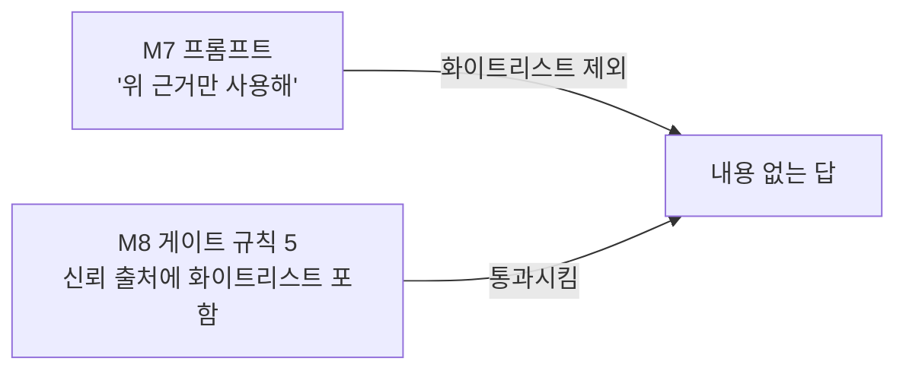

## 분류 체계

로드맵은 사고를 `근거 없는 발화 / 지연 / 오탐 / 장치 충돌` 네 유형으로 나누라고 했다.
리허설 1회차 실물 5건을 대보니 **네 유형 어디에도 안 들어가는 것이 두 건** 있었다.
그래서 두 유형을 추가한다.

| 유형 | 정의 | 1회차 건수 |
|---|---|---:|
| 근거 없는 발화 | 근거 없이 말한다 | 0 |
| **내용 없는 발화** 🆕 | **근거는 있는데 질문에 답하지 않는다** | **1** |
| 지연 | 목표 시간을 초과한다 | 0 (기준선 불일치로 판정 보류) |
| 오탐 | 잘못된 값을 정상으로 처리한다 | 2 |
| 장치 충돌 | 하드웨어·프로세스가 서로 막는다 | 0 |
| 구조 | 실제 사용 조건에서 아예 돌지 않는다 | 1 |
| **운영 위험** 🆕 | **코드는 정상인데 사람이 잘못 판단하게 만든다** | **1** |

**「내용 없는 발화」가 이번 캡스톤의 수확이다.** M1~M9 는 *"틀린 말을 막는 것"* 만 봤다.
그 방어가 완성되자 **맞는 말도 못 하는 상태**가 드러났다. 안전의 반대편은 무용함이다.

## 5건 매핑

| # | 사고 | 유형 | 원인 모듈 | 상태 |
|---|---|---|---|---|
| 1 | `--live` 가 샘플 4회차에만 묶여 오늘 회차로 안 돎 | 구조 | **M7** (엔진 배선) | ✅ 수정 |
| 2 | 데몬 `prewarm(part="3")` 하드코딩 | 오탐 | **M9** (데몬) | ✅ 수정 |
| 3 | 게이트 통과했으나 화이트리스트 항목을 말하지 못함 | **내용 없는 발화** | **M7·M8** (프롬프트 ↔ 게이트 정의 불일치) | 🔴 미수정 |
| 4 | 같은 프롬프트 재실행에서 어미 붕괴(`추렸다요`) | 오탐 | **M6·M7** (출력 품질 미검사) | 🔴 미수정 |
| 5 | 옛 `prompt.txt` 를 오늘 것으로 오독 | **운영 위험** | **M10** (프리플라이트로 흡수) | 🟡 대책 정의 |

### 왜 3번이 M7·M8 양쪽인가

한쪽만 고치면 재발한다.

**M7 은 재료로 안 주고, M8 은 근거로 인정한다.** 같은 대상에 대한 정의가 두 층에서 다르다.
정의를 맞추는 것이 수정이고, 어느 한 층만 고치면 다른 층이 다시 어긋난다.

## 재현 테스트 — 수정한 것이 정말 안 돌아오는가

M8 이 세운 원칙: *"게이트를 꺼도 같은 결과가 나온다면 아무것도 확인하지 않은 것이다."*
수정 검증도 같다. 고쳤다는 주장에는 **고치기 전에 실패하고 후에 통과하는 대조**가 필요하다.

| # | 재현 명령 | 수정 전 | 수정 후 |
|---|---|---|---|
| 1 | `python 01_parse_rundown.py --live 26` | `error: invalid choice: '26'` | ✅ 파트 3개 파싱 |
| 1 | `python engine_daemon.py --live 26 --repeats 1 --text "..."` | `⛔ 사전 캐시 실패: ①` | ✅ 5,683ms 완주 |
| 2 | 위 명령의 컨텍스트 파트 | `part=3` (오늘 없음) | ✅ `part=2` (세션 권위값) |
| — | **회귀**: 볼트 Rundown 16편 전수 파싱 | 이상 1건(Live26) | ✅ **이상 0건** |

**회귀 검증이 중요하다.** 1번 수정은 파서 헤딩 규칙을 넓히는 변경이라
M8 이 15편으로 확보해 둔 값이 흔들릴 수 있었다. 16편 전수에서 파트·항목·하위섹션 수가
**M8 기록과 전부 일치**했다 (Live14=14 · Live16=12/2 · Live17=26/7 · Live18~25=19·24·17·5·7·6·7·15).

## 사고 5의 대책 — 프리플라이트로 흡수

코드 수정으로 풀 문제가 아니다. `output/` 에 옛 파일이 남는 것 자체는 정상이고,
위험한 것은 **그것이 오늘 것과 구분되지 않는다**는 점이다.

프리플라이트 6번이 이미 같은 일을 컨텍스트에 대해 한다 —
*"파일이 있는가"* 가 아니라 *"오늘 것인가"* 를 묻는다. 이 검사를 `output/` 전반으로 넓힌다.

- [ ] 프리플라이트에 **`output/` 내 오늘 이전 파일 목록**을 WARN 으로 표시하는 항목 추가
- [ ] 또는 디버그 산출물을 `output/debug/{회차}/` 로 분리해 회차가 파일 경로에 남게 한다

두 번째가 근본적이다. 파일 이름에 회차가 있으면 오독이 성립하지 않는다 —
`prompt.26.txt` 를 Live21 것으로 착각할 수는 없다.

## 다음 리허설(2회차)에서 확인할 것

- [ ] 사고 3 수정(안 A: 화이트리스트를 근거 목록에도 편입) 후 같은 질문에 **실험 3개 이름이 나오는가**
- [ ] 사고 4 — 같은 질문 5회 반복해 어미 붕괴 재현율 측정. 1/5 이상이면 게이트 검사 추가
- [ ] 커버리지 미정 파트(주간 영상)에 대한 질문 → **침묵하는가** (M1 원칙 검증, 아직 안 해봄)
- [ ] 금칙 주제 질문 → `forbidden_topic_requested` 차단이 실물에서도 도는가 (M8 은 시나리오로만 확인)
- [ ] 지연 — `--repeats 5` 로 M9 와 **같은 기준선**에서 재측정
