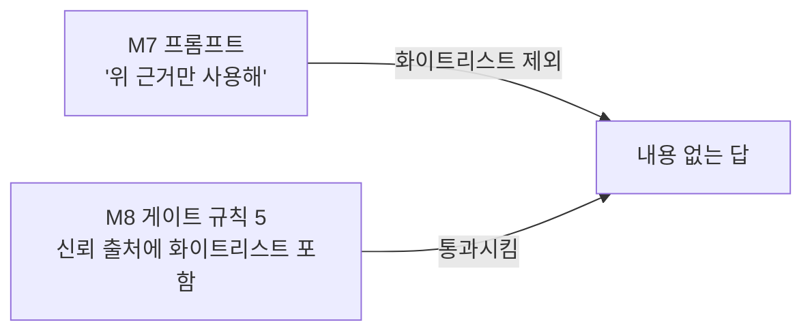

## 분류 체계

로드맵은 사고를 `근거 없는 발화 / 지연 / 오탐 / 장치 충돌` 네 유형으로 나누라고 했다.
리허설 1회차 실물 5건(+ 3회차 사전 점검 2건)을 대보니 **네 유형 어디에도 안 들어가는 것이 두 건** 있었다.
그래서 두 유형을 추가한다.

| 유형 | 정의 | 1회차 건수 |
|---|---|---:|
| 근거 없는 발화 | 근거 없이 말한다 | 0 (**+1, 3회차 실전**) |
| **내용 없는 발화** 🆕 | **근거는 있는데 질문에 답하지 않는다** | **1** (+2, 3회차 실전) |
| 지연 | 목표 시간을 초과한다 | 0 (기준선 불일치로 판정 보류) |
| 오탐 | 잘못된 값을 정상으로 처리한다 | 2 |
| 장치 충돌 | 하드웨어·프로세스가 서로 막는다 | 0 |
| 구조 | 실제 사용 조건에서 아예 돌지 않는다 | 1 (+2, 09-12) |
| **운영 위험** 🆕 | **코드는 정상인데 사람이 잘못 판단하게 만든다** | **1** (+1, 3회차 실전) |

**「내용 없는 발화」가 이번 캡스톤의 수확이다.** M1~M9 는 *"틀린 말을 막는 것"* 만 봤다.
그 방어가 완성되자 **맞는 말도 못 하는 상태**가 드러났다. 안전의 반대편은 무용함이다.

## 11건 매핑 (1회차 5건 + 3회차 사전 점검 2건 + **3회차 실전 4건**)

| # | 사고 | 유형 | 원인 모듈 | 상태 |
|---|---|---|---|---|
| 1 | `--live` 가 샘플 4회차에만 묶여 오늘 회차로 안 돎 | 구조 | **M7** (엔진 배선) | ✅ 수정 |
| 2 | 데몬 `prewarm(part="3")` 하드코딩 | 오탐 | **M9** (데몬) | ✅ 수정 |
| 3 | 게이트 통과했으나 화이트리스트 항목을 말하지 못함 | **내용 없는 발화** | **M7·M8** (프롬프트 ↔ 게이트 정의 불일치) | 🔴 미수정 |
| 4 | 같은 프롬프트 재실행에서 어미 붕괴(`추렸다요`) | 오탐 | **M6·M7** (출력 품질 미검사) | 🔴 미수정 |
| 5 | 옛 `prompt.txt` 를 오늘 것으로 오독 | **운영 위험** | **M10** (프리플라이트로 흡수) | 🟡 대책 정의 |
| 6 | LIVE 모드가 쓰는 `spoken.json` 을 **읽어 재생하는 코드가 없다** — 소리가 나갈 부품 자체가 부재 | 구조 | **M9** (Electron 셸 미완이 곧 그 자리) | ✅ **수정 (CVL 1, 09-17)** — `spoken_player.py` |
| 7 | `--serve` 중 파트 전환(핫키)이 컨텍스트를 다시 만들지 않음 — ④ 가 옛 파트 근거로 답함 | 구조 | **M9** (데몬 ①② 1회 실행) | ✅ 수정 (CVL 1, 09-17) — 데몬이 파트 전환을 감지해 ② 재실행 |
| 8 | **1부 확정 커버리지를 「후보」표 문구와 혼동** — Rundown 의 확정 줄과 후보 표를 같은 무게로 읽어 "후보"라고 말함 (3/3 재현, Live #27) | **내용 없는 발화** (근거는 있으나 상태를 틀림) | **M2·M8** (Rundown 계약: 커버리지 줄 > 후보 표 우선순위가 컨텍스트에 없음) | ✅ 수정 (CVL 1, 09-17) |
| 9 | **「CoMC 어디까지 왔나」에 항목만 읊고 답 없음** — 상태 질문에 목록만 (Live #27) | **내용 없는 발화** | **M7·M8** (사고 3과 같은 뿌리: 프롬프트 ↔ 게이트 정의 불일치) | ✅ 수정 (CVL 1, 09-17) — 규칙 7-b |
| 10 | **2부 진행 중 주간 영상을 묻자 2부 항목을 "이번 주 영상"으로 오귀속** (Live #27) | **근거 없는 발화** (파트 경계 넘음 — 첫 발생) | **M7** (④ 가 `current_part` 근거만 쓰지 않고 파트 밖 항목을 끌어옴) · M8 게이트가 파트 소속을 검사 안 함 | ✅ 수정 (CVL 1, 09-17) — 규칙 9 `cross_part` |
| 11 | **의도 `unknown` 거절 시 옛 초안이 오버레이에 재렌더** (Live #27, 2회) | **운영 위험** (틀린 화면이 정상처럼 보임) | **M9** (⑥ 이 거절 시 `overlay.json` 을 비우지 않음) | ✅ 수정 (CVL 1, 09-17) — `clear_overlay` |

### 왜 3번이 M7·M8 양쪽인가

한쪽만 고치면 재발한다.

**M7 은 재료로 안 주고, M8 은 근거로 인정한다.** 같은 대상에 대한 정의가 두 층에서 다르다.
정의를 맞추는 것이 수정이고, 어느 한 층만 고치면 다른 층이 다시 어긋난다.

## 재현 테스트 — 수정한 것이 정말 안 돌아오는가

M8 이 세운 원칙: *"게이트를 꺼도 같은 결과가 나온다면 아무것도 확인하지 않은 것이다."*
수정 검증도 같다. 고쳤다는 주장에는 **고치기 전에 실패하고 후에 통과하는 대조**가 필요하다.

| # | 재현 명령 | 수정 전 | 수정 후 |
|---|---|---|---|
| 1 | `python 01_parse_rundown.py --live 26` | `error: invalid choice: '26'` | ✅ 파트 3개 파싱 |
| 1 | `python engine_daemon.py --live 26 --repeats 1 --text "..."` | `⛔ 사전 캐시 실패: ①` | ✅ 5,683ms 완주 |
| 2 | 위 명령의 컨텍스트 파트 | `part=3` (오늘 없음) | ✅ `part=2` (세션 권위값) |
| — | **회귀**: 볼트 Rundown 16편 전수 파싱 | 이상 1건(Live26) | ✅ **이상 0건** |

**회귀 검증이 중요하다.** 1번 수정은 파서 헤딩 규칙을 넓히는 변경이라
M8 이 15편으로 확보해 둔 값이 흔들릴 수 있었다. 16편 전수에서 파트·항목·하위섹션 수가
**M8 기록과 전부 일치**했다 (Live14=14 · Live16=12/2 · Live17=26/7 · Live18~25=19·24·17·5·7·6·7·15).

## 사고 5의 대책 — 프리플라이트로 흡수

코드 수정으로 풀 문제가 아니다. `output/` 에 옛 파일이 남는 것 자체는 정상이고,
위험한 것은 **그것이 오늘 것과 구분되지 않는다**는 점이다.

프리플라이트 6번이 이미 같은 일을 컨텍스트에 대해 한다 —
*"파일이 있는가"* 가 아니라 *"오늘 것인가"* 를 묻는다. 이 검사를 `output/` 전반으로 넓힌다.

- [ ] 프리플라이트에 **`output/` 내 오늘 이전 파일 목록**을 WARN 으로 표시하는 항목 추가
- [ ] 또는 디버그 산출물을 `output/debug/{회차}/` 로 분리해 회차가 파일 경로에 남게 한다

두 번째가 근본적이다. 파일 이름에 회차가 있으면 오독이 성립하지 않는다 —
`prompt.26.txt` 를 Live21 것으로 착각할 수는 없다.

## 다음 리허설(2회차)에서 확인할 것

- [ ] 사고 3 수정(안 A: 화이트리스트를 근거 목록에도 편입) 후 같은 질문에 **실험 3개 이름이 나오는가**
- [ ] 사고 4 — 같은 질문 5회 반복해 어미 붕괴 재현율 측정. 1/5 이상이면 게이트 검사 추가
- [ ] 커버리지 미정 파트(주간 영상)에 대한 질문 → **침묵하는가** (M1 원칙 검증, 아직 안 해봄)
- [ ] 금칙 주제 질문 → `forbidden_topic_requested` 차단이 실물에서도 도는가 (M8 은 시나리오로만 확인)
- [ ] 지연 — `--repeats 5` 로 M9 와 **같은 기준선**에서 재측정

## 3회차 실전(Live #27, 09-13)이 말하는 것 — 9/17 정리

1회차 5건은 「돌지 않는다·오탐」이었고, 3회차 4건은 **전부 「돈다, 그런데 내용이 틀리거나 비어 있다」** 다.
사고 8·9 는 내용 없는 발화, 10 은 이 Topic 첫 「근거 없는 발화」(파트 경계), 11 은 운영 위험.
**코드는 방송 중 한 줄도 안 고쳤고 소리로 나간 오류는 0** — 3회차를 REVIEW 로 돌린 판단이 맞았다.

진행자 소감(9/17 원문): *"기능상으로는 OK, 내용상으로는 사전 작업에서 보완해야 할 점들이 많이 있는 것 같다."*
→ 사고 8·9·10 의 공통 원인은 **Rundown 이 앱에게 주는 신호가 약하다**는 것이다 — 확정/후보 구분, 상태 질문에 답할 「현재 상태」줄, 파트 소속.
코드 수정(우선순위 규칙 · `part_id` 검사 · 거절 시 clear)과 **Rundown 작성 규칙(rundown-writer 스킬)** 두 쪽에서 같이 고친다.

## 4회차(무관중, 09-18~19) 전 수정 목록

- [x] 사고 8 — ② 근거 풀에 `[확정] 이번 방송 커버리지 — …` 첫 줄 + 확정 항목 표 행 `[확정 항목 현재 상태]` · `### 후보` 소절 제외 · ④ 프롬프트에 확정/후보 뜻 (09-17, 재현 테스트 3/3)
- [x] 사고 9 + 3 — ④ 상태 질문 규칙 + ⑤ 규칙 7-b(상태 어휘 없으면 `content_empty`) · 실제 LLM 1회: "현재 상태는 9/17에 Topic을 완료했고…" 통과 3/3 (09-17)
- [x] 사고 10 — ② `other_parts`(이름만) · ④ 다른 파트 질문이면 LLM 전 거절 · ⑤ 규칙 9 `cross_part` 전부 드롭 (09-17)
- [x] 사고 11 — `common.clear_overlay()` · ④ 거절과 ⑥ 침묵 모두 화면을 비운다 (09-17)
- [x] 사고 7 — 데몬 `utter()` 가 발화 전에 `session_state.current_part_id` 를 읽어 컨텍스트 파트와 다르면 ② 재실행 (09-17)
- [x] 사고 6 — `09-…/examples/engine/spoken_player.py` (09-17). 헤드폰 재생 ✅ · VB-CABLE 루프백 소리 감지 ✅ · MUTE 전환 시 abort 22ms ✅ · LIVE 모드 ⑥ → spoken.json → 재생 → 소비 end-to-end ✅. **송출 트랙(OBS) 검증은 4회차 전 남음**

## CVL 1 (09-17) 에서 새로 본 것

- **잠복 결함** — `verdict.schema.json` 의 `dropped_sentences.reason` enum 에 `style_broken`(규칙 8, 09-06 추가)이 없었다. 규칙 8 이 한 번이라도 걸렸다면 ⑤ 가 계약 위반으로 죽었을 것이다. Live #27 에서 안 걸려서 안 터졌다. enum 에 `style_broken`·`cross_part` 를 넣었다. 유형은 **구조**(코드는 맞는데 계약이 안 따라옴) — 12번으로 센다
- **발화 길이** — 3문장짜리 답이 소리로 36초였다. 문장 수 상한(5)은 있는데 글자 수 상한이 없다. 4회차에서 실제 길이를 재고 `length_hardcut` 에 글자 수를 더할지 정한다
- `01_parse_rundown` 이 Live28 의 「3. 주간 영상」을 `id="3. 주간 영상"` 으로 읽는다(번호 없는 파트 취급). 발화에는 영향이 없었지만 `N부` 판정과 어긋날 수 있다 — 관찰만

## 4회차 (09-17 저녁, 무관중) — 사고 0건

질문 10건 중 통과 6 · 의도된 침묵 4. 사고 7~11 전부 재발 없음 → [rehearsal-log-4.md](rehearsal-log-4.md).
관찰 1건(사고 13 **후보**, 확정 아님): ③ `completion_confusion` 이 「완료된 Topic 을 방송에서 실사용」하는 항목에 대한 정당한 질문을 막았다 — 오탐. 실물 2건째가 나오면 규칙을 좁힌다.

## CVL 2 실사용 연습 (09-17 저녁, 사용자 직접 조작) — 운영 위험 2건

| # | 사고 | 유형 | 원인 | 상태 |
|---|---|---|---|---|
| 14 | 핫키 프로세스가 파트 전환 직후 **계약 위반으로 종료** — `session_state.json` 에 스키마 밖 필드 `last_change_by` | 운영 위험 | `rehearsal4_driver.py`(테스트 도구)가 운영 파일에 스키마 밖 값을 남김 | ✅ 파일 정리 · 드라이버 수정. 교훈: **테스트 도구도 운영 파일엔 스키마대로만 쓴다** |
| 15 | OBS 오버레이가 캔버스에 안 보임 — Browser Source 가 서버 기동 전에 로드돼 빈 페이지로 굳음 | 운영 위험 | 기동 순서 (OBS 먼저 → 서버 나중) | ✅ 소스 Refresh 로 즉시 해결 · 조작 가이드에 순서·Refresh 명시 |

| 16 | 「Chrome Remote Control 기능에 대해 설명해 주세요」→ ③ `unknown` → 침묵 | **내용 없는 발화**(정당한 요청을 못 알아들음) | ③ INTENT_RULES 에 청유형(설명해·알려 주·소개해…) 없음 | ✅ 규칙 추가 (엔진 재시작 필요) |

14·15 는 코드가 아니라 **순서와 도구 위생**의 문제고, 16 은 진행자의 자연스러운 말투가 규칙에 없던 것이다. 진행자가 직접 조작해 보니 나왔다 — 드라이버로 돌린 4회차에서는 나올 수 없던 종류다.

## CVL 3 (09-17 밤) — 창 4개를 하나로 합치다가 만난 것 1건

| # | 사고 | 유형 | 원인 | 상태 |
|---|---|---|---|---|
| 17 | `comc_console.py` 에서 재생기를 **스레드**로 돌리자 승인 발화가 `PortAudioError: Error starting stream: Unanticipated host error (WdmSyncIoctl … GLE=0x490)` 로 침묵 — 단독 프로세스에서는 정상이던 코드 | 운영 위험 (소리 경로) | WASAPI **콜백** 스트림은 COM 이 초기화된 스레드에서만 시작된다. main 스레드는 sounddevice import 때 초기화돼 있었고, 새 스레드는 아니었다. 블로킹 write 는 되고 콜백만 죽는 것을 실측으로 분리 | ✅ `spoken_player._com_init()` — 스레드마다 한 번 `CoInitializeEx(MULTITHREADED)`. 수정 후 승인 재생 10.7초 완주 · LIVE 재생 3.9초 시점 패닉 abort 확인 |

| 18 | 「Chrome Remote Desktop 에 대해 설명해 주세요」→ 답 「오늘은 **[확정]** Chrome Remote Desktop으로…」 — ② 가 근거 줄에 붙인 라벨이 답에 그대로 들어가 **소리로 나갔다** (LIVE 실사용 연습) | 내용 오류 (내부 표시 누출) | ④ 프롬프트가 라벨의 뜻(확정/후보 구분)은 설명했지만 「라벨을 말하지 말라」는 없었다. ⑤ 에도 라벨 검사 없음 | ✅ ④ 프롬프트에 「대괄호 라벨을 답에 쓰지 않는다」 + ⑤ `strip_evidence_labels()` 가 `[확정]`·`[지시]`·`[후보]`·`[확정 항목 현재 상태]` 를 final_text 에서 제거 (하한). 회귀 10/10 유지 |

같이 잡은 것 (사고 번호는 안 붙인다): `contextlib.redirect_stdout` 이 프로세스 전체의 stdout 을 바꿔서 재생기가 합성하는 3초 동안 핫키 스레드의 출력이 재생기 로그로 새어 들어갔다 → 스레드별 stdout 라우터(`_Router`)로 교체. 창 4개일 때는 프로세스가 달라 생길 수 없던 문제다 — **합치면 합친 만큼 새 종류의 사고가 생긴다.**
