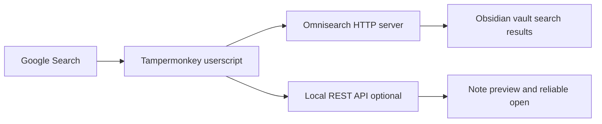

## 자료 맵

### GitHub Repo

- Repo: `https://github.com/johnfkoo951/obsidian-omnisearch-google-cmds`
- Local clone: `C:\tmp\obsidian-omnisearch-google-cmds`
- Userscript: `https://raw.githubusercontent.com/johnfkoo951/obsidian-omnisearch-google-cmds/main/obsidian-omnisearch-google-cmds.user.js`
- 핵심 파일:
  - `README.md`: 설치 순서와 권한 설정
  - `obsidian-omnisearch-google-cmds.user.js`: Tampermonkey/Violentmonkey 유저스크립트 본체
  - `images/`: 데모와 Tampermonkey 권한 스크린샷

### 방송 슬라이드 요약

> Google 검색 시 오른쪽 사이드바에 내 Obsidian 노트 검색 결과가 함께 표시됨

방송 슬라이드에서 확인한 설치 요구사항은 Tampermonkey, Obsidian Omnisearch 플러그인, 선택 사항인 Local REST API 플러그인이다. 주요 기능은 멀티 vault 동시 검색, BM25 관련도 점수, Local REST API를 통한 노트 본문 미리보기, `j/k/Enter/y` 키보드 탐색이다.

### 설치 대상 Vault

- 현재 vault: `C:\AI_study\2026\Changsoo_Vault`
- Obsidian 플러그인 경로: `C:\AI_study\2026\Changsoo_Vault\.obsidian\plugins`
- 설치 완료 플러그인:
  - `omnisearch` version `1.29.3`
  - `obsidian-local-rest-api` version `4.1.3`

### 의존 플러그인 출처

- Omnisearch: `https://github.com/scambier/obsidian-omnisearch`
- Local REST API: `https://github.com/coddingtonbear/obsidian-local-rest-api`

## 설치 구조

## 확인 포인트

- Omnisearch HTTP server가 켜져 있어야 브라우저에서 `localhost` 검색 요청을 받을 수 있다.
- Local REST API는 선택 사항이지만, 실제 노트 본문 미리보기와 안정적인 노트 열기에 필요하다.
- Chrome에서는 Tampermonkey의 `Allow User Scripts`, `Site access`, 첫 `localhost` cross-origin 허용이 필요하다.
