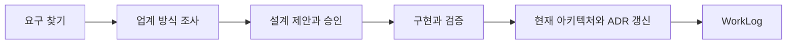

## 이 Topic이 접목한 방식

9/27 공식 문서 비교 기록을 출발점으로 삼는다. Kiro의 요구·설계·작업 문서를 그대로 복제하는 대신, 요구와 검증은 WorkLog, 현재 설계는 ARCHITECTURE, 결정 이유는 ADR에 둔다. → [공식 문서 비교 기록](../../architecture/decisions/006-두%20트랙%20개발%20방식.md#kiro-공식-문서-확인-2026-09-27--live-29)

| 역할 | 이 Topic의 문서 |
|---|---|
| 요구와 인수 기준 | WorkLog의 EARS 요구·검증 표 |
| 현재 기술 설계 | ARCHITECTURE.md |
| 구현 순서 | 로드맵·WorkLog 체크리스트 |
| 바뀐 이유와 대가 | decisions/의 ADR |

## 한 바퀴

EARS의 한국어 틀은 「WHEN [조건] 이면 THE SYSTEM SHALL [동작] 한다」다. 조건 없는 요구는 「THE SYSTEM SHALL …」로 쓰고, 검증 결과를 같은 요구에 연결한다. 별도 요구 파일을 늘리지 않는 변형이다. → [ADR 008](../../architecture/decisions/008-요구는%20EARS%20한%20줄로도%20적는다.md#결정)

M1의 5초 요구는 전체 CLI 실행 측정으로 검증했고 링크 직접 확인은 색인 호출 여부로 검증했다. 이처럼 요구마다 어떤 증거로 통과를 판단할지 정하되, 한 사례로 방법론 전체의 성공을 선언하지 않는다. → [M1 EARS](../../vl_worklog/20261002_M1_Personal-Ops-Board.md#오늘-정한-요구--ears)
