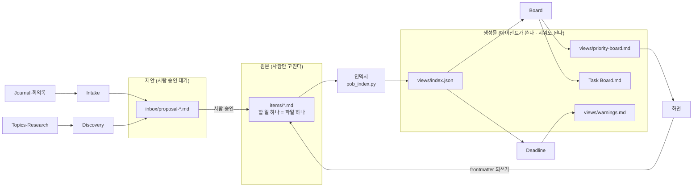

# Personal Ops Board — ARCHITECTURE

**판**: v0.1 (M0 첫 판 · 2026-09-27 Live #29)
**이 문서의 규칙**: 미리 다 정한 설계가 아니라 **지금 모습**이다. 모듈을 마칠 때마다 고치고, 왜 바뀌었는지는 [`decisions/`](decisions/) 에 남긴다.

## 1. 한눈에

**AI Agent Application** — 원본은 마크다운 파일, 그것을 유지하는 것은 AI 에이전트, 화면은 확인 창구다. 사람은 우선순위를 보고, 에이전트의 제안을 승인한다.

## 2. 층

| 층 | 무엇 | 위치 (볼트) | 상태 |
|---|---|---|---|
| 데이터 — 원본 | 할 일 파일. frontmatter = 필드, 본문 = 맥락·체크리스트·관련 | `AI/Tasks/items/` · 스키마 `items/_schema.md` | ✅ 58건 (9/27) |
| 데이터 — 캐시 | 파싱 결과. 원본이 아니다 — 지우고 다시 만들 수 있다 | `AI/Tasks/views/index.json` | 🔄 M1 |
| 데이터 — 제안 | 에이전트가 만든 초안. 사람이 승인하면 `items/` 로 | `AI/Tasks/inbox/` | 🔄 M1 (폴더만) |
| 스크립트 | 규칙이 정해진 일 (LLM 불필요) — 인덱서 | `AI/Tasks/scripts/` | 🔄 M1 |
| 에이전트 | 프롬프트 파일 + 오케스트레이터 노드 | `_Settings_/Prompts/POB-*.md` · `orchestrator.yaml` | ⏳ M2~ |
| 런타임 | AI4PKM 오케스트레이터 (트리거: 파일 변경 · cron) | `orchestrator.yaml` | ✅ 기존 |
| 화면 | HTML 한 파일 + Python 로컬 서버 | `AI/Tasks/app/` | ⏳ M6 |

## 3. 에이전트 계약

> 🔑 에이전트는 서로의 내부를 모르고 **이 표만 안다.** 연결 방식(파일 공유 → Supervisor · 직접 호출)을 바꿀 때는 이 표의 해당 줄과 그 에이전트만 고친다. → [decisions/007](<decisions/007-에이전트 연결은 열어 둔다.md>)

| 에이전트 | 트리거 | 입력 | 출력 | 쓸 수 있는 곳 | 부를 수 있는 대상 | 모듈 |
|---|---|---|---|---|---|---|
| (스크립트) 인덱서 | Board 전 · 요청 시 | `items/*.md` | `views/index.json` | `views/` | — | M1 |
| Board | `items/` 변경 · 요청 시 | `views/index.json` | `views/priority-board.md` · `Task Board.md` | `views/` · `Task Board.md` | 없음 (v1) | M2 |
| Deadline | cron 매일 아침 | `views/index.json` | `views/warnings.md` | `views/` | 없음 (v1) | M5 |
| Intake | Journal·회의록 변경 | 구술 원문 · `views/index.json`(중복 확인) | `inbox/proposal-*.md` | `inbox/` | 없음 (v1) | M7 |
| Discovery | cron 월요일 | Topics · Research · Journal 30일 | `inbox/proposal-*.md` | `inbox/` | 없음 (v1) | M8 |

**모든 에이전트 공통**: `items/` 를 고치지 않는다 · 만든 파일 상단에 `generated_by` 를 남긴다 · 실패해도 이전 결과를 지우지 않는다.

## 4. 멀티 에이전트 구조

**지금(v1)**: 파일 공유 (블랙보드) — 에이전트끼리 직접 부르지 않는다. Board → `index.json` → Deadline 은 사실상 순차 파이프라인.

**열어 둔 선택지**: Supervisor(관리자가 팀원 에이전트를 부르고 결과를 모음) · 동급 Peer(같은 레벨끼리 직접 소통) · 계층형. 모듈마다 「업계 방식 조사」에서 다시 보고, 바꿀 때는 결정 기록 + 사용자 승인.

## 5. 절대 규칙 (바꾸려면 결정 기록 + 사용자 승인)

1. 원본은 마크다운 — DB 없음 (`index.json` 은 캐시)
2. 에이전트 런타임은 AI4PKM 오케스트레이터 — 새 스케줄러·큐·프레임워크 없음
3. Python 3.13 — Go · Node 빌드 · Electron 없음
4. `items/` 는 사람과 화면만 고친다
5. 기존 워크플로(매일·매주 자동 정리)를 깨지 않는다
6. 사용자 구술 원문은 손대지 않는다

## 6. 결정 기록

| # | 제목 | 상태 |
|---|---|---|
| [001](<decisions/001-원본은 마크다운 - DB 없음.md>) | 원본은 마크다운 — DB 없음 | ✅ |
| [002](<decisions/002-할 일 하나는 파일 하나.md>) | 할 일 하나 = 파일 하나 | ✅ |
| [003](<decisions/003-에이전트 런타임은 AI4PKM 오케스트레이터.md>) | 에이전트 런타임은 AI4PKM 오케스트레이터 | ✅ |
| [004](<decisions/004-Python 3.13.md>) | Python 3.13 — 화면은 HTML 한 파일 + 로컬 서버 | ✅ |
| [005](<decisions/005-Go 는 보류.md>) | Go 는 보류 — v4 상주 데몬 때 재검토 | ✅ |
| [006](<decisions/006-두 트랙 개발 방식.md>) | 두 트랙 개발 방식 | ✅ · KIRO 문서 비교 포함 |
| [007](<decisions/007-에이전트 연결은 열어 둔다.md>) | 에이전트 연결 — v1 은 파일 공유, 구조는 열어 둔다 | ✅ |
| [008](<decisions/008-요구는 EARS 한 줄로도 적는다.md>) | 요구는 EARS 한 줄로도 적는다 (KIRO 변형 적용) | ✅ |

데이터 스키마의 결정(9건)은 볼트 `AI/Tasks/items/_schema.md` 결정 로그에 있다 — 이 문서의 `decisions/` 는 **앱 구조**의 결정이다.

## 변경 이력

| 날짜 | 모듈 | 무엇 |
|---|---|---|
| 2026-09-27 | M0 | 첫 판 — 층 · 에이전트 계약 표 · 멀티 에이전트 구조(열어 둠) · 절대 규칙 · 사용자 리뷰 승인 |
| 2026-09-27 | M0 | 결정 기록 001~007 · KIRO 공식 문서 비교(006) · 008 EARS |
