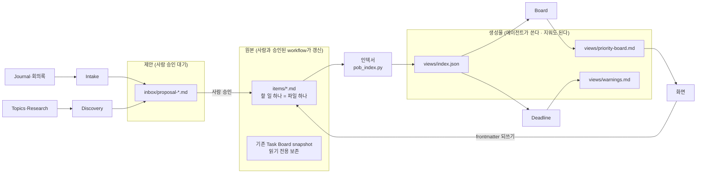

# Personal Ops Board — ARCHITECTURE

**판**: v0.8 (M6 local Board UI implementation · 2026-10-03)
**이 문서의 규칙**: 미리 다 정한 설계가 아니라 **지금 모습**이다. 모듈을 마칠 때마다 고치고, 왜 바뀌었는지는 [결정 기록](decisions/013-M6-로컬-Board-UI.md) 에 남긴다.

## 1. 한눈에

**AI Agent Application** — 원본은 마크다운 파일, 그것을 유지하는 것은 AI 에이전트, 화면은 확인 창구다. 사람은 우선순위를 보고, 에이전트의 제안을 승인한다.

## 2. 층

| 층 | 무엇 | 위치 (볼트) | 상태 |
|---|---|---|---|
| 데이터 — 원본 | 할 일 파일. frontmatter = 필드, 본문 = 맥락·체크리스트·관련 | `AI/Tasks/items/` · 스키마 `items/_schema.md` | ✅ POST-HANDOFF canonical source; 70건 유효 (2026-10-02) |
| 데이터 — 캐시 | 파싱 결과. 원본이 아니다 — 지우고 다시 만들 수 있다 | `AI/Tasks/views/index.json` | ✅ M1 |
| 데이터 — 제안 | 에이전트가 만든 초안. 사람이 승인하면 `items/` 로 | `AI/Tasks/inbox/` | 🔄 M3; 41개 제안 검토 대기 |
| 스크립트 | 규칙이 정해진 일 (LLM 불필요) — 인덱서 · Board · Deadline renderer | `AI/Tasks/scripts/pob_*.py` | ✅ M1·M2·M5 |
| 에이전트 | 프롬프트 파일 + 오케스트레이터 노드 | `_Settings_/Prompts/POB-*.md`, GDR/GWR · `orchestrator.yaml` | ✅ M2 Board 등록·1회 실행; M4 조건부 task write · M5 cron 10/3 예약 실행 2회 검증; 다음 날 갱신 대기 |
| 런타임 | AI4PKM 오케스트레이터 (트리거: 파일 변경 · cron) | `orchestrator.yaml` | ✅ 기존 |
| 화면 | HTML 한 파일 + Python 로컬 서버 | `AI/Tasks/app/` | 🔄 M6 구현·56 regression·HTTP fixture E2E·read-only UI 확인; browser fixture 수동 조작 남음 |

### 2.2 M6 Board UI

브라우저 UI는 Markdown source의 얇은 로컬 클라이언트다. 서버는 `127.0.0.1`에만 바인딩하고, 읽은 SHA-256과 현재 파일이 다른 편집은 거절한다. 기존 task는 status/priority/tier만 frontmatter에서 바꾸며 body bytes를 보존한다. tier 조건에 맞지 않는 상태 변경을 거절하고, index·Board·Deadline view 재생성이 실패하면 원본을 되돌린다. inbox proposal은 한 건씩 확인·승인하며 자동 이관하지 않는다. 운영 입력은 read-only로 조회했고, 별도 임시 fixture에서 task 생성·lane 표시·priority 편집·본문 보존·개별 proposal 승인을 HTTP 종단 간으로 검증했다. → [ADR 013](decisions/013-M6-로컬-Board-UI.md#결정) · [M6 WorkLog](../vl_worklog/20261003_M6_Personal-Ops-Board.md#구현)

### 2.1 M1 인덱서

현재 구현은 `items/` 71개를 읽어 `views/index.json`을 생성한다 (2026-10-03: valid 71, error 0, 사전 수용된 정보성 warning 11). 경로 링크는 볼트 루트·`AI/` 생략 표기를 직접 확인하고, 이름만 있는 링크를 해석할 때 전체 이름 색인을 한 번 생성한다. 전체 순회는 제외 폴더를 진입 전에 가지치기한다. 출력 계약과 원본 무변경 원칙은 유지한다. → [ADR 009](decisions/009-링크는%20직접%20확인하고%20색인은%20지연%20생성.md#결정)

현재 전체 실행은 0.221초로 5초 목표를 통과했고 합성 회귀 10건과 실제 링크 120개의 기존 판정 일치를 확인했다. 이는 현재 PC와 입력에서의 측정이며, M1 모듈 문서와 스키마 결정 1~10 반영표를 정리했다. M2는 완료/닫음 구분과 결정적 Board view를 구현했다.

## 3. 에이전트 계약

> 🔑 에이전트는 서로의 내부를 모르고 **이 표만 안다.** 연결 방식(파일 공유 → Supervisor · 직접 호출)을 바꿀 때는 이 표의 해당 줄과 그 에이전트만 고친다. → [decisions/007](decisions/007-에이전트%20연결은%20열어%20둔다.md)

| 에이전트 | 트리거 | 입력 | 출력 | 쓸 수 있는 곳 | 부를 수 있는 대상 | 모듈 |
|---|---|---|---|---|---|---|
| (스크립트) 인덱서 | Board 전 · 요청 시 | `items/*.md` | `views/index.json` | `views/` | — | M1 |
| Board | `items/*.md` 변경 · 요청 시 | `items/*.md` → `views/index.json` | `views/priority-board.md` | `views/` | 없음 (v1) | M2 |
| Deadline | AI4PKM cron. 원래 매일 05:00; 10/4 방송 검증을 위해 05:15 임시 설정 | `items/` → `views/index.json` | `views/warnings.md` | `views/` | 없음 (v1) | M5 |
| Board UI | 사용자 로컬 요청 | `items/`, `inbox/`, views | 로컬 HTML; 승인된 편집만 `items/`에 기록 | 인덱서·Board·Deadline 도구 | M6 |
| Intake | Journal·회의록 변경 | 구술 원문 · `views/index.json`(중복 확인) | `inbox/proposal-*.md` | `inbox/` | 없음 (v1) | M7 |
| Discovery | cron 월요일 | Topics · Research · Journal 30일 | `inbox/proposal-*.md` | `inbox/` | 없음 (v1) | M8 |

**모든 에이전트 공통**: `items/` 를 고치지 않는다 · 만든 파일 상단에 `generated_by` 를 남긴다 · 실패해도 이전 결과를 지우지 않는다.

### 3.1 M5 Deadline

Deadline은 LLM 판단 없이 `pob_deadline.py`가 최신 index cache를 읽어 `warnings.md`를 결정적으로 생성한다. 활성 상태(`todo`, `doing`, `waiting`)만 보며 기한 초과·오늘 마감·항목별 `warn_days`에 따른 D-N을 표시한다. `warn_days` 기본값은 3이고, `waiting.due`는 독촉일이다. 완료·보류·마감일 없는 항목은 제외한다. Index 오류나 잘못된 마감 날짜가 있으면 결과 파일을 교체하지 않는다. 실행은 `orchestrator.yaml`의 AI4PKM cron node를 사용하며 별도 scheduler를 추가하지 않는다. 10/3에 05:05·05:15 예약 실행과 view 갱신을 확인했고, 다음 날 시험 후 원래 05:00으로 복구한다. → [ADR 012](decisions/012-M5-결정적-마감-경고.md#결정)

## 4. 멀티 에이전트 구조

**지금(v1)**: 파일 공유 (블랙보드) — 에이전트끼리 직접 부르지 않는다. POST-HANDOFF에서 GDR/GWR은 사용자가 확정한 task 변경만 `items/`에 기록하고, 인덱서가 `index.json`을 만들며 Board renderer가 `priority-board.md`를 생성한다. 분류·정렬은 결정적 Python renderer가 수행하고 POB-Board prompt는 실행 순서만 잇는다. 2026-10-02 Roundup에서 task 변경 4건으로 경로를 확인했고 2026-10-03 다음 날 GDR에서도 변경이 유지되어 index·Board 재생성 검증을 통과했다.

### 4.1 M2 Board 권한 경계

M2 당시 Board는 `AI/Tasks/items/`와 루트 `AI/Tasks/Task Board.md`를 읽기만 했다. 2026-10-02에는 전체 원본 snapshot, 완료 이력 보관본, 행별 판정 기록, shadow·회귀 및 실제 PRE-HANDOFF Roundup 확인 뒤 사용자가 handoff를 승인했다. 현재 Task Board는 읽기 전용 보존 진입점이고 `items/`가 canonical source다. 보류 48건과 미승인 제안 41건은 이관되지 않았으며 M3 전체 완료로 간주하지 않는다. → [ADR 010](decisions/010-M2-보드는-비공개-view만-생성.md#결정) · [ADR 011](decisions/011-M3-Task-Board-소유권-handoff.md#결정)

**열어 둔 선택지**: Supervisor(관리자가 팀원 에이전트를 부르고 결과를 모음) · 동급 Peer(같은 레벨끼리 직접 소통) · 계층형. 모듈마다 「업계 방식 조사」에서 다시 보고, 바꿀 때는 결정 기록 + 사용자 승인.

## 5. 절대 규칙 (바꾸려면 결정 기록 + 사용자 승인)

1. 원본은 마크다운 — DB 없음 (`index.json` 은 캐시)
2. 에이전트 런타임은 AI4PKM 오케스트레이터 — 새 스케줄러·큐·프레임워크 없음
3. 현재 Python 3.13 — Go는 보류하며 필요성이 확인되면 새 ADR과 사용자 승인으로 재검토 ([005](decisions/005-Go%20는%20보류.md#결정)). Node 빌드 · Electron 없음
4. `items/` 는 사람, 사용자 승인에 따라 동작하는 화면 및 POST-HANDOFF Roundup workflow만 고친다. 일반 에이전트는 직접 수정하지 않는다.
5. 기존 워크플로(매일·매주 자동 정리)를 깨지 않는다
6. 사용자 구술 원문은 손대지 않는다

## 6. 결정 기록

| # | 제목 | 상태 |
|---|---|---|
| [001](decisions/001-원본은%20마크다운%20-%20DB%20없음.md) | 원본은 마크다운 — DB 없음 | ✅ |
| [002](decisions/002-할%20일%20하나는%20파일%20하나.md) | 할 일 하나 = 파일 하나 | ✅ |
| [003](decisions/003-에이전트%20런타임은%20AI4PKM%20오케스트레이터.md) | 에이전트 런타임은 AI4PKM 오케스트레이터 | ✅ |
| [004](decisions/004-Python%203.13.md) | Python 3.13 — 화면은 HTML 한 파일 + 로컬 서버 | ✅ |
| [005](decisions/005-Go%20는%20보류.md) | Go 는 보류 — 필요성이 확인되면 재검토 | ✅ |
| [006](decisions/006-두%20트랙%20개발%20방식.md) | 두 트랙 개발 방식 | ✅ · KIRO 문서 비교 포함 |
| [007](decisions/007-에이전트%20연결은%20열어%20둔다.md) | 에이전트 연결 — v1 은 파일 공유, 구조는 열어 둔다 | ✅ |
| [008](decisions/008-요구는%20EARS%20한%20줄로도%20적는다.md) | 요구는 EARS 한 줄로도 적는다 (KIRO 변형 적용) | ✅ |
| [009](decisions/009-링크는%20직접%20확인하고%20색인은%20지연%20생성.md) | 경로 직접 확인 · 이름 색인 지연 생성 · 순회 가지치기 | ✅ A1 승인·검증 |
| [010](decisions/010-M2-보드는-비공개-view만-생성.md) | M2 Board는 비공개 view만 생성 · 결정적 정렬 | ✅ 사용자 승인·구현 |
| [011](decisions/011-M3-Task-Board-소유권-handoff.md) | 기존 Task Board 보존 후 POST-HANDOFF 적용 | ✅ 사용자 승인·보존 검증; M3 전체 이관은 진행 중 |
| [012](decisions/012-M5-결정적-마감-경고.md) | M5 결정적 마감 경고 · AI4PKM cron | ✅ |
| [013](decisions/013-M6-로컬-Board-UI.md) | M6 로컬 Board UI · Markdown 원본과 제한된 되쓰기 | ✅ 사용자 승인 |

데이터 스키마의 결정(9/27 계획 9건 · 10/2 현재 10건)은 볼트 `AI/Tasks/items/_schema.md` 결정 로그에 있다 — 이 문서의 `decisions/` 는 **앱 구조**의 결정이다.

## 변경 이력

| 날짜 | 모듈 | 무엇 |
|---|---|---|
| 2026-09-27 | M0 | 첫 판 — 층 · 에이전트 계약 표 · 멀티 에이전트 구조(열어 둠) · 절대 규칙 · 사용자 리뷰 승인 |
| 2026-09-27 | M0 | 결정 기록 001~007 · KIRO 공식 문서 비교(006) · 008 EARS |
| 2026-10-02 | M1 | A1 구현·검증, ADR 009, Go 보류의 재검토 가능성 명확화 (현재 Python 유지) |
| 2026-10-02 | M2 | 결정적 보드 view, 완료/닫음·점검 영역, AI4PKM prompt/node 등록 |
| 2026-10-02 | M3/M4 | snapshot·완료 이력 보존, 사용자 승인 POST-HANDOFF, GDR/GWR 조건부 workflow 반영; 다음 날 운영 실행 검증은 남음 |
| 2026-10-03 | M4 | 다음 날 GDR 뒤 기존 4개 변경 item 지속성 확인, 인덱스 71/71·오류 0·Board 재생성 성공; M4 완료 |
| 2026-10-03 | M5 | AI4PKM cron 예약 실행 2회 및 `warnings.md` 갱신 확인; 10/4 다음 날 실행 대기, 임시 05:15 설정 |
| 2026-10-03 | M6 | 로컬 UI·제한된 Markdown 편집·proposal 승인 구현, 합성 회귀와 read-only smoke 통과; UI 수동 조작 검증 남음 |

## 모듈 마무리 상태

M1 DoD 6/6과 M2의 생성 view·합성 검증·CLI registry 및 승인된 1회 trigger를 확인했다. M3는 보존 후 handoff했으나 보류·미승인 항목 처리 중이다. M4의 실제 task 변경 경로와 다음 날 지속성 검증을 마쳤다. M5의 합성 회귀와 10/3 cron 시각 실행 2회를 확인했으며, 다음 날 자동 갱신 검증은 10/4에 남아 있다. M6 UI는 합성 회귀와 read-only 화면 점검을 통과했고, 사용자 조작 검증이 남아 있다. 자동 파일 감시는 비활성 상태다. → [M1 안내](../01-Schema-Indexer/README.md) · [M2 안내](../02-Board-Agent/README.md) · [M3 안내](../03-Migration/README.md) · [M4 안내](../04-Workflow-Integration/README.md) · [M5 안내](../05-Deadline-Agent/README.md) · [M6 안내](../06-Board-UI/README.md)
