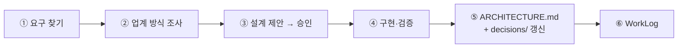

## 한 줄 요약

**할 일 62건을 손으로 한 시간 정리하다가 「나한테 맞는 도구를 만들자」고 생각했고, 앱보다 데이터를 먼저 2주 동안 키웠고, 그 사이 Builders Lounge 에서 다른 빌더에게 새로운 개발 방식을 배웠고, 그 방식으로 라이브 방송에서 첫 코드를 시작한다.** 이 문서는 M0 산출물이다. 처음 보는 사람이 이 문서만 읽고 「왜 이렇게 만드는지」 설명할 수 있게 하는 것이 목표다.

> 📌 이 문서는 공개 레포에 있다. 실제 할 일의 내용 · 사람 이름 · 연락처는 적지 않고 **건수와 구조만** 적는다. 원자료(브레인덤프 원문 · 아이디어 정리 · PRD · BRD)는 비공개 폴더에 있다.

## 1. 왜 만드나

2026년 9월 12일(토) 저녁, 사람이 보는 할 일 보드(`Task Board.md`)의 「처리 중인 일」이 **62건**이었고, 그중 **5건은 이미 날짜가 지나 있었다.** 사람과 AI 가 **한 시간 넘게** 손으로 「날짜 → 약속 → 프로젝트 → 멈출 것」 순서로 다시 배열했다. 결과는 좋았지만 문제가 분명했다 — **다음 주면 또 흐트러진다.**

그 정리를 본 직후의 구술(원문):

> 「기존의 Jira 나 Trello 같지만 저한테 맞는 그런 툴」

기존 도구로 가지 않은 이유는 **원본이 이미 볼트(Obsidian 마크다운)에 있기 때문**이다. 할 일은 Daily Roundup · 회의록 · 구술 · 학습 로드맵에서 태어나고, 그 문서들과 링크로 이어져 있다. 할 일만 따로 떼어 다른 서비스로 옮기면 그 연결이 끊긴다.

## 2. 어떻게 만들기로 했나 — 같은 밤에 쓴 문서 네 개

9/12 밤에 아이디어 정리 · PRD(제품 사양) · BRD(사업 요구) · 개발 시작 Prompt 를 썼다. 핵심 결정은 다섯 가지다.

| 결정 | 내용 | 기존 도구와 다른 점 |
|---|---|---|
| **AI Agent Application** | 에이전트가 데이터를 유지하고, 화면은 그것을 그리는 확인 창구다 | Jira·Trello 는 화면이 주인이고 사람이 입력한다 |
| **원본은 마크다운** | DB 를 만들지 않는다. 할 일 하나 = 마크다운 파일 하나(frontmatter) | 원본이 내 볼트에 남고, 기존 문서와 위키링크로 이어진다 |
| **에이전트는 AI4PKM 노드** | 이미 매일 돌고 있는 오케스트레이터 위에 올린다. 새 스케줄러·큐를 만들지 않는다 | 새 인프라 없음 |
| **Python 3.13 + HTML 한 파일** | Go · Node 빌드 · Electron 을 쓰지 않는다 | 로컬만, 가볍게 |
| **4단계 보드** | 1 날짜가 박힌 일 · 2 사람에게 한 약속/대기 · 3 내 프로젝트 · 4 멈춘 일 | 칸반(할 일/진행/완료)이 아니라 「무엇부터 볼지」 기준 |

설계 원칙 하나가 9/24 구술에서 더해졌다 — 「AI는 내 일을 도와 주는 도구로 사용해야지 나에게 일을 시키는 상관으로 만들면 안 되겠다.」 그래서 이 앱은 **일을 지시하는 장치가 아니라 사람이 판단하도록 돕는 도구**다. 에이전트는 제안만 하고, 원본에 옮기는 것은 사람의 승인이다.

## 3. 무엇을 준비했나 — 앱보다 데이터 먼저, 2주

9/12 밤의 결정: **「앱 개발은 9/27 라이브 방송부터. 데이터 모델은 지금부터.」** 스키마를 문서로 완성하지 않고, 실제로 써 보면서 굳히기로 했다.

| 준비 | 결과 (2026-09-27 기준) |
|---|---|
| 할 일 파일 (`items/`, 할 일 하나 = 파일 하나) | 23건으로 시작 → **58건** |
| 스키마 결정 로그 — 쓰다가 막힌 곳마다 한 줄 | **9건** (예: 기다리는 일에도 마감이 있다 · 날짜가 바뀌면 파일명도 바꾼다 · 끝나지 않는 상시 작업 표현) |
| 전환기 규칙 — 할 일 보드를 고칠 때 할 일 파일도 같이 고친다 | 모든 에이전트 규칙과 매일·매주 자동 정리 프롬프트에 넣었다 |
| M1 인덱서 사전 점검 — 첫 코드의 사양을 코드 없이 확정 | 전수 점검 · 파서 규칙 5개 · 방송 진행 순서 |

2주 동안 결정 로그가 9건 생겼다는 것은, **처음에 사양을 다 정했다면 9번 틀렸을 것**이라는 뜻이기도 하다. 가장 먼저 뒤집힌 규칙은 「마감일이 있으면 tier 1」이었다 — 첫 23건을 만들자마자 「기다리는 일에도 마감이 있다」는 것이 나왔다.

## 4. 어떤 방식으로 만드나 — Builders Lounge 에서 배운 방식

2026-09-16 Builders Lounge 5차 모임에서 **5차 발표자(샌프란시스코의 한 빌더)** 가 Multi-Agent AI 시스템 개발기를 발표했다. 발표에서 가져온 세 가지 원칙:

| # | 원칙 | 이 앱에서 |
|---|---|---|
| 1 | **아키텍처는 미리 다 정하지 않는다 — 만들며 쌓는다** (KIRO 처럼 아키텍처 문서를 만들면서 짠다) | 모듈을 마칠 때마다 `architecture/ARCHITECTURE.md` 와 결정 기록을 갱신한다 |
| 2 | **업계 방식을 먼저 묻는다 — 갈라파고스 금지** | 설계 전에 「2026년 9월 기준 업계 방식」을 조사한다 |
| 3 | **기능은 대화로 찾는다 — 제안 → 승인 → 코드** | 모듈마다 필요한 기능을 대화로 정하고, 승인한 것만 만든다 |

그리고 결과물 하나 — 프로젝트를 끝내면 **다음 에이전트 앱에 재사용할 아키텍처 문서**가 남는다. 발표자는 「두 번째 프로젝트부터는 개발이 빨라진다」고 했다.

이것을 VibeLearn AI 학습 절차 위에 **두 트랙**으로 얹었다.

- **기능 트랙**: 모듈마다 기능 하나 (M1 인덱서 → M2 Board 에이전트 → …)
- **아키텍처 트랙**: 그 모듈의 결정을 즉시 `ARCHITECTURE.md`(현재 모습)와 `decisions/NNN-제목.md`(결정 하나 = 파일 하나)에 저장

## 5. 첫 멀티 에이전트 시스템 — 구조는 열어 둔다

v1 에이전트는 넷이다 — **Board**(4단계 보드) · **Deadline**(마감 경고) · **Intake**(구술에서 할 일 뽑기) · **Discovery**(잊힌 일 찾기). v1 은 에이전트끼리 직접 부르지 않고 **파일로만 잇는다**(블랙보드 방식).

그러나 이것은 고정이 아니다 (2026-09-27 방송 중 결정). Supervisor 가 팀원 에이전트를 부르는 구조, 같은 레벨의 에이전트가 직접 소통하는 구조 등으로 **나중에 바꿀 수 있게** 만든다. 그 장치가 `ARCHITECTURE.md` 의 **에이전트 계약 표**다 — 에이전트는 서로의 내부가 아니라 계약(트리거 · 입력 · 출력 · 쓸 곳 · 부를 수 있는 대상)만 안다.

## 6. 다음

- M0 주중 다듬기: KIRO 공식 문서로 스펙 기반 개발 확인 · 첫 결정 기록 7개(`decisions/001~007`)
- M1: 인덱서 — 할 일 58건을 읽어 캐시(`views/index.json`)를 만들고 규칙 위반을 찾는다

→ 로드맵: [../vl_roadmap/20260927_RoadMap_Personal-Ops-Board.md](../vl_roadmap/20260927_RoadMap_Personal-Ops-Board.md) · 아키텍처: [../architecture/ARCHITECTURE.md](../architecture/ARCHITECTURE.md)
