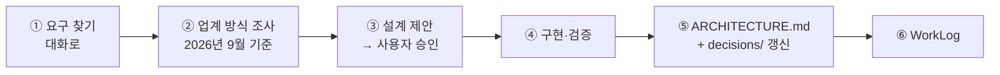

# Personal-Ops-Board 학습 로드맵

**생성일**: 2026-09-27 (Live #29 방송 중)
**방법론**: VibeLearn AI
**버전**: 1.0

---

## 📚 학습 개요

### Topic 소개
볼트의 마크다운을 그래프로 읽고 AI 에이전트(AI4PKM 노드)가 유지하며, 사람은 화면에서 우선순위만 보는 **나만의 일정 관리 앱(AI 시대에 맞는 나만의 일정 관리 앱)** 을 만든다. 라이브 방송에서 기능을 하나씩 만들면서 아키텍처 문서를 함께 완성해 가는 프로젝트형 Topic 이다. Builders Lounge 5차 모임에서 5차 발표자(샌프란시스코의 한 빌더)에게 배운 방식 — **아키텍처를 미리 다 정하지 않고, 만들면서 대화와 결정을 아키텍처 문서에 쌓는다** — 을 적용한다.

이 앱은 **AI Agent Application** 이다. 에이전트가 마크다운을 유지하고 화면은 그것을 그린다. 화면이 주인이고 DB 가 원본인 기존 앱 개념으로 만들지 않는다.

### 학습 목표
- [ ] 9/12 우선순위 To-Do 같은 4단계 보드를 사람 손 없이 앱이 만든다 (v1 완료 기준)
- [ ] 한 주 동안 우선순위를 손으로 정리하지 않는다
- [ ] 모든 모듈이 `ARCHITECTURE.md` 와 결정 기록을 갱신한 상태로 닫힌다
- [ ] 왜·어떻게 만들기로 했고 무엇을 준비했는지가 M0 산출물로 남는다
- [ ] 마지막에 재사용 가능한 「AI Agent Application 아키텍처 템플릿」이 나온다
- [ ] 🧪 **방법론 실험**: KIRO 식 「아키텍처를 개발과 동시에 업데이트」를 VibeLearn AI 에 접목한 결과를 평가하고, 성공이면 VibeLearn AI 새 버전을 별도로 만든다 (사용자 결정 2026-09-27) → [실험 노트](../vl_materials/VibeLearn%20AI%20새%20버전%20실험%20노트.md)

### 예상 학습 기간
모듈 M0~M10 (11개). **모듈 하나 ≈ 라이브 방송 한 회(약 55분) + 주중 이어가기.** 방송 중에 끝내지 못한 모듈은 방송 후 주중에 이어서 완료한다 (사용자 결정 2026-09-27, 「그대로 진행」).

| 예외 | 어떻게 |
|---|---|
| M0 · M1 | 준비가 끝나 있어 짧다 — 첫 방송에서 M0 + M1 앞부분까지 |
| M3 | 2주 전환기에 items 가 이미 쌓여 남은 초안 수가 적을 수 있다. 사람 승인은 방송 밖에서 |
| M6 | 기능이 많아 방송 두 회가 될 수 있다 |
| M9 | 달력 기준 7일. 방송에서는 시작과 회고만 |

### 학습 환경
- OS: Windows 11 (명령은 PowerShell 기준)
- 도구: VS Code · Claude Code · Python 3.13 (`python-frontmatter`) · AI4PKM 오케스트레이터(`orchestrator.yaml`) · Obsidian(확인용)
- 사전 지식: 필수 — Python 기초 · 마크다운 frontmatter · 이 볼트의 Task Board/GDR 구조 / 권장 — AI 에이전트·오케스트레이션 개념 · 스펙 기반 개발

---

## 🧭 이 Topic 의 개발 방식 — 두 트랙과 한 바퀴

| 트랙 | 매 모듈에서 하는 일 | 남는 산출물 |
|---|---|---|
| **① 기능 트랙** | 기능 하나를 만든다 | 코드·데이터는 **볼트 `AI/Tasks/`** · WorkLog |
| **② 아키텍처 트랙** | 그 기능을 만들며 내린 결정을 즉시 문서에 저장한다 | `architecture/ARCHITECTURE.md`(현재 모습) · `architecture/decisions/NNN-제목.md`(결정 하나 = 파일 하나) |

**매 모듈의 한 바퀴 (순서를 지킨다)**



- 🔴 ③ 승인 전에는 코드를 쓰지 않는다. ⑤ 없이 모듈을 닫지 않는다
- ① 요구 찾기에서 정한 요구마다 **EARS 한 줄**(「WHEN [조건] 이면 THE SYSTEM SHALL [동작] 한다」)을 WorkLog 에 함께 적고, ④ 검증에서 한 줄씩 통과/실패를 적는다 → decisions/008
- 🧪 KIRO 방식은 그대로 옮기지 않는다 — 곧바로 적용하기 어려운 것은 우리 방식으로 바꿔 적용하고 실험 노트에 남긴다
- **M2 이후 모듈의 세부 기능은 그 모듈의 ① 요구 찾기에서 확정한다.** 아래 모듈별 계획은 출발점이다
- 업계 방식이 절대 규칙(아래)과 부딪히면 바로 바꾸지 않는다 — 결정 기록으로 남기고 사용자에게 묻는다

**결정 기록 형식** (`architecture/decisions/NNN-제목.md`): 날짜·모듈 / 맥락 / 검토한 선택지(업계 방식 포함, 출처) / 결정 / 이유 / 결과·대가 / 대화 출처(WorkLog)

### 멀티 에이전트 구조 — 열어 둔다 (사용자 결정 2026-09-27)

이 앱은 사용자의 **첫 멀티 에이전트 시스템**이다. v1 은 가장 단순한 구조(파일로만 잇기)로 출발하지만, **나중에 에이전트끼리 부르거나 Supervisor 를 두는 구조로 바꿀 수 있게** 만든다.

| 구조 | 어떻게 소통하나 | 이 앱에서 |
|---|---|---|
| **파일 공유 (블랙보드)** | 에이전트가 공유 파일에 쓰고 다른 에이전트가 읽는다. 서로 직접 부르지 않는다 | **v1 출발점** — Board → `index.json` → Deadline |
| **Supervisor (관리자 + 팀원)** | 관리자 에이전트가 일을 나눠 팀원 에이전트를 부르고 결과를 모은다 | 후보 — 예: 「오늘 아침 정리」 관리자가 Board·Deadline·Discovery 를 차례로 부르고 한 장으로 요약 |
| **동급 (Peer / Network)** | 같은 레벨의 에이전트가 서로 직접 메시지를 주고받는다 | 후보 — 예: Intake 가 중복 판단을 Board 에게 직접 묻는다 |
| **계층형** | Supervisor 아래에 또 Supervisor | v1 에서는 필요 없음 |
| **순차 파이프라인** | 앞 에이전트의 출력이 다음 에이전트의 입력 | 파일 공유의 특수한 경우 — 지금 Board → Deadline 이 여기에 가깝다 |

**바꿀 수 있게 만드는 규칙**
- 🔑 **에이전트 계약을 한 곳에 둔다** — `ARCHITECTURE.md` 의 「에이전트 계약」 표에 에이전트마다 트리거 · 입력 · 출력 · 쓸 수 있는 곳 · 부를 수 있는 대상을 적는다. 에이전트는 서로의 내부를 모르고 계약만 안다. 나중에 파일 대신 호출로 바꿔도 **계약 한 줄과 해당 에이전트만** 바꾸면 된다
- **모듈마다 구조를 다시 본다** — M2 이후 각 에이전트 모듈의 ② 업계 방식 조사에서 「이 기능에는 어떤 멀티 에이전트 구조가 맞나」를 함께 조사하고, 파일 공유가 아닌 구조가 낫다면 결정 기록으로 제안한다
- **구조를 바꾸는 것은 결정 기록으로만** — `decisions/` 에 「무엇을 바꾸는지 · 왜 파일 공유로 부족했나 · 되돌리는 법」을 남기고 사용자 승인 뒤에 바꾼다
- **바꿔도 지키는 것** — 원본은 마크다운 · `items/` 는 사람과 화면만 고친다 · 사람 승인 게이트. Supervisor 나 동급 호출이 새 프레임워크·큐를 요구하면 절대 규칙(AI4PKM 런타임)과 부딪히므로 **바로 도입하지 않고 사용자에게 묻는다**

**절대 규칙 (개발 시작 Prompt)**: 원본은 마크다운 — DB 없음(`views/index.json` 은 지워도 되는 캐시) · 에이전트 런타임은 AI4PKM 오케스트레이터 · 현재 Python 3.13(Go 보류, 필요하면 새 ADR·승인으로 재검토 · Node 빌드·Electron 없음) · `items/` 는 사람과 화면만 고친다(에이전트는 `views/`·`inbox/`) · 기존 워크플로(GDR·GWR·TIU)를 깨지 않는다 · 사용자 구술 원문 무수정 · 🔴 **이 Topic 폴더는 공개 레포 — 실제 할 일·이름·연락처 금지, 예시는 가린 것만**

---

## 🗺️ 전체 로드맵 구조

| 모듈 | 모듈명 | 난이도 | 예상 시간 | 산출물 폴더 (Topic, 공개) | 볼트 쪽 기능 산출물 (비공개) |
|---|---|---|---|---|---|
| M0 | 시작의 기록 | ⭐ | 2h | `00-Start-Record/` | — |
| M1 | 스키마 + 인덱서 | ⭐ | 3h | `01-Schema-Indexer/` | `scripts/pob_index.py` · `views/index.json` |
| M2 | Board 에이전트 | ⭐⭐ | 4h | `02-Board-Agent/` | `Personal Ops Board (POB).md` · create/update 노드 · `views/priority-board.md` |
| M3 | 마이그레이션 | ⭐⭐ | 4h | `03-Migration/` | `inbox/` 초안 · `Task Board.md` 생성물 전환 |
| M4 | GDR·GWR 연동 | ⭐⭐ | 3h | `04-Workflow-Integration/` | GDR·GWR 6c 수정 |
| M5 | Deadline 에이전트 | ⭐⭐ | 3h | `05-Deadline-Agent/` | `POB-DEADLINE` prompt · cron 노드 · `views/warnings.md` |
| M6 | 화면 | ⭐⭐⭐ | 6h (방송 2회) | `06-Board-UI/` | `app/index.html` · `app/serve.py` |
| M7 | Intake 에이전트 | ⭐⭐⭐ | 4h | `07-Intake-Agent/` | `POB-Intake.md` · Journal 감시 노드 |
| M8 | Discovery 에이전트 | ⭐⭐ | 3h | `08-Discovery-Agent/` | `POB-Discovery.md` · 월요일 cron |
| M9 | 한 주 실전 | ⭐⭐ | 7일 (방송 2회 + 매일 10분) | `09-Week-Live-Run/` | 7일 운영 기록 |
| M10 | 아키텍처 템플릿 (Capstone) | ⭐⭐⭐ | 3h | `10-Architecture-Template/` | — |

**총 예상 시간**: 약 35시간 + M9 7일 운영 (방송 약 12회 + 주중 이어가기). 🔒 **M3 → M4 순서는 바꾸지 않는다** — M4 를 먼저 하면 GDR 이 쓸 `items/` 가 아직 정리되지 않은 상태다.

---

## 📖 모듈별 상세 계획

### M0 - 시작의 기록

**난이도**: ⭐
**예상 시간**: 2h (방송 15분 + 주중 다듬기)
**산출물 폴더**: `00-Start-Record/`

#### 학습 목표
- [ ] 이 앱을 **왜** 만들기로 했는지(9/12 할 일 62건을 손으로 한 시간 정리)를 한 문서로 설명할 수 있다
- [ ] Jira·Trello 와 무엇이 다른지(마크다운 원본 · 에이전트가 유지 · 화면은 확인 창구)를 세 줄로 말할 수 있다
- [ ] 2주 전환기에 준비한 것(items 23→58건 · 결정 로그 9건 · 인덱서 사전 점검)을 목록으로 보일 수 있다
- [ ] KIRO 공식 문서로 「스펙 기반 개발」이 무엇인지 확인하고 이 Topic 의 두 트랙과 비교할 수 있다
- [ ] `ARCHITECTURE.md` 첫 판과 기존 구조 결정 5~6개를 decisions/ 로 옮길 수 있다

#### 주요 개념
1. **AI Agent Application**: 에이전트가 데이터(마크다운)를 유지하고 화면은 그것을 그리는 앱. 화면이 주인이 아니다
2. **스펙 기반 개발 (Spec-driven development)**: 코드보다 요구·설계 문서를 먼저 두고 함께 키우는 방식 (KIRO 가 대표 사례). ⚠️ 「스펙을 다 쓰고 시작」이 아니라 「만들며 쌓는다」가 이 Topic 의 해석이다
3. **ADR (Architecture Decision Record)**: 결정 하나 = 파일 하나. 나중에 「왜 이렇게 됐나」를 되짚는 기록
4. **두 결정 기록의 차이**: `_schema.md` 결정 로그 = 데이터 스키마 결정 / `decisions/` = 앱 구조 결정
5. **멀티 에이전트 구조**: 파일 공유(블랙보드) · Supervisor · 동급(Peer) · 계층형 · 파이프라인. ⚠️ v1 은 파일 공유로 출발하지만 고정이 아니다 — 에이전트 계약을 한 곳에 두어 바꿀 수 있게 한다

#### 실습 과제

**실습 1: 「시작의 기록」 초안** ⭐
- **목적**: 처음 보는 사람이 이 문서만 읽고 「왜 이렇게 만드는지」 이해하게 한다
- **단계**:
  1. 비공개 원자료(브레인덤프 원문 · 아이디어 정리 · PRD · BRD · 영상용 이야기)를 읽는다
  2. `vl_materials/` 에 공개용 「시작의 기록」을 쓴다 — 왜 · 어떻게 · 무엇을 준비 · 어떤 방식
  3. 🔴 실제 할 일 내용·이름을 가린다 (건수·구조만)
- **예상 시간**: 15분 (방송) + 주중 30분
- **검증**: 개인 정보 검색(이름·연락처) 0건 · 네 질문(왜/어떻게/무엇/방식)에 답이 있다

**실습 2: ARCHITECTURE.md 첫 판 + 첫 결정 기록** ⭐⭐
- **목적**: 아키텍처 트랙을 시작한다
- **단계**:
  1. KIRO 공식 문서에서 스펙 기반 개발의 요구·설계·작업 구조를 확인한다
  2. `architecture/ARCHITECTURE.md` 첫 판 — 데이터(items/views/inbox) · 런타임(AI4PKM) · 에이전트 넷 · **에이전트 계약 표**(트리거·입력·출력·쓸 곳·부를 수 있는 대상) · 화면 · 경계
  3. 기존 결정을 `decisions/001~007` 로: 마크다운 원본(DB 없음) · 할 일 하나 = 파일 하나 · AI4PKM 런타임 · Python 3.13 · Go 보류 · 두 트랙 개발 방식 · **007 에이전트 연결 — v1 은 파일 공유, 구조는 열어 둔다**(Supervisor·동급 호출로 바꿀 조건과 방법)
- **예상 시간**: 주중 60분
- **검증**: 결정 기록 6~7개가 형식(맥락·선택지·결정·이유·대가·출처)을 갖췄다 · 에이전트 계약 표가 있다

#### 산출물
```
00-Start-Record/
├── README.md              ← 학습 순서 안내 + 전체 문서 링크 (필수)
└── concepts/
    ├── ai-agent-application.md
    ├── spec-driven-development.md   ← KIRO 와 두 트랙 비교
    └── multi-agent-structures.md    ← 파일 공유 · Supervisor · 동급 · 계층형 · 파이프라인
vl_materials/2026-09-27 시작의 기록.md
architecture/ARCHITECTURE.md (첫 판, 에이전트 계약 표 포함)
architecture/decisions/001~007-*.md
```

#### Definition of Done
- [ ] 「시작의 기록」에 왜·어떻게·무엇을 준비·어떤 방식이 모두 있다
- [ ] `ARCHITECTURE.md` 첫 판 + 에이전트 계약 표 (아키텍처 트랙)
- [ ] 첫 결정 기록 6~7개 — 007 에이전트 연결 방식 포함 (아키텍처 트랙)
- [ ] 공개 문서에 실제 할 일·이름·연락처 0건
- [ ] 모듈 README 작성
- [ ] 🔴 **README 링크가 실제 파일을 가리키는지 확인** (`python scripts/check_links.py`)
- [ ] WorkLog + Daily Retrospective

#### Self-Assessment
**개념 이해**:
- [ ] AI Agent Application 과 기존 앱의 차이를 1-2문장으로 설명 가능
- [ ] 스펙 기반 개발과 이 Topic 의 「만들며 쌓는」 방식의 차이를 설명 가능

**실무 활용**:
- [ ] AI 에게 「이 결정을 ADR 형식으로 남겨 줘」라고 지시하고 결과를 판단 가능

#### 예상 시간 배분
- 개념 학습(KIRO 문서): 25분
- 실습 1: 45분
- 실습 2: 60분
- 문서화·버퍼: 20분
- **합계**: 2.5h (버퍼 20% 포함)

#### 참조 자료
- [KIRO Docs](https://kiro.dev/docs/): 스펙 기반 개발 (requirements · design · tasks)
- [Documenting Architecture Decisions — Michael Nygard](https://cognitect.com/blog/2011/11/15/documenting-architecture-decisions): ADR 의 원형
- [adr.github.io](https://adr.github.io/): ADR 형식 모음
- [Building effective agents — Anthropic](https://www.anthropic.com/engineering/building-effective-agents): 워크플로 패턴 · orchestrator-workers
- [How we built our multi-agent research system — Anthropic](https://www.anthropic.com/engineering/multi-agent-research-system): Supervisor(리드 에이전트 + 하위 에이전트) 실제 사례
- 비공개: 브레인덤프 원문 · 아이디어 정리 · PRD · BRD · 개발 방식 · 영상용 이야기

---

### M1 - 스키마 + 인덱서

**난이도**: ⭐
**예상 시간**: 3h (방송 40분 + 주중)
**산출물 폴더**: `01-Schema-Indexer/`

#### 학습 목표
- [ ] `items/*.md` 58건(9/27 기준)을 한 건도 빠짐없이 파싱해 `views/index.json` 을 만들 수 있다
- [ ] 필수 필드 · 열거값 · tier 규칙(PRD 1.3) · 링크 실재를 검사해 `problems` 로 보일 수 있다
- [ ] 임시 fixture 로 tier 오류가 잡히는 것을 증명할 수 있다 (원본 무변경)
- [ ] `_schema.md` 결정 로그 9건이 인덱서 판정에 반영됐음을 보일 수 있다

#### 주요 개념
1. **인덱서 = 읽기 전용**: 원본을 고치지 않고 캐시(`index.json`)만 쓴다. 지워도 다시 만들 수 있어야 한다
2. **error / warning / info**: 파싱·필수·열거값은 error, tier 불일치·권장 필드·링크는 warning. ⚠️ 권장 필드 누락은 실패가 아니다
3. **실패를 건너뛰지 않는다**: 깨진 파일도 `tasks` 에 `valid:false` 로 남긴다
4. **일방향 tier 검증**: 규칙에서 벗어나면 mismatch 만 낸다 — tier 를 추정해 고치지 않는다

#### 실습 과제

**실습 1: 인덱서 뼈대** ⭐
- **목적**: 58건을 읽어 캐시를 만든다
- **단계**:
  1. `_schema.md` 결정 로그와 「M1 인덱서 사전 점검」(파서 계약 5개)을 다시 읽는다
  2. 볼트 `AI/Tasks/views/` · `inbox/` 를 만든다
  3. `AI/Tasks/scripts/pob_index.py` — frontmatter 파싱 → `{generated_at, tasks, problems}`
- **예상 시간**: 25분
- **검증**: `tasks` 길이 = 58, `generated_at` 에 로컬 시간대

**실습 2: 검증 규칙 + fixture** ⭐⭐
- **목적**: 규칙 위반이 실제로 잡히는지 증명한다
- **단계**:
  1. 필수 필드 · 열거값 · `done_at` · tier 규칙 · project/source 링크 해석
  2. `items/` 바깥 임시 폴더에 tier 1 인데 due 없는 fixture → `tier_due_required` 확인
  3. fixture 삭제 · 원본 무변경 확인 (수정 시각·해시)
- **예상 시간**: 25분
- **검증**: 의도한 오류 1건 탐지 · 권장 필드 경고 목록 · `items/` 해시 전후 동일

#### 산출물
```
01-Schema-Indexer/
├── README.md
├── concepts/
│   └── parser-contract.md        ← 파서 계약 5개 · severity 기준 (공개용)
├── examples/
│   └── fixtures/                 ← 🔴 가린 가짜 task 만
└── guides/
    └── run-indexer.md            ← PowerShell 실행법
볼트: AI/Tasks/scripts/pob_index.py · AI/Tasks/views/index.json
architecture/ARCHITECTURE.md 갱신 · decisions/ 추가 (예: 캐시는 JSON 인데 원본이 아닌 이유)
```

#### Definition of Done
- [ ] 58건 전부 `tasks` 에 있다 (한 건도 사라지지 않음)
- [ ] fixture 로 tier 오류 탐지 확인 · 원본 `items/` 무변경
- [ ] `_schema.md` 결정 로그 9건 반영 여부를 표로 확인
- [ ] `ARCHITECTURE.md` 갱신 + 결정 기록 1개 이상 (아키텍처 트랙)
- [ ] 모듈 README · 🔴 `python scripts/check_links.py`
- [ ] WorkLog + Daily Retrospective

#### Self-Assessment
**개념 이해**:
- [ ] 인덱서가 왜 원본을 고치면 안 되는지 설명 가능
- [ ] error 와 warning 을 가르는 기준을 설명 가능

**실무 활용**:
- [ ] AI 가 만든 인덱서가 실패 파일을 건너뛰는지 코드를 보고 판단 가능

**문제 해결**:
- [ ] 링크 해석 실패(0개/2개 이상) 시 AI 에게 어디를 보라고 지시 가능

#### 예상 시간 배분
- 개념 학습: 30분
- 실습 1: 40분
- 실습 2: 60분
- 문서화: 30분
- **합계**: 3h (버퍼 20% 포함)

#### 참조 자료
- [python-frontmatter](https://python-frontmatter.readthedocs.io/): YAML frontmatter 파싱
- [Python json](https://docs.python.org/3/library/json.html): 캐시 쓰기
- 비공개: PRD 1.3 · M1 인덱서 사전 점검 · `_schema.md`

---

### M2 - Board 에이전트

**난이도**: ⭐⭐
**예상 시간**: 4h
**산출물 폴더**: `02-Board-Agent/`

> 📌 세부 기능은 이 모듈의 ① 요구 찾기에서 확정한다. 아래는 출발점이다.

#### 학습 목표
- [ ] `index.json` 을 읽어 9/12 To-Do 와 같은 4단계 보드(`views/priority-board.md`)를 만들 수 있다
- [ ] 에이전트를 `_Settings_/Prompts/Personal Ops Board (POB).md` + `orchestrator.yaml` 노드로 등록할 수 있다
- [ ] 「우선순위 보드 에이전트」의 업계 방식을 조사하고 그 위에서 설계를 제안받을 수 있다
- [ ] 결정적 규칙(코드)과 판단(LLM)의 경계를 문서로 정할 수 있다

#### 주요 개념
1. **에이전트 = 프롬프트 + 오케스트레이터 노드**: 새 스케줄러를 만들지 않는다
2. **4단계 보드**: 날짜 → 약속 → 프로젝트 → 멈출 것 (9/12 To-Do 구조)
3. **결정적 vs 판단**: 날짜 정렬은 코드로, 「멈출 것」 추천은 LLM 으로 — ⚠️ 모든 것을 LLM 에 맡기면 매번 결과가 달라진다
4. **생성물(views)**: 에이전트가 쓰는 곳. 사람이 고치지 않는다

#### 실습 과제
**실습 1: 요구 찾기 + 업계 방식** ⭐ — 4단계 기준을 대화로 확정 · 「2026년 9월 기준 LLM 우선순위 에이전트 구성」 조사 · **멀티 에이전트 구조 검토**(파일 공유로 충분한가, Board 를 정렬·추천으로 나눠 Supervisor 로 묶는 게 나은가) → 설계 제안 → 승인 (40분, 검증: 승인된 설계 + 결정 기록 + 에이전트 계약 표 갱신)
**실습 2: POB 프롬프트 + 노드** ⭐⭐ — 프롬프트 작성 · orchestrator create/update 노드 등록 · 수동 실행 (60분, 검증: `priority-board.md` 생성)
**실습 3: 5개 파일로 확인** ⭐⭐ — 가린 fixture 5건으로 4단계가 나오는지 (30분, 검증: 네 칸에 기대한 대로 배치)

#### 산출물
```
02-Board-Agent/ README.md · concepts/board-levels.md · examples/(가린 입력·출력) · guides/register-node.md
볼트: _Settings_/Prompts/Personal Ops Board (POB).md · orchestrator.yaml 노드 · AI/Tasks/views/priority-board.md
architecture/ 갱신 · decisions/ (코드 vs LLM 경계 등)
```

#### Definition of Done
- [ ] 5개 파일로 4단계 보드가 나온다
- [x] 노드가 `orchestrator.yaml` 에 등록돼 한 번 이상 실행됐다 (CLI log: completed; 자동 감시는 비활성)
- [ ] 업계 방식 조사 출처가 결정 기록에 있다
- [ ] `ARCHITECTURE.md` 갱신 + 결정 기록 (아키텍처 트랙)
- [ ] 기존 GDR·GWR 이 그대로 돈다
- [ ] 모듈 README · 🔴 `python scripts/check_links.py`
- [ ] WorkLog + Daily Retrospective

#### Self-Assessment
- [ ] (개념) 에이전트와 스크립트의 역할 경계를 설명 가능
- [ ] (실무) AI 에게 보드 기준을 바꾸라고 지시하고 결과를 판단 가능
- [ ] (문제 해결) 보드가 매번 다르게 나올 때 원인을 좁힐 수 있다

#### 예상 시간 배분
- 개념·조사: 50분 · 실습 1: 40분 · 실습 2: 60분 · 실습 3: 30분 · 문서화: 40분 · **합계**: 4h (버퍼 포함)

#### 참조 자료
- [Building effective agents — Anthropic](https://www.anthropic.com/engineering/building-effective-agents): 워크플로 vs 에이전트, 단순한 구성부터
- 볼트 `orchestrator.yaml` (GDR·EIC 노드 선례) · 비공개 PRD 2.1 · 3.1

---

### M3 - 마이그레이션

**난이도**: ⭐⭐
**예상 시간**: 4h (방송 1회 + 방송 밖 사람 승인)
**산출물 폴더**: `03-Migration/`

> 📌 세부 기능은 이 모듈의 ① 요구 찾기에서 확정한다. 2주 전환기로 items 가 이미 쌓였으므로 **남은 차이부터 잰다.**

#### 학습 목표
- [ ] Task Board 와 `items/` 의 차이(한쪽에만 있는 항목)를 목록으로 뽑을 수 있다
- [ ] 차이를 `inbox/` 초안으로 만들고 사람이 승인·수정·버리는 절차를 운영할 수 있다
- [ ] `Task Board.md` 를 Board 생성물로 전환할 수 있다

#### 주요 개념
1. **inbox 초안**: 에이전트는 제안만, `items/` 로 옮기는 것은 사람 — 승인 게이트
2. **대조(reconciliation)**: 두 원본의 차이를 먼저 보고 옮긴다
3. **전환점**: `Task Board.md` 가 손으로 쓰는 문서 → 생성물이 되는 순간. ⚠️ 되돌릴 방법을 먼저 준비한다

#### 실습 과제
**실습 1: 차이 목록** ⭐ — Task Board 처리 중인 일 vs items 대조 (30분, 검증: 차이 표)
**실습 2: inbox 초안 + 승인 절차** ⭐⭐ — 초안 생성 · 승인 규칙 (60분 + 방송 밖, 검증: 모든 초안이 승인·수정·버림 중 하나)
**실습 3: 생성물 전환** ⭐⭐ — 백업 후 `Task Board.md` 를 Board 가 쓰게 (30분, 검증: 사람 수정 없이 같은 섹션 구조)

#### 산출물
```
03-Migration/ README.md · concepts/approval-gate.md · guides/migration-checklist.md
볼트: AI/Tasks/inbox/ · Task Board.md (생성물)
architecture/ 갱신 · decisions/ (승인 게이트 · 전환 시점)
```

#### Definition of Done
- [ ] 모든 차이 항목이 처리됐다 (승인·수정·버림)
- [ ] `Task Board.md` 가 Board 생성물이고 세 섹션 구조가 유지된다
- [ ] 되돌리기 방법이 문서에 있다
- [ ] `ARCHITECTURE.md` 갱신 + 결정 기록 (아키텍처 트랙)
- [ ] 모듈 README · 🔴 `python scripts/check_links.py`
- [ ] WorkLog + Daily Retrospective

#### Self-Assessment
- [ ] (개념) 에이전트가 `items/` 를 직접 고치면 안 되는 이유를 설명 가능
- [ ] (실무) AI 가 만든 초안의 tier·due 가 맞는지 판단 가능

#### 예상 시간 배분
- 개념: 30분 · 실습 1: 30분 · 실습 2: 90분 · 실습 3: 40분 · 문서화: 30분 · **합계**: 4h (버퍼 포함)

#### 참조 자료
- 비공개 PRD 5절 (마이그레이션) · 9/12 우선순위 To-Do · `_schema.md`

---

### M4 - GDR·GWR 연동

**난이도**: ⭐⭐
**예상 시간**: 3h (+ 하룻밤 실행)
**산출물 폴더**: `04-Workflow-Integration/`

> 📌 세부 기능은 이 모듈의 ① 요구 찾기에서 확정한다. M3의 보존·복구 기준과 handoff readiness를 선행한다. 사용자 승인으로 handoff를 적용했더라도 M3의 남은 task 판정은 별도로 계속한다.

#### 학습 목표
- [ ] GDR·GWR 6c 단계를 `items/` 쓰기로 바꾸는 변경안을 **먼저 사용자에게 보이고** 승인받을 수 있다
- [ ] 하룻밤 GDR 실행 뒤 Board 결과가 깨지지 않았음을 확인할 수 있다
- [ ] 전환기 규칙(Task Board 와 items 동시 수정)을 끝내고 AGENTS.md 등을 정리할 수 있다

#### 주요 개념
1. **단일 원본으로 수렴**: 두 원본(Task Board·items) → 하나(items) + 생성물(Task Board)
2. **변경 전 보여 주기**: 기존 프롬프트를 고칠 때는 무엇을 어떻게 바꿀지 먼저 보인다
3. **야간 회귀 확인**: 자동 워크플로는 다음 날 아침 결과로 검증한다

#### 실습 과제
**실습 1: 변경안** ⭐ — GDR·GWR 6c diff 제안 → 승인 (40분)
**실습 2: 적용 + 하룻밤 실행** ⭐⭐ — 같은 커밋에서 프롬프트 수정 · 다음 날 확인 (40분 + 야간, 검증: 충돌 0 · Board 정상)
**실습 3: 전환기 종료** ⭐⭐ — AGENTS.md·CLAUDE.md 전환기 규칙 정리 (30분)

#### 산출물
```
04-Workflow-Integration/ README.md · guides/prompt-change-procedure.md · troubleshooting/
볼트: GDR·GWR 프롬프트 · AGENTS.md·CLAUDE.md
architecture/ 갱신 · decisions/ (전환기 종료)
```

#### Definition of Done
- [ ] GDR 이 돈 다음 날 아침 Board 결과가 깨지지 않았다
- [ ] 전환기 규칙이 정리됐다
- [ ] `ARCHITECTURE.md` 갱신 + 결정 기록 (아키텍처 트랙)
- [ ] 모듈 README · 🔴 `python scripts/check_links.py`
- [ ] WorkLog + Daily Retrospective

#### Self-Assessment
- [ ] (개념) M3 전에 M4 를 하면 안 되는 이유를 설명 가능
- [ ] (문제 해결) 야간 실행이 깨졌을 때 로그에서 원인을 찾도록 AI 에게 지시 가능

#### 예상 시간 배분
- 개념: 20분 · 실습 1: 40분 · 실습 2: 50분 · 실습 3: 30분 · 문서화: 30분 · **합계**: 3h (버퍼 포함)

#### 참조 자료
- 볼트 `_Settings_/Prompts/Generate Daily Roundup (GDR).md` 6c · GWR 프롬프트 · `orchestrator.yaml`

---

### M5 - Deadline 에이전트

**난이도**: ⭐⭐
**예상 시간**: 3h
**산출물 폴더**: `05-Deadline-Agent/`

> 📌 세부 기능은 이 모듈의 ① 요구 찾기에서 확정한다.

#### 학습 목표
- [ ] 지남·D-3·D-7 이 구분된 경고(`views/warnings.md`)를 매일 아침 만들 수 있다
- [ ] cron 노드로 등록해 자동 실행 로그를 남길 수 있다
- [ ] `warn_days` 와 대기(waiting) 마감 규칙을 경고에 반영할 수 있다

#### 주요 개념
1. **cron 노드**: 정해진 시각 실행 (GDR `0 4 * * *` 선례)
2. **경고 단계**: 지남 / D-3 / D-7 · 항목별 `warn_days`
3. **알림 피로**: ⚠️ 경고가 너무 많으면 아무도 안 본다 — 기준을 요구 찾기에서 정한다

#### 실습 과제
**실습 1: 요구 찾기 + 업계 방식** ⭐ — 마감 알림 설계 조사 → 승인 (30분)
**실습 2: 프롬프트 + cron 노드** ⭐⭐ — `POB-DEADLINE` prompt · 노드 · 수동 실행 (50분, 검증: 세 단계 구분)
**실습 3: 가린 fixture 로 경계값 확인** ⭐⭐ — 오늘·D-3·D-7·D-8 (30분)

#### 산출물
```
05-Deadline-Agent/ README.md · concepts/warning-levels.md · examples/
볼트: `_Settings_/Prompts/Personal Ops Board Deadline (POB-DEADLINE).md` · cron 노드 · AI/Tasks/views/warnings.md
architecture/ 갱신 · decisions/
```

#### Definition of Done
- [x] 매일 아침 `warnings.md` 가 자동으로 생긴다 (로그 1회 이상) — 10/3 05:05·05:15 예약 실행 및 view 갱신 확인
- [x] 경계값 fixture 통과
- [x] `ARCHITECTURE.md` 갱신 + 결정 기록 (아키텍처 트랙)
- [x] 모듈 README · `05-Deadline-Agent/scripts/check_links.py` 통과
- [x] WorkLog + Daily Retrospective

#### Self-Assessment
- [ ] (개념) 날짜 계산을 LLM 이 아니라 코드에 맡기는 이유를 설명 가능
- [ ] (실무) 경고 기준 변경을 AI 에게 지시 가능

#### 예상 시간 배분
- 개념·조사: 40분 · 실습 1: 30분 · 실습 2: 50분 · 실습 3: 30분 · 문서화: 30분 · **합계**: 3h (버퍼 포함)

#### 참조 자료
- [crontab.guru](https://crontab.guru/): cron 식 확인
- 비공개 PRD 2.2 · 3.2 · 볼트 `orchestrator.yaml`

---

### M6 - 화면

**난이도**: ⭐⭐⭐
**예상 시간**: 6h (방송 2회 가능)
**산출물 폴더**: `06-Board-UI/`

> 📌 세부 기능은 이 모듈의 ① 요구 찾기에서 확정한다. 방송 한 회에 못 끝나면 주중·다음 방송으로 이어 간다.

#### 학습 목표
- [ ] HTML 한 파일 + Python 로컬 서버로 보드·경고 배너를 보여 줄 수 있다
- [ ] status/priority/tier 드롭다운으로 바꾼 값이 frontmatter 에 반영되고 **본문은 보존**되게 할 수 있다
- [ ] 빠른 입력 한 줄 → `items/` 파일 생성 → 보드에 즉시 표시를 만들 수 있다
- [ ] inbox 초안을 화면에서 승인할 수 있다

#### 주요 개념
1. **얇은 화면**: 화면은 파일을 그리고 되쓸 뿐 — 원본은 여전히 마크다운
2. **frontmatter 부분 되쓰기**: ⚠️ 본문을 다시 쓰면 사람의 메모가 사라진다
3. **로컬 전용**: 127.0.0.1 에서만 — 외부 접속은 v1 비목표

#### 실습 과제
**실습 1: 읽기 화면** ⭐ — `serve.py` + `index.html` 로 보드·경고 (60분)
**실습 2: 되쓰기** ⭐⭐ — 드롭다운 → frontmatter 만 수정 (90분, 검증: 본문 해시 전후 동일)
**실습 3: 빠른 입력 + inbox 승인** ⭐⭐⭐ — (90분, 검증: 새 파일이 스키마를 통과하고 보드에 보인다)

#### 산출물
```
06-Board-UI/ README.md · concepts/thin-ui.md · guides/run-server.md · troubleshooting/
볼트: AI/Tasks/app/index.html · AI/Tasks/app/serve.py
architecture/ 갱신 · decisions/ (서버 방식 · 되쓰기 규칙)
```

#### Definition of Done
- [ ] 화면에서 바꾼 것이 파일에 반영되고 본문은 보존된다
- [ ] 빠른 입력 → 파일 → 보드 표시
- [ ] 서버가 로컬에서만 열린다
- [ ] `ARCHITECTURE.md` 갱신 + 결정 기록 (아키텍처 트랙)
- [ ] 모듈 README · 🔴 `python scripts/check_links.py`
- [ ] WorkLog + Daily Retrospective

#### Self-Assessment
- [ ] (개념) 화면이 원본이 되면 무엇이 깨지는지 설명 가능
- [ ] (실무) AI 가 만든 되쓰기 코드가 본문을 건드리는지 판단 가능
- [ ] (문제 해결) 저장이 안 될 때 서버·파일 어느 쪽 문제인지 좁힐 수 있다

#### 예상 시간 배분
- 개념·조사: 50분 · 실습 1: 60분 · 실습 2: 90분 · 실습 3: 90분 · 문서화: 40분 · **합계**: 6h (버퍼 포함)

#### 참조 자료
- [Python http.server](https://docs.python.org/3/library/http.server.html): 로컬 서버
- [MDN Fetch API](https://developer.mozilla.org/en-US/docs/Web/API/Fetch_API): 화면 → 서버 요청
- 비공개 PRD 2절 · 4절

---

### M7 - Intake 에이전트

**난이도**: ⭐⭐⭐
**예상 시간**: 4h
**산출물 폴더**: `07-Intake-Agent/`

> 📌 세부 기능은 이 모듈의 ① 요구 찾기에서 확정한다.

#### 학습 목표
- [ ] Journal 구술에서 할 일 후보를 뽑아 `inbox/` 초안으로 만들 수 있다 (실제 구술 1건으로 검증)
- [ ] 이미 있는 항목과의 중복을 감지할 수 있다
- [ ] 구술 원문을 요약·수정하지 않고 **뽑기만** 하는 규칙을 지킬 수 있다

#### 주요 개념
1. **추출 vs 요약**: 원문은 그대로, 후보만 뽑는다
2. **new_file 트리거**: 새 Journal 을 감시하는 노드 (EIC `input_type: new_file` 선례)
3. **중복 감지**: ⚠️ 같은 일이 다른 말로 두 번 나온다 — 사람 승인으로 합친다

#### 실습 과제
**실습 1: 요구 찾기 + 업계 방식** ⭐ — (40분)
**실습 2: POB-Intake + 감시 노드** ⭐⭐ — (60분, 검증: 구술 1건 → 초안)
**실습 3: 중복 감지** ⭐⭐⭐ — (60분, 검증: 기존 항목과 겹치는 후보에 표시)

#### 산출물
```
07-Intake-Agent/ README.md · concepts/extract-not-summarize.md · examples/(가린 구술)
볼트: _Settings_/Prompts/POB-Intake.md · 감시 노드 · AI/Tasks/inbox/
architecture/ 갱신 · decisions/
```

#### Definition of Done
- [ ] 실제 구술 1건으로 초안이 나온다
- [ ] 원문 무수정 확인
- [ ] 중복 표시 동작
- [ ] `ARCHITECTURE.md` 갱신 + 결정 기록 (아키텍처 트랙)
- [ ] 모듈 README · 🔴 `python scripts/check_links.py`
- [ ] WorkLog + Daily Retrospective

#### Self-Assessment
- [ ] (개념) 구술 원문을 고치면 안 되는 이유를 설명 가능
- [ ] (실무) 추출 결과의 누락·과잉을 판단하고 프롬프트 수정을 지시 가능

#### 예상 시간 배분
- 개념·조사: 50분 · 실습 1: 40분 · 실습 2: 60분 · 실습 3: 60분 · 문서화: 30분 · **합계**: 4h (버퍼 포함)

#### 참조 자료
- 볼트 `orchestrator.yaml` EIC 노드 · 비공개 PRD 3.3

---

### M8 - Discovery 에이전트

**난이도**: ⭐⭐
**예상 시간**: 3h
**산출물 폴더**: `08-Discovery-Agent/`

> 📌 세부 기능은 이 모듈의 ① 요구 찾기에서 확정한다.

#### 학습 목표
- [ ] 월요일 cron 으로 「보류·미정」 상태로 잊힌 일을 찾아 제안 1건 이상을 만들 수 있다
- [ ] PRD 의 검증 사례(보류된 한 사업 아이디어)가 잡히는지 확인할 수 있다
- [ ] 그래프 탐색(링크 따라가기) 범위를 정할 수 있다

#### 주요 개념
1. **발굴 에이전트**: 사람이 잊은 것을 제안만 한다 — 지시하지 않는다
2. **그래프 탐색**: 위키링크를 따라 관련 문서를 읽는다 (DB·벡터 없이)
3. **「AI 는 상관이 아니라 도구」**: ⚠️ 제안이 많으면 일을 시키는 장치가 된다

#### 실습 과제
**실습 1: 요구 찾기 + 업계 방식** ⭐ — (30분)
**실습 2: POB-Discovery + 월요일 cron** ⭐⭐ — (60분, 검증: 제안 1건 이상)
**실습 3: 검증 사례 확인** ⭐⭐ — (30분)

#### 산출물
```
08-Discovery-Agent/ README.md · concepts/graph-traversal.md
볼트: _Settings_/Prompts/POB-Discovery.md · 월요일 cron 노드
architecture/ 갱신 · decisions/
```

#### Definition of Done
- [ ] 월요일에 제안 1건 이상 자동 생성
- [ ] 검증 사례가 잡힌다
- [ ] `ARCHITECTURE.md` 갱신 + 결정 기록 (아키텍처 트랙)
- [ ] 모듈 README · 🔴 `python scripts/check_links.py`
- [ ] WorkLog + Daily Retrospective

#### Self-Assessment
- [ ] (개념) 벡터 검색 없이 링크 그래프로 찾는 방식의 장단점을 설명 가능
- [ ] (실무) 제안의 질을 판단하고 범위를 좁히라고 지시 가능

#### 예상 시간 배분
- 개념·조사: 40분 · 실습 1: 30분 · 실습 2: 60분 · 실습 3: 30분 · 문서화: 30분 · **합계**: 3h (버퍼 포함)

#### 참조 자료
- 비공개 아이디어 정리(그래프 탐색 방식) · PRD 3.4

---

### M9 - 한 주 실전

**난이도**: ⭐⭐
**예상 시간**: 달력 7일 (방송 2회: 시작·회고 + 매일 10분 기록)
**산출물 폴더**: `09-Week-Live-Run/`

> 📌 세부 운영 규칙은 이 모듈의 ① 요구 찾기에서 확정한다.

#### 학습 목표
- [ ] 7일 동안 사람이 우선순위를 손으로 정리하지 않고 운영할 수 있다 (**v1 진짜 완료 기준**)
- [ ] 매일 에이전트 넷의 실행 로그와 사람 개입을 기록할 수 있다
- [ ] PRD 7절 DoD 전체를 점검할 수 있다

#### 주요 개념
1. **손 정리 0**: status 바꾸기는 되고, 순서를 손으로 다시 짜는 것은 안 된다 — 경계를 첫날 정한다
2. **운영 로그**: 매일 무엇이 돌았고 사람이 무엇을 했나
3. **v2 로 새지 않기**: ⚠️ 운영 중 떠오르는 기능은 적어만 두고 만들지 않는다 (BRD 5절)

#### 실습 과제
**실습 1: 시작 방송** ⭐ — 운영 규칙 확정 · 1일차 (30분)
**실습 2: 매일 기록** ⭐⭐ — 7일 (하루 10분, 검증: 7일 로그)
**실습 3: 회고 방송** ⭐⭐ — PRD 7절 DoD 점검 (40분)

#### 산출물
```
09-Week-Live-Run/ README.md · guides/operating-rules.md · 7일 운영 기록(가린 것)
architecture/ 갱신 · decisions/ (운영 중 바뀐 결정)
```

#### Definition of Done
- [ ] 7일 동안 손 정리 0
- [ ] 에이전트 넷 모두 자동 실행 로그가 있다
- [ ] PRD 7절 DoD 점검표 완료
- [ ] `ARCHITECTURE.md` 갱신 + 결정 기록 (아키텍처 트랙)
- [ ] 모듈 README · 🔴 `python scripts/check_links.py`
- [ ] WorkLog + Module Retrospective

#### Self-Assessment
- [ ] (개념) 「손 정리 0」이 왜 진짜 완료 기준인지 설명 가능
- [ ] (문제 해결) 운영 중 깨진 부분을 어느 에이전트 문제인지 좁힐 수 있다

#### 예상 시간 배분
- 시작 방송: 55분 · 매일 10분 × 7 · 회고 방송: 55분 · 문서화: 40분 · **합계**: 약 3.5h + 7일

#### 참조 자료
- 비공개 PRD 7절 · BRD 5절

---

### M10 - 아키텍처 템플릿 (Capstone)

**난이도**: ⭐⭐⭐
**예상 시간**: 3h
**산출물 폴더**: `10-Architecture-Template/`

#### 학습 목표
- [ ] `ARCHITECTURE.md` 를 「AI Agent Application 아키텍처 템플릿」으로 일반화할 수 있다
- [ ] 이 앱에만 해당하는 것(할 일 스키마)과 다른 앱에도 쓰는 것(마크다운 원본 · 에이전트 = 프롬프트 + 노드 · 얇은 화면 · 사람 승인)을 가를 수 있다
- [ ] 첫 재사용 후보(CoMC 근거 레인 확장 · Bila AI Agent)에 대입해 빈칸을 찾을 수 있다
- [ ] 템플릿에 「멀티 에이전트 구조 고르기」 안내(파일 공유 · Supervisor · 동급 · 계층형 — 언제 무엇을)를 넣을 수 있다
- [ ] 결정 기록 전체를 되돌아보며 「틀렸던 판단」을 정리할 수 있다

#### 주요 개념
1. **템플릿화**: 구체 → 일반. 「두 번째 프로젝트부터 빨라진다」의 실체
2. **재사용 경계**: 무엇이 교체 가능한 부분인가
3. **대입 검증**: ⚠️ 한 번도 다른 앱에 대 보지 않은 템플릿은 템플릿이 아니다

#### 실습 과제
**실습 1: 일반화** ⭐⭐ — 공통/고유 가르기 (60분)
**실습 2: 재사용 후보에 대입** ⭐⭐⭐ — 두 후보 중 하나 이상 (60분, 검증: 빈칸 목록)
**실습 3: Topic 회고** ⭐⭐ — Final Retrospective (40분)

#### 산출물
```
10-Architecture-Template/ README.md · TEMPLATE.md (AI Agent Application 아키텍처 템플릿) · examples/(대입 예)
architecture/ARCHITECTURE.md 최종판 · decisions/ 정리
Topic 최상위 README.md 완성 · vl_worklog/YYYYMMDD_Personal-Ops-Board_Final_Retrospective.md
```

#### Definition of Done
- [ ] 🧪 실험 노트의 접목 원장 「평가」 칸을 모두 채우고, VibeLearn AI 새 버전을 만들지 판단했다
- [ ] 템플릿이 공통/고유를 구분한다
- [ ] 재사용 후보 1개 이상에 대입했다
- [ ] `ARCHITECTURE.md` 최종판 + 결정 기록 정리 (아키텍처 트랙)
- [ ] Topic 최상위 README 완성 (모듈 목록 · 결과물 링크)
- [ ] 🔴 `python scripts/check_links.py`
- [ ] Topic Final Retrospective

#### Self-Assessment
- [ ] (개념) AI Agent Application 의 공통 구조를 다른 사람에게 5분 안에 설명 가능
- [ ] (실무) 다음 에이전트 앱을 이 템플릿으로 시작하라고 AI 에게 지시 가능

#### 예상 시간 배분
- 개념: 30분 · 실습 1: 60분 · 실습 2: 60분 · 실습 3: 40분 · 문서화: 20분 · **합계**: 3.5h (버퍼 포함)

#### 참조 자료
- [Building effective agents — Anthropic](https://www.anthropic.com/engineering/building-effective-agents): 에이전트 구조 비교 기준
- 이 Topic 의 `architecture/decisions/` 전체

---

## 📝 WorkLog 작성 가이드

각 학습 세션마다 WorkLog를 작성하여 진행 상황을 추적합니다.

**파일명 규칙**: `vl_worklog/YYYYMMDD_MX_Personal-Ops-Board.md`
- 예: `vl_worklog/20260927_M0_Personal-Ops-Board.md`

**WorkLog 필수 섹션**:
1. 오늘의 학습 목표 (체크리스트)
2. 진행 내용 (실습별 상세 기록) — **이 Topic 은 「오늘 정한 요구」와 「한 바퀴 중 어디까지」를 함께 적는다**
3. 문제 해결 로그 — 막힌 것 · 틀렸던 판단
4. DoD 체크리스트 (모듈 완료 기준)
5. Daily Retrospective
6. 참조 및 산출물 — 새 결정 기록 링크 · 다음으로 넘길 것

## 🔍 Retrospective 가이드

### Daily Retrospective (매일, 5-10분)
WorkLog 내에 작성: What went well? / What could be improved? / Insights / Tomorrow's focus

### Module Retrospective (모듈 완료 시, 15-20분)
`vl_worklog/YYYYMMDD_MX_Retrospective.md`: 계획 대비 실제 · 핵심 학습 · 문제와 해결 · Roadmap 정확도 · 다음 모듈 준비 · **이 모듈에서 추가한 결정 기록 목록**

### Topic Retrospective (전체 완료 시, 30-60분)
`vl_worklog/YYYYMMDD_Personal-Ops-Board_Final_Retrospective.md`: 전체 여정 통계 · VibeLearn AI + 두 트랙 방식의 효과 · 산출물 품질 · 향후 개선

## 📂 전체 폴더 구조

```
Personal-Ops-Board/                 ← 🔴 공개 레포 (문서만)
├── README.md                       # 🔴 필수 — Topic 최상위 안내
├── topic_starter.md
├── vl_prompts/  roadmap_prompt.md · daily_learning_prompt.md
├── vl_roadmap/  20260927_RoadMap_Personal-Ops-Board.md
├── vl_worklog/  YYYYMMDD_MX_Personal-Ops-Board.md ...
├── vl_materials/  시작의 기록 (공개용)
├── architecture/
│   ├── ARCHITECTURE.md             # 현재 모습 — 매 모듈 갱신
│   └── decisions/NNN-제목.md       # 결정 하나 = 파일 하나
├── 00-Start-Record/ … 10-Architecture-Template/

볼트 AI/Tasks/                      ← 비공개 (코드·실제 데이터)
├── items/ · views/ · inbox/ · scripts/ · app/
```

## 📊 학습 진행 상황 추적

| 모듈 | 시작일 | 종료일 | 상태 | DoD 달성률 | 비고 |
|------|--------|--------|------|-----------|------|
| M0 | 2026-09-27 | 2026-10-02 | ✅ | 7/7 (100%) | 학습 문서·ADR·링크 정리 · 사용자 검토 완료 · 게시 요청은 별도 |
| M1 | 2026-09-27 | 2026-10-02 | ✅ | 6/6 (100%) | 현재 69건 입력 보존 · A1 0.221초 · 회귀 16건 · 결정 1~10 반영표 · 문서·링크 검사 |
| M2 | 2026-10-02 | 2026-10-02 | ✅ | 구현·테스트·분류/정렬·진단 사용자 검토 완료; GDR/GWR 비파괴 회귀 확인 | POB-UPDATED 1회 실행 완료; 자동 감시 비활성 |
| M3 | 2026-10-02 | | 🔄 | 사용자 판정 136/136; 오류 0; 기존 Task Board 스냅샷·복구 검증; 사용자 승인 POST-HANDOFF 적용 | 인덱스 70 유효; 선택 필드 warning 11건은 정보성으로 수용. Backlog 41 초안 10/6 개별 검토 예정, 보류 총 48건 유지; A-010 제안 승인 대기. 전체 task migration 미완료 |
| M4 | 2026-10-02 | 2026-10-03 | ✅ | DoD 5/5 (100%) — 승인·조건부 GDR/GWR·shadow 회귀·PRE no-op·POST 변경 4건·다음 날 지속성 검증, 71/71 유효·오류 0 | [M4 산출물](../04-Workflow-Integration/README.md). M3 전체 이관과 backlog 41건·보류 48건은 별도 진행 |
| M5 | 2026-10-03 | | 🔄 | 90% | EARS 요구·설계 승인·결정적 renderer·합성 회귀·cron 예약 실행 2회 완료; 10/4 다음 날 갱신 검증 대기 |
| M6 | | | 🔄 | 80% | UI·56 regression·HTTP fixture E2E·read-only smoke·quick-add 결정·시연 시나리오 문서 완료; browser fixture 수동 조작과 retrospective 남음 |
| M7 | | | ⏳ | 0% | |
| M8 | | | ⏳ | 0% | |
| M9 | | | ⏳ | 0% | 달력 7일 |
| M10 | | | ⏳ | 0% | Capstone |

**범례**: ⏳ 대기 · 🔄 진행 중 · ✅ 완료

## 🎯 성공 기준

전체 Topic 완료 기준:
- [ ] 모든 모듈 완료 (DoD 100%)
- [ ] 최소 11개 산출물 폴더 생성
- [ ] 모든 모듈에서 `ARCHITECTURE.md` 갱신 + 결정 기록 추가
- [ ] 에이전트 계약 표가 최신이고, 멀티 에이전트 구조를 바꾼 경우 결정 기록이 있다
- [ ] **한 주 동안 사람이 우선순위를 손으로 정리하지 않았다** (v1 완료 기준)
- [ ] Topic Retrospective 작성
- [ ] Self-Assessment 평균 ⭐⭐⭐⭐ 이상
- [ ] Capstone — AI Agent Application 아키텍처 템플릿 완성
- [ ] 🧪 방법론 실험 평가 완료 — VibeLearn AI 새 버전 여부 결정

---

**생성자**: Claude with VibeLearn AI
**Roadmap 버전**: 1.0
**방법론 버전**: VibeLearn AI 2.0
