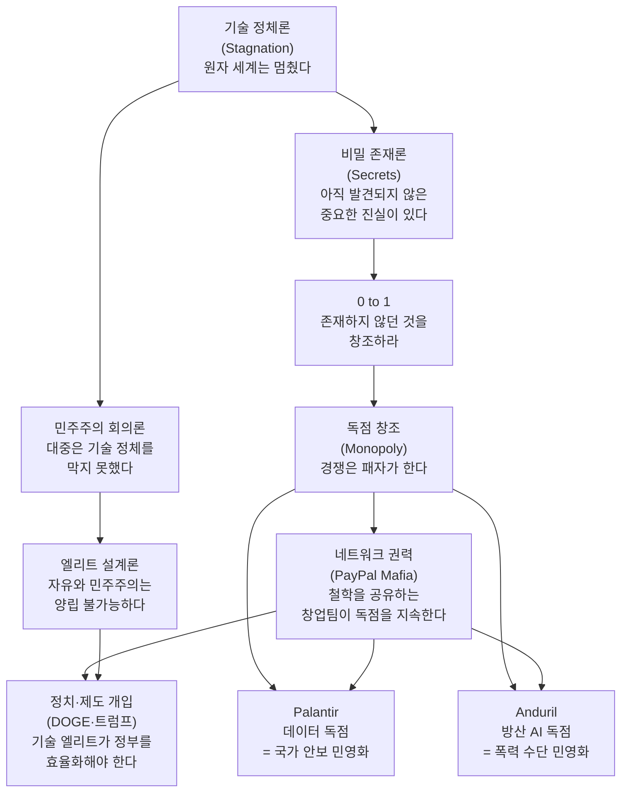

## 세계관 연결 구조

틸의 핵심 명제들은 독립적으로 보이지만 하나의 내적 논리로 연결된다. "독점이 옳다"는 결론은 기술 정체론 → 비밀 발견 → 독점 창조 → 민주주의 회의론 → 엘리트 설계 라는 사슬 위에 놓여 있다.

---

## 핵심 명제 간 관계 요약

| 명제 | 연결 방향 | 설명 |
|------|----------|------|
| 기술 정체론 → 비밀 존재론 | 원인→결과 | 원자 세계가 멈췄기 때문에 아직 발견되지 않은 비밀이 많다 |
| 비밀 존재론 → 0 to 1 | 원인→행동 | 비밀을 먼저 발견한 자가 창조적 독점을 만들 수 있다 |
| 0 to 1 → 독점 창조 | 논리적 귀결 | 진정한 혁신은 경쟁 시장이 아닌 독점 위치를 만든다 |
| 독점 창조 → 네트워크 권력 | 제도화 | PayPal → Palantir, Founders Fund, Anduril으로 독점이 확산 |
| 기술 정체론 → 민주주의 회의론 | 판단 | 대중 민주주의는 기술 정체를 막지 못했다 |
| 민주주의 회의론 → 엘리트 설계론 | 대안 | 따라서 기술 엘리트가 설계해야 한다 |
| 엘리트 설계론 → 정치·제도 개입 | 실행 | DOGE, 트럼프 2기 기술 인사 등으로 실현 |

---

## 세계관의 강점

1. **내적 일관성**: 각 명제가 다음 명제를 논리적으로 지지한다
2. **반증 가능성 낮음**: "기술이 정체됐다"는 전제를 수용하면 나머지 논리는 저항하기 어렵다
3. **행동 지침 명확**: "독점을 만들어라"는 구체적 행동 지침을 제공한다
4. **성공 사례 존재**: PayPal, Facebook(초기 투자), Palantir — 실제로 독점이 작동했다

## 세계관의 위험

1. **순환 논리**: "성공한 독점은 좋은 독점이다" — 실패한 독점은 분석에서 사라진다
2. **엘리트 자기정당화**: 자신이 속한 집단(기술 엘리트)에게 설계 권한을 부여하는 논리
3. **민주주의 대안 부재**: 대중 민주주의를 비판하지만 대안 거버넌스 구조를 명시하지 않는다
4. **"비밀"의 편의적 사용**: 사후에 어떤 성공도 "비밀을 발견한 것"으로 해석 가능

---

## 에세이 활용 포인트

이 맵에서 가장 취약한 고리: **기술 정체론 → 민주주의 회의론**

원자 세계의 기술 정체가 사실이라 해도, 그것이 대중 민주주의의 실패를 의미하지는 않는다. 기후 위기, 팬데믹 대응, 인프라 노후화 — 이 문제들은 민주주의가 잘 해결한 사례와 실패한 사례가 모두 있다. 틸은 실패 사례만 선택적으로 인용한다.
