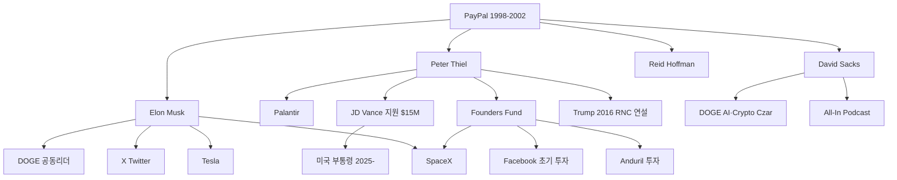

## 핵심 논제

PayPal Mafia는 틸의 철학이 한 회사를 넘어 산업·정치·미디어 전반으로 확산된 방식을 보여주는 가장 강력한 사례다. 틸이 Zero to One에서 "강한 창업팀이 독점의 기반"이라고 했을 때, 그는 이미 자신이 경험한 것을 서술하고 있었다. PayPal에서 형성된 신뢰 네트워크는 실리콘밸리 역사상 가장 생산적인 동문 집단이 됐고, 2025년에는 미국 행정부의 핵심 권력 구조 안에 자리를 잡았다.

---

## 핵심 멤버와 이후 경로

| 이름 | PayPal 역할 | 이후 주요 행보 |
|------|------------|--------------|
| **Peter Thiel** | 공동창업자·CEO | Palantir, Founders Fund, 트럼프 지지 |
| **Elon Musk** | X.com 합병 CEO | Tesla, SpaceX, X(Twitter), DOGE |
| **Reid Hoffman** | EVP | LinkedIn 창업 (Microsoft에 $26B 매각) |
| **Max Levchin** | 공동창업자·CTO | Yelp 이사회, Affirm 창업 |
| **David Sacks** | COO | Yammer 창업, Craft Ventures, DOGE AI·Crypto Czar |
| **Keith Rabois** | EVP | Square, OpenStore, Khosla Ventures |
| **Roelof Botha** | CFO | Sequoia Capital 파트너 (Airbnb, Stripe, Unity 투자) |
| **Jeremy Stoppelman** | VP Engineering | Yelp 공동창업·CEO |
| **Jawed Karim** | 엔지니어 | YouTube 공동창업 |
| **Chad Hurley** | 디자이너 | YouTube 공동창업 |

---

## 권력 네트워크 구조

---

## 투자 네트워크 — Founders Fund

Peter Thiel이 2005년 설립한 VC. PayPal Mafia의 철학을 자본 형태로 유지하는 기관.

**주요 투자 포트폴리오**:

| 기업 | 분야 | 의미 |
|------|------|------|
| SpaceX | 우주 | 기술 가속주의 최전선 |
| Palantir | 감시·국방 AI | 틸 직접 창업 |
| Anduril | 방산 AI | Luckey·틸 공동 구축 |
| Facebook (초기) | 소셜 | $500K → $1B+ 수익 |
| Airbnb | 숙박 공유 | 네트워크 효과 독점 |
| Lyft | 모빌리티 | Uber 대항마 |
| Stripe | 핀테크 | PayPal 계보 |

Founders Fund의 투자 패턴은 틸의 철학을 그대로 반영한다: 독점 가능한 기술, 기존 산업의 근본을 바꾸는 비즈니스, 국방·정부 연계 가능성.

---

## 정치 권력망 — 트럼프 2기

PayPal Mafia가 미국 행정부에 진입한 양상:

| 인물 | 역할 | PayPal 연결 |
|------|------|------------|
| **Elon Musk** | DOGE 공동리더 | PayPal 공동창업 |
| **David Sacks** | AI·Crypto 정책 담당관 | PayPal COO |
| **JD Vance** | 부통령 | Mithril Capital(틸 VC) 근무, 틸 $15M 후원 |
| **Peter Thiel** | 배후 영향력 | PayPal 창업자 |

> Thiel은 2024년에 트럼프를 직접 지지하지 않았지만, 그의 네트워크(Vance, Sacks, Musk)가 트럼프 2기 행정부의 기술 정책을 설계하고 있다.

---

## JD Vance — 틸의 정치적 프로젝트

JD Vance는 PayPal Mafia의 정치 실험 중 가장 직접적인 사례다.

- 예일 법대 졸업 후 Mithril Capital(틸의 VC)에서 근무
- 《Hillbilly Elegy》 출판 → 틸 서클에서 홍보
- 2022년 오하이오 상원의원 경선: Thiel $15M, Musk 지지
- 2024년 공화당 부통령 후보 → 당선
- 부통령으로서 AI 규제 완화, 암호화폐 친화, 국방 기술 민영화 입장

틸은 "기술 엘리트가 정치를 설계해야 한다"는 철학을 Vance라는 인물을 통해 실행했다.

---

## 네트워크 권력의 특성

### 왜 이 네트워크가 강한가

1. **공유된 경험**: 2001~2002년 닷컴 버블 붕괴 생존 — 살아남은 자들의 결속
2. **상호 투자·이사회 교차**: 서로의 회사에 투자하고 이사회에 참여
3. **철학적 일관성**: Zero to One 독점 논리를 공통 프레임으로 공유
4. **반체제 정체성**: 주류 실리콘밸리(ESG, DEI, Google 문화)에 대한 대항 정체성

### 한계와 균열

- Musk와 Thiel의 관계: 2016 이후 협력하다 DOGE 이후 사실상 분리
- Reid Hoffman: 민주당·오픈AI 지지로 네트워크 이탈
- 내부 권력 경쟁: Musk vs Thiel 중 누가 실질적 영향력이 더 큰가

---

## 봉건제→자본주의→AI 시대 비교

| 시대 | 권력 유지 방식 |
|------|--------------|
| 봉건제 | 혈연·혼인·종교적 서약으로 영주 연합 형성 |
| 자본주의 | 기업 합병·주식 교환·이사회 교차로 자본 연합 형성 |
| AI 시대(PayPal Mafia) | 창업 경험·투자 네트워크·정치 자금으로 기술 엘리트 연합 형성 |

PayPal Mafia는 새 시대의 귀족 가문이다. 혈연 대신 공동 창업 경험, 영토 대신 데이터와 알고리즘, 군사력 대신 자율무기 기업이 그 자리를 채운다.

---

## 에세이 활용 포인트

- **핵심 질문**: 이 네트워크는 실리콘밸리의 능력주의(meritocracy) 결과인가, 아니면 새로운 세습 엘리트의 형성인가?
- **인용 후보**: "The network that PayPal created arguably changed the world more than PayPal itself." — 다양한 기술 저널리스트들
- **대안 질문**: 같은 방식으로 — 공유 경험, 상호 투자, 철학적 일관성 — 을 가진 다른 집단이 등장할 수 있는가? AI 크리에이터 커뮤니티가 그 가능성을 가지는가?
