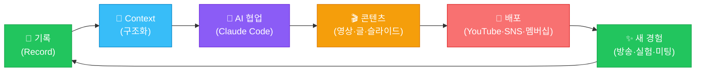

# AI 크리에이터 워크플로우

**목적**: 발표 S15 슬라이드용 핵심 다이어그램 — "기록 → Context → AI 협업 → 콘텐츠 → 배포" 순환 구조 시각화

---

## Mermaid 다이어그램 (발표 슬라이드용)



---

## 각 단계 설명

| 단계 | 도구/방법 | 실제 사례 |
|------|----------|---------|
| **기록** | GOBI Desktop, Obsidian, WorkLog, Rundown | 방송 Capture, 미팅 녹화, 학습 WorkLog |
| **Context** | 구조화된 텍스트 파일, 날짜 + 맥락 | Rundown.md, records-as-context.md |
| **AI 협업** | Claude Code, tehaleh-video-prompt.md, VibeLearn AI | 슬라이드 플랜 생성, 컴포넌트 코딩, 리서치 |
| **콘텐츠** | Remotion, edge-tts, Qwen3-TTS | MP4 영상, 발표 슬라이드, 분석 문서 |
| **배포** | YouTube, GitHub, SNS, 창발 발표 | Members Only → Public, GitHub 공개 |
| **새 경험** | 배포 후 피드백, 다음 라이브 방송 | 댓글 반응 → 다음 실험 소재 |

---

## 핵심 인사이트: 기록이 없으면 루프가 시작되지 않는다

```
[기록 없이]
아이디어 → AI에게 "만들어줘" → Generic 결과 (내 경험 반영 안 됨)

[기록 있을 때]
아이디어 + 기록(Context) → AI → 나만의 결과 (내 언어, 내 스타일)
```

**공식** (Live #14 인트로):
> "기록 + AI = 아이디어 즉시 실현"

---

## 4개 사례와 워크플로우 매핑

| 사례 | 기록 원천 | AI 도구 | 산출물 | 배포 |
|------|----------|---------|-------|------|
| Case 1: 방송 → Remotion 영상 | GOBI Capture + Rundown | Claude Code + Remotion | MP4 요약 영상 | YouTube |
| Case 2: 미팅 → GitHub 문서 | Zoom 녹화 + Transcript | Claude Code | builders-lounge 레포 | GitHub |
| Case 3: WorkLog → 연속성 | VibeLearn AI WorkLog | Claude Code | 발표 자료 | 창발 발표 |
| Case 4: 세션 → 콘텐츠 | 세션 녹화 + Transcript | Claude Code | YouTube 영상 | YouTube |

---

*M5 산출물 — 2026-06-21, VibeLearn AI*
