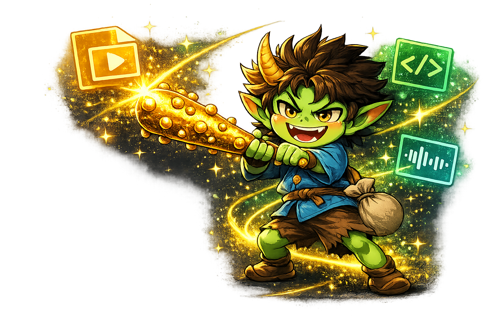
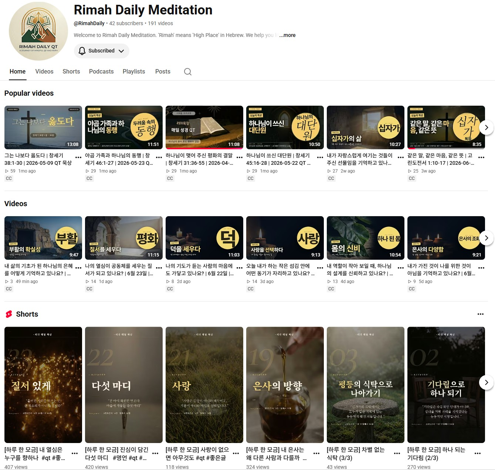
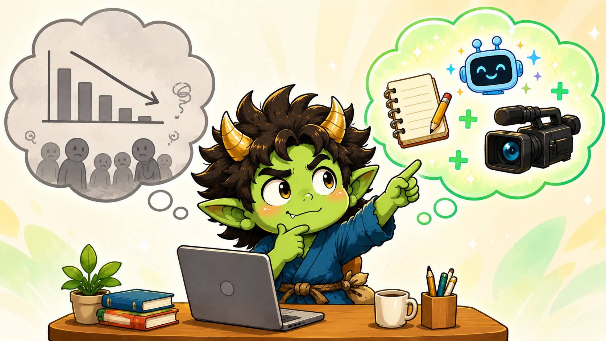
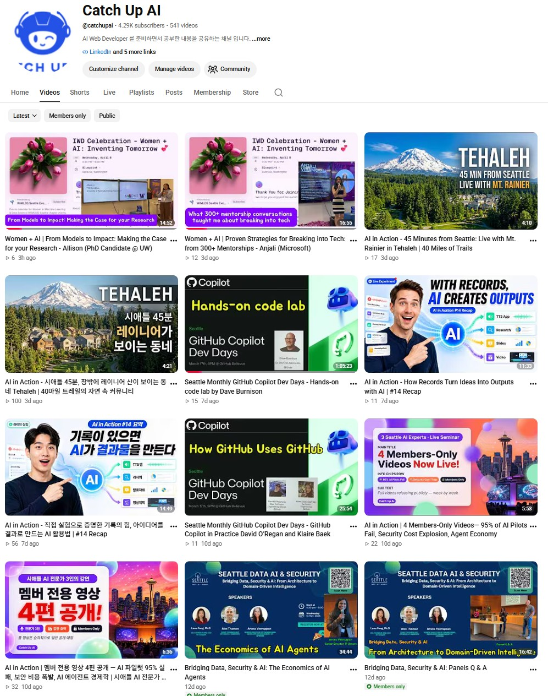

<!-- _class: lead invert -->

# 기록이 AI를 강하게 만든다

**AI 크리에이터의 경쟁력은 기록에서 시작된다**

---

  

    

      

        
      

      
<a href="https://www.youtube.com/@catchupai" target="_blank" rel="noopener" style="color:#60A5FA;text-decoration:none;">📺 youtube.com/@catchupai</a>

    

    

      

        
      

      
<a href="https://catchupai.net/" target="_blank" rel="noopener" style="color:#60A5FA;text-decoration:none;">🌐 catchupai.net</a>

    

  

  

  

    <strong style="color:#F59E0B;">박창수</strong> · Catch Up AI 
    창발 Product Group · 2026-06-26
  

<!-- 인사 + "오늘 36분 영상 데모로 시작하겠습니다" -->

---

<!-- _paginate: false -->

<h2 style="color:#F59E0B;font-size:1.6em;margin:0;">🎬 Tehaleh 소개 영상</h2>

<blockquote style="border-left:4px solid #22C55E;background:rgba(34,197,94,0.10);padding:0.5em 1em;color:#bbf7d0;border-radius:0 8px 8px 0;margin:0;">발표 전에 링크를 공유드렸습니다. 보셨나요?</blockquote>

<strong style="color:#F59E0B;">Tehaleh — Pierce County, WA</strong> 
AI가 만든 동네 소개 영상

<a href="https://youtu.be/Cucvcz9bVPU" style="color:#60A5FA;" target="_blank" rel="noopener">한국어 영상</a> · <a href="https://youtu.be/YygPvJbKPvU" style="color:#60A5FA;" target="_blank" rel="noopener">English Version</a>

---

## 36분만에 영상 초본 완성 — 5단계 과정

| 단계 | 작업 | 시간 |
|------|------|------|
| 1 | <a href="https://github.com/solkit70/VibeLearn-AI" target="_blank" rel="noopener">VibeLearn AI</a> — Roadmap 작성 | **8분** |
| 2 | M1 Research | **2분** |
| 3 | M2 슬라이드 플랜 (15장) | **4분** |
| 4 | M3 Remotion 컴포넌트 개발 | **13분** |
| 5 | M4 오디오 생성 + Draft 렌더링 | **9분** |
| | **합계** | **36분** |

지금부터 각 단계를 직접 보여드리겠습니다.

<!-- "화면에 보이는 영상은 각 단계에서 실제 작업한 20~30초 클립입니다" -->

---

<!-- _header: "오프닝 데모 — Step 1/5" -->

## 🗺️ VibeLearn AI — Roadmap 8분

<video src="clips/clip_01_roadmap.mp4" controls></video>

- **VibeLearn AI**: 목표 → 로드맵 → 단계별 학습 시스템
- **4개 모듈**: Research / 슬라이드 플랜 / Remotion 개발 / 오디오·렌더링
- 로드맵이 있어야 AI에게 정확하게 지시할 수 있습니다

---

<!-- _header: "오프닝 데모 — Step 2/5" -->

## 🔍 M1 Research — 2분

<video src="clips/clip_02_research.mp4" controls></video>

- `tehaleh-research.md` — 6개 섹션 자동 구조화
- 위치 / 커뮤니티 / IT 종사자 / 은퇴자 / 한인 관점
- 리서치 결과 → 다음 슬라이드 플랜의 소재

---

<!-- _header: "오프닝 데모 — Step 3/5" -->

## 📋 M2 슬라이드 플랜 — 4분

<video src="clips/clip_03_slideplan.mp4" controls></video>

- `video-slide-plan.md` — 15장 슬라이드 기획 + 한국어 나레이션 스크립트
- 슬라이드 타입, 내용, 예상 시간 자동 작성
- 이 계획 문서가 코딩 단계의 청사진

---

<!-- _header: "오프닝 데모 — Step 4/5" -->

## ⚛️ M3 Remotion 개발 — 13분

<video src="clips/clip_04_remotion.mp4" controls></video>

- React 기반 영상 프레임워크 + Claude Code
- 6가지 슬라이드 타입 컴포넌트 + 별빛 배경 애니메이션
- `video-slide-plan.md` → 코드 자동 생성 → Remotion Studio 미리보기

---

<!-- _header: "오프닝 데모 — Step 5/5" -->

## 🎤 M4 오디오 + 렌더링 — 9분

<video src="clips/clip_05_audio.mp4" controls></video>

- `gen_audio.py` — 15개 슬라이드 한국어 TTS 동시 생성
- 오디오 길이 측정 → `data.ts` 타이밍 자동 업데이트
- **Draft MP4 렌더링 완료** — 총 36분

---

<!-- _class: lead -->

  
  
사실 이게 도깨비 방망이 처럼 뚝딱 만들어진 것은 아닙니다.

---

## 사전 준비 — 시스템과 스킬

- ✅ **tehaleh-video-prompt.md** — 영상 제작 워크플로우 프롬프트
- ✅ <a href="https://github.com/solkit70/VibeLearn-AI" target="_blank" rel="noopener" style="font-weight:bold;">VibeLearn AI 학습 시스템</a> — 1년간 실험으로 구축
- ✅ <a href="https://github.com/jykim/ai4pkm-vault" target="_blank" rel="noopener" style="font-weight:bold;">AI4PKM Vault</a> — 김진영님의 기록 저장 기반 시스템
- ✅ **Remotion 프레임워크** — React 기반 코드형 영상 제작 도구
- ✅ **VS Code + Claude Code** — AI 코딩 환경 세팅 완료
- ✅ <a href="https://www.gobispace.com/" target="_blank" rel="noopener" style="font-weight:bold;">GOBI Desktop</a> — 방송 중 실시간 Capture

---

## 사전 준비 — API와 도구

- ✅ **Node.js 18+ + Remotion** — `npm install` 완료
- ✅ **Remotion 스킬 라이브러리** — 10개+ 영상 제작으로 축적된 패턴
- ✅ **openai-image-skill / gemini-image-skill** — API 이미지 생성
- ✅ **ChatGPT/Gemini 웹** — API 없이 이미지 생성
- ✅ **edge-tts** — 무료 초안용 TTS (`pip install edge-tts`)
- ✅ **Qwen3-TTS API** — 내 목소리 복제 모델 + `DASHSCOPE_API_KEY`
- ✅ **ffmpeg** — 오디오 후처리 (속도·음량)

이것들이 없었다면 36분이 아니라 며칠이 걸렸을 것입니다

---

## Draft 이후 — 후작업 플로우

  

    
🎬 영상 제작

    

      
1.Edge-TTS 생성

      
↓

      
2.나레이션 수정 (내 말투로)

      
↓

      
3.슬라이드 세부 수정

      
↓

      
4.Qwen3-TTS로 음성 교체

      
↓

      
5.렌더링 완료 🎬

      
↓

      
6.영어 영상 제작

    

  

  

    
📺 YouTube 업로드

    

      
1.유튜브 업로드

      
↓

      
2.썸네일 작업

      
↓

      
3.제목 · Description · Tags 작성

      
↓

      
4.Publish

      
↓

      
5.SNS 홍보 📢

    

  

---

## End to End 완전 자동화 예

  

---

<!-- _class: lead -->
<!-- _paginate: false -->

  

---

## Catch Up AI — 채널 변화 타임라인

<table style="width:100%; font-size:0.72em; border-collapse:collapse; margin-top:0.4em; line-height:1.3">
<thead>
<tr style="background:rgba(255,255,255,0.15)">
<th style="padding:0.4em 0.7em; text-align:left; width:6%">Phase</th>
<th style="padding:0.4em 0.7em; text-align:left; width:22%; white-space:nowrap">기간</th>
<th style="padding:0.4em 0.7em; text-align:left; width:32%">주제</th>
<th style="padding:0.4em 0.7em; text-align:left">특성</th>
</tr>
</thead>
<tbody>
<tr style="border-top:1px solid rgba(255,255,255,0.1)">
<td style="padding:0.4em 0.7em; font-weight:bold; color:#60A5FA; vertical-align:middle">P1</td>
<td style="padding:0.4em 0.7em; color:#94a3b8; white-space:nowrap; vertical-align:middle">24-02-13 ~ 24-03-19</td>
<td style="padding:0.4em 0.7em; vertical-align:middle">Deep Learning 기초</td>
<td style="padding:0.4em 0.7em; color:#94a3b8; vertical-align:middle">기술 설명</td>
</tr>
<tr style="border-top:1px solid rgba(255,255,255,0.1)">
<td style="padding:0.4em 0.7em; font-weight:bold; color:#22C55E; vertical-align:middle" rowspan="2">P2</td>
<td style="padding:0.4em 0.7em; color:#94a3b8; white-space:nowrap; vertical-align:middle" rowspan="2">24-03-20 ~ 25-03-31</td>
<td style="padding:0.4em 0.7em; vertical-align:middle">LangChain / LangGraph</td>
<td style="padding:0.4em 0.7em; color:#94a3b8; vertical-align:middle">AI 앱 개발</td>
</tr>
<tr>
<td style="padding:0.4em 0.7em; vertical-align:middle">AI Agent / 추론</td>
<td style="padding:0.4em 0.7em; color:#94a3b8; vertical-align:middle">방법론 탐구</td>
</tr>
<tr style="border-top:1px solid rgba(255,255,255,0.1)">
<td style="padding:0.4em 0.7em; font-weight:bold; color:#F59E0B; vertical-align:middle" rowspan="3">P3</td>
<td style="padding:0.4em 0.7em; color:#94a3b8; white-space:nowrap; vertical-align:middle" rowspan="3">25-04-01 ~ 26-02-23</td>
<td style="padding:0.4em 0.7em; vertical-align:middle"><strong style="color:#22C55E">Vibe Coding</strong> (라방)</td>
<td style="padding:0.4em 0.7em; color:#94a3b8; vertical-align:middle">재미로 하는 Vibe Coding</td>
</tr>
<tr>
<td style="padding:0.4em 0.7em; vertical-align:middle">PKM / AI4PKM</td>
<td style="padding:0.4em 0.7em; color:#94a3b8; vertical-align:middle">기록 시스템</td>
</tr>
<tr>
<td style="padding:0.4em 0.7em; vertical-align:middle">AI 일상 실험 (라방)</td>
<td style="padding:0.4em 0.7em; color:#94a3b8; vertical-align:middle">AI를 일상에 적용</td>
</tr>
<tr style="border-top:1px solid rgba(255,255,255,0.1)">
<td style="padding:0.4em 0.7em; font-weight:bold; color:#a78bfa; vertical-align:middle">P4</td>
<td style="padding:0.4em 0.7em; color:#94a3b8; white-space:nowrap; vertical-align:middle">26-02-24 ~ 현재</td>
<td style="padding:0.4em 0.7em; vertical-align:middle"><strong>AI 영상 제작</strong> (라방 요약 등)</td>
<td style="padding:0.4em 0.7em; color:#94a3b8; vertical-align:middle">Remotion·AI로 영상 자동 제작</td>
</tr>
</tbody>
</table>

  
채널의 변화 = 관심의 변화

  

    AI 배우기
    →→→
    AI 사용하기
    학습 중심에서 실전·창작 중심으로
  

---

## 기록이 없으면 AI를 활용 할 수 없다

| | Tehaleh/묵상 영상 | 내 실험·방송·학습 |
|--|------------|---------------|
| 정보 원천 | 인터넷 | **내 컴퓨터에 과정과 결과 기록** |
| AI 활용 | 누구나 가능 | **기록한 사람만 가능** |
| 타 영상과 비교 | 차별화 제한적 | **나만의 콘텐츠** |

> "AI 크리에이터의 경쟁력은 기록에서 시작된다"

> "기록하지 않은 경험은 AI 에게는 존재하지 않는 대상이다"

---

  

---

## Phase별 성과 비교

<table style="width:100%; font-size:0.78em; border-collapse:collapse; margin-top:0.6em; line-height:1.4">
<thead>
<tr style="background:rgba(255,255,255,0.15)">
<th style="padding:0.45em 0.8em; text-align:left; width:18%">Phase</th>
<th style="padding:0.45em 0.8em; text-align:center; width:10%">기간(월)</th>
<th style="padding:0.45em 0.8em; text-align:right; width:18%">일반 영상 조회수</th>
<th style="padding:0.45em 0.8em; text-align:right; width:16%">월평균 조회수</th>
<th style="padding:0.45em 0.8em; text-align:right; width:16%">월평균 신규구독</th>
<th style="padding:0.45em 0.8em; text-align:left">비고</th>
</tr>
</thead>
<tbody>
<tr style="border-top:1px solid rgba(255,255,255,0.1)">
<td style="padding:0.45em 0.8em; font-weight:bold; color:#60A5FA">P1 DL 입문</td>
<td style="padding:0.45em 0.8em; text-align:center; color:#94a3b8">1.2</td>
<td style="padding:0.45em 0.8em; text-align:right; color:#94a3b8">~1,200</td>
<td style="padding:0.45em 0.8em; text-align:right; color:#94a3b8">~1,000</td>
<td style="padding:0.45em 0.8em; text-align:right; color:#94a3b8">~12명</td>
<td style="padding:0.45em 0.8em; color:#94a3b8">소규모, 채널 시작</td>
</tr>
<tr style="border-top:1px solid rgba(255,255,255,0.1); background:rgba(34,197,94,0.08)">
<td style="padding:0.45em 0.8em; font-weight:bold; color:#22C55E">P2 외부 기술 전달</td>
<td style="padding:0.45em 0.8em; text-align:center; color:#22C55E">12.4</td>
<td style="padding:0.45em 0.8em; text-align:right; color:#e8f0fe">~71,307</td>
<td style="padding:0.45em 0.8em; text-align:right; font-weight:bold; color:#22C55E">~5,750</td>
<td style="padding:0.45em 0.8em; text-align:right; font-weight:bold; color:#22C55E">~231명</td>
<td style="padding:0.45em 0.8em; color:#22C55E">채널 핵심 성장기</td>
</tr>
<tr style="border-top:1px solid rgba(255,255,255,0.1)">
<td style="padding:0.45em 0.8em; font-weight:bold; color:#F59E0B">P3 라이브 방송</td>
<td style="padding:0.45em 0.8em; text-align:center; color:#94a3b8">10.8</td>
<td style="padding:0.45em 0.8em; text-align:right; color:#94a3b8">~52,175</td>
<td style="padding:0.45em 0.8em; text-align:right; color:#94a3b8">~4,831</td>
<td style="padding:0.45em 0.8em; text-align:right; color:#94a3b8">~125명</td>
<td style="padding:0.45em 0.8em; color:#94a3b8">전환 후 하락</td>
</tr>
<tr style="border-top:1px solid rgba(255,255,255,0.1)">
<td style="padding:0.45em 0.8em; font-weight:bold; color:#a78bfa">P4 AI 영상 제작</td>
<td style="padding:0.45em 0.8em; text-align:center; color:#94a3b8">3.9</td>
<td style="padding:0.45em 0.8em; text-align:right; color:#94a3b8">~10,326</td>
<td style="padding:0.45em 0.8em; text-align:right; color:#94a3b8">~2,648</td>
<td style="padding:0.45em 0.8em; text-align:right; color:#94a3b8">~18명</td>
<td style="padding:0.45em 0.8em; color:#94a3b8">진행 중</td>
</tr>
</tbody>
</table>

---

## 월별 조회수 · 구독자 추이

<table style="width:100%; border-collapse:collapse; line-height:1.2">
<thead>
<tr style="background:rgba(255,255,255,0.15)">
<th style="padding:0.22em 0.45em; text-align:left">월</th>
<th style="padding:0.22em 0.45em; text-align:right">조회수</th>
<th style="padding:0.22em 0.45em; text-align:right">구독</th>
<th style="padding:0.22em 0.45em; text-align:left">비고</th>
</tr>
</thead>
<tbody>
<tr style="border-top:1px solid rgba(255,255,255,0.08)"><td style="padding:0.18em 0.45em; color:#60A5FA">2024-02</td><td style="padding:0.18em 0.45em; text-align:right; color:#94a3b8">~800</td><td style="padding:0.18em 0.45em; text-align:right; color:#94a3b8">~4</td><td style="padding:0.18em 0.45em; color:#94a3b8">채널 시작 2/13</td></tr>
<tr style="border-top:1px solid rgba(255,255,255,0.08)"><td style="padding:0.18em 0.45em; color:#60A5FA">2024-03 (1~19)</td><td style="padding:0.18em 0.45em; text-align:right; color:#94a3b8">~169</td><td style="padding:0.18em 0.45em; text-align:right; color:#94a3b8">~10</td><td style="padding:0.18em 0.45em; color:#94a3b8">DL Basic 07 마지막</td></tr>
<tr style="border-top:1px solid rgba(255,255,255,0.08); background:rgba(34,197,94,0.05)"><td style="padding:0.18em 0.45em; color:#22C55E">2024-03 (20~31)</td><td style="padding:0.18em 0.45em; text-align:right">~106</td><td style="padding:0.18em 0.45em; text-align:right">~4</td><td style="padding:0.18em 0.45em; color:#22C55E">P2 시작</td></tr>
<tr style="border-top:1px solid rgba(255,255,255,0.08); background:rgba(34,197,94,0.05)"><td style="padding:0.18em 0.45em; color:#22C55E">2024-04</td><td style="padding:0.18em 0.45em; text-align:right">2,918</td><td style="padding:0.18em 0.45em; text-align:right">58</td><td style="padding:0.18em 0.45em"></td></tr>
<tr style="border-top:1px solid rgba(255,255,255,0.08); background:rgba(34,197,94,0.05)"><td style="padding:0.18em 0.45em; color:#22C55E">2024-05</td><td style="padding:0.18em 0.45em; text-align:right">3,378</td><td style="padding:0.18em 0.45em; text-align:right">202</td><td style="padding:0.18em 0.45em"></td></tr>
<tr style="border-top:1px solid rgba(255,255,255,0.08); background:rgba(34,197,94,0.05)"><td style="padding:0.18em 0.45em; color:#22C55E">2024-06</td><td style="padding:0.18em 0.45em; text-align:right">1,078</td><td style="padding:0.18em 0.45em; text-align:right">66</td><td style="padding:0.18em 0.45em"></td></tr>
<tr style="border-top:1px solid rgba(255,255,255,0.08); background:rgba(34,197,94,0.05)"><td style="padding:0.18em 0.45em; color:#22C55E">2024-07</td><td style="padding:0.18em 0.45em; text-align:right">4,154</td><td style="padding:0.18em 0.45em; text-align:right">150</td><td style="padding:0.18em 0.45em"></td></tr>
<tr style="border-top:1px solid rgba(255,255,255,0.08); background:rgba(34,197,94,0.05)"><td style="padding:0.18em 0.45em; color:#22C55E">2024-08</td><td style="padding:0.18em 0.45em; text-align:right">4,350</td><td style="padding:0.18em 0.45em; text-align:right">194</td><td style="padding:0.18em 0.45em"></td></tr>
<tr style="border-top:1px solid rgba(255,255,255,0.08); background:rgba(34,197,94,0.05)"><td style="padding:0.18em 0.45em; color:#22C55E">2024-09</td><td style="padding:0.18em 0.45em; text-align:right">3,100</td><td style="padding:0.18em 0.45em; text-align:right">104</td><td style="padding:0.18em 0.45em"></td></tr>
<tr style="border-top:1px solid rgba(255,255,255,0.08); background:rgba(34,197,94,0.05)"><td style="padding:0.18em 0.45em; color:#22C55E">2024-10</td><td style="padding:0.18em 0.45em; text-align:right; font-weight:bold; color:#22C55E">11,914</td><td style="padding:0.18em 0.45em; text-align:right">411</td><td style="padding:0.18em 0.45em; color:#F59E0B">IONQ 바이럴</td></tr>
<tr style="border-top:1px solid rgba(255,255,255,0.08); background:rgba(34,197,94,0.05)"><td style="padding:0.18em 0.45em; color:#22C55E">2024-11</td><td style="padding:0.18em 0.45em; text-align:right">~5,518</td><td style="padding:0.18em 0.45em; text-align:right">126</td><td style="padding:0.18em 0.45em"></td></tr>
<tr style="border-top:1px solid rgba(255,255,255,0.08); background:rgba(34,197,94,0.05)"><td style="padding:0.18em 0.45em; color:#22C55E">2024-12</td><td style="padding:0.18em 0.45em; text-align:right">~7,433</td><td style="padding:0.18em 0.45em; text-align:right">384</td><td style="padding:0.18em 0.45em"></td></tr>
<tr style="border-top:1px solid rgba(255,255,255,0.08); background:rgba(34,197,94,0.05)"><td style="padding:0.18em 0.45em; color:#22C55E">2025-01</td><td style="padding:0.18em 0.45em; text-align:right">9,343</td><td style="padding:0.18em 0.45em; text-align:right">415</td><td style="padding:0.18em 0.45em"></td></tr>
<tr style="border-top:1px solid rgba(255,255,255,0.08); background:rgba(34,197,94,0.05)"><td style="padding:0.18em 0.45em; color:#22C55E">2025-02</td><td style="padding:0.18em 0.45em; text-align:right">12,218</td><td style="padding:0.18em 0.45em; text-align:right; font-weight:bold; color:#22C55E">427</td><td style="padding:0.18em 0.45em; color:#F59E0B">구독자 월 최고</td></tr>
<tr style="border-top:1px solid rgba(255,255,255,0.08); background:rgba(34,197,94,0.05)"><td style="padding:0.18em 0.45em; color:#22C55E">2025-03</td><td style="padding:0.18em 0.45em; text-align:right">~10,479</td><td style="padding:0.18em 0.45em; text-align:right">319</td><td style="padding:0.18em 0.45em"></td></tr>
</tbody>
</table>

<table style="width:100%; border-collapse:collapse; line-height:1.2">
<thead>
<tr style="background:rgba(255,255,255,0.15)">
<th style="padding:0.22em 0.45em; text-align:left">월</th>
<th style="padding:0.22em 0.45em; text-align:right">조회수</th>
<th style="padding:0.22em 0.45em; text-align:right">구독</th>
<th style="padding:0.22em 0.45em; text-align:left">비고</th>
</tr>
</thead>
<tbody>
<tr style="border-top:1px solid rgba(255,255,255,0.08); background:rgba(245,158,11,0.05)"><td style="padding:0.18em 0.45em; color:#F59E0B">2025-04</td><td style="padding:0.18em 0.45em; text-align:right">9,998</td><td style="padding:0.18em 0.45em; text-align:right">386</td><td style="padding:0.18em 0.45em; color:#F59E0B">라이브 방송 시작</td></tr>
<tr style="border-top:1px solid rgba(255,255,255,0.08); background:rgba(245,158,11,0.05)"><td style="padding:0.18em 0.45em; color:#F59E0B">2025-05</td><td style="padding:0.18em 0.45em; text-align:right">8,399</td><td style="padding:0.18em 0.45em; text-align:right">235</td><td style="padding:0.18em 0.45em"></td></tr>
<tr style="border-top:1px solid rgba(255,255,255,0.08); background:rgba(245,158,11,0.05)"><td style="padding:0.18em 0.45em; color:#F59E0B">2025-06</td><td style="padding:0.18em 0.45em; text-align:right">4,471</td><td style="padding:0.18em 0.45em; text-align:right">107</td><td style="padding:0.18em 0.45em; color:#94a3b8">성장세 꺾임</td></tr>
<tr style="border-top:1px solid rgba(255,255,255,0.08); background:rgba(245,158,11,0.05)"><td style="padding:0.18em 0.45em; color:#F59E0B">2025-07</td><td style="padding:0.18em 0.45em; text-align:right">4,023</td><td style="padding:0.18em 0.45em; text-align:right">126</td><td style="padding:0.18em 0.45em"></td></tr>
<tr style="border-top:1px solid rgba(255,255,255,0.08); background:rgba(245,158,11,0.05)"><td style="padding:0.18em 0.45em; color:#F59E0B">2025-08</td><td style="padding:0.18em 0.45em; text-align:right">5,040</td><td style="padding:0.18em 0.45em; text-align:right">84</td><td style="padding:0.18em 0.45em"></td></tr>
<tr style="border-top:1px solid rgba(255,255,255,0.08); background:rgba(245,158,11,0.05)"><td style="padding:0.18em 0.45em; color:#F59E0B">2025-09</td><td style="padding:0.18em 0.45em; text-align:right">3,838</td><td style="padding:0.18em 0.45em; text-align:right">58</td><td style="padding:0.18em 0.45em"></td></tr>
<tr style="border-top:1px solid rgba(255,255,255,0.08); background:rgba(245,158,11,0.05)"><td style="padding:0.18em 0.45em; color:#F59E0B">2025-10</td><td style="padding:0.18em 0.45em; text-align:right">2,362</td><td style="padding:0.18em 0.45em; text-align:right">51</td><td style="padding:0.18em 0.45em"></td></tr>
<tr style="border-top:1px solid rgba(255,255,255,0.08); background:rgba(245,158,11,0.05)"><td style="padding:0.18em 0.45em; color:#F59E0B">2025-11</td><td style="padding:0.18em 0.45em; text-align:right">2,635</td><td style="padding:0.18em 0.45em; text-align:right">51</td><td style="padding:0.18em 0.45em; color:#94a3b8">저점</td></tr>
<tr style="border-top:1px solid rgba(255,255,255,0.08); background:rgba(245,158,11,0.05)"><td style="padding:0.18em 0.45em; color:#F59E0B">2025-12</td><td style="padding:0.18em 0.45em; text-align:right">3,455</td><td style="padding:0.18em 0.45em; text-align:right">74</td><td style="padding:0.18em 0.45em"></td></tr>
<tr style="border-top:1px solid rgba(255,255,255,0.08); background:rgba(245,158,11,0.05)"><td style="padding:0.18em 0.45em; color:#F59E0B">2026-01</td><td style="padding:0.18em 0.45em; text-align:right; font-weight:bold">3,990</td><td style="padding:0.18em 0.45em; text-align:right">101</td><td style="padding:0.18em 0.45em"></td></tr>
<tr style="border-top:1px solid rgba(255,255,255,0.08); background:rgba(245,158,11,0.05)"><td style="padding:0.18em 0.45em; color:#F59E0B">2026-02 (1~23)</td><td style="padding:0.18em 0.45em; text-align:right">~3,964</td><td style="padding:0.18em 0.45em; text-align:right; color:#94a3b8">—</td><td style="padding:0.18em 0.45em"></td></tr>
<tr style="border-top:1px solid rgba(255,255,255,0.08); background:rgba(167,139,250,0.05)"><td style="padding:0.18em 0.45em; color:#a78bfa">2026-02 (24~28)</td><td style="padding:0.18em 0.45em; text-align:right">~862</td><td style="padding:0.18em 0.45em; text-align:right; color:#94a3b8">—</td><td style="padding:0.18em 0.45em; color:#a78bfa">AI 영상 제작 시작</td></tr>
<tr style="border-top:1px solid rgba(255,255,255,0.08); background:rgba(167,139,250,0.05)"><td style="padding:0.18em 0.45em; color:#a78bfa">2026-03</td><td style="padding:0.18em 0.45em; text-align:right">3,302</td><td style="padding:0.18em 0.45em; text-align:right">35</td><td style="padding:0.18em 0.45em"></td></tr>
<tr style="border-top:1px solid rgba(255,255,255,0.08); background:rgba(167,139,250,0.05)"><td style="padding:0.18em 0.45em; color:#a78bfa">2026-04</td><td style="padding:0.18em 0.45em; text-align:right">2,321</td><td style="padding:0.18em 0.45em; text-align:right; color:#94a3b8">—</td><td style="padding:0.18em 0.45em"></td></tr>
<tr style="border-top:1px solid rgba(255,255,255,0.08); background:rgba(167,139,250,0.05)"><td style="padding:0.18em 0.45em; color:#a78bfa">2026-05</td><td style="padding:0.18em 0.45em; text-align:right">2,331</td><td style="padding:0.18em 0.45em; text-align:right">10</td><td style="padding:0.18em 0.45em"></td></tr>
<tr style="border-top:1px solid rgba(255,255,255,0.08); background:rgba(167,139,250,0.05)"><td style="padding:0.18em 0.45em; color:#a78bfa">2026-06 (1~23)</td><td style="padding:0.18em 0.45em; text-align:right">1,510</td><td style="padding:0.18em 0.45em; text-align:right">14</td><td style="padding:0.18em 0.45em"></td></tr>
</tbody>
</table>

---

## 구독자 최고 성장기 (2024-12 ~ 2025-03)

  
2024-12 &nbsp;<strong style="color:#22C55E">384명</strong>

  
2025-01 &nbsp;<strong style="color:#22C55E">415명</strong>

  
2025-02 ★ &nbsp;<strong style="color:#22C55E">427명</strong>

  
2025-03 &nbsp;<strong style="color:#22C55E">319명</strong>

<table style="width:100%; font-size:0.68em; border-collapse:collapse; line-height:1.2">
<thead>
<tr style="background:rgba(255,255,255,0.12)">
<th style="padding:0.28em 0.6em; text-align:left; width:58%">영상 제목</th>
<th style="padding:0.28em 0.6em; text-align:center; white-space:nowrap; width:10%">업로드</th>
<th style="padding:0.28em 0.6em; text-align:left; width:20%">주제</th>
<th style="padding:0.28em 0.6em; text-align:right; white-space:nowrap; width:12%">조회수</th>
</tr>
</thead>
<tbody>
<tr style="border-top:1px solid rgba(255,255,255,0.08)">
<td style="padding:0.22em 0.6em">Multi-Agent Architectures — 직장 그만두고 시작한 공부</td>
<td style="padding:0.22em 0.6em; text-align:center; color:#94a3b8; white-space:nowrap">24-12-01</td>
<td style="padding:0.22em 0.6em; color:#60A5FA">Multi-Agent</td>
<td style="padding:0.22em 0.6em; text-align:right; color:#22C55E">2,834</td>
</tr>
<tr style="border-top:1px solid rgba(255,255,255,0.08)">
<td style="padding:0.22em 0.6em">Hierarchical Agent Teams Architecture 최종회</td>
<td style="padding:0.22em 0.6em; text-align:center; color:#94a3b8; white-space:nowrap">25-01-06</td>
<td style="padding:0.22em 0.6em; color:#60A5FA">Multi-Agent</td>
<td style="padding:0.22em 0.6em; text-align:right; color:#22C55E">2,561</td>
</tr>
<tr style="border-top:1px solid rgba(255,255,255,0.08)">
<td style="padding:0.22em 0.6em">AI Agent 시대 한국이 선도할 수 있습니다</td>
<td style="padding:0.22em 0.6em; text-align:center; color:#94a3b8; white-space:nowrap">25-01-19</td>
<td style="padding:0.22em 0.6em; color:#60A5FA">Multi-Agent</td>
<td style="padding:0.22em 0.6em; text-align:right; color:#22C55E">1,448</td>
</tr>
<tr style="border-top:1px solid rgba(255,255,255,0.08)">
<td style="padding:0.22em 0.6em">Plan & Execute — AI 추론·추론 방법론</td>
<td style="padding:0.22em 0.6em; text-align:center; color:#94a3b8; white-space:nowrap">25-02-04</td>
<td style="padding:0.22em 0.6em; color:#60A5FA">추론 방법론</td>
<td style="padding:0.22em 0.6em; text-align:right; color:#22C55E">2,708</td>
</tr>
<tr style="border-top:1px solid rgba(255,255,255,0.08); background:rgba(34,197,94,0.06)">
<td style="padding:0.22em 0.6em; font-weight:bold">코딩의 판이 바뀐다 — Prompt를 지배하는 자</td>
<td style="padding:0.22em 0.6em; text-align:center; color:#94a3b8; white-space:nowrap">25-02-07</td>
<td style="padding:0.22em 0.6em; color:#60A5FA">추론 방법론</td>
<td style="padding:0.22em 0.6em; text-align:right; font-weight:bold; color:#F59E0B">3,876</td>
</tr>
<tr style="border-top:1px solid rgba(255,255,255,0.08)">
<td style="padding:0.22em 0.6em">AI로 AI 웹앱 만들기 — 코딩 몰라도 5분에 무료</td>
<td style="padding:0.22em 0.6em; text-align:center; color:#94a3b8; white-space:nowrap">25-03-16</td>
<td style="padding:0.22em 0.6em; color:#60A5FA">실용 튜토리얼</td>
<td style="padding:0.22em 0.6em; text-align:right; color:#22C55E">1,855</td>
</tr>
<tr style="border-top:1px solid rgba(255,255,255,0.08)">
<td style="padding:0.22em 0.6em">AI 해커톤 1등 — 인도 미녀와 6시간에 앱 완성</td>
<td style="padding:0.22em 0.6em; text-align:center; color:#94a3b8; white-space:nowrap">25-03-21</td>
<td style="padding:0.22em 0.6em; color:#60A5FA">해커톤 참가기</td>
<td style="padding:0.22em 0.6em; text-align:right; color:#22C55E">1,673</td>
</tr>
<tr style="border-top:1px solid rgba(255,255,255,0.08); background:rgba(34,197,94,0.06)">
<td style="padding:0.22em 0.6em; font-weight:bold">LLMCompiler — 한국인이 만든 추론 방법론</td>
<td style="padding:0.22em 0.6em; text-align:center; color:#94a3b8; white-space:nowrap">25-03-26</td>
<td style="padding:0.22em 0.6em; color:#60A5FA">추론 방법론</td>
<td style="padding:0.22em 0.6em; text-align:right; font-weight:bold; color:#F59E0B">4,085</td>
</tr>
</tbody>
</table>

공통 키워드: <strong style="color:#60A5FA">Multi-Agent 아키텍처 · 추론 방법론</strong>

---

## AI YouTube 채널의 유형

✓ 튜토리얼 / 기술 전달형

도구·라이브러리 사용법 설명 검색 유입 강점 · P2 주력

뉴스 / 트렌드 해설형

최신 AI 발표·업계 소식 발행 속도가 경쟁력

✓ 프로젝트 / 빌드 로그형

AI 프로젝트 제작 과정 공유 개발자 구독자 집중 · P4

✓ 개념 / 교육형

AI 원리·아키텍처·논문 해설 깊이 있는 시청자 확보 · P1

✓ 라이브 / 커뮤니티형

실시간 방송·Q&A 참여 팬덤 구축에 강함 · P3

개인 스토리 / 브이로그형

공부 일지·커리어 전환기 감성적 연결로 구독 전환

  현재 Catch Up AI &nbsp;→&nbsp; 🔬 AI 실험 과정 공유 &nbsp;·&nbsp; 📡 라이브 방송 &nbsp;·&nbsp; 🎙️ 시애틀 AI 세미나 소식

---

<!-- _class: lead -->
<!-- _paginate: false -->

---

## 선택의 기로 — 그리고 나의 선택

📌 현재 상황

<ul style="margin:0;padding-left:1.2em;font-size:0.88em;line-height:1.75;color:#e8f0fe;">
  <li>AI 활용 실험을 컨텐츠로 제작 중</li>
  <li>조회수·시청 시간 등 아직 부진</li>
  <li>기술 전달형 채널 복귀 의사 없음</li>
</ul>

✅ 나의 선택

<ul style="margin:0;padding-left:1.2em;font-size:0.88em;line-height:1.75;color:#e8f0fe;">
  <li>관심 가는 AI 실험 지속 추진</li>
  <li>컨텐츠 제작까지 AI 활용 실험</li>
  <li>구독자 관심 확대 방법 병행 탐색</li>
</ul>

  나만의 컨텐츠를 만들려면 <strong style="color:#F59E0B;">나만의 기록</strong>이 필요하다. 
  그것이 내가 생각하는 <strong style="color:#F59E0B;">AI 경쟁력의 핵심</strong>이다.

---

<!-- _class: lead invert -->

# 기록이 AI를 강하게 만든다

AI 크리에이터의 경쟁력은 기록에서 시작된다

---

## 기록 → Context → AI → 배포 순환

  
📝 기록

  
→

  
🧠 Context

  
→

  
🤖 AI 협업

  
↑

  

  
↓

  
✨ 새 경험

  
←

  
📢 배포

  
←

  
🎬 콘텐츠

- 기록 없이: AI → Generic 결과 (내 경험 반영 안 됨)
- **기록 있을 때: AI + Context → 나만의 결과, 내 언어, 내 스타일**

---

<!-- _class: lead -->
<!-- _paginate: false -->

---

## 이 기록들이 AI를 위한 Context가 된다

  

    
🎙️

    
GOBI 캡처

    
2026-06-21 Capture.md · 현장 음성 맥락

  

  

    
💬

    
AI ChatHistory

    
Weekly Planning.md · 실제 작업 내역

  

  

    
📺

    
YouTube 자막

    
captions.sbv · 방송 전체 흐름 기준

  

  

    
📅

    
Weekly Planning

    
2026-06-22 Planning.md · 주간 맥락

  

  

    
📓

    
Daily Roundup

    
2026-06-21 Claude Code.md · 당일 정리

  

  

    
📋

    
Live Rundown

    
Live15 Weekly Rundown.md · 방송 계획

  

  

    
🔧

    
시스템 변경 기록

    
CLAUDE.md · AGENTS.md · .claude/skills/* · 기술 변화 추적

  

  

    
🎬 → Live #15 요약 영상

    
video-slide-plan.md · 16장 슬라이드 플랜 완성

  

  하나의 자막만으로는 부족했다 — 7가지 기록이 맥락을 완성했다

---

<!-- _class: lead -->
<!-- _paginate: false -->

---

## 기록, AI 시대의 경쟁력

굳이 컨텐츠를 만들기 위해서만 기록이 필요한 것은 아닙니다. <strong style="color:#F59E0B;">AI를 잘 사용하려면 기록이 필요합니다.</strong>

  ✨ Gold in, Gold out &nbsp;·&nbsp; Garbage in, Garbage out 
  AI에게 좋은 Context를 주어야 좋은 답을 얻을 수 있습니다

  

    
🎯 나에게 딱 맞는 AI

    
AI가 나를 알려면 내 정보가 필요합니다. 내 기록이 곧 나만의 Context입니다.

  

  

    
🚀 AI 시대 경쟁력

    
기록하는 사람이 AI를 더 잘 씁니다. 오늘 메모 하나가 경쟁력의 시작입니다.

  

  AI 시대 경쟁력을 갖기 위해 <strong style="color:#8B5CF6;">지금 바로 기록을 시작하세요</strong>

---

<!-- _class: lead invert -->

## 기록이 AI를 강하게 만듭니다

오늘 집에 가서 **메모 하나** 쓰세요.
그게 AI와의 협업의 시작입니다.

---

  

    

      
    

    
<a href="https://www.youtube.com/@catchupai" target="_blank" rel="noopener" style="color:#60A5FA;text-decoration:none;">📺 youtube.com/@catchupai</a>

  

  

    

      
    

    
<a href="https://catchupai.net/" target="_blank" rel="noopener" style="color:#60A5FA;text-decoration:none;">🌐 catchupai.net</a>

  

📺 **Catch Up AI** — AI를 일상에 적용해 보는 다양한 실험
💬 **Builders Lounge** — Builder들의 모임 #club-sg-ai · gobispace.com
🛠️ **Utah Project** — 비개발자 Vibe Coding 앱 개발 Guide
🏠 **Channel Membership** — Members Only 선공개 콘텐츠 (시애틀 AI 생태계)
📧 **1:1 세션** — AI4PKM / VibeLearn AI 상담

**감사합니다** 🌿

<!-- 질문 있으신 분? -->
