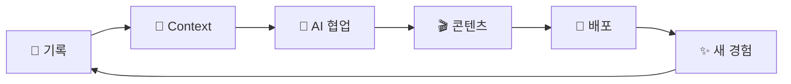

<!-- _class: lead invert -->

# 기록이 AI를 강하게 만든다

**AI 크리에이터의 경쟁력은 기록에서 시작된다**

---
창발 Product Group · 2026-06-26

Catch Up AI · 솔킷

<!-- 인사 + "오늘 36분 영상 데모로 시작하겠습니다" -->

---

<!-- _paginate: false -->

## 🎬 Tehaleh 소개 영상 — 완성본 미리 보기

> 발표 전에 링크를 공유드렸습니다. 보셨나요?


**Tehaleh — 워싱턴주 Pierce County**
AI가 만든 동네 소개 영상

[한국어 영상](https://youtu.be/Cucvcz9bVPU) · [English Version](https://youtu.be/YygPvJbKPvU)

---

## 36분으로 Draft 완성 — 5단계 과정

| 단계 | 작업 | 시간 |
|------|------|------|
| 1 | VibeLearn AI — Roadmap 작성 | **8분** |
| 2 | M1 Research | **2분** |
| 3 | M2 슬라이드 플랜 (15장) | **4분** |
| 4 | M3 Remotion 컴포넌트 개발 | **13분** |
| 5 | M4 오디오 생성 + Draft 렌더링 | **9분** |
| | **합계** | **36분** |

지금부터 각 단계를 직접 보여드리겠습니다.

<!-- "화면에 보이는 영상은 각 단계에서 실제 작업한 20~30초 클립입니다" -->

---

<!-- _header: "오프닝 데모 — Step 1/5" -->

## 🗺️ VibeLearn AI — Roadmap 8분

<video src="clips/clip_01_roadmap.mp4" controls></video>
<p class="clip-label">▶ 실제 작업 화면 클립 (20~30초)</p>

- **VibeLearn AI**: 목표 → 로드맵 → 단계별 학습 시스템
- **4개 모듈**: Research / 슬라이드 플랜 / Remotion 개발 / 오디오·렌더링
- 로드맵이 있어야 AI에게 정확하게 지시할 수 있습니다

---

<!-- _header: "오프닝 데모 — Step 2/5" -->

## 🔍 M1 Research — 2분

<video src="clips/clip_02_research.mp4" controls></video>
<p class="clip-label">▶ 실제 작업 화면 클립 (20~30초)</p>

- `tehaleh-research.md` — 6개 섹션 자동 구조화
- 위치 / 커뮤니티 / IT 종사자 / 은퇴자 / 한인 관점
- 리서치 결과 → 다음 슬라이드 플랜의 소재

---

<!-- _header: "오프닝 데모 — Step 3/5" -->

## 📋 M2 슬라이드 플랜 — 4분

<video src="clips/clip_03_slideplan.mp4" controls></video>
<p class="clip-label">▶ 실제 작업 화면 클립 (20~30초)</p>

- `video-slide-plan.md` — 15장 슬라이드 기획 + 한국어 나레이션 스크립트
- 슬라이드 타입, 내용, 예상 시간 자동 작성
- 이 계획 문서가 코딩 단계의 청사진

---

<!-- _header: "오프닝 데모 — Step 4/5" -->

## ⚛️ M3 Remotion 개발 — 13분

<video src="clips/clip_04_remotion.mp4" controls></video>
<p class="clip-label">▶ 실제 작업 화면 클립 (20~30초)</p>

- React 기반 영상 프레임워크 + Claude Code
- 6가지 슬라이드 타입 컴포넌트 + 별빛 배경 애니메이션
- `video-slide-plan.md` → 코드 자동 생성 → Remotion Studio 미리보기

---

<!-- _header: "오프닝 데모 — Step 5/5" -->

## 🎤 M4 오디오 + 렌더링 — 9분

<video src="clips/clip_05_audio.mp4" controls></video>
<p class="clip-label">▶ 실제 작업 화면 클립 (20~30초)</p>

- `gen_audio.py` — 15개 슬라이드 한국어 TTS 동시 생성
- 오디오 길이 측정 → `data.ts` 타이밍 자동 업데이트
- **Draft MP4 렌더링 완료** — 총 36분

---

<!-- _class: lead -->

## 이건 뚝딱이 아닙니다

**36분 전에 오랫동안 준비된 것들이 있습니다**

---

## 사전 준비 — 시스템과 스킬

- ✅ **VibeLearn AI 학습 시스템** — 1년간 실험으로 구축
- ✅ **tehaleh-video-prompt.md** — 영상 제작 워크플로우 프롬프트
- ✅ **Remotion 스킬 라이브러리** — 10개+ 영상 제작으로 축적된 패턴
- ✅ **Obsidian PKM Vault** — 기록 저장 기반 시스템
- ✅ **VS Code + Claude Code** — AI 코딩 환경 세팅 완료

이것들이 없었다면 36분이 아니라 며칠이 걸렸을 것입니다

---

## 사전 준비 — API와 도구

- ✅ **Qwen3-TTS API** — 내 목소리 복제 모델 + `DASHSCOPE_API_KEY`
- ✅ **edge-tts** — 무료 초안용 TTS (`pip install edge-tts`)
- ✅ **Node.js 18+ + Remotion** — `npm install` 완료
- ✅ **ffmpeg** — 오디오 후처리
- ✅ **GOBI Desktop** — 방송 중 실시간 Capture
- ✅ **ChatGPT/Gemini 웹** — API 없이 이미지 생성

---

## Draft 이후 — 후작업과 비용 절약

```
나레이션 수정 (내 말투로)
    ↓
Edge-TTS 재생성 (무료 — 확인용)
    ↓
Qwen3-TTS 교체 (유료 — 확정 후만)
    ↓
슬라이드 세부 수정 (배치·색상·애니메이션)
```

**비용 절약 포인트**
- 이미지: API 대신 ChatGPT/Gemini **웹** 생성 → 무료
- 음성: Edge-TTS로 충분히 검토 후 Qwen3-TTS 전환

---

<!-- _class: lead -->

## Tehaleh는 인터넷 정보로 가능했습니다

**하지만 내 실험 기록은?**

---

## 기록하지 않으면 AI에게 존재하지 않는다

| | Tehaleh 영상 | 내 실험·방송·학습 |
|--|------------|---------------|
| 정보 원천 | 인터넷 | **내 기록만 존재** |
| AI 활용 | 누구나 가능 | **기록한 사람만 가능** |
| 차별점 | 없음 | **나만의 콘텐츠** |

> "기록하지 않은 경험은 AI에게 존재하지 않는 경험이다"

---

<!-- _class: lead invert -->

# 기록이 AI를 강하게 만든다

AI 크리에이터의 경쟁력은 기록에서 시작된다

---

## Catch Up AI — 채널 변화 타임라인

| 시기 | 주제 | 특성 |
|------|------|------|
| 2024 초 | Deep Learning 기초 | 기술 설명 |
| 2024 중 | LangChain / LangGraph | AI 앱 개발 |
| 2025 초 | AI Agent / 추론 | 방법론 탐구 |
| 2025 중 | Vibe Coding | "누구나 가능" |
| 2025 하 | PKM / AI4PKM | 기록 시스템 |
| 2026~ | **AI 일상 실험** | IT스러운 게 하나도 없다 |

---

## 솔직한 고백

> "나는 콘텐츠를 만들면서 새로운 시도를 하고 있다.
> 하지만 대중성 부분은 아직 커버를 못하고 있다."

저도 아직 모릅니다. 어떻게 하면 더 많은 분들에게 닿을 수 있는지.

**하지만 오늘 이 자리에 서 있는 것은 — 기록이 있어서입니다.**

오늘 보여드린 36분 데모도, 이 발표 자체도, 기록 없이는 불가능했습니다.

---

## 기록 → Context → AI → 배포 순환



- 기록 없이: AI → Generic 결과 (내 경험 반영 안 됨)
- **기록 있을 때: AI + Context → 나만의 결과, 내 언어, 내 스타일**

---

## 실제 방송 발언

> **Live #12** (2026-05-31):
> "AI 시대에는 기록이 그냥 메모가 아니라,
> AI가 일할 수 있는 나의 컨텍스트가 됩니다."

> **Live #14** (2026-06-14):
> "아이디어에서 결과물까지, 중간이 사라졌다.
> 단, 기록이 있어야 한다."

---

## 기록 → 콘텐츠: 실제 사례 4개

| | 기록 원천 | 산출물 |
|-|---------|-------|
| 🎬 Case 1 | 라이브 방송 Capture + Rundown | Remotion 요약 영상 |
| 📄 Case 2 | 미팅 녹화 + Transcript | GitHub 공개 문서 |
| 📚 Case 3 | VibeLearn AI WorkLog | 이 발표 자료 자체 |
| 🎓 Case 4 | 세션 녹화 + Transcript | YouTube 콘텐츠 |

**공통 구조**: 기록 → Context → AI 협업 → 산출물 → 배포

---

## 어떻게 시작할까

**무엇을 기록할까**
- 경험, 인사이트, 실험 결과 — 완벽하지 않아도 됩니다
- 날짜 + 맥락이 있으면 AI가 검색할 수 있습니다

**어떻게 기록할까**
- **Obsidian** — 로컬 마크다운, 무료
- **GOBI Desktop** — 실시간 Capture (방송 중에도)
- 음성 메모 + AI 전사

> "먼저 해온 사람의 시스템을 빌려 쓰고, 하나씩 내게 맞게 바꾸세요"

---

<!-- _class: lead invert -->

## 기록이 AI를 강하게 만듭니다

오늘 집에 가서 **메모 하나** 쓰세요.
그게 AI와의 협업의 시작입니다.

---

📺 **Catch Up AI** — 매주 일요일 새벽 5시 AI 실험 라이브
🏠 **멤버십** — Members Only 선공개 콘텐츠
💬 **Builders Lounge** — AI 실험 커뮤니티
📧 **1:1 세션** — AI4PKM / VibeLearn AI 상담

**감사합니다** 🌿

<!-- 질문 있으신 분? -->
