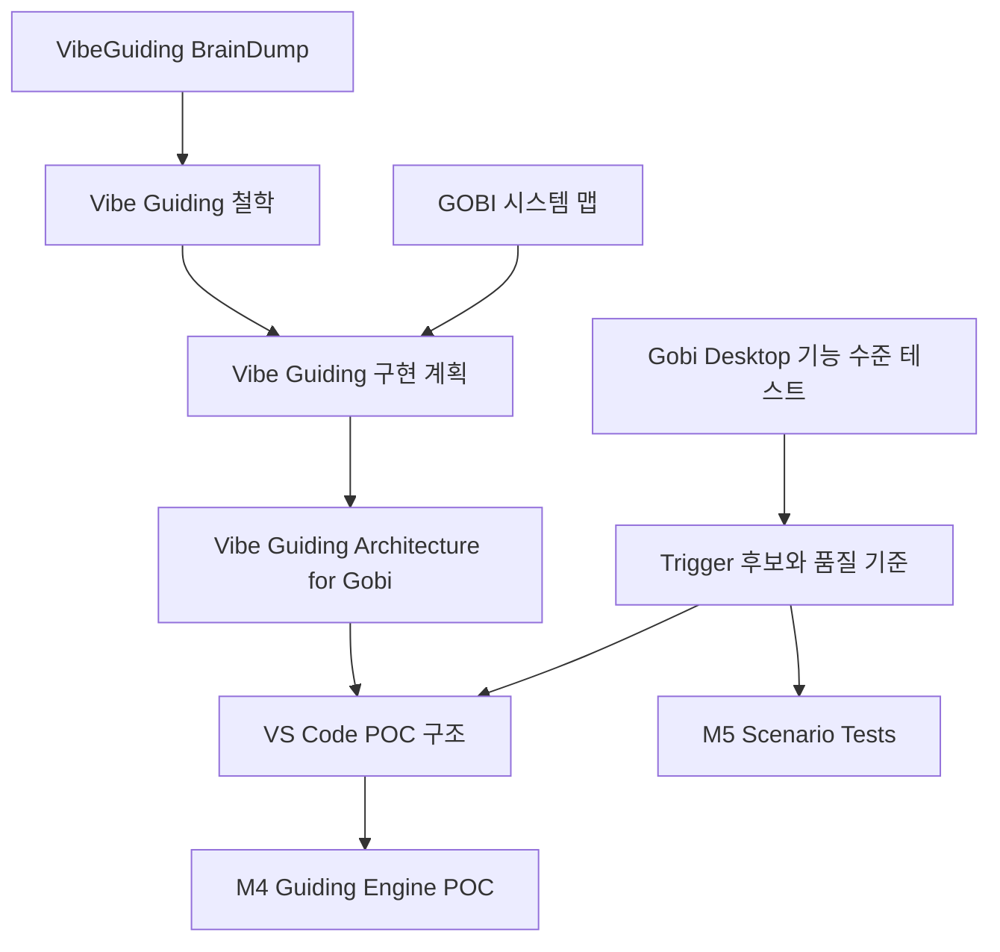

## Source Map 목적

이 문서는 M1의 핵심 산출물로, Vibe Guiding의 철학, GOBI 적용 대상, 구현 단계, 엔진 구조, 실제 실패 사례를 하나의 근거 지도로 정리한다. 이후 M2에서는 컴포넌트 책임 분리의 근거로, M3에서는 Vibe Manual/CVL 스키마 설계의 근거로, M4-M5에서는 Trigger와 Scenario Test 설계의 입력으로 사용한다.

## Source 1: VibeGuiding BrainDump

**원본 링크**: [[Ingest/CatchUpAI_VL/Topics/Material_For_Topics/Idea/Vibe_Guiding/VibeGuiding_BrainDump|VibeGuiding_BrainDump]]

**이 Source의 역할**: Vibe Guiding의 원래 문제의식과 철학을 담은 1차 아이디어 문서다. 이 문서는 Vibe Guiding이 일반 챗봇이나 단순 문서 검색이 아니라, Vibe Learning으로 생성한 최신 매뉴얼을 사용자 상황에 맞게 활성화하는 시스템임을 정의한다.

> "필요한 사람에게 필요한 내용을 필요할 때에 알려주는 Guide"

**핵심 인사이트**: Vibe Guiding은 Vibe Learning 이후에 의미가 생긴다. Vibe Learning은 Topic에 대한 교과서 품질의 문서를 만들고, Vibe Guiding은 그 문서를 AI의 context로 사용해 특정 사용자의 현재 상태에 맞는 안내를 제공한다. 따라서 이 Topic의 구현 방향은 "답변 생성기"가 아니라 "최신 매뉴얼 + 사용자 상태 + 트리거 판단 + 맞춤 안내"로 잡아야 한다.

**다음 모듈 사용처**: M2에서는 Build the Brain과 Activate the Brain의 책임 분리를 정의하는 근거로 사용한다. M3에서는 Vibe Manual이 사람과 AI 모두가 읽는 구조화 문서여야 한다는 설계 원칙으로 사용한다. M4에서는 Guide Composer가 일반 요약이 아니라 사용자 수준과 현재 문제에 맞게 문서를 재구성해야 하는 이유로 사용한다.

## Source 2: GOBI Vibe Guiding 시스템 맵

**원본 링크**: [[Ingest/CatchUpAI_VL/Topics/GOBI-Guiding/2026-04-03 GOBI Vibe Guiding 시스템 맵#개요|2026-04-03 GOBI Vibe Guiding 시스템 맵]]

**이 Source의 역할**: GOBI에 Vibe Guiding을 적용할 때 참조해야 하는 제품군, 리포지토리, 문서화 파이프라인, 협업 채널을 정리한 시스템 지도다. 이 문서는 Vibe Guiding의 지식 기반이 어디에서 오고, 어떤 제품을 대상으로 안내해야 하는지 알려준다.

> "GitHub 소스코드 → Vibe Learning → Core Concept + User Manual 자동 생성"

**핵심 인사이트**: GOBI의 Vibe Guiding은 단일 앱 기능이 아니라 `gobi-ai/gobi-monorepo`, `gobi-ai/docs`, `docs.gobihq.com`, Gobi Desktop, Gobi Space, Gobi CLI를 연결하는 지식 흐름 위에 놓인다. 따라서 첫 POC는 전체 제품군을 다루기보다, 로컬에서 재현 가능한 대상 하나를 정하고 그 대상의 문서와 사용자 상태만 다루는 것이 적절하다.

**다음 모듈 사용처**: M2에서는 대상 시스템과 데이터 흐름을 Architecture Diagram에 반영한다. M3에서는 `docs.gobihq.com`과 specs 문서가 Vibe Manual의 주요 입력이 된다는 점을 반영한다. M4에서는 POC 입력 파일인 `retrieval_index.json`에 어떤 문서 계층을 넣을지 판단하는 근거로 사용한다.

## Source 3: Vibe Guiding 구현 계획

**원본 링크**: [[Ingest/CatchUpAI_VL/Topics/GOBI-Guiding/2026-04-05 Vibe Guiding 구현 계획#Context|2026-04-05 Vibe Guiding 구현 계획]]

**이 Source의 역할**: Vibe Guiding을 GOBI에 적용하는 단계별 실행 계획이다. 팀이 기대하는 User Manual 작성과 Changsoo의 확장 목표인 Guiding 시스템이 충돌하지 않고 레이어 관계라는 점을 명확히 한다.

> "매뉴얼 (팀 기대) → 가이딩 (Changsoo 확장) → 제품 통합 (최종 목표)"

**핵심 인사이트**: 이 계획은 Vibe Guiding을 세 단계로 나눈다. 첫째, GOBI 제품별 Vibe Manual을 만든다. 둘째, User Context와 Structured Context를 결합하는 Guiding Engine으로 확장한다. 셋째, GOBI Applet이나 제품 내부 기능으로 통합한다. 따라서 지금 VS Code Topic은 바로 제품 통합으로 가지 않고, M1-M4에서 개념과 파일 기반 POC를 먼저 검증해야 한다.

**다음 모듈 사용처**: M2에서는 Vibe Manual/CVL 컴포넌트와 Guiding Engine 컴포넌트를 분리하는 근거로 사용한다. M3에서는 Atomic, Structured, Context-rich 원칙을 Vibe Manual Schema로 구체화한다. M6에서는 제품 통합 후보와 팀 공유 전략을 정리할 때 다시 사용한다.

## Source 4: Vibe Guiding Architecture for Gobi

**원본 링크**: [[Ingest/CatchUpAI_VL/Topics/GOBI-Specs-Pipeline/04-Reviews-and-Opinions/2026-04-09 - Proposal - Vibe Guiding Architecture for Gobi#1. 개요 (Overview)|2026-04-09 - Proposal - Vibe Guiding Architecture for Gobi]]

**이 Source의 역할**: Vibe Guiding의 엔진 구조를 제안한 아키텍처 문서다. 통합 컨텍스트 폴더, 실시간 동기화, 사용자 상황 분석, 데이터 추출, 맞춤형 가이드 생성이라는 주요 컴포넌트를 제공한다.

> "사용자의 상황(Context)을 이해하고 실시간으로 최적의 안내를 제공"

**핵심 인사이트**: 이 문서는 Vibe Guiding Engine을 세 기능으로 나눈다. 첫째, 유저 상황 분석 및 필요 정보 파악. 둘째, 트리거링 및 데이터 추출. 셋째, 유저 맞춤형 가이드 제공. 이 구조는 M4 POC의 `collect_context.py`, `evaluate_trigger.py`, `retrieve_manual.py`, `compose_guide.py`로 거의 직접 매핑된다.

**다음 모듈 사용처**: M2에서는 컴포넌트 책임표와 Mermaid 흐름도의 핵심 근거로 사용한다. M4에서는 POC 파일 구조와 모듈명 설계의 직접 근거로 사용한다. M5에서는 guide failure를 context, trigger, retrieval, compose 중 어디의 문제인지 분류하는 기준으로 사용한다.

## Source 5: Gobi Desktop Vibe Guiding 기능 수준 테스트

**원본 링크**: [[Ingest/CatchUpAI_VL/Topics/GOBI-Guiding/2026-04-13 Gobi Desktop Vibe Guiding 기능 수준 테스트#2. 테스트 결과 및 분석|2026-04-13 Gobi Desktop Vibe Guiding 기능 수준 테스트]]

**이 Source의 역할**: Gobi Desktop Custom Homepage/Applet 제작 과정에서 기존 AI 안내가 실제 작업 완수에 충분했는지 검증한 테스트 기록이다. 이 문서는 추상적인 설계가 아니라 실제 실패 지점을 Trigger 후보와 품질 기준으로 바꾸는 근거다.

> "사용자의 현재 설정 상태(Vault Path, Applet 경로 등)를 실시간으로 정확히 파악"

**핵심 인사이트**: 테스트 결과는 대화형 안내 자체는 가능하지만, 실제 작업 완수를 위해서는 가이드 정밀도, 사용자 상태 수집, 할루시네이션 방지, 버전/환경별 동적 매핑이 필요하다는 점을 보여준다. 따라서 POC는 "좋은 답변"을 만드는 것보다 먼저 실제 환경 정보와 problem signal을 입력으로 받아 검증 가능한 안내를 생성해야 한다.

**다음 모듈 사용처**: M3에서는 Known Failure와 Completion Signal 필드의 필요성을 뒷받침한다. M4에서는 `user_context.sample.json`과 `trigger_rules.json`의 초기 규칙 후보로 사용한다. M5에서는 GOBI Desktop Custom Homepage/Applet 시나리오 테스트의 원본 근거로 사용한다.

## Source 간 관계

## M1 기준 핵심 결론

Vibe Guiding은 Vibe Learning으로 생성한 최신 매뉴얼을 사용자 상황에 맞게 활성화하는 안내 시스템이다. GOBI 적용에서는 소스코드, specs, docs, 제품 사용 상태가 모두 context가 되지만, 첫 POC는 전체 통합이 아니라 VS Code에서 파일 기반으로 `user_context`, `trigger_rules`, `retrieval_index`, `guide_response`의 흐름을 검증하는 것이 적절하다.

## M2-M5로 넘길 결정 사항

| 결정 항목 | 현재 판단 | 근거 Source | 다음 사용 모듈 |
|---|---|---|---|
| 핵심 구조 | Build the Brain / Activate the Brain 분리 | [[Ingest/CatchUpAI_VL/Topics/Material_For_Topics/Idea/Vibe_Guiding/VibeGuiding_BrainDump|BrainDump]], [[Ingest/CatchUpAI_VL/Topics/GOBI-Guiding/2026-04-05 Vibe Guiding 구현 계획#Context|구현 계획]] | M2 |
| POC 대상 범위 | 제품 통합 전 파일 기반 VS Code POC | [[Ingest/CatchUpAI_VL/Topics/GOBI-Specs-Pipeline/04-Reviews-and-Opinions/2026-04-09 - Proposal - Vibe Guiding Architecture for Gobi#5. 단계별 실행 계획|Architecture Proposal]] | M2, M4 |
| 매뉴얼 필수 요소 | goal, steps, completion signal, known failures | [[Ingest/CatchUpAI_VL/Topics/GOBI-Guiding/2026-04-05 Vibe Guiding 구현 계획#1-3. Vibe Manual 설계 원칙|구현 계획]] | M3 |
| Trigger 후보 | 컨텍스트 단절, 메뉴 환각, 버전/환경 불일치 | [[Ingest/CatchUpAI_VL/Topics/GOBI-Guiding/2026-04-13 Gobi Desktop Vibe Guiding 기능 수준 테스트#3. 향후 보완 및 개선 방향|기능 수준 테스트]] | M4, M5 |
| 첫 시나리오 후보 | GOBI CLI 또는 Gobi Desktop Custom Homepage/Applet | [[Ingest/CatchUpAI_VL/Topics/GOBI-Guiding/2026-04-03 GOBI Vibe Guiding 시스템 맵#2. GOBI 제품군 (가이딩 대상)|시스템 맵]], [[Ingest/CatchUpAI_VL/Topics/GOBI-Guiding/2026-04-13 Gobi Desktop Vibe Guiding 기능 수준 테스트#1. 테스트 개요|기능 수준 테스트]] | M1, M5 |
