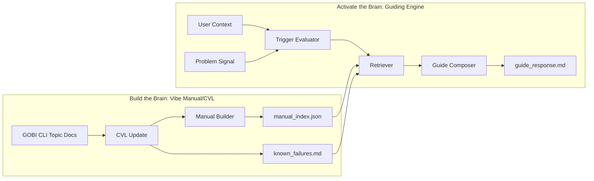
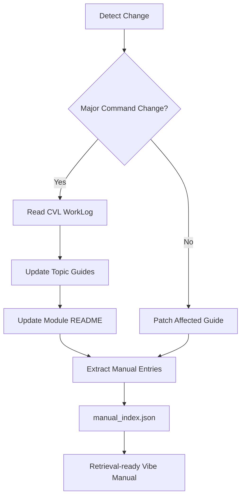
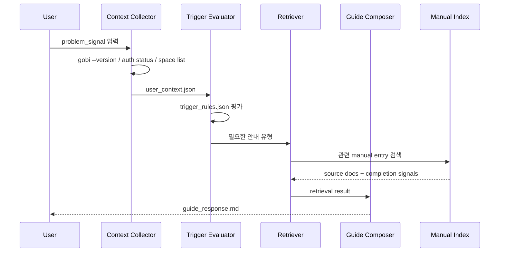
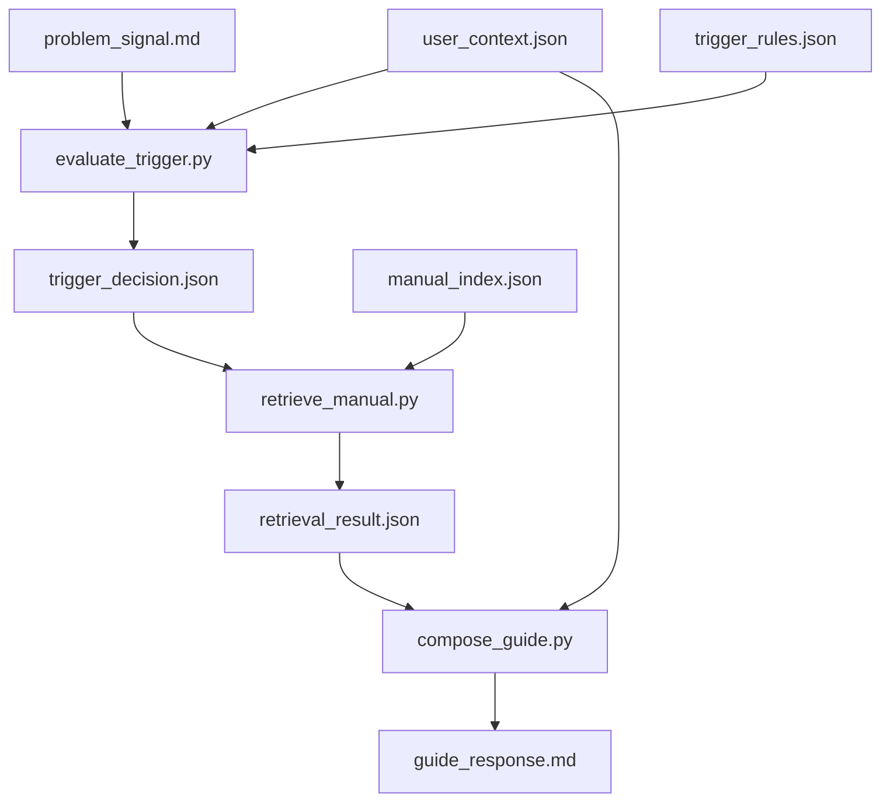

## 전체 아키텍처

Vibe Guiding은 `Build the Brain`과 `Activate the Brain`을 분리한다. Build 단계는 최신 매뉴얼을 만드는 과정이고, Activate 단계는 사용자의 현재 문제를 보고 그 매뉴얼을 실행 가능한 안내로 바꾸는 과정이다.

## Vibe Manual/CVL 흐름

이 흐름은 GOBI CLI v2.0.12처럼 대상 기술이 바뀔 때 기존 학습 산출물을 어떻게 최신 매뉴얼로 유지할지 보여준다.

핵심 산출물은 사람에게 읽히는 문서와 AI가 검색할 수 있는 index가 함께 존재하는 상태다. v2.0.12 변경에서는 `gobi init`, `BRAIN.md`, `Thread` 같은 구 표현이 남아 있으면 Retrieval이 잘못된 안내를 만들 수 있으므로 CVL 결과가 index에 반영되어야 한다.

## Guiding Engine 실행 흐름

이 흐름은 사용자가 GOBI CLI 작업에서 막혔을 때 어떤 순서로 안내가 만들어지는지 보여준다.

## 파일 흐름

## M2 설계 기준

다이어그램의 모든 흐름은 `manual_index`, `user_context`, `trigger_rules`, `guide_response`를 포함해야 한다. 이 네 파일은 M4 POC의 최소 계약이며, 이 계약이 지켜지면 이후 Desktop/Applet 시나리오도 같은 방식으로 확장할 수 있다.
