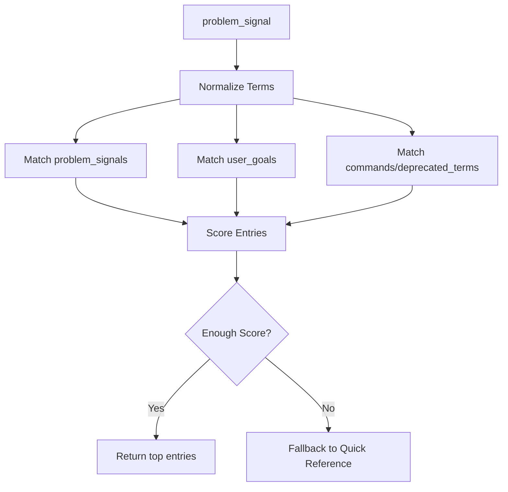

## 설계 목적

Retrieval Metadata는 Guiding Engine이 사용자의 problem signal을 적절한 Vibe Manual 조각으로 연결하기 위한 index다. M4에서는 full-text search나 vector DB 없이 파일 기반 `manual_index.json`으로 먼저 검증한다.

## `manual_index.json` 최상위 구조

```json
{
  "index_version": "0.1",
  "generated_at": "2026-05-10",
  "source_topic": "GOBI-CLI",
  "source_version": "GOBI CLI v2.0.12",
  "entries": []
}
```

## Entry 필드

| 필드 | 타입 | 필수 | 설명 |
|---|---|---|---|
| `manual_id` | string | 예 | 안정적인 id |
| `title` | string | 예 | guide response에 표시할 제목 |
| `source_path` | string | 예 | 근거 문서 경로 |
| `source_section` | string | 아니요 | 가능하면 section anchor |
| `product` | string | 예 | 예: GOBI CLI |
| `version_scope` | string | 예 | 예: v2.0.12+ |
| `guide_type` | string | 예 | install, auth, space_post, session, vault_publish 등 |
| `user_goals` | array | 예 | 사용자가 표현할 수 있는 목표 |
| `problem_signals` | array | 예 | trigger와 연결되는 문제 신호 |
| `commands` | array | 아니요 | 관련 CLI 명령어 |
| `deprecated_terms` | array | 아니요 | 구 용어와 구 명령어 |
| `replacement_terms` | object | 아니요 | 구 용어를 새 용어로 변환 |
| `completion_signal` | string | 예 | 성공 확인 기준 |
| `fallbacks` | array | 예 | retrieval 실패 또는 실행 실패 fallback |
| `priority` | number | 예 | 동일 매칭 시 우선순위 |

## 샘플 Entry

```json
{
  "manual_id": "gobi-cli-space-create-post",
  "title": "Create a Space Post with GOBI CLI",
  "source_path": "Topics/GOBI-CLI/03-Space-Thread/guides/thread-management.md",
  "source_section": "1. create-post",
  "product": "GOBI CLI",
  "version_scope": "v2.0.12+",
  "guide_type": "space_post",
  "user_goals": [
    "Space에 글을 올리고 싶다",
    "Post를 만들고 싶다",
    "Thread를 만들고 싶다"
  ],
  "problem_signals": [
    "space_post_blocked",
    "old_thread_command_used",
    "unknown_space_slug"
  ],
  "commands": [
    "gobi space list",
    "gobi space create-post",
    "gobi space get-post"
  ],
  "deprecated_terms": [
    "thread",
    "create-thread",
    "list-threads",
    "get-thread"
  ],
  "replacement_terms": {
    "thread": "post",
    "create-thread": "create-post",
    "list-threads": "list-posts",
    "get-thread": "get-post"
  },
  "completion_signal": "create-post returns a post id and get-post can retrieve it",
  "fallbacks": [
    "Run gobi space list to confirm space slug",
    "Run gobi auth status if the command returns an auth error"
  ],
  "priority": 90
}
```

## Retrieval 단계



## Scoring 기준

| 조건 | 점수 |
|---|---|
| `problem_signals` exact match | +50 |
| `commands` exact match | +30 |
| `deprecated_terms` match | +30 |
| `user_goals` semantic/keyword match | +20 |
| `version_scope` matches user CLI version | +15 |
| fallback source only | +5 |

## 최소 index 후보

M4 POC에서 최소한 다음 항목을 index에 넣는다.

| manual_id | source_path | guide_type |
|---|---|---|
| `gobi-cli-install` | `Topics/GOBI-CLI/01-Setup-Auth/concepts/installation-guide.md` | install |
| `gobi-cli-auth-status` | `Topics/GOBI-CLI/01-Setup-Auth/concepts/installation-guide.md` | auth |
| `gobi-cli-core-concepts` | `Topics/GOBI-CLI/01-Setup-Auth/concepts/core-concepts.md` | concept |
| `gobi-cli-vault-publish` | `Topics/GOBI-CLI/02-Brain-Session/guides/brain-publish-guide.md` | vault_publish |
| `gobi-cli-session-reply` | `Topics/GOBI-CLI/02-Brain-Session/guides/session-management.md` | session |
| `gobi-cli-space-create-post` | `Topics/GOBI-CLI/03-Space-Thread/guides/thread-management.md` | space_post |
| `gobi-cli-quick-reference` | `Topics/GOBI-CLI/04-Capstone/guides/quick-reference.md` | fallback |

## M4로 넘길 결정

M4에서는 이 설계를 실제 `manual_index.json` 파일로 구현한다. 첫 구현은 rule-based matching으로 충분하며, vector retrieval은 guide response 품질이 확인된 뒤 확장한다.
