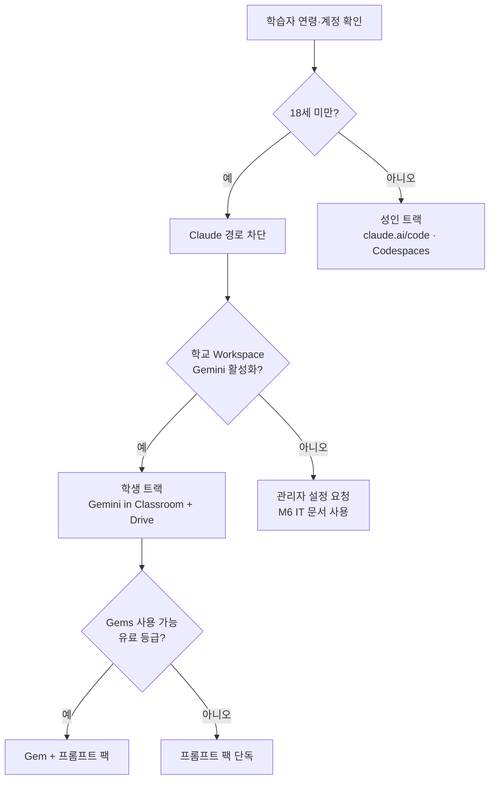

## 이 문서가 답하는 질문

K-12 학생에게 어떤 AI 도구를 쓸 수 있는가? 각 도구의 최소 연령과 교육용 예외는 어떻게 되는가?

**조사 시점**: 2026-08-16
**핵심 결론**: **Claude만 18세 미만을 전면 차단한다.** 나머지는 13세 기준이며, 교육 계정 경로가 있으면 부모 동의 없이도 열린다. 이 한 줄이 이 프로젝트의 2트랙 구조를 결정했다.

## 비교표

| 도구 | 최소 연령 | 13-17세 조건 | 교육 계정 경로 | K-12 학생 사용 |
|---|---|---|---|---|
| **Claude** (Anthropic) | **18세** | **불가 — 부모 동의로도 예외 없음** | 없음 (Claude for Education은 고등교육) | ❌ **차단** |
| **ChatGPT** (OpenAI) | 13세 | 부모 동의 필요 | ChatGPT Edu (주로 고등교육) | ⚠️ 조건부 |
| **Microsoft Copilot** | 13세 (지역별 상이) | 최소 연령 미만은 **부모 동의로도 불가** | ✅ 교육 계정으로 13세 이상 접근, **부모 동의 불필요** | ⚠️ 13세 이상 |
| **Google Gemini** | 개인 계정 18세 | — | ✅ **Workspace for Education 경로로 K-12 전 연령** (2026-08-10~, 관리자 승인 필요) | ✅ **가능** |

## 도구별 상세

### Claude — 18세 미만 전면 차단

Anthropic은 모든 Claude.ai 사용자에게 18세 이상을 요구한다. 계정 생성 시 18세 이상임을 확인해야 하며, **부모 동의가 있어도 미성년자는 사용할 수 없다.**

집행도 실제로 이뤄진다. 대화 중 사용자가 18세 미만임을 스스로 드러내면 분류기가 이를 감지해 검토 대상으로 표시하고, 미성년자로 확인된 계정은 비활성화된다. Anthropic은 더 미묘한 연령 신호를 탐지하는 분류기를 추가 개발 중이라고 밝혔다.

근거로는 어린 사용자가 AI 챗봇과의 대화에서 부정적 영향을 받을 위험이 더 크다는 점을 든다.

> **이 프로젝트에 대한 결정적 함의**: VibeLearn AI의 주력 도구인 Claude Code는 K-12 학생에게 **기술적 문제가 아니라 법적·계약적으로** 막혀 있다. Chromebook에서 브라우저로 claude.ai/code를 여는 것이 기술적으로 가능해도 소용없다. 이것이 학생 트랙을 Gemini 기반으로 다시 설계해야 하는 이유이며, 우회 가능한 성질의 제약이 아니다.

### ChatGPT — 13세, 18세 미만은 부모 동의

OpenAI의 최소 연령은 13세이며 18세 미만은 부모 동의가 필요하다. 13세라는 숫자는 발달상 적절하다는 판단이 아니라 **COPPA가 부모 동의를 더는 요구하지 않는 나이**라는 법적 경계선이다.

학교 도입 시 실질적 장벽은 연령보다 **학군 승인과 DPA**다. 개별 학생이 개인 계정으로 쓰는 것과 학군이 공식 도입하는 것은 완전히 다른 절차다.

### Microsoft Copilot — 교육 계정 경로가 명확

최소 연령은 13세이며 지역에 따라 다르다. 주목할 점은 **최소 연령 미만은 부모 동의나 계정 관리로도 접근할 수 없다**는 것이다. 이 점에서 ChatGPT(13-18세는 부모 동의로 가능)와 구조가 다르다.

교육 맥락에서는 2025년 7월 말부터 **13세 이상 학습자가 기관 교육 계정으로 접근**할 수 있다. 조건이 좋다.

- 엔터프라이즈급 데이터 보호 적용
- 학생 입력이 모델 학습에 사용되지 않음
- 기존 학교 보안 정책이 그대로 적용
- **부모·보호자 동의 불필요**

### Google Gemini — K-12 전 연령, 단 관리자 승인 필요

개인 Gmail 계정으로는 18세 이상 + 지원 국가 조건이 붙는다. 그러나 **Workspace for Education 경로는 다르다.**

2026년 8월 10일부터 Gemini in Classroom이 **K-12 및 고등교육 학생 전 연령**으로 확대됐다(웹 8/10, 모바일 8/17). 무료 Fundamentals를 포함한 모든 Workspace for Education 등급에서 작동한다.

**단, 조건이 두 겹이다.**

1. 관리자가 Gemini in Classroom, Gemini, Gemini Notebook을 이미 켜 두었어야 한다
2. 관리자는 18세 미만 학생을 별도 조직 단위(OU)로 분리해 **해당 그룹만 골라 끌 수 있다**

즉 "K-12 전 연령 지원"은 기술적 가능성이지 보장이 아니다. 실제 사용 가능 여부는 학군 관리자 설정에 달려 있다.

> **M6 IT 관리자 체크리스트 항목**: Gemini in Classroom 활성화 여부, 18세 미만 OU의 개별 차단 여부. 이 둘이 꺼져 있으면 학생 트랙 전체가 동작하지 않는다.

### Gemini Gems — 등급 제약

Gems(맞춤형 Gemini)는 Gemini Business·Enterprise·Education·Education Premium 애드온을 가진 Workspace 고객에게 제공되며, 유료 Workspace for Education 등급에는 추가 비용 없이 번들된다.

교사가 Google Classroom을 통해 학생에게 Gem을 공유하려면 관리자가 **Gemini 활성화 + Gems 공유 허용**을 모두 켜 두어야 한다. 교사는 Classroom의 수업 자료 생성 메뉴에서 "Gem (Custom version of Gemini)"을 선택해 만든다.

> **설계 결론**: 무료 Fundamentals 등급 학교에는 Gems가 없다. 따라서 **프롬프트 팩이 1차 수단이고 Gem은 있으면 편해지는 선택 계층**이어야 한다. 이미 로드맵 M5에 반영됨.

## 이 표가 만든 설계 결정

## 참조 자료

| 자료 | 유형 | 링크 |
|---|---|---|
| Claude 최소 연령 정책 | 1차 | https://support.claude.com/en/articles/13117299-minimum-age-requirement-access-restriction |
| Claude 연령 확인 (Age assurance) | 1차 | https://support.claude.com/en/articles/15171100-age-assurance-on-claude |
| Anthropic: 사용자 웰빙 보호 | 1차 | https://www.anthropic.com/news/protecting-well-being-of-users |
| Anthropic 소비자 이용약관 | 1차 | https://anthropic.com/legal/terms |
| Microsoft Copilot 연령 제한·자녀 보호 | 1차 | https://support.microsoft.com/en-us/topic/microsoft-copilot-age-limits-and-parental-controls-f79b47a6-288a-4513-8c01-afe4d16db900 |
| Gemini in Classroom 전 연령 확대 (2026-08-10) | 1차 | https://workspaceupdates.googleblog.com/2026/08/gemini-in-google-classroom-is-expanding-to-users-of-all-ages-with-contextualized-Gemini-starter-prompts-for-students.html |
| Gems 소개 (Workspace Updates) | 1차 | https://workspaceupdates.googleblog.com/2024/08/customize-gemini-with-gems.html |
| Gemini App의 Workspace 서비스 접근 제어 | 1차 | https://knowledge.workspace.google.com/admin/generative-ai/gemini-app/turn-google-apps-in-gemini-on-or-off |

> ⚠️ **미확인**: ChatGPT의 13세·부모 동의 정책은 OpenAI 이용약관 원문을 직접 대조하지 않고 복수의 2차 자료로 확인했다. Copilot의 지역별 최소 연령 차이도 구체 지역 목록은 미확인이다. **연령 정책은 변동이 잦으므로 M6 문서 작성 시점에 재확인할 것.**

## 다음 문서

- [legal-frame-cipa-coppa-ferpa.md](legal-frame-cipa-coppa-ferpa.md) — 이 연령 기준들이 나온 법적 배경
- [ai4k12-five-big-ideas.md](ai4k12-five-big-ideas.md) — 연령대별로 무엇을 가르치기로 돼 있는가 (다음 세션)
