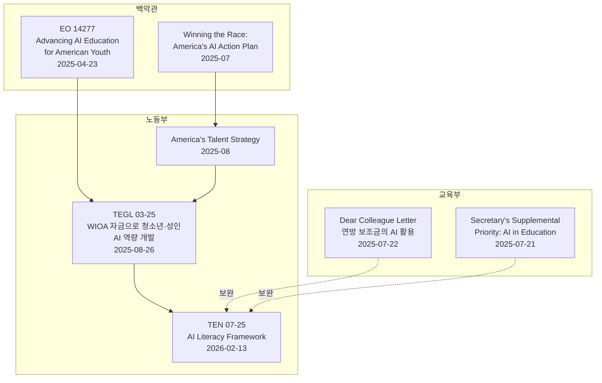

## 이 문서가 답하는 질문

미국 연방 정부가 "AI 리터러시란 무엇인가"를 어떻게 정의했는가? 그 정의를 학생·시니어·시민단체 등 서로 다른 대상에게 어떻게 공통 언어로 쓸 수 있는가?

**조사 시점**: 2026-08-16 · **출처**: 1차 원문 (Attachment I 전문 11p, TEN 본문 3p, 그래픽 1p)
**핵심 결론**: 이 프레임워크는 학교 전용이 아니라 **워크포스와 교육 시스템 양쪽**을 대상으로 하며, 수신처에 주 교육청·CTE 국장·교육감이 직접 포함된다. 학생·재직자·시니어를 하나의 축으로 놓고 교육을 설계할 때 쓸 수 있는, 현재로서 가장 권위 있는 공용 어휘다.

## 기본 정보

| 항목 | 내용 |
|---|---|
| 문서 | Training and Employment Notice (TEN) No. 07-25 |
| 발행 | 미 노동부 고용훈련청 (DOL / ETA) |
| 발행일 | 2026-02-13 |
| 서명 | Henry Mack, Ed.D. (Assistant Secretary) / Taylor Stockton (Chief Innovation Officer) |
| 법적 성격 | **자발적 가이던스(voluntary guidance)**. 신규 규제 의무 없음 |
| 구성 | TEN 본문 3p + Attachment I 프레임워크 11p + Attachment II 그래픽 1p |

**Purpose (원문)**: "To issue the U.S. Department of Labor's Artificial Intelligence (AI) Literacy Framework as a resource for program design and encourage expanded AI literacy training across the public workforce and education systems."

### 수신처 (TO) — 교육 계통이 직접 포함된다

주 워크포스 기관·행정관·연락관 / 주·지역 워크포스 위원회 위원장 및 국장 / 노동위원 / American Job Centers / 모든 ETA 수혜기관 / **커뮤니티 칼리지 및 부족 칼리지** / 주 도제 기관 / Job Corps 센터 / **주 교육청(State Educational Agencies)** / **주 CTE 국장** / **주 교육감(State Education Commissioners)**

> 프레임워크 본문도 대상을 명시한다 — "workers, employers, training providers, **teachers and faculty**, state and local agencies, and other workforce and education system stakeholders". 목표 수혜자는 "American youth, students, faculty and teachers, job seekers, and workers"다.

## 연방 정책 계보 — 이 프레임워크는 단독 문서가 아니다

핵심은 **행정명령 14277(2025-04-23) "Advancing Artificial Intelligence Education for American Youth"**가 청소년 AI 교육의 연방 앵커라는 점이다. TEN 07-25는 그 이행 사슬의 최신 고리이며, TEGL 03-25에서 제시했던 예비 구성요소를 확장한 것이다.

AI Action Plan은 DOL·ED·NSF·DOC에 **"AI 역량 개발을 관련 교육·워크포스 자금 흐름의 핵심 목표로 삼을 것"**을 권고하며, CTE·워크포스 훈련·도제 프로그램 통합을 명시한다. 또 중·고등학생 대상 조기 진로 노출 프로그램 확대도 DOL·ED·NSF 주도로 권고한다.

> **이 프로젝트에 대한 함의**: Chromebook판 VibeLearn AI를 학교에 소개할 때 "개인이 만든 도구"가 아니라 **연방 정책 방향에 부합하는 도구**로 위치시킬 수 있다. EO 14277 → AI Action Plan → TEN 07-25로 이어지는 계보를 M6 IT 관리자 문서와 M8 영상에서 인용할 것.

## AI 리터러시 정의 (원문)

> "a foundational set of competencies that enable individuals to **use and evaluate** AI technologies responsibly, with a primary focus on **generative AI**, which is increasingly central to the modern workplace."

DOL은 두 가지를 명확히 한다.

**첫째, 생성형 AI에 초점을 둔다.** AI에는 규칙 기반 시스템부터 머신러닝, 컴퓨터 비전까지 다양한 기술이 있지만, 가장 변혁적이고 널리 퍼진 응용이 생성형 AI이며 사람들이 "AI"라고 할 때 대개 이것을 가리킨다는 현실을 반영했다.

**둘째, "리터러시"는 최저선이지 숙련이 아니다.** AI가 경제 전반에 스며드는 상황에서 **모든 근로자와 학생이 가져야 할 기초 수준의 지식과 기술**을 뜻한다. AI 시스템을 관리·구축하는 등 더 높은 역량이 필요한 직무가 많다는 점은 별도로 인정한다.

> 원문은 "AI proficiency", "AI fluency" 같은 용어가 혼용되는 현실도 짚는다. 실무에서는 "AI 리터러시가 필요하다"는 말만으로 부족하며, **직무와 맥락별로 필요한 구체적 역량과 깊이를 정의해야 한다**고 명시한다. 이 지적은 대상별 교육 설계에 그대로 적용된다.

## Section 1 — 5개 기초 콘텐츠 영역 (무엇을 가르칠 것인가)

### 1. Understand AI Principles — AI 원리 이해

기술적 숙달이 아니라, 오늘날 AI 도구가 어떻게 작동하는지 이해하는 데 필요한 **어휘와 심성 모형**을 갖추는 것.

- **패턴 인식과 확률적 출력** — 데이터의 통계적 패턴으로 응답을 생성하므로 같은 입력에도 다른 출력이 나올 수 있다
- **역량과 양식(modalities)** — 텍스트 생성, 데이터 분석, 이미지 인식 등 입출력 형식별 역량
- **학습과 추론** — 학습은 대규모 데이터로 모델을 만드는 것, 추론은 실시간으로 출력을 생성하는 것
- **환각과 정확도 한계** — 자신 있게 틀린 답을 낼 수 있으므로 검증이 필수이고 과의존을 피해야 한다
- **인간의 설계와 감독** — 모든 AI 시스템은 데이터·목표·매개변수에 대한 인간의 결정을 반영한다

### 2. Explore AI Uses — 활용처 탐색

산업·직무·맥락에 따라 활용이 크게 다르므로, 탐색을 통해 **언제 어떻게 적용할지, 어디서 인간 입력이 여전히 필수인지** 판단력을 기른다.

- **생산성 도구** — 문서 초안, 발표 개요, 보고서 분석
- **정보 지원** — 질문 응답, 배경 정보 확보, 맞춤 학습 콘텐츠 생성
- **창작 보조** — 마케팅 문구·네이밍·그래픽 초안 생성 후 사람이 다듬기
- **과제별 응용** — 코드 조각 작성, 오디오 전사, 데이터 입력 자동화, 복잡한 일정 정리
- **의사결정 지원** — 추천, 위험 평가, 예측 생성

### 3. Direct AI Effectively — 효과적 지시

코딩 기술이 아니라 **프롬프트를 구성하고 정보를 제공하고 전략적으로 반복하는 심성 모형**이 필요하다.

- **맥락 제시** — 배경, 의도한 독자, 톤, 구체적 목표를 제공
- **프롬프팅 기법** — 명확한 구조, 단계별 지시, 형식·출력 지정
- **관련 입력 데이터 제공** — 언제 어떤 자료·예시를 넣어야 정확도가 오르는지
- **출력에 대한 반복** — 후속 프롬프트로 명료화·정제·재구성하는 지속적 과정으로 다루기
- **모호하거나 오해를 부르는 프롬프트 피하기** — 명료성과 단어 선택이 결과에 미치는 영향 인식

### 4. Evaluate AI Outputs — 출력 평가

**AI를 지원 도구로 쓰되 최종 권위로 삼지 않도록** 하는 역량. 사용자가 과정의 통제권을 유지하게 한다.

- **사실 정확성 검증** — 신뢰할 수 있는 출처와 교차 확인해 허위 주장·낡은 참조·날조 식별
- **완결성과 명료성 평가** — 과제를 온전히 다뤘는지, 대상에게 쓸 수 있는 형태인지
- **누락과 논리 오류 포착** — 빠진 단계, 결함 있는 논리, 잘못된 전제 식별
- **전략적 의도와의 정합** — 목표 달성, 올바른 메시지, 용도 적합성
- **인간 판단 적용** — 자신의 전문성·맥락·재량을 얹어 해석·사용·수정

### 5. Use AI Responsibly — 책임 있는 사용

- **민감 정보 보호** — 어떤 데이터를 AI에 넣으면 안 되는지, 우발적 유출을 어떻게 막는지
- **직장 정책과 규칙 준수** — 조직의 AI 사용 정책 인지 및 준수
- **오용·피해 회피** — 표절, 사칭, 위해 등 부적절한 사용을 인지하고 신고 방법 숙지
- **맥락별 위험 관리** — 과제·대상·부문에 따라 위험이 다르며 고위험 상황에서는 더 엄격히
- **책무성 유지** — AI로 만든 결정과 산출물에 대한 책임은 사용자에게 있으며, 검토 없이 최종·권위로 취급하지 않기

> **VibeLearn AI와의 정합성**: 이 5개 영역은 VibeLearn AI의 "AI 시대 평가 기준"(개념 이해 + AI에게 효과적으로 지시하는 능력 > 암기)과 사실상 같은 것을 말한다. 영역 1·2가 개념 이해, 영역 3이 지시 능력, 영역 4·5가 판단과 책임이다. **VibeLearn AI를 미국 교육 맥락에 소개할 때 이 대응 관계를 쓰면 설명 비용이 크게 줄어든다.**

## Section 2 — 7개 전달 원칙 (어떻게 가르칠 것인가)

| # | 원칙 | 한 줄 정의 (공식 그래픽) |
|---|---|---|
| 1 | **Enable Experiential Learning** | 실제 상황에서 AI 역량을 연습할 수 있는 실습 중심 경험으로 전달 |
| 2 | **Embed Learning in Context** | 기존 프로세스와 해당 산업·특성의 맥락 안에 통합 |
| 3 | **Build Complementary Human Skills** | 판단력·창의성·소통·문제해결 등 인간 역량을 AI로 증강 |
| 4 | **Address Prerequisites to AI Literacy** | 디지털 리터러시와 광대역 접근성 등 참여·성공의 장벽 해소 |
| 5 | **Create Pathways for Continued Learning** | 더 고급·전문 AI 역량과 AI 관련 직업으로 나아갈 구조적 경로 제공 |
| 6 | **Prepare Enabling Roles** | 관리자·상담사 등 학습을 지원하는 역할군을 준비시킴 |
| 7 | **Design for Agility** | AI 역량 변화에 맞춰 콘텐츠·전달을 신속히 갱신할 내장 장치 확보 |

### 원칙 4가 이 프로젝트의 존재 이유다 — 원문 상세

원문은 이렇게 말한다.

> "AI literacy efforts can only be successful if learners have the foundational tools and access needed to engage with training. For some workers, this may include **digital literacy skills, device access, or broadband connectivity**... Programs should proactively identify and address these barriers."

권장 접근 방식 5가지 중 세 가지가 이 프로젝트와 직결된다.

- **기준선 준비도 평가** — 참가자가 AI 도구를 효과적으로 쓸 디지털 친숙도가 있는지 간단한 진단으로 확인하고 장벽 식별
- **접근성 지원 옵션 고려** — 기기·광대역 격차가 있는 곳에서는 **공용 컴퓨터실, 모바일 우선 콘텐츠, 비동기 형식** 같은 실용적 해법 탐색
- **대역폭 유연성 고려** — **저대역폭 환경과 모바일 기기에 더 잘 맞는 훈련 자료**를 가능한 범위에서 고려

연방 프레임워크가 "기기 접근성을 선결 조건으로 해소하라"고 명시한 바로 그 지점에서, 현재 VibeLearn AI는 실패한다. CLI와 로컬 개발 환경을 전제하므로 학교 지급 Chromebook을 가진 학생에게는 **선결 조건이 해소되지 않은 상태**다.

즉 Chromebook판을 만드는 일은 단순 이식이 아니라 **연방 프레임워크가 명시한 원칙을 충족시키는 작업**이다. M6 IT 관리자 문서와 M8 영상에서 이 논리를 그대로 쓸 것.

원칙 1(체험 학습)은 VibeLearn AI의 실습 70-80% 원칙과 동일하고, 원칙 6(조력자 준비)은 M6에서 교사용 매뉴얼을 학생용과 별도로 만들어야 하는 근거다. 원칙 7(민첩성)은 프레임워크 자신에게도 적용되어, DOL은 이 문서를 "출발점"으로 규정하고 계속 개정하겠다고 밝혔다.

## 프레임워크 자체의 대상 구분 — `audiences/` 작업의 기반

원문 "Audience Considerations" 절이 이미 4개 대상을 나누고 각각에 "무엇부터 시작하라"를 제시한다. **M1 실습 3의 대상 확장 매핑은 이 구조를 새로 발명할 게 아니라 확장하면 된다.**

| 대상 | 원문이 제시한 출발점 |
|---|---|
| **Workers** (재직자·구직자·학생) | 현재 업무의 반복 과제(이메일 초안, 보고서 요약, 데이터 정리)를 식별하고 AI로 시도해 본다. AI 출력과 자신의 평소 방식을 비교해 어디서 시간이 절약되고 어디서 인간 감독이 특히 중요한지 관찰 |
| **Employers** | AI 도구가 등장하는 현재 워크플로를 검토하고, 직무별로 어느 수준의 AI 리터러시가 필요한지 판단. 흔한 업무 중심의 단순 실습을 장려하고 내부 지침 제공 |
| **Education and Training Providers** | 기존 커리큘럼에서 AI 리터러시를 통합할 지점을 찾고, 전공 분야 과제를 AI로 수행하는 실습 경험 제공. 지역 고용주와 협력해 지역 노동시장 수요 파악 |
| **State and Local Agencies** | 지역의 AI 도구 채택 실태를 평가하고 기존 워크숍·오리엔테이션·진로 서비스에 AI 리터러시 통합. WIOA 서비스와 연계 |

> **주의**: 원문의 4개 구분에는 **시니어와 시민단체 활동가가 별도 항목으로 없다.** Workers 안에 흡수되거나 아예 빠져 있다. 학습자(사용자)가 계획하는 대상 확장은 이 공백을 메우는 작업이며, `audiences/`에서 원문의 4개에 **시니어**와 **시민단체·비IT 배경** 2개를 추가해 6개 축으로 확장한다.

## 참조 자료

| 자료 | 유형 | 확보 상태 |
|---|---|---|
| TEN 07-25 본문 (Accessible) | 1차 | ✅ `vl_materials/sources/DOL-TEN-07-25-accessible.pdf` |
| Attachment I — AI Literacy Framework 전문 | 1차 | ✅ `vl_materials/sources/DOL-TEN-07-25-Attachment-I-Framework.pdf` |
| Attachment II — 프레임워크 그래픽 | 1차 | ✅ `vl_materials/sources/DOL-TEN-07-25-Attachment-II-graphic.pdf` (M8 영상 시각 참고용) |
| Winning the Race: America's AI Action Plan | 1차 | ✅ `vl_materials/sources/WH-Americas-AI-Action-Plan.pdf` |
| America's Talent Strategy | 1차 | ✅ `vl_materials/sources/WH-Americas-Talent-Strategy.pdf` |
| EO 14277 Advancing AI Education for American Youth (2025-04-23) | 1차 | ⬜ 미확보 — Federal Register 90(80) 17519 |
| TEGL 03-25 (2025-08-26) | 1차 | ⬜ 미확보 — dol.gov/agencies/eta/advisories/tegl-03-25 |
| ED Dear Colleague Letter (2025-07-22) | 1차 | ⬜ 미확보 — ed.gov/media/document/opepd-ai-dear-colleague-letter-7222025-110427.pdf |
| ED Secretary's Supplemental Priority (2025-07-21) | 1차 | ⬜ 미확보 — Federal Register 2025-13650 |

> **다음 세션 확보 대상**: EO 14277과 ED Dear Colleague Letter 2건. 특히 **EO 14277이 청소년 AI 교육의 연방 앵커**이므로 우선순위가 높다. Federal Register와 ed.gov는 dol.gov와 달리 차단되지 않을 가능성이 있으므로 먼저 시도한다.

## 다음 문서

- [three-layer-governance.md](three-layer-governance.md) — 이 프레임워크가 3층 구조에서 차지하는 위치
- [legal-frame-cipa-coppa-ferpa.md](legal-frame-cipa-coppa-ferpa.md) — 권고가 아니라 실제로 구속하는 법률들
