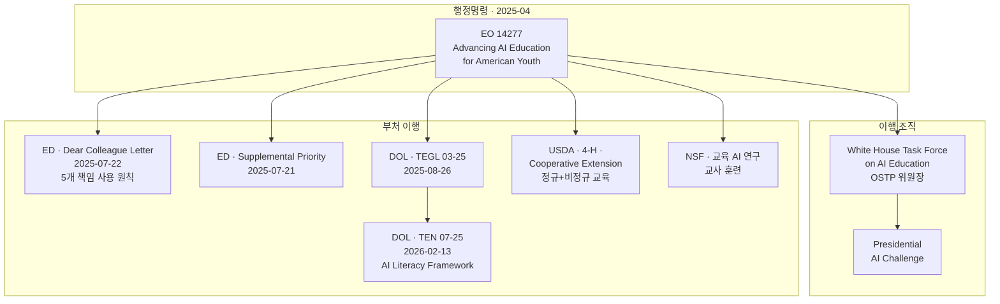

## 이 문서가 답하는 질문

미국 연방 정부가 청소년 AI 교육에 대해 무엇을 명령했는가? 그 명령이 이 프로젝트와 어떻게 연결되는가?

**조사 시점**: 2026-08-16 · **출처**: EO 14277 전문(5p, Federal Register 90 FR 17519), ED Dear Colleague Letter 전문(2p), ED Secretary's Supplemental Priority(4p)
**핵심 결론**: EO 14277은 **K-12 학생용 온라인 AI 리터러시 자료를 민관 협력으로 개발하라**고 명시적으로 지시한다. Chromebook판 VibeLearn AI는 정확히 그 범주에 속한다. 그리고 교육부의 "책임 있는 사용 원칙"에는 VibeLearn AI의 철학과 거의 같은 문장이 들어 있다.

## 1. Executive Order 14277 (2025-04-23)

**Advancing Artificial Intelligence Education for American Youth**
Federal Register Vol. 90, No. 80, p. 17519 · FR Doc. 2025-07368

### 정책 선언 (Sec. 2)

> "It is the policy of the United States to promote **AI literacy and proficiency** among Americans by promoting the appropriate integration of AI into education, providing comprehensive **AI training for educators**, and fostering **early exposure to AI concepts** and technology to develop an AI-ready workforce and the next generation of American AI innovators."

배경(Sec. 1)에서 주목할 문장이 둘 있다. 첫째, "Early learning and exposure to AI concepts not only **demystifies** this powerful technology but also sparks curiosity and creativity". 둘째, K-12가 핵심이지만 **"our Nation must also make resources available for lifelong learners"** — 평생 학습자를 명시적으로 포함한다.

### 조직과 행사

**White House Task Force on AI Education** (Sec. 4) — OSTP 국장이 위원장. 구성: 농무·노동·에너지·교육 장관, NSF 국장, 국내정책보좌관, AI·암호화폐 특별보좌관, 정책보좌관.

**Presidential AI Challenge** (Sec. 5) — 90일 내 계획 수립, 계획 제출 후 12개월 내 개최. **다중 연령대**, 지역별 경쟁, 다양한 주제로 구성해 학생과 교육자의 AI 성취를 조명한다.

### Sec. 6 — 이 프로젝트가 속하는 조항

> "agencies represented on the Task Force shall seek to establish **public-private partnerships** with leading AI industry organizations, academic institutions, **nonprofit entities, and other organizations with expertise in AI and computer science education** to collaboratively develop **online resources focused on teaching K–12 students foundational AI literacy and critical thinking skills**."

자료는 첫 민관 협력 발표 후 **180일 내에 K-12 수업에서 쓸 수 있는 상태**가 되어야 한다.

> **함의**: "K-12 학생에게 기초 AI 리터러시와 비판적 사고를 가르치는 온라인 자료"가 EO의 명시적 목표다. Chromebook판 VibeLearn AI는 정확히 이 정의에 부합한다. 개인·비영리가 만든 무료 자료도 "other organizations with expertise"에 포함된다. **M6 IT 관리자 문서와 M8 영상에서 이 조항을 직접 인용할 것.**

같은 조 (c)항이 교육부 장관에게 **90일 내** 연방 보조금(formula·discretionary) 사용 지침 발행을 지시했고, 그 결과물이 아래의 Dear Colleague Letter다.

### Sec. 7 — 교육자 훈련, 그리고 뜻밖의 채널

교육부는 ESEA와 고등교육법 Title II 재량 보조금에서 AI를 우선순위로 두어야 한다. 목적에는 행정 업무 시간 절감, 교사 훈련·평가 개선, **모든 교과에 AI 기초를 통합할 수 있도록 전 교육자 연수 제공**이 포함된다.

NSF는 AI 교육 연구를 우선하고 교사 훈련 기회를 만든다.

**(c) 농무부 장관**은 **4-H와 Cooperative Extension System**을 통해 **정규 및 비정규 교육(formal and non-formal education)**에서 AI 활용 연구·확장·교육을 우선해야 한다.

> **학습자의 확장 계획에 직결**: 4-H와 Cooperative Extension은 미국에서 농촌·지역사회·성인·시니어 교육의 전통적 통로다. EO가 이 채널을 **비정규 교육까지 포함해** 명시했다는 것은, 학생 밖 대상(시니어, 지역 활동가, 비IT 배경 성인)에게 AI 교육을 하려는 계획에 **연방 차원의 근거와 협력 상대**가 이미 존재한다는 뜻이다. `audiences/` 작업에서 이 채널을 진입점으로 다룰 것.

### Sec. 8 — 고등학생 AI 과정과 자격증

노동부 장관은 AI 관련 Registered Apprenticeship 확대, WIOA 청소년 기금으로 AI 역량 개발 장려, 주지사 set-aside 활용 명확화를 해야 한다. 특히 **고등학생이 AI 과정과 자격 프로그램을 이수할 기회**를 만들고, 고교 재학 중 **이중 등록(dual enrollment)**으로 대학 학점과 산업 인증 AI 자격을 동시에 취득하도록 학군과의 파트너십을 권장한다.

### 법적 성격 (Sec. 9)

이 명령은 **어떤 개인에게도 법적으로 집행 가능한 권리나 이익을 창설하지 않는다.** 적용 법률과 예산 범위 내에서 시행된다. 즉 방향 제시이지 학군에 대한 강제가 아니다 — 3층 구조에서 1층이 갖는 성격 그대로다.

## 2. ED Dear Colleague Letter (2025-07-22)

교육부 장관 Linda E. McMahon 서명. EO 14277 Sec. 6(c)의 이행이다.

### 연방 교육 자금을 AI에 쓸 수 있는 3개 범주

| 범주 | 허용 용도 |
|---|---|
| **AI 기반 고품질 교육 자료** | 실시간으로 학습자 요구에 적응하는 도구 개발·조달, 개인화 학습 자료 접근 확대, **교육자·제공자·가정이 AI를 효과적·책임 있게 쓰도록 훈련** |
| **AI 강화 고효과 튜터링** | 지능형 튜터링 시스템, 인간 튜터 + AI 플랫폼 하이브리드, 진단·일정 도구 |
| **진로·대학 경로 탐색·상담** | 진로 탐색 플랫폼, 가상 상담(수강 계획·학자금·전환), 추가 지원이 필요한 학생 식별 예측 모델 |

### 책임 있는 사용 5원칙 — VibeLearn AI와의 정렬

| 원칙 | 원문 요지 |
|---|---|
| **Educator-led** | AI는 교사·제공자·튜터·상담사·교육 리더를 **지원**해야 한다 |
| **Ethical** | K-12에서 특히, 교육자는 학생이 **AI 출력의 타당성을 평가**하고, 소셜미디어 맥락에서 적절한 사용을 이해하며, **"AI로부터만 배우는 것이 아니라 AI와 함께 배우도록"** 돕고, 자유 사회의 기여 구성원이 되도록 해야 한다 |
| **Accessible** | 장애가 있는 아동·교육자·가족을 포함해 디지털 접근성 편의가 필요한 이들에게 접근 가능해야 한다 |
| **Transparent and explainable** | 이해관계자, **특히 학부모**가 시스템 작동 방식을 이해하고 도입 결정에 실질적으로 참여해야 한다 |
| **Data-protective** | FERPA를 포함한 연방 프라이버시법 준수 |

> ### ⭐ 결정적 인용
>
> **"to learn with – rather than exclusively from – AI"**
>
> 이 문장은 VibeLearn AI의 핵심 철학 "AI와 함께 배우고, 배운 것을 구조화하여, 다음 학습자를 위한 길을 만든다"와 사실상 같은 말이다. 미국 교육부가 K-12 AI 활용의 윤리 원칙으로 명문화한 문장이 우리 방법론의 슬로건과 겹친다.
>
> **M6 교사용·IT용 매뉴얼의 첫 장, M8 영상의 도입부에 이 인용을 배치할 것.** VibeLearn AI가 미국 교육 현장에 왜 맞는지를 설명하는 데 이보다 강한 근거는 없다.

'Transparent' 원칙도 실무에 반영된다 — 학부모가 도입 결정에 참여해야 한다는 것은 M6에 **가정용 안내 문서**가 필요하다는 근거를 하나 더 더한다(Oklahoma 부록 D~F와 같은 방향).

## 3. ED Secretary's Supplemental Priority (2025-07-21)

**Advancing Artificial Intelligence in Education** — 재량 보조금 프로그램에 적용할 우선순위. 제안 단계(공고·의견수렴) 문서이며, 우선순위 전체 또는 일부 구성요소만 특정 공모에 적용할 수 있다.

두 갈래로 구성된다.

**(a) AI 리터러시 구축과 AI·컴퓨터과학 교육 확대**
- 교수·학습 실천 개선, **AI 생성 허위정보·오정보를 탐지하는 방법** 포함
- K-12에서 AI·컴퓨터과학 교육 제공 확대
- 학업 과정의 일부로 AI·컴퓨터과학 과목 확대
- 고등교육 기관의 **예비·현직 교사 양성 프로그램에 AI·컴퓨터과학 내장**
- 전문성 개발 제공
- AI를 교육에 통합하는 적절한 방법의 **근거 축적**

**(b) 교육에서 AI의 적절한 활용 확대**
- K-12·고등교육 수업, 보충 학습 지원 (영재, 학년 수준 미달 학생 포함)
- **장애 아동·학생과 그 가족**을 위한 조기 개입 및 수업·서비스
- 개인화 학습, 차별화 수업 지원 (가상 조교, 튜터링, 데이터 분석)
- 교사 양성 과정에서의 AI 활용 자원·지원

문서는 데이터 분석과 계산적 사고를 통합하면 학생이 AI 시스템 작동 방식을 더 깊이 이해할 수 있고, 적절한 경우 컴퓨터과학을 접목하면 **의미 있는 AI 리터러시 구축 노력을 강화**한다고 밝힌다.

## 연방 층 전체 계보 (최종)

## 후속 모듈 인계

| 대상 | 내용 |
|---|---|
| **M6** | EO 14277 Sec. 6(a) 인용 — "K-12 온라인 AI 리터러시 자료"가 연방 목표임을 IT 문서 서두에 명시 |
| **M6** | ED DCL 5원칙에 항목별로 대응하는 표 작성 (Educator-led / Ethical / Accessible / Transparent / Data-protective) |
| **M6** | 'Transparent' 원칙 근거로 **가정용 안내 문서** 포함 확정 |
| **M8** | **"learn with – rather than exclusively from – AI"**를 영상 도입부 인용으로 |
| **M8** | 연방 정책 계보 Mermaid를 영상 슬라이드로 활용 |
| **audiences/** | **USDA 4-H · Cooperative Extension**을 시니어·지역사회 대상 AI 교육의 연방 채널로 조사 |
| **audiences/** | EO의 "lifelong learners" 문구를 성인·시니어 트랙의 정책 근거로 |
| 향후 | Presidential AI Challenge 참가·연계 가능성 검토 (다중 연령대, 지역별) |

## 참조 자료

| 자료 | 유형 | 확보 |
|---|---|---|
| EO 14277 전문 (Federal Register 90 FR 17519) | 1차 | ✅ `sources/EO-14277-advancing-AI-education-youth.pdf` |
| ED Dear Colleague Letter (2025-07-22) | 1차 | ✅ `sources/ED-dear-colleague-letter-AI-20250722.pdf` |
| ED Secretary's Supplemental Priority (2025-07-21) | 1차 | ✅ `sources/ED-secretary-supplemental-priority-AI.pdf` |
| DOL TEGL 03-25 (2025-08-26) | 1차 | ⬜ dol.gov 403 차단 |

> ⚠️ **미확보**: TEGL 03-25는 dol.gov 차단으로 확보하지 못했다. 다만 TEN 07-25가 "TEGL 03-25에서 제시한 예비 구성요소를 확장한 것"이라고 밝히고 있어 **내용상 상위 집합을 이미 확보한 상태**다. 우선순위를 낮춘다.
>
> ⚠️ ED Supplemental Priority는 **제안(proposed) 단계** 문서다. 최종 확정본이 나왔는지 인용 전 확인할 것.

## 다음 문서

- [dol-ai-literacy-framework.md](dol-ai-literacy-framework.md) — 이 사슬의 최신 고리인 DOL 프레임워크 상세
- [three-layer-governance.md](three-layer-governance.md) — 연방 층이 주·학군과 맺는 관계
