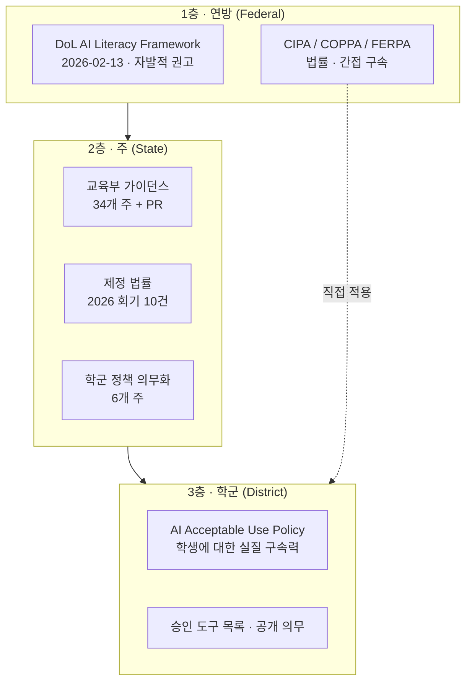

## 이 문서가 답하는 질문

미국 학생이 학교에서 AI를 쓸 때, 그 규칙은 누가 만드는가? 어느 층이 실제로 학생을 구속하는가?

**조사 시점**: 2026-08-16
**핵심 결론**: 실제 구속력은 거의 전부 **학군(district)** 층에 있다. 연방은 권고, 주는 대개 가이던스이며, 학생이 실제로 부딪히는 벽은 학군 AUP다.

## 전체 구조

## 1층 · 연방 — 권고이지 규칙이 아니다

미국에는 K-12의 AI 사용을 직접 규율하는 연방 법률이 없다. 연방이 하는 일은 두 가지로 나뉜다.

**첫째, 행정명령에서 시작해 부처 가이던스로 내려오는 자발적 정책 사슬.**

| 문서 | 발행 | 성격 |
|---|---|---|
| **EO 14277** Advancing AI Education for American Youth | 2025-04-23 | 행정명령 — 청소년 AI 교육의 연방 앵커 |
| Winning the Race: America's AI Action Plan | 2025-07 | 백악관 전략. DOL·ED·NSF·DOC에 AI 역량을 교육·워크포스 자금의 핵심 목표로 삼도록 권고 |
| ED Dear Colleague Letter | 2025-07-22 | 교육부 — 연방 보조금의 AI 활용 지침 |
| ED Secretary's Supplemental Priority | 2025-07-21 | 교육부 — AI 교육 우선순위 |
| America's Talent Strategy | 2025-08 | 노동부 전략 |
| **TEGL 03-25** | 2025-08-26 | 노동부 — WIOA 자금으로 청소년·성인 AI 역량 개발 |
| **TEN 07-25** AI Literacy Framework | 2026-02-13 | 노동부 — 5개 콘텐츠 영역 + 7개 전달 원칙 |

이 사슬 전체가 **구속력이 없다**. EO 14277 Sec. 9는 "어떤 개인에게도 법적으로 집행 가능한 권리나 이익을 창설하지 않는다"고 명시하고, TEN 07-25도 신규 규제 의무가 없음을 밝힌다. 강제 대신 **자금 흐름(WIOA, 연방 보조금)과 우선순위 부여**로 영향력을 행사한다.

다만 방향은 분명하다. EO 14277은 **K-12 학생용 온라인 AI 리터러시 자료를 민관 협력으로 개발**하라고 지시했고, TEN 07-25의 수신처에는 주 교육청·주 CTE 국장·주 교육감·커뮤니티 칼리지가 직접 포함된다.

상세는 [federal-ai-education-mandate.md](federal-ai-education-mandate.md)(EO 14277 + 교육부 조치)와 [dol-ai-literacy-framework.md](dol-ai-literacy-framework.md)(노동부 프레임워크) 참조.

**둘째, 기존 법률의 간접 적용.** CIPA·COPPA·FERPA는 AI를 겨냥해 만들어진 법이 아니지만 AI 도구 도입에 실질적 제약을 만든다. 특히 CIPA는 E-Rate 자금을 받는 학교에 필터링·모니터링 의무를 지우는데, 이것이 Chromebook 관리 스택의 법적 뿌리다. 상세는 [legal-frame-cipa-coppa-ferpa.md](legal-frame-cipa-coppa-ferpa.md) 참조.

> **오해하기 쉬운 점 1**: "연방 프레임워크가 나왔으니 이제 표준이 생겼다"고 읽으면 안 된다. 프로그램 설계를 돕는 참고 자료이며, 따르지 않아도 제재가 없다.
>
> **오해하기 쉬운 점 2**: 반대로 "노동부 문서니까 학교와 무관하다"고 읽어도 안 된다. 수신처와 목표 수혜자에 학생·교사·주 교육청이 명시되어 있다. 자금 흐름(WIOA, 연방 보조금)을 통해 실질적 영향력을 행사한다.

## 2층 · 주 — 세는 기준에 따라 숫자가 달라진다

주 층을 조사할 때 가장 먼저 부딪히는 문제는 **"몇 개 주가 AI 정책을 갖고 있나"에 대한 답이 출처마다 다르다**는 것이다. 서로 다른 것을 세고 있기 때문이다.

| 세는 대상 | 숫자 | 출처 | 기준일 |
|---|---|---|---|
| 교육부 공식 **가이던스** 발행 | 34개 주 + Puerto Rico | AI for Education 트래커 | 2025-10-28 |
| 2026 회기 **법안 발의** | 27개 주 / 77건 | FutureEd | 2026-07-13 |
| 2026 회기 **법률 제정** | 10건 | FutureEd | 2026-07-13 |
| 학군에 **AI 정책 채택 의무화** | 6개 주 | K-12 Dive | 2026 |

가장 실무적으로 중요한 것은 마지막 줄이다. **가이던스는 권고지만, 학군에 정책 채택을 의무화한 주에서는 학군 AUP의 존재 자체가 법적 요구사항이 된다.**

**학군 정책을 의무화한 6개 주**

| 주 | 근거 | 특징 |
|---|---|---|
| Tennessee | Public Chapter 550 (2024) | 최초 사례 |
| Ohio | (선행 입법) | — |
| Idaho | S1227 | 주 교육부 가이던스 개발 의무 |
| Maryland | SB0720 | 학군에 AI 조정관(coordinator) 지정 의무 |
| Oklahoma | SB1734 | **AI를 채점·징계 등 고위험 결정에 주 용도로 쓰는 것 금지**, 사용 중인 AI 도구와 수집 학생 데이터를 가정에 연 1회 공개 의무 |
| Virginia | SB394 | 주 교육부 가이던스 + 교사 연수 |

그 밖에 주목할 제정 사례로 California A.B. 1159(학생 데이터를 상업용 AI 모델 학습에 쓰는 것 제한), Oregon S.B. 1546(미성년자 보호 설계 요구, 과도·강박적 사용 방지 장치 포함), Washington H.B. 2225(유해 AI 행동 보고 의무), Utah(AI 리터러시를 중학교 학업 표준에 편입)가 있다.

> ⚠️ **자료 노후 주의**: 34개 주 가이던스 숫자의 기준일은 2025-10-28로 조사 시점 기준 약 10개월 전이다. 2026 회기에 10건이 추가 제정됐으므로 실제 숫자는 더 클 가능성이 높다. 인용 시 반드시 기준일을 함께 표기할 것.

**주 층의 알려진 공백** (ExcelinEd 지적): 주가 학군에 정책 채택을 요구하면서도 **평가 프레임워크나 중앙 도구 목록을 제공하지 않아** 검증 부담이 학군에 전가된다. 또 대부분의 입법이 벤더에게 감사 가능한 기록, 출력 생성 방식 공개, 배포 전 편향 평가를 요구하지 않는다.

## 3층 · 학군 — 여기가 진짜 벽이다

학생이 실제로 부딪히는 것은 학군 AI Acceptable Use Policy다. 관찰되는 공통 패턴은 세 가지다.

**1. 승인 도구 목록(allowlist) 방식.** 학군이 사전 승인한 도구만 쓸 수 있다. 예컨대 Manchester School District는 SchoolAI, Khan Academy Khanmigo, Canva 세 가지만 지정했다. 목록에 없는 도구는 기본적으로 금지다.

> **이 프로젝트에 대한 함의**: Chromebook판 VibeLearn AI가 아무리 잘 만들어져도, 학군 승인 목록에 오르지 못하면 학생은 쓸 수 없다. M6의 IT 관리자용 문서가 "안내문"이 아니라 "승인 심사 자료"여야 하는 이유다.

**2. 공개(disclosure)와 인용 의무.** AI 사용을 밝히지 않고 결과물을 제출하면 학업 정직성 위반으로 처리된다. 단순 금지가 아니라 **단계별 허용 + 단계별 공개 의무**로 가는 것이 2026년의 흐름이다.

Oklahoma 주 모델 정책의 **Acceptable Use Rating Scale**이 대표적이다. 원문 기준 5단계다.

| 레벨 | 사용 수준 | 학생 의무 |
|---|---|---|
| Level 0 | No AI Use | 공개 불필요 |
| Level 1 | Idea Generation Only | 공개 + **AI 대화 링크** |
| Level 2 | Editing Only | 공개 + **AI 대화 링크** |
| Level 3 | Specific Task with Teacher Oversight | 인용 + **링크** |
| Level 4 | Full AI Use with Reflection | 인용 + **링크** |

> **이 프로젝트에 대한 함의**: Level 1부터 **AI 대화 자체의 링크 제출**을 요구한다. "AI를 썼다"는 선언이 아니라 교사가 대화를 열람할 수 있어야 한다는 뜻이다. 따라서 WorkLog의 AI 표기 필드는 **레벨(0~4) + 대화 링크** 두 항목이어야 하고, 학생 트랙의 AI 도구는 대화 공유 링크를 만들 수 있어야 한다. M4에서 Gemini의 대화 공유가 학교 계정에서 작동하는지 실측할 것.

학군 정책은 사용 규칙만이 아니라 도구 평가 루브릭·위험 등급·부모 동의 절차·공개 도구 목록까지 포함하는 완결된 체계다. 전체 해부는 [district-policy-anatomy.md](district-policy-anatomy.md) 참조.

**3. 집행의 현실적 한계.** Manchester 학군 관계자는 AI 오용 탐지가 어렵다고 인정했다. 탐지 도구의 신뢰도가 낮고, 학생이 학교 통제 밖의 개인 기기를 쓸 수 있기 때문이다. 즉 정책은 **탐지가 아니라 규범 형성과 절차 설계**에 의존한다.

## 판정 절차 — 어느 층 소관인가

새로운 규칙이나 제약을 만났을 때 다음 순서로 판정한다.

1. **법률 위반 가능성이 있나?** → 1층. CIPA·COPPA·FERPA 중 무엇이 걸리는지 확인. 우회 불가.
2. **주 법률이 요구하나?** → 2층. 해당 주가 학군 정책 의무화 6개 주에 속하는지, 데이터·연령 관련 제정법이 있는지 확인.
3. **그 외 전부** → 3층. 학군 AUP를 직접 확인해야 한다. 주 가이던스는 참고일 뿐 답이 아니다.

특정 학군의 정책을 확인하는 실무 절차는 [../guides/how-to-check-district-policy.md](../guides/how-to-check-district-policy.md) 참조.

## 참조 자료

| 자료 | 유형 | 링크 |
|---|---|---|
| DOL 보도자료 (2026-02-13) | 1차 | https://www.dol.gov/newsroom/releases/eta/eta20260213 |
| DOL TEN 07-25 원문 | 1차 | https://www.dol.gov/agencies/eta/advisories/ten-07-25 |
| State AI Guidance 트래커 (34개 주) | 취합 | https://www.aiforeducation.io/ai-resources/state-ai-guidance |
| FutureEd 2026 입법 트래커 | 취합 | https://www.future-ed.org/legislative-tracker-2026-state-ai-in-education-bills/ |
| ExcelinEd 2026 주 정책 분석 | 분석 | https://excelined.org/2026/05/26/state-k-12-ai-policy-in-2026-milestones/ |
| K-12 Dive: 학군 정책 의무화 4개 주 추가 | 보도 | https://www.k12dive.com/news/4-more-states-require-districts-to-adopt-ai-policies/824749/ |
| Oklahoma 모델 정책 (PDF) | 1차 | https://oklahoma.gov/content/dam/ok/en/osde/ai-and-digital-learning/Model%20Policy%20Artificial%20Intelligence%20AI%20Use%20in%20Schools.docx.pdf |
| Manchester 학군 정책 개정 보도 | 보도 | https://www.govtech.com/education/k-12/manchester-schools-revise-ai-policy-for-ethics-transparency |

> ✅ **1차 출처 확보 완료 (2026-08-16 갱신)**: TEN 07-25 본문·Attachment I 전문·그래픽, Oklahoma 모델 정책 전문(부록 포함), AI Action Plan, America's Talent Strategy를 모두 `vl_materials/sources/`에 확보하고 원문 대조를 마쳤다. 이전 판의 "35개 이상 주" 표현과 Acceptable Use Rating Scale 3단계 서술은 원문 기준으로 정정했다.
>
> ✅ **연방 층 1차 출처 확보 완료**: EO 14277 전문, ED Dear Colleague Letter, ED Secretary's Supplemental Priority를 추가 확보해 총 11건이 `vl_materials/sources/`에 있다. 연방 층 서술은 전부 원문 대조를 마쳤다.
>
> ⚠️ **남은 미확보 2건**: ① **FCC CIPA** 페이지 — fcc.gov 403 차단. [legal-frame-cipa-coppa-ferpa.md](legal-frame-cipa-coppa-ferpa.md)의 CIPA 4개 요소는 원문 대조 전이다. ② **TEGL 03-25** — dol.gov 403 차단이나, TEN 07-25가 이를 확장한 문서임을 밝히고 있어 내용상 상위 집합을 이미 확보했다. 우선순위 낮음.
