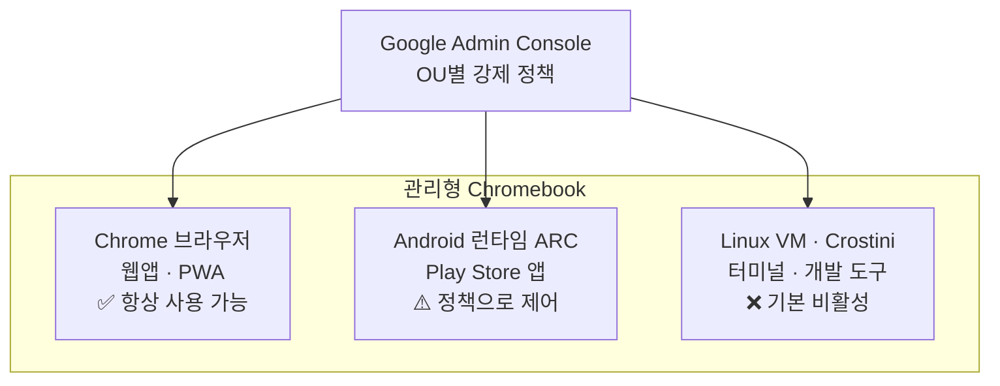

## 이 문서가 답하는 질문

ChromeOS에서 코드는 어디에서 실행되는가? 관리 정책은 각 실행 경로를 어떻게 끄는가?

**조사 시점**: 2026-08-16
**핵심 결론**: ChromeOS는 3개 런타임을 갖지만, 관리형 기기에서 **개발 도구를 돌릴 수 있는 두 경로(Linux VM, Android)는 기본적으로 닫혀 있다.** 특히 Linux는 관리자가 "끈" 것이 아니라 **관리자가 켜지 않으면 애초에 안 되는** 구조다.

## 3개 런타임

| 런타임 | 무엇을 실행하나 | 관리형 기기 기본 상태 |
|---|---|---|
| **Chrome 브라우저** | 웹앱, PWA, 확장 프로그램 | 사용 가능 (단 URL 필터링과 확장 allowlist 적용) |
| **Android (ARC)** | Play Store 앱 | 정책으로 제어. 사이드로드는 별도 정책 |
| **Linux (Crostini)** | 터미널, git, Node, Python, 데스크톱 IDE | **기본 비활성** |

## Linux가 닫혀 있는 구조 — 정확한 메커니즘

여기가 가장 오해가 많은 지점이다. 흔히 "관리자가 Linux를 껐다"고 설명하지만, 실제 구조는 다르다.

**`VirtualMachinesAllowed` 정책의 기본값이 관리형 기기에서는 "실행 불가"다.**

> "When this policy is not set on a managed device, the device can't run virtual machines."
> — Chrome Enterprise 정책 문서

즉 관리자가 아무것도 하지 않아도 Linux는 안 된다. **켜려면 능동적 조치가 필요하다.** 이 차이가 실무적으로 중요하다 — "왜 껐나요"라고 물으면 안 되고 "켜 주실 수 있나요"라고 물어야 한다. 대부분의 학군은 의도적으로 차단한 게 아니라 **기본값을 그대로 둔 상태**다.

**Crostini를 쓰려면 정책 여러 개가 동시에 켜져야 한다.**

| 정책 | 역할 |
|---|---|
| `VirtualMachinesAllowed` | 기기가 VM을 돌릴 수 있는가 (기기 수준) |
| `CrostiniAllowed` | 사용자가 Crostini를 쓸 수 있는가 (사용자 수준) |
| `DeviceUnaffiliatedCrostiniAllowed` | **비제휴(unaffiliated) 사용자**도 쓸 수 있는가 |

앞의 둘은 **둘 다 Enabled여야** Crostini가 동작한다. 세 번째는 기기를 관리하는 조직과 다른 도메인 계정으로 로그인한 사용자(비제휴)에게 적용되며, 이 경우 셋 다 켜져야 한다.

> **학교 환경의 함의**: 학생 계정이 기기 관리 조직과 같은 도메인이면 제휴(affiliated) 사용자다. 대개 그렇다. 따라서 앞의 두 정책이 관건이다. 다만 관리자 입장에서는 **정책 3개를 이해하고 조합해야 하는 일**이라 "그냥 켜주세요"가 간단한 요청이 아니다.

## 확장 프로그램 — allowlist 방식

관리자는 Chrome Web Store를 **"Block all apps, admin manages allowlist"**로 설정할 수 있다. 정책 수준에서는 `ExtensionInstallBlocklist`에 `*`를 넣으면 전체 차단이 되고, `ExtensionInstallAllowlist`에 명시된 것만 설치 가능하다.

우선순위 규칙이 둘 있다.

- **`ExtensionInstallForcelist`가 blocklist보다 우선한다.** 강제 설치된 확장은 차단 목록에 있어도 설치된다
- **강제 설치된 항목은 사용자가 제거할 수 없다**

> **함의**: 학생이 Claude Code나 임의의 개발 도구 확장을 설치할 방법은 없다. 반대로, 학군이 특정 확장을 채택하기로 하면 강제 설치로 전체 배포가 가능하다. **allowlist 등재가 유일한 경로**다.

## 기기 정책의 적용 범위 — 로그인 계정과 무관하다

Google 문서가 명시하는 중요한 점이다.

> "Device-level policies apply for anyone who uses the device, even if they sign in as a guest or with a personal Gmail account."

**개인 Gmail로 로그인해도 기기 정책은 그대로 적용된다.** 학생이 개인 계정으로 우회하는 시나리오는 성립하지 않는다. 다만 이 경우 비제휴 사용자가 되어 오히려 제약이 늘어날 수 있다.

## 관리자가 제어하는 것들 (전체 범위)

Google Admin Console의 ChromeOS 기기 정책 범주다. 이 목록 자체가 "무엇이 통제 가능한가"를 보여준다.

| 범주 | 주요 항목 |
|---|---|
| 등록·접근 | 강제 재등록, powerwash 제어, 확인된 접근 |
| 로그인 | 게스트 모드, 로그인 사용자 제한, 도메인 자동완성, SAML SSO |
| 업데이트 | 자동 업데이트, 버전 고정, 릴리스 채널, 롤아웃 일정 |
| 키오스크 | 관리형 게스트 세션, URL 차단, 가상 키보드, 전원 관리 |
| 화면·전원 | 해상도, 배율, 절전·종료, 배터리 충전 최적화, 예약 재부팅 |
| **보고·모니터링** | OS 정보, 하드웨어 정보, 기기 원격 측정, **사용자 활동**, 시스템 로그 |
| 기타 | Bluetooth, **USB 기기 접근**, **Linux VM**, **Android 앱 사이드로드**, 시간대, 데이터 로밍 |

> **M2 Q4(CIPA 최소선 vs 현장 실태)와의 연결**: 이 목록에 **"사용자 활동 보고"**가 이미 들어 있다. Admin Console 자체가 CIPA가 요구하지 않는 수준의 가시성을 제공한다는 뜻이다. GoGuardian 같은 별도 제품이 어디까지 더 하는지는 [filtering-monitoring-vendors.md](filtering-monitoring-vendors.md)에서 다룬다.

## 참조 자료

| 자료 | 유형 | 링크 |
|---|---|---|
| Set ChromeOS device policies | 1차 | https://support.google.com/chrome/a/answer/1375678 |
| Overview: Managing ChromeOS device policies | 1차 | https://support.google.com/chrome/a/answer/1375694 |
| VirtualMachinesAllowed | 1차 | https://chromeenterprise.google/policies/virtual-machines-allowed/ |
| CrostiniAllowed | 1차 | https://chromeenterprise.google/policies/crostini-allowed/ |
| DeviceUnaffiliatedCrostiniAllowed | 1차 | https://chromeenterprise.google/policies/device-unaffiliated-crostini-allowed/ |
| Allow or block apps and extensions | 1차 | https://support.google.com/chrome/a/answer/6177431 |
| ExtensionInstallBlocklist / Allowlist / Forcelist | 1차 | https://chromeenterprise.google/policies/ |

> ⚠️ **확인 방식**: `chromeenterprise.google/policies/` 정책 페이지들은 JavaScript로 렌더링되어 직접 열람에 실패했고, `admx.help` 미러는 조사 시점에 다운(HTTP 522)이었다. 정책 기본값과 상호 의존 관계는 **정책 원문을 인용한 검색 결과**로 확인했다. 문구는 원문 인용이나 **페이지 직접 대조는 미완료**다. M6 IT 문서 작성 전 재확인할 것.

## 다음 문서

- [managed-device-capability-matrix.md](managed-device-capability-matrix.md) — 이 구조가 만드는 실제 가부 판정표
