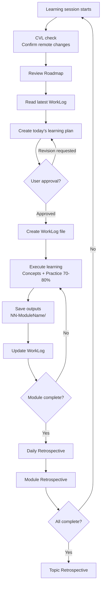

# VibeLearn AI — 4-Phase Workflow Diagram
> **[<- Korean Version](workflow-diagram.md)**


**Created**: 2026-02-26
**Module**: M1 - System Analysis & Concept Definition

---

## Overall Workflow Overview

VibeLearn AI is a cyclical learning system composed of 4 Phases.

```
New topic discovered
      │
      ▼
┌─────────────────────────────────────────────────────────┐
│  Phase 1: Topic Setup (once per Topic)                   │
│                                                          │
│  ① "I want to learn ___" → Conversation with AI          │
│  ② Write topic_info.md (gather Topic information)        │
│  ③ Auto-generate folder structure                        │
│  ④ Prepare vl_prompts/ files (roadmap + daily_learning)  │
└─────────────────────┬────────────────────────────────────┘
                      │
                      ▼
┌─────────────────────────────────────────────────────────┐
│  Phase 2: Roadmap Generation (once per Topic)            │
│                                                          │
│  ① Pass roadmap_prompt.md → to AI                        │
│  ② Review appropriateness of learning period             │
│  ③ Generate module-by-module Roadmap (M1, M2, ... MN)   │
│  ④ Save to vl_roadmap/YYYYMMDD_RoadMap_{Topic}.md        │
└─────────────────────┬────────────────────────────────────┘
                      │
                      ▼
┌─────────────────────────────────────────────────────────┐
│  Phase 3: Daily Learning (repeating cycle)  ◄────┐       │
│                                              │    │       │
│  ① Read Roadmap + latest WorkLog             │    │       │
│  ② Create today's learning plan (await approval)  │       │
│  ③ Execute plan (70-80% practice-focused)    │    │       │
│  ④ Generate outputs → NN-ModuleName/ folder  │    │       │
│  ⑤ Write WorkLog in real time                │    │       │
│  ⑥ Daily Retrospective                       │    │       │
│                                              │    │       │
│            Module incomplete ────────────────┘    │       │
│            Module complete → Module Retrospective ►│       │
└────────────────────────────────────────────────────┘       │
                      │                                       │
                      │ Full Topic complete                   │
                      ▼                                       │
┌─────────────────────────────────────────────────────────┐
│  Phase 4: Completion & Retrospective                     │
│                                                          │
│  ① Write Topic Retrospective (30-60 min)                 │
│  ② Final output review (textbook quality check)          │
│  ③ Self-Assessment                                       │
│  ④ Share on GitHub (optional)                            │
└─────────────────────────────────────────────────────────┘
```

---

## Phase Input → Output Mapping

| Phase | Input | Files Used | Output |
|-------|-------|-----------|--------|
| **Phase 1** | Learning topic + AI conversation | `topic_starter.md` | `topic_info.md`, `vl_prompts/` folder |
| **Phase 2** | topic_info.md | `roadmap_prompt.md` | `vl_roadmap/YYYYMMDD_RoadMap_{Topic}.md` |
| **Phase 3** | Roadmap + WorkLog | `daily_learning_prompt.md` | `NN-ModuleName/` outputs + WorkLog |
| **Phase 4** | All WorkLogs | (written directly) | `*_Final_Retrospective.md` |

---

## Phase 3 Daily Learning Cycle (Detailed)



---

## Core File Flow

```
templates/                          Topics/{TopicName}/
├── topic_starter.md    ──copy+inject──▶ topic_info.md
│                                        │
├── roadmap_prompt_template.md ──▶   vl_prompts/
│   + Topic info injected                ├── roadmap_prompt.md
│                                        └── daily_learning_prompt.md
└── daily_learning_prompt.md ──────▶         │
                                             │
                                             ▼
                                        vl_roadmap/
                                        └── YYYYMMDD_RoadMap_{Topic}.md
                                             │
                                             │ referenced daily
                                             ▼
                                        vl_worklog/
                                        ├── YYYYMMDD_M1_{Topic}.md
                                        ├── YYYYMMDD_M2_{Topic}.md
                                        └── ...
                                             │
                                             │ generate outputs
                                             ▼
                                        01-ModuleName/
                                        ├── README.md
                                        ├── concepts/
                                        ├── examples/
                                        └── guides/
```

---

## Summary: 3 Core Questions

| When | File | Role |
|------|------|------|
| "What will I learn?" | `topic_info.md` | Set destination |
| "How will I learn it?" | `RoadMap_{Topic}.md` | Design the route |
| "What did I do today?" | `WorkLog.md` | Record progress |

---

**Author**: Claude with VibeLearn AI
**Reference**: README.md, GETTING_STARTED.md
