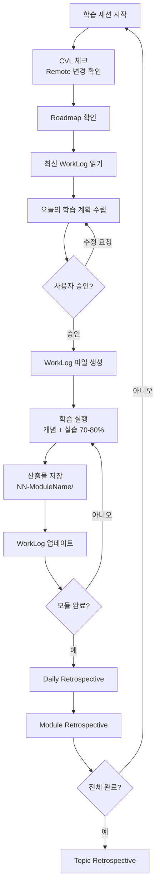

# VibeLearn AI — 4단계 워크플로우 다이어그램
> **[-> English Version](workflow-diagram.en.md)**


**작성일**: 2026-02-26
**모듈**: M1 - 시스템 분석 & 개념 정립

---

## 전체 워크플로우 개요

VibeLearn AI는 4개의 Phase로 구성된 순환 학습 시스템입니다.

```
새 학습 주제 발견
      │
      ▼
┌─────────────────────────────────────────────────────────┐
│  Phase 1: Topic 설정 (최초 1회)                          │
│                                                         │
│  ① "배우고 싶어" → AI와 대화                              │
│  ② topic_info.md 작성 (Topic 정보 수집)                  │
│  ③ 폴더 구조 자동 생성                                   │
│  ④ vl_prompts/ 파일 준비 (roadmap + daily_learning)     │
└─────────────────────┬───────────────────────────────────┘
                      │
                      ▼
┌─────────────────────────────────────────────────────────┐
│  Phase 2: Roadmap 생성 (Topic당 1회)                     │
│                                                         │
│  ① roadmap_prompt.md → AI에게 전달                       │
│  ② 학습 기간 적정성 검토                                  │
│  ③ 모듈별 Roadmap 생성 (M1, M2, ... MN)                 │
│  ④ vl_roadmap/YYYYMMDD_RoadMap_{Topic}.md 저장          │
└─────────────────────┬───────────────────────────────────┘
                      │
                      ▼
┌─────────────────────────────────────────────────────────┐
│  Phase 3: 일일 학습 (반복 사이클)           ◄────┐       │
│                                             │    │       │
│  ① Roadmap + 최신 WorkLog 읽기              │    │       │
│  ② 오늘의 학습 계획 수립 (승인 대기)          │    │       │
│  ③ 계획 실행 (70-80% 실습 중심)             │    │       │
│  ④ 산출물 생성 → NN-ModuleName/ 폴더         │    │       │
│  ⑤ WorkLog 실시간 작성                      │    │       │
│  ⑥ Daily Retrospective                     │    │       │
│                                             │    │       │
│            모듈 미완료 ─────────────────────┘    │       │
│            모듈 완료 → Module Retrospective ──►  │       │
└─────────────────────────────────────────────────┘       │
                      │                                    │
                      │ 전체 Topic 완료                     │
                      ▼                                    │
┌─────────────────────────────────────────────────────────┐
│  Phase 4: 완료 & 회고                                    │
│                                                         │
│  ① Topic Retrospective 작성 (30-60분)                   │
│  ② 산출물 최종 검토 (교과서 품질 확인)                    │
│  ③ Self-Assessment                                      │
│  ④ GitHub 공유 (선택)                                   │
└─────────────────────────────────────────────────────────┘
```

---

## Phase별 입력 → 출력 매핑

| Phase | 입력 (Input) | 사용 파일 | 출력 (Output) |
|-------|------------|---------|--------------|
| **Phase 1** | 학습 주제 + AI 대화 | `topic_starter.md` | `topic_info.md`, `vl_prompts/` 폴더 |
| **Phase 2** | topic_info.md | `roadmap_prompt.md` | `vl_roadmap/YYYYMMDD_RoadMap_{Topic}.md` |
| **Phase 3** | Roadmap + WorkLog | `daily_learning_prompt.md` | `NN-ModuleName/` 산출물 + WorkLog |
| **Phase 4** | 모든 WorkLog | (직접 작성) | `*_Final_Retrospective.md` |

---

## Phase 3 일일 학습 사이클 상세



---

## 핵심 파일 흐름

```
templates/                          Topics/{TopicName}/
├── topic_starter.md    ──복사+주입──▶ topic_info.md
│                                    │
├── roadmap_prompt_template.md ──▶  vl_prompts/
│   + Topic 정보 주입                 ├── roadmap_prompt.md
│                                    └── daily_learning_prompt.md
└── daily_learning_prompt.md ─────▶     │
                                        │
                                        ▼
                                   vl_roadmap/
                                   └── YYYYMMDD_RoadMap_{Topic}.md
                                        │
                                        │ 매일 참조
                                        ▼
                                   vl_worklog/
                                   ├── YYYYMMDD_M1_{Topic}.md
                                   ├── YYYYMMDD_M2_{Topic}.md
                                   └── ...
                                        │
                                        │ 산출물 생성
                                        ▼
                                   01-ModuleName/
                                   ├── README.md
                                   ├── concepts/
                                   ├── examples/
                                   └── guides/
```

---

## 요약: 3개의 핵심 질문

| 시점 | 파일 | 역할 |
|------|------|------|
| "뭘 배울까?" | `topic_info.md` | 목적지 설정 |
| "어떻게 배울까?" | `RoadMap_{Topic}.md` | 경로 설계 |
| "오늘 뭘 했나?" | `WorkLog.md` | 진행 기록 |

---

**작성자**: Claude with VibeLearn AI
**참조**: README.md, GETTING_STARTED.md
