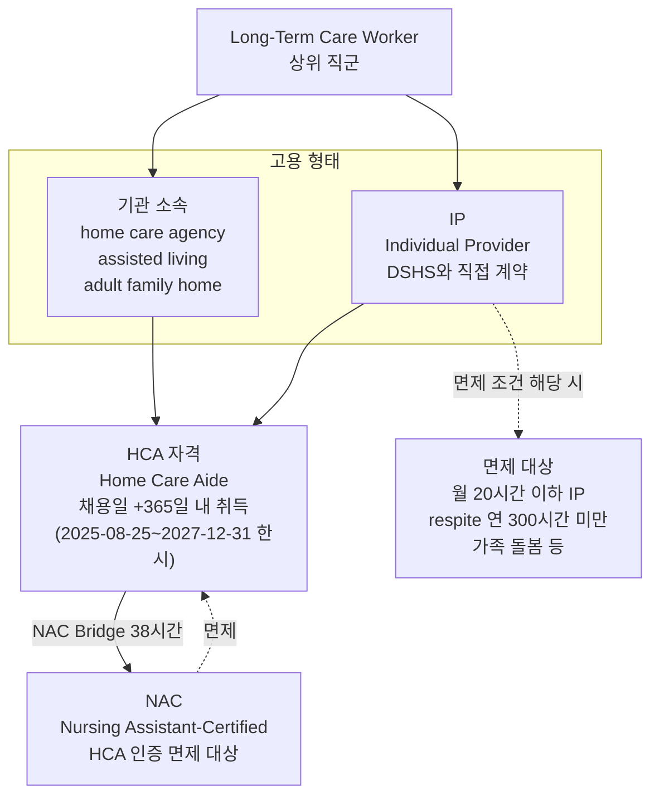
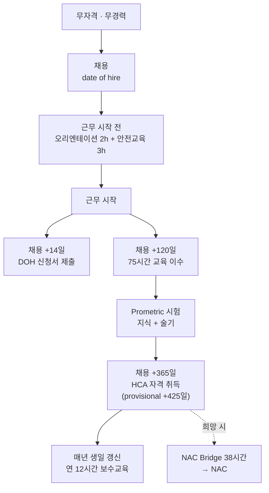

## 층위 구조 — 나란한 3개가 아니다

**읽는 법**

- **IP는 HCA의 대안이 아니다.** IP는 고용 형태이고, IP로 일하면 HCA 자격 대상이 된다
- **NAC는 위층이다.** NAC를 가지면 HCA 인증이 면제된다
- **HCA → NAC로 올라가는 지정 경로가 있다** — Bridge 38시간

## 진입 순서 — 취업이 먼저다

**일반 자격증 직종과 반대다.**

| | 일반적인 순서 | **WA HCA** |
|---|---|---|
| 1 | 교육 | **채용** |
| 2 | 시험 | 오리엔테이션·안전교육 |
| 3 | 자격 취득 | 근무 시작 |
| 4 | 취업 | 교육 → 시험 → 자격 |

> **"If you are not currently working, you are not able to obtain the DSHS background check."**
>
> 고용 전에는 배경조회를 받을 수 없으므로 **자격을 미리 딸 수 없다.**

## 관계 판정 요약

| 질문 | 답 |
|---|---|
| 세 경로가 같은 층위인가 | ❌ **아니다** |
| 병렬인가 계단식인가 | **혼합.** IP는 고용 형태(병렬 아님), HCA→NAC는 계단식 |
| 하나를 고르는 구조인가 | ❌ IP + HCA는 함께 간다 |
| 진입 순서는 | **취업 → 교육 → 자격** |

## 참조

- 세 경로 정의: [../concepts/three-roles.md](../concepts/three-roles.md)
- 일정 스캔: [../examples/intake-calendar.md](../examples/intake-calendar.md)
