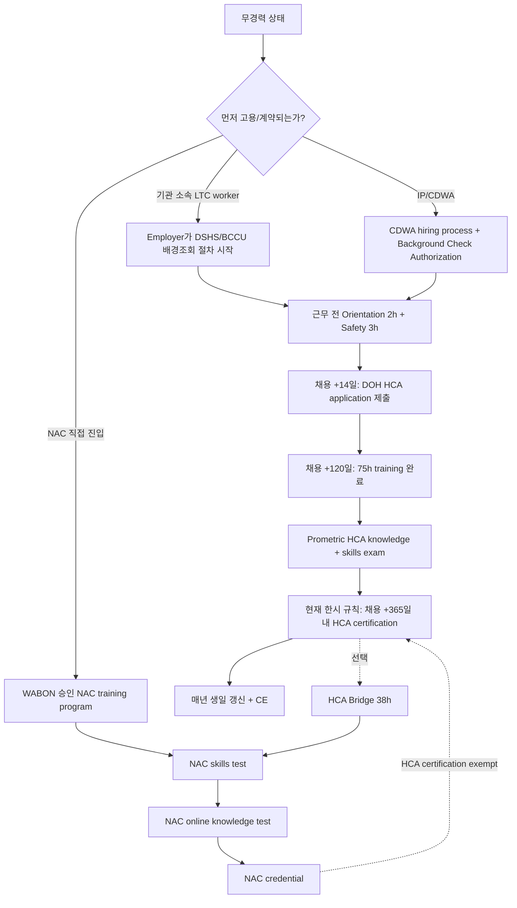

## 기준일

**조사일**: 2026-08-30

이 문서는 워싱턴주 HCA·IP·NAC/NAR 경로를 "지금 내가 어디서 시작해 무엇을 해야 하는가" 기준으로 정리한다. 의료·법률 자문이 아니라 학습용 절차 지도이며, 실제 지원 전에는 각 기관의 최신 페이지를 다시 확인한다.

## 핵심 절차 지도

## HCA 절차

| 순서 | 단계 | 담당/주체 | 기한·비용 | 근거 |
|---:|---|---|---|---|
| 1 | 채용 또는 paid direct care 시작 | employer / CDWA / facility | date of hire 발생 | WAC 246-980-010 |
| 2 | Orientation 2h + Safety 3h | DSHS 승인 training | 직접 돌봄 전 | WAC 246-980-030, M1 DSHS training PDF |
| 3 | HCA application 제출 | WA DOH | 채용 +14일, application fee $100 | DOH Certification Information, WAC 246-980-030 |
| 4 | DSHS/BCCU background check | hiring entity + DSHS | 채용 후 절차. 개인 단독 선행 불가 | DOH FAQ, DSHS Background Checks |
| 5 | 75h training 완료 | DSHS approved program / SEIU 등 | 채용 +120일 | DOH FAQ, WAC 246-980-040 |
| 6 | HCA exam | Prometric | Knowledge $49, Skills $101 | DOH Exam Information |
| 7 | HCA certification 발급 | WA DOH | 현재 한시 규칙: +365일, provisional +425일 | WAC 246-980-030/040 |
| 8 | 갱신 | WA DOH / CE provider | 매년 생일, renewal fee $100, CE 12h | DOH Certification Information / FAQ |

### 200일 vs 365일 판정

| 출처 | 숫자 | 해석 |
|---|---:|---|
| RCW 18.88B.021 | 200일 | 기본법 문구 |
| DOH FAQ | 200일 | FAQ 일부가 기본 규정 또는 미갱신 문구를 반영하는 것으로 보임 |
| WAC 246-980-030/040 | 365일 / 425일 | 2025-08-25~2027-12-31 적용되는 현행 한시 규칙 |
| WSR 26-12-065 | 200→365, 260→425 개정 표시 | 한시 규칙의 개정 근거 |

**결론**: 2026-08-30 현재 실무 안내에는 `365일`을 중심으로 쓰되, RCW/FAQ에 `200일` 문구가 남아 있으므로 "한시 규칙 적용 중"이라고 명시한다.

## IP 절차

| 순서 | 단계 | 담당/주체 | 확인 상태 |
|---:|---|---|---|
| 1 | IP 지원 또는 client가 IP로 지정 | CDWA / client | CDWA는 DSHS의 Consumer Directed Employer |
| 2 | hiring process 시작 | CDWA Workday/DirectMyCare | CDWA resources에서 hiring checklist와 background check guide 제공 |
| 3 | Background Check Authorization Form 작성 | IP applicant | 10자리 confirmation code를 CDWA에 제출하는 구조 |
| 4 | fingerprint background check | CDWA + DSHS/BCCU | Okay to Provide Care 기준 120일 내 fingerprint 완료 필요 |
| 5 | HCA requirement 판정 | DOH/DSHS 규정 | 면제 없으면 HCA 절차 진행 |
| 6 | 면제 가능성 확인 | WAC 246-980-025 | 월 20시간 이하, respite 연 300시간 미만, 가족 돌봄 등 |

**IP의 핵심**: IP는 자격이 아니라 고용 형태다. 그래서 IP가 되면 HCA가 필요할 수 있고, 특정 조건이면 HCA certification이 면제될 수 있다.

## NAC/NAR 절차

| 항목 | NAR | NAC |
|---|---|---|
| 정식명 | Nursing Assistant-Registered | Nursing Assistant-Certified |
| 법령상 정의 | WAC 246-841A-390의 nursing assistant-registered | WAC 246-841A-390의 nursing assistant-certified |
| 역할 | 등록 상태의 nursing assistant | 인증된 nursing assistant |
| 학생/고용 중 적용 | nursing home에서 hire 후 3일 내 NAR 신청 등 care setting별 규칙 | training + skills/knowledge exam 후 credential |
| HCA와 관계 | HCA certification 면제 근거로는 NAC가 핵심 | NAC 보유자는 HCA certification 면제 대상 |
| 비용 | initial application $85, renewal $95 | initial application $85, renewal $95 |
| 시험 | NAC로 가기 위한 경로에 연결 | skills test + online knowledge test $55 |

NAC는 traditional program, HCA Bridge, MA Bridge 세 경로가 있다. HCA Bridge는 현재 사용자의 단계에서 특히 중요하다. HCA를 먼저 얻으면 나중에 38시간 bridge로 NAC에 올라가는 구조를 만들 수 있기 때문이다.

## 확인 불가 / 다음 문의

| 항목 | 상태 | 다음 문의처 |
|---|---|---|
| CDWA IP에서 정확한 date of hire와 `Okay to Provide Care`의 관계 | 부분 확인 | CDWA 866-214-9899 또는 InfoCDWA@ConsumerDirectCare.com |
| Certified Home Care Aide Checklist 최신 원문 | 부분 확인 | DOH HSQA customer service 360-236-4700 |
| NAC skills test 비용 | 프로그램별 상이 | 선택할 NAC training provider 또는 WABON |

## 참조

- WA DOH Home Care Aide FAQ: https://doh.wa.gov/licenses-permits-and-certificates/professions-new-renew-or-update/home-care-aide/frequently-asked-questions
- WA DOH Home Care Aide Certification Information: https://doh.wa.gov/licenses-permits-and-certificates/professions-new-renew-or-update/home-care-aide/certification-information
- WA DOH Home Care Aide Exam Information: https://doh.wa.gov/pa/node/19595
- WAC 246-980-025: https://app.leg.wa.gov/wac/default.aspx?cite=246-980-025
- WAC 246-980-030: https://app.leg.wa.gov/wac/default.aspx?cite=246-980-030
- WAC 246-980-040: https://app.leg.wa.gov/wac/default.aspx?cite=246-980-040
- WAC 246-841A-390: https://app.leg.wa.gov/wac/default.aspx?cite=246-841A-390
- WAC 246-841A-403: https://app.leg.wa.gov/wac/default.aspx?cite=246-841A-403
- WABON NAC Information: https://nursing.wa.gov/education/nursing-assistant-training/na-program-student-info/nursing-assistant-certification-nac-information
- WABON Nurse License Fees: https://nursing.wa.gov/licensing/nurse-license-fees
- CDWA Become a Provider: https://www.consumerdirectwa.com/become-a-provider/
- CDWA Resources/FAQ: https://www.consumerdirectwa.com/resources/
