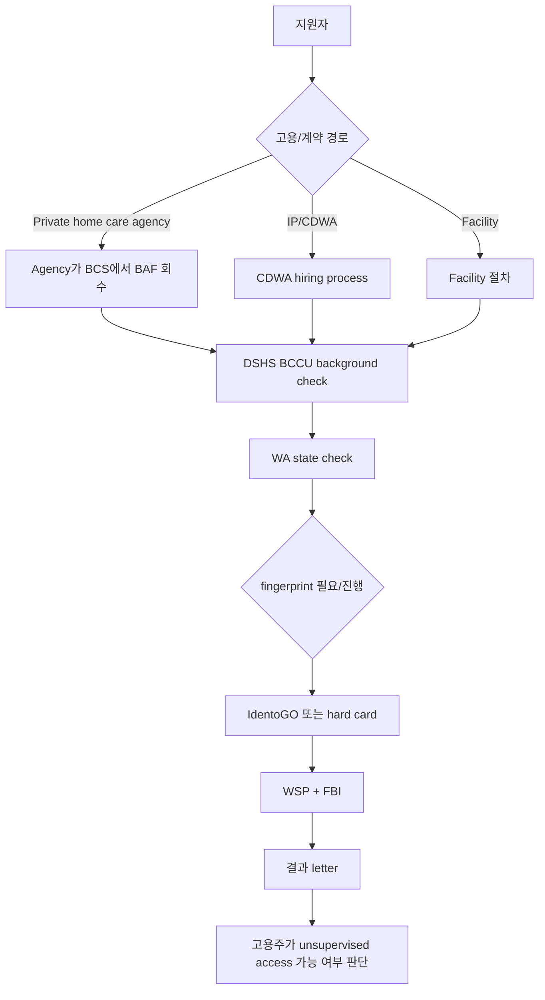

## 결론

배경조회는 이 Topic의 병목 중 하나지만, 개인이 독립적으로 먼저 끝내는 절차가 아니다. DSHS는 background check authorization form 작성 전에 hiring entity 또는 in-home client/consumer와 먼저 접촉하라고 안내하고, DOH FAQ도 현재 일하고 있지 않으면 DSHS background check를 받을 수 없다고 설명한다.

## 배경조회 흐름



## 기관 소속 HCA worker

DSHS의 private home care agency 안내는 applicant가 온라인 Background Check Authorization form을 작성하고, agency가 confirmation code와 생년월일로 BAF를 회수해 BCS에서 BCCU에 제출하는 흐름을 설명한다. fingerprint check는 WA state check와 FBI fingerprint check를 포함한다.

중요한 운영 포인트는 fingerprint 결과가 120일 안에 agency로 도착해야 한다는 점이다. 도착하지 않으면 120일 이후 unsupervised work가 막힌다.

## IP/CDWA worker

CDWA FAQ는 모든 IP, Parent Provider 포함, hire 시 background check가 필요하고 fingerprint background check를 `Okay to Provide Care` 날짜 기준 120일 안에 완료해야 한다고 설명한다. IP는 Background Check Authorization Form을 완료한 뒤 10자리 confirmation code를 CDWA에 제출하고, CDWA가 BCCU를 통해 check를 진행한다.

**주의**: `Okay to Provide Care`와 WAC의 `date of hire`가 완전히 같은지, 또는 어떤 상황에서 다르게 쓰이는지는 아직 별도 확인이 필요하다. 실제 지원 전 CDWA에 문의한다.

## 비용과 처리 기간

| 항목 | 현재 확인 |
|---|---|
| DSHS LTC worker background check 비용 | DSHS background check page는 DSHS가 LTC workers의 background checks 비용을 낸다고 설명 |
| fingerprint 비용 | DSHS/CDWA 경로에서는 별도 비용 발생 여부를 실제 안내에서 확인 필요. law enforcement hard card는 비용이 있을 수 있음 |
| 처리 기간 | BCCU turnaround time 페이지에서 확인 필요. 공개 처리일은 변동 가능하므로 지원 직전 재확인 |

## 막히는 지점

| 문제 | 증상 | 대응 |
|---|---|---|
| confirmation code 분실 | 온라인 BAF 종료 후 code를 다시 못 얻을 수 있음 | 작성 직후 안전하게 기록하되, 볼트에는 생년월일 등 신원 정보와 함께 저장하지 않음 |
| fingerprint reject | WSP가 지문을 거부 | 즉시 재예약. 반복 reject 가능성 있음 |
| 결과 letter 해석 | qualified/disqualified/CC&S review 판단 필요 | 고용주/CDWA/BCCU 안내에 따름 |
| 120일 초과 | unsupervised work 불가 | 채용 직후 fingerprint appointment를 바로 잡는 것이 핵심 |

## 개인정보 기록 규칙

- SSN, 생년월일, driver license number, confirmation code 원문은 볼트에 기록하지 않는다.
- WorkLog에는 `BAF 작성일`, `fingerprint appointment date`, `결과 수신일`, `문제 발생 여부`만 기록한다.
- 공유 자료에는 실제 기관 담당자명·개인 case detail을 빼고 일반 절차만 남긴다.

## 다음 문의 템플릿

CDWA 또는 고용주에게 물을 질문:

```text
I am preparing to apply as a caregiver/Individual Provider in Washington. Could you confirm when my date of hire or Okay to Provide Care date starts for the HCA training/certification timeline, and which background check steps I need to complete first?
```

한국어 메모:

```text
HCA 교육/자격 기한이 어느 날짜부터 시작되는지, 그리고 배경조회와 지문 채취를 어떤 순서로 진행해야 하는지 확인한다.
```

## 참조

- DSHS Background Checks: https://www.dshs.wa.gov/node/2527
- DSHS Background Checks - Private Home Care Agencies: https://www.dshs.wa.gov/altsa/background-checks-private-home-care-agencies-hca
- DSHS Background Check Authorization Form: https://www.dshs.wa.gov/ffa/background-check-authorization-form?banner_hide=1
- CDWA Resources: https://www.consumerdirectwa.com/resources/
- CDWA Become a Provider: https://www.consumerdirectwa.com/become-a-provider/
