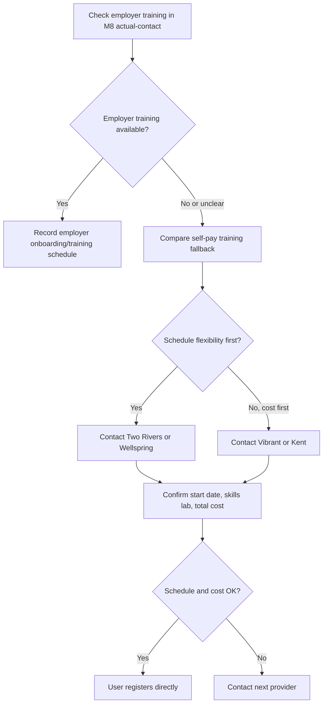

## Summary

이 문서는 HCA 75시간 교육 등록 전에 확인할 순서와 기록 방식을 정리한다. 실제 등록 양식에는 생년월일, 주소, government ID, 결제 정보가 들어갈 수 있으므로, 볼트에는 제출 여부와 날짜만 기록한다. 개인정보 원문이나 스크린샷은 저장하지 않는다.

## Enrollment Decision Flow

## Step-by-Step Checklist

| 단계 | 할 일 | 기록할 것 | 기록하지 말 것 |
|------|------|------|------|
| 1 | employer training 가능 여부 확인 | 기관명, 답변일, training 제공 여부 | recruiter 개인 연락처 전체, 계정 정보 |
| 2 | self-pay fallback 필요 여부 결정 | fallback 필요/불필요 | 개인 재정 정보 |
| 3 | 교육기관에 시작일 문의 | 기관명, next cohort/start date, skills lab 요일 | 생년월일, government ID, 주소 전체 |
| 4 | 총비용 확인 | tuition, fee, tax/service charge, exam fee 포함 여부 | 카드 정보, 결제 영수증 원본 |
| 5 | 출석 요건 확인 | 온라인/LMS, skills lab, 결석 보충 규칙 | 계정 로그인 정보 |
| 6 | 등록 실행 | 등록일, 시작일, 종료 예정일, confirmation 존재 여부 | confirmation number 원문, student ID 원문 |
| 7 | 이수 로그 시작 | 날짜, 주제, 시간, 배운 내용 | client 정보, 타인 개인정보 |

## Questions for Training Providers

| 질문 | 이유 |
|------|------|
| HCA 75-hour Basic Training이 DSHS-approved 과정인가요? | 자격 요건 충족 여부 확인 |
| 다음 시작일 또는 rolling enrollment 방식은 어떻게 되나요? | 채용 후 120일 리스크 관리 |
| 온라인/LMS와 in-person skills lab 비율은 어떻게 되나요? | 통근·일정 판단 |
| skills lab 날짜와 시간은 고정인가요, 예약식인가요? | 사용자 일정 충돌 확인 |
| 총비용은 tuition 외 fee, tax, service charge, 교재비를 포함하나요? | 실제 결제액 확인 |
| HCA state exam fee가 포함되어 있나요, 별도인가요? | M7 비용으로 분리 |
| employer sponsored 또는 reimbursement가 가능한가요? | employer-linked training과 연결 |
| 결석 또는 일정 변경 시 make-up 정책은 무엇인가요? | 이수 실패 리스크 관리 |
| 수료증 발급 시점은 언제인가요? | DOH application/exam 일정 연결 |
| 등록 전에 background check가 필요한가요, 아니면 certification 단계에서 필요한가요? | M2/M7 절차와 충돌 방지 |

## Provider Contact Order

1. Employer training route: Family Resource, Visiting Angels Puyallup. 먼저 비용 지원과 training schedule을 물어본다.
2. Two Rivers: flexible daily scheduling과 HCA-CNA Bridge 가능성이 있어, 일정 유연성 기준 fallback 1순위다.
3. Wellspring: enrollment process와 rolling enrollment 정보가 가장 자세하고 Lakewood skills lab이 명확하다.
4. Vibrant: 비용이 낮고 Tacoma라 통근은 좋지만 Thu/Fri 9am-5pm skills practice가 사용자 일정과 맞는지 확인해야 한다.
5. Kent: 비용은 중간이고 3주 in-person 구조라, next session이 맞을 때만 검토한다.

## Privacy Rules

- [x] 등록 양식의 이름, 주소, 생년월일, government ID, 결제 정보는 이 볼트에 적지 않는다.
- [x] confirmation number는 필요하면 끝 4자리만 남긴다.
- [x] 영수증은 총액만 기록하고 원본 이미지는 저장하지 않는다.
- [x] 수업 중 만난 사람, client 사례, 건강정보는 기록하지 않는다.
- [x] 질문과 답변은 기관 단위로 요약한다.
