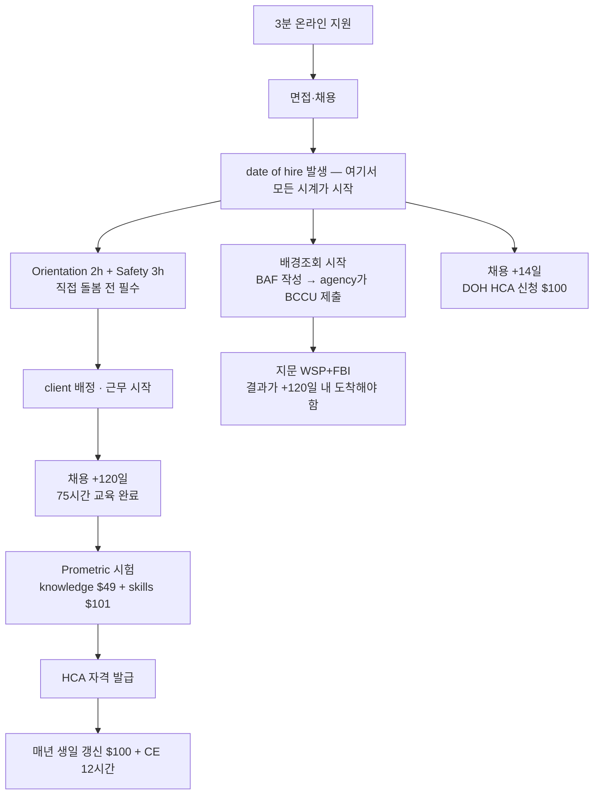

## Summary

사용자가 지목한 두 기관(**First Choice In-Home Care**, **대한부인회 = Korean Women's Association / KWA)**의 신청 경로를 조사했다. **조사일 2026-08-31.**

> ⭐ **핵심 발견 — 둘 다 SEIU 775 노조 기관이다.**
> 이것이 M4·M5 가 조사한 기존 후보(Family Resource, Visiting Angels)와의 결정적 차이이고,
> **M5 의 순위를 다시 봐야 하는 이유**다.

---

## 왜 이게 중요한가 — M3 의 숫자가 그대로 나온다

M3 은 IP(Individual Provider) 경로의 의료보험 조건을 **「월 80시간을 2개월 연속」** 으로 확인했다. 그리고 agency 경로는 *"benefits 조건 미기재"* 로 남아 있었다. **KWA 채용 페이지에 그 문장이 그대로 있다.**

> *"Medical/Dental insurance (**after 80 hours/month for 2 consecutive months**)"*

**우연이 아니다.** 둘 다 **SEIU 775 Benefits Group** 이 운영하는 같은 신탁이기 때문이다. 시급 하한도 겹친다.

| 경로 | 시급 하한 |
|---|---|
| CDWA Individual Provider | **$23.54** |
| **KWA** | **$23.54** |

같은 노조 임금표를 쓰고 있다는 뜻이다.

### 그래서 무엇이 달라지나

M5 는 IP 를 **차순위로 미뤘다.** 이유는 하나였다 — *"Bonney Lake 인근에서 월 80시간을 채울 client 를 확보할 수 있는지 확인되지 않았다."* IP 는 **본인이 client 를 찾아야** 하기 때문이다.

> ⭐ **KWA 는 IP 의 시급과 보험 조건을 그대로 주면서, client 를 스스로 찾으라고 하지 않는다.**
> 기관이 배정한다. **M5 가 IP 를 미룬 이유가 통째로 사라진다.**

---

## 한 장 비교

| | **KWA (대한부인회)** | **First Choice In-Home Care** | 참고: Family Resource | 참고: Visiting Angels |
|---|---|---|---|---|
| 시급 | **$23.54–28.53** | $21.44–24.59 (자사) ⚠️ | $22.50–23 | $22 |
| **노조** | ✅ **SEIU 775** | ✅ **SEIU 775** | ❌ | ❌ |
| 의료보험 조건 | ⭐ **월 80h × 2개월 연속 (명시)** | 노조 계약(하프타임 이상) | 미기재 | 미기재 |
| 은퇴연금 | **SEIU 775 Secure Retirement** | 노조 계약 | 401k 매치 | 매치 |
| HCA 사전 필요 | ❌ *"willingness to become certified"* | ❌ 채용 후 취득 | ❌ | 선호 |
| 교육 | ⭐ **유급 HCA 자격 훈련** | **자체 훈련센터 2곳** | 2주 사내 훈련 | training assist |
| 한국어 | ⭐ **다국어·다문화 기관** | — | — | — |
| 본부 | Lakewood | Tacoma | Tacoma/Puyallup | Puyallup |

⚠️ **First Choice 시급이 출처마다 다르다** — 자사 페이지 `$21.44–24.59`, 구인 사이트 `$22.55–26.37`. **문의 시 반드시 확인할 항목이다.**

---

## ① KWA (대한부인회 / Korean Women's Association)

**성격**: 50년 된 501(c)(3) 비영리 사회복지 기관. **다국어·다문화 서비스**를 표방하며 대형 재가 돌봄 프로그램을 운영한다.

| 항목 | 내용 |
|---|---|
| **지원** | https://www.kwacares.org/careers → https://kwacares.applicantpro.com/jobs/ |
| **전화** | **253-535-4202** · 무료 **888-508-2780** · 채용 **253-946-1995 ext. 1** |
| 본부 | **3625 Perkins Lane SW, Lakewood, WA 98499** |
| 시급 | **$23.54 – $28.53/hr** |
| 서비스 지역 | Western Washington (Tacoma · Lakewood · Renton 등) |
| 통근 | Bonney Lake 기준 Lakewood·Tacoma **약 20마일** — M4 근거리 |

### 자격 요건

| 요건 | 충족 |
|---|---|
| 만 18세 이상 | ✅ |
| **본인 차량 · WA 운전면허 · 자동차 보험** | ✅ (면허 보유 확인됨) |
| **home care worker 자격을 취득할 의향** | ✅ — *"willingness to become certified"* |
| 범죄경력·평판 조회 통과 | 채용 절차에서 진행 |
| HCA/CNA **사전 보유** | ❌ **불필요** |

### 복지 (채용 페이지 명시)

- ⭐ **Medical/Dental — 월 80시간 × 2개월 연속** 후
- **유급 HCA 자격 훈련** (Paid Home Care Aide Certification training)
- SEIU 775 조합원 · **SEIU 775 Secure Retirement Plan**
- PTO 적립 · 마일리지 환급 · **주말 근무 시급 할증** · 연방 공휴일 6일 할증
- 추천 보너스 $200

### ⭐ 2026-09-01 공고 목록 실사 — `$28.53` 은 **한국어 이중언어 프리미엄**이었다

지원 포털(`kwacares.applicantpro.com/jobs/`)을 직접 열어 확인했다. `Caregiver` 검색 결과 **22건**이고,
**전부 지역별 공고**다. 그런데 **시급 상한이 공고마다 같지 않다.**

| 공고 | 시급 |
|---|---|
| 일반 지역 공고 (Aberdeen · Bellingham · Bremerton · Federal Way/Kent/Seattle · Longview 등) | $23.54 – **27.28** |
| ⭐ **KOREAN Bilingual Caregiver, South King County** (Federal Way) | $23.54 – **28.53** |

> 🔻 **기존 기록을 정정한다.** M8 조사에서 KWA 시급을 *"$23.54–28.53"* 으로 적었는데,
> **상한 $28.53 은 일반 공고가 아니라 「한국어 이중언어」 공고의 것**이었다.
> 일반 공고 상한은 **$27.28** 이다.
>
> ⭐ **그런데 이 정정이 오히려 유리하다.** 사용자는 **한국어 원어민**이라 그 프리미엄 공고의
> 대상자다. **다른 지원자 대부분이 못 가지는 자격**이고, 시급 상한이 **$1.25/hr 높다.**
> 게다가 KWA 는 *"다국어·다문화 기관"* 을 표방하므로 이 조건이 기관의 실제 수요와 맞는다.

**Federal Way 는 Bonney Lake 기준 약 20마일** — M4 근거리 분류 안이다.
게시일이 **2026-06-30** 으로 다른 공고(대부분 8/06)보다 두 달 이르다. 오래 열려 있다는 것은
**채우기 어려운 자리**라는 뜻일 수 있다 — 지원자에게 유리한 신호다.

> 📌 **지원 전략** — **①한국어 이중언어 공고**를 먼저 넣고,
> **②Pierce County(Tacoma·Puyallup·Lakewood) 공고**가 목록에 있으면 함께 넣는다.
> 같은 기관에 2–3건은 「지역 유연성」으로 읽히지만 10건은 산만해 보인다.
> ⚠️ Aberdeen·Bellingham·Longview·Long Beach 는 **통근 불가**다. 고르지 않는다.

### 📋 공고 본문 분석 — Lynnwood 공고 (2026-09-01 · 사용자 제공)

> ⚠️ **Lynnwood 자체는 지원 대상이 아니다.** Snohomish County(Everett·Lynnwood·Bothell·
> Edmonds·Marysville) 배정이라 Bonney Lake 에서 **약 55~60마일 — 통근 불가**다.
> **다만 공고 본문이 모든 KWA caregiver 공고에 공통으로 적용되는 정보를 담고 있다.**
> ([직무기술서가 전 공고 동일함은 아래에서 확인됨](#-공식-job-description-분석-2026-09-01--사용자-제공))

#### ⭐ 해소된 질문 2개 — 이동시간·마일리지는 **둘 다 나온다**

공고 복리후생란 원문이다.

> *"Medical, Vision, and Dental Insurance **with qualifying hours**; Paid Time Off;
> **Paid Home Care Aide Certification Training**; **Paid Travel Time between clients**;
> **Mileage reimbursement**; flexible hours/scheduling available"*

| 우리 질문 | **답** |
|---|---|
| client 간 이동시간은 유급인가 | ✅ **유급** (`Paid Travel Time between clients`) |
| 마일리지 환급이 되는가 | ✅ **된다** (`Mileage reimbursement`) |
| HCA 훈련은 유급인가 | ✅ **유급** (`Paid Home Care Aide Certification Training`) |
| 치과·안과도 포함인가 | ✅ **Medical + Vision + Dental** |

> 📌 **실질 시급 계산이 달라진다.** 재가 돌봄의 최대 함정이 *"이동은 무급, 케어 시간만 유급"*
> 인데 **KWA 는 이동시간도 준다.** 하루에 client 를 두세 곳 도는 구조에서 이 차이가 크다.

#### 🔴 그런데 「시간」에 대한 문장이 양날이다

> *"Caregivers are **not required to work a minimum number of hours per week** and can
> choose their preferred days, times, and locations."*

공고는 이것을 **유연성**으로 내세운다. 실제로 파트타임 희망자에게는 장점이다.
**그런데 뒤집으면 이렇게 읽힌다.**

| 읽는 방향 | 뜻 |
|---|---|
| 공고의 의도 | ✅ 최소 시간 **강제**가 없다 — 원하는 만큼만 일해도 된다 |
| ⚠️ **뒤집으면** | **최소 시간 보장도 없다** — 시간은 근처 client 수요가 정한다 |

> 🔴 **이것이 M3 이 확인한 보험 조건(「월 80시간 × 2개월 연속」)과 정면으로 만난다.**
> 80시간을 **일할 의사**는 본인이 정할 수 있지만, **80시간어치 client 가 근처에 있는지**는
> 본인이 정할 수 없다.
>
> ⭐ **그래서 1번 질문의 성격이 바뀐다.** *"월 80시간을 배정해 주는가"* 가 아니라
> **「Bonney Lake 반경에 80시간을 채울 만큼 client 가 있는가」** 로 물어야 정확한 답이 나온다.

#### 그 밖에 확인된 것

| 항목 | 내용 |
|---|---|
| 시급 결정 방식 | **`Depending on Experience`** — 무경력이면 **하한 $23.54 에서 시작**할 가능성이 높다. 직무기술서의 *"certified hours per CBA wage scale"* 과 합치면 **자격 시간을 쌓아 올린다** |
| 🔴 **필수** | 18세 이상 · **본인 차량(reliable personal transportation)** · **WA 운전면허 + 자동차 보험** · 기한 내 자격 취득 의사 · 범죄경력·평판 조회 통과 |
| **preferred (필수 아님)** | 고졸·GED·외국 동등학력 · **돌봄 경력** · 공감 능력·의사소통 |
| 지원 절차 | *"initial **3-minute**, mobile-friendly application"* — **첫 지원은 3분짜리 간단 양식**이다. 부담 없이 넣을 수 있다 |
| ⚠️ **지역별 전화번호가 따로 있다** | Lynnwood 는 **425-742-6396**. 우리가 가진 **253-946-1995 ext.1 은 본부(Lakewood/Tacoma)** 번호다. **Pierce County 공고를 찾으면 그 공고에 적힌 번호로 걸어야 한다** |
| 카운티 규칙 실증 | Lynnwood 공고가 *"Snohomish County; Everett, Lynnwood, Bothell, Edmonds, Marysville, Snohomish"* 를 나열한다 — **직무기술서의 「채용 사무소 카운티 전역」 규칙이 공고로 확인된다** |
| 기관 성격 | 1979년 등록 **501(c)(3) 비영리**. 노인복지·재가돌봄·복지수급·시민권·저렴주택·보건안내. **multicultural/multilingual 을 반복 강조** |

> 📌 **`Apply www.kwacares.org/careers` 가 공고마다 반복된다** — 지원 창구는 하나다.

### 📄 공식 Job Description 분석 (2026-09-01 · 사용자 제공)

KWA 「In-Home Caregiver」 공식 직무기술서를 확보했다 (최종 수정 2022-08-22, 4장).
**공개 채용 페이지에 없던 사실이 다섯 개 나왔다.**

📎 **원본**: `08-Application-and-Hire/examples/KWA - In-Home Caregiver Job Description (2022-08-22).pdf`

> 📌 **공고마다 같은 파일이 붙어 있다.** 지원 포털에서 여러 공고를 열면 파일명이 다르게 (`In-Home_Caregiver_2024.*` / `In-Home_Caregiver_Job_Description.*`) 내려받아지지만 **본문은 완전히 동일하다**(텍스트 10,491자 일치, 2026-09-01 확인). **지역별 공고가 22건이어도 직무 내용은 하나**라는 뜻이다 — 공고 간 차이는 **근무 지역과 시급 상한**뿐이다.

#### ⭐ 1. 통근 범위를 정하는 것은 「어느 사무소에서 채용되느냐」다

> *"Travels to and from client's home **anywhere within the county where the KWA office
> they are hired at is located**"*
> *"May be required to travel between and work from **other KWA offices**"*

**배정 범위가 client 주소가 아니라 「채용 사무소의 카운티 전역」이다.** 이것이 공고 선택을 바꾼다.

| 지원할 공고 | 채용 사무소 | **배정 범위** | Bonney Lake 기준 |
|---|---|---|---|
| **KOREAN Bilingual, South King County** | Federal Way | **King County 전역** | 남부(Federal Way·Kent·Auburn) 15~30마일. **북부(시애틀·벨뷰)면 35~45마일** |
| **Pierce County 공고** (있다면) | Lakewood 등 | **Pierce County 전역** | ✅ Tacoma·Puyallup·Orting·Graham — 전부 근거리 |

> 🔴 **여기서 상충이 생긴다.** 한국어 공고는 **시급 상한이 $1.25 높지만 King County 배정**이고,
> Pierce County 공고는 **통근이 짧지만 일반 시급**이다.
>
> ⭐ **그래서 전화에서 물어야 할 새 질문이 생겼다** —
> **「Pierce County 사무소에서 채용되면서 한국어 client 를 맡는 것이 가능한가?」**
> Tacoma·Lakewood 에도 한국인 인구가 있고 KWA 본부가 Lakewood 다.
> **가능하다면 높은 시급과 짧은 통근을 동시에 가진다.**

#### ⭐ 2. 자격 취득 기한이 「영어가 제2언어면 260일」이다

> *"Must become certified as a home care worker within **200 days or 260 days
> (English is second language)** of employment."*

**한국어 원어민에게 60일이 더 주어진다.** M1 이 *"기한 미준수 시 근무 중단"* 으로 기록한 그 기한이다.

그리고 결정적으로 — *"Certification is a **condition of continued employment**"* 다.
**채용의 조건이 아니라 계속 고용의 조건이다.** M1 의 발견(**자격보다 취업이 먼저**)이
공식 문서로 확인됐다. **자격 없이 채용되고, 일하면서 딴다.**

#### ⚠️ 3. 신체 요구가 가볍지 않다

> *"Ability to exert up to **50 pounds or more of force** occasionally... to lift, carry,
> push, pull or otherwise move a client"*

동작 목록: standing · walking · bending · flexing · **lifting** · twisting · stooping ·
kneeling · reaching · stretching · pushing · pulling · **climbing stairs**.
장비: **gait belt · Hoyer lift · transfer board** · 샤워 의자 · 워커 · 휠체어.

> ⚠️ *"Lifting the client when they are unable to assist in their transfer
> **requires specialized training**"* — 가장 무거운 이동은 별도 훈련이 필요하다.

#### ⚠️ 4. 업무의 실체는 「개인 위생 돌봄」이다

직무기술서 2장 대부분이 이것이다 — **목욕(전신 포함) · 대소변 처리(bed pan·기저귀·화장실 이동) ·
routine peri-colostomy/catheter tasks · 옷 입히고 벗기기 · 직접 먹여주기**.
그 밖에 식사 준비, client 구역 청소·세탁, 병원 동행, 장보기.

> 📌 **이것을 알고 결정해야 한다.** 20년 사무직 경력자에게는 **처음 접하는 종류의 일**이다.
> 시급과 보험 조건만 보고 판단할 수 있는 자리가 아니다.

#### 5. 그 밖에 확인된 것

| 항목 | 내용 |
|---|---|
| **급여 구조** | *"Based on **certified hours** per **CBA wage scale**"* — SEIU 775 단체협약 임금표. **훈련 시간을 쌓으면 시급이 오른다.** 공고의 $23.54–27.28 이 그 범위이고 **신규는 하한에서 시작** |
| 학력 | 고졸·GED·**외국 동등학력 「preferred」** — 필수가 아니다. 학사 학위면 여유 있게 넘는다 |
| 경력 | *"**No prior experience necessary**"* |
| 보수교육 | **연 12시간**, 본인 생일 기준 |
| 개인 차량 | 병원 동행·장보기에 **본인 차 사용을 요구할 수 있다** — 마일리지 환급 조건은 여전히 확인 필요 |
| 영어 | 업무 수행에 충분한 수준 요구. **professional working proficiency 면 충족**, 한국어는 오히려 강점 |
| 근무 형태 | Full Time · **Part-Time or On-Call 둘 다 표기됨** — 파트타임이 정식 옵션이다 |

> ⚠️ **문서 최종 수정일이 2022-08-22 다.** 4년 전 문서이므로 **CBA 임금표는 그 사이 올랐다.**
> 실제 시급은 공고에 표시된 **$23.54–27.28 (한국어 공고 $23.54–28.53)** 이 최신이다.

### ⚠️ 지원 시 주의 — 공고를 잘못 고르면 시급이 $6 차이난다

KWA 에는 **별도의 저임금 직군**이 있다.

| 직군 | 시급 |
|---|---|
| **Caregiver / Home Care Aide** ← 이것 | **$23.54–28.53** |
| Housekeeper / Personal Care | $17.00–19.37 |

**반드시 `Caregiver` 또는 `Home Care Aide` 공고로 지원한다.**

---

## ② First Choice In-Home Care

**성격**: WA DOH 면허 + DSHS 계약 기관. 발달장애 아동·성인, 정신건강 대상자, 재향군인, 고령자에게 personal care 를 제공한다.

| 항목 | 내용 |
|---|---|
| **지원** | https://www.fcihc.com/job-openings (양식 제출) 또는 **HR 1-877-747-5090** |
| **Tacoma 사무소** | **1102 Broadway, Suite 101, Tacoma, WA 98402** · **253-926-2230** |
| Renton 사무소 | 555 S Renton Village Pl, Suite 300 · 425-747-5000 |
| 시급 | ⚠️ **$21.44–24.59 (자사)** vs $22.55–26.37 (구인 사이트) |
| 서비스 지역 | **King · Pierce · Snohomish · Kitsap · Clark · Cowlitz** |

### 자격·교육

- **CNA 또는 HCA 는 preferred 이지만 필수 아님**
- **WA 운전면허 · 현재 유효한 자동차 보험 증빙 · 신뢰할 수 있는 차량 필수**
- 채용 절차: 평판 조회 → **WSP 범죄경력 조회 → FBI 지문 조회** → DOH 자격 확인 → 경력 확인
- 채용 후 **NAC 또는 HCA 자격 취득** 필수
- 오리엔테이션·안전교육 **5시간**, 연 **12시간** 보수교육
- ⭐ **자체 Caregiver Training Center 2곳** 운영

> 🔻 **정정 (2026-09-01)** — 앞서 *"FBI 지문 조회가 명시된 곳은 여기뿐"* 이라 적었으나 **틀렸다.**
> **DSHS/BCCU 경로는 모든 LTC worker 에게 WA state check + FBI fingerprint 를 요구한다** — **KWA 도 동일하다.**
> First Choice 는 그것을 채용 페이지에 **명시했을 뿐**이고, 절차가 더 긴 것이 아니다.

> ⚠️ **First Choice 는 공고 목록을 웹에 올리지 않는다.** *"contact our Human Resources
> Department"* 라고만 안내한다. **전화가 사실상 유일한 창구다.**

---

## ⭐ First Choice 는 「전화 등록」이 아니다 — 창구만 다르다 (2026-09-01)

> 🔴 **HCA 절차는 고용주 정책이 아니라 워싱턴주 법(WAC 246-980)이다.**
> WA 에서 재가 돌봄을 하는 **모든 기관이 같은 절차를 따른다** — 채용 → Orientation 2h + Safety 3h
> → DOH 신청(+14일) → 75시간 교육(+120일) → Prometric 시험 → 자격.
> **First Choice 도 예외가 아니다.** 전화는 **3분 양식을 대신하는 지원 창구일 뿐**이고,
> 그 뒤 절차는 KWA 와 동일하다.

### 🔻 정정 — 「FBI 지문은 First Choice 만」이 아니었다

앞서 *"FBI 지문 조회가 명시된 곳은 여기뿐이다. 채용 절차가 더 길 수 있다"* 고 적었는데
**틀렸다.** M2 의 [배경조회 절차](../../02-Credentialing-Process/guides/background-check.md)가
확인한 대로, private home care agency 경로는 **DSHS/BCCU 를 통해 WA state check + FBI
fingerprint check 를 포함**한다. **KWA 도 똑같이 거친다.**

**First Choice 는 그것을 채용 페이지에 명시했을 뿐이다.** 절차가 더 긴 게 아니다.

### 두 기관 비교 — 확인된 것만

| | **KWA** | **First Choice** |
|---|---|---|
| 지원 창구 | 온라인 포털 · **3분 양식** | **웹 양식 또는 전화** — 공고 목록을 웹에 안 올린다 |
| Pierce County | ✅ **본부 직영 공고**(Lakewood) | ✅ 서비스 지역에 포함 (Tacoma 사무소) |
| 시급 | **$23.54–27.28** (한국어 **$28.53**) | ⚠️ **$21.44–24.59** (자사) vs $22.55–26.37 (구인사이트) — **출처 불일치** |
| **이동시간 유급** | ✅ **명시됨** | ❓ **미확인** |
| **마일리지 환급** | ✅ **명시됨** | ❓ 미확인 |
| 의료보험 조건 | ✅ **월 80h × 2개월 명시** | ❓ 노조 계약(하프타임 이상)이라고만 |
| 보험 범위 | ✅ 의료 + **치과 + 안과** | ❓ 미확인 |
| HCA 교육 | ✅ **유급 제공** | ✅ **자체 훈련센터 2곳** |
| 오리엔테이션 | 2h + 3h (법정) | **5시간** 표기 (같은 법정 요건을 묶은 것으로 보임) |
| 배경조회 | DSHS/BCCU (WSP+FBI) | **동일** (명시했을 뿐) |
| 한국어 | ⭐ 다국어·다문화 기관 | — |

> 📌 **확인된 항목 전부에서 KWA 가 앞선다.** First Choice 의 미확인 항목이 많은 것은
> **웹에 정보를 안 올리기 때문**이지 조건이 나쁘다는 뜻은 아니다. 다만 **지금 비교할 수 있는
> 근거로는 KWA 가 1순위다.**

### 🔴 그런데 두 곳에 동시 취업하면 안 된다

의료보험 조건이 **「월 80시간 × 2개월 연속」** 인데 **이 시간은 고용주별로 센다.**

| | 결과 |
|---|---|
| 한 기관에 80시간 | ✅ **보험 자격 충족** |
| 두 기관에 40시간씩 | ❌ **어느 쪽에서도 못 채운다** — 총 80시간을 일하고도 보험이 없다 |

> ⭐ **그래서 전략은 「둘 다 지원, 한 곳에 집중」이다.**
> **지원은 양쪽에 한다** — 어느 쪽이 Bonney Lake 근처 client 를 더 많이 가졌는지 모르기 때문이다.
> **그러나 채용된 뒤에는 시간을 한 곳에 몰아야 한다.**
> First Choice 의 진짜 용도는 **KWA 가 80시간을 못 채워 줄 때의 대안**이다.

### First Choice 통화 시 추가 질문

KWA 에서 이미 확인된 항목이 First Choice 에는 비어 있다. **그것부터 묻는다.**

| # | 질문 |
|---|---|
| ⭐ 1 | **client 간 이동시간이 유급인가, 마일리지 환급이 되는가** (KWA 는 둘 다 준다) |
| ⭐ 2 | **의료보험 자격 기준 시간과 대기 기간은** (KWA 는 월 80h × 2개월) |
| 3 | 치과·안과도 포함인가 |
| ⭐ 4 | **시급이 자사 페이지($21.44–24.59)와 구인사이트($22.55–26.37)가 다른데 실제는 얼마인가** |
| 5 | **Bonney Lake 반경에 월 80시간을 채울 client 수요가 있는가** |
| 6 | HCA 교육은 유급인가, 훈련센터는 어디인가 (통근 거리) |
| 7 | 채용 절차에 총 며칠 걸리는가 |

## 채용부터 근무까지 — 전체 절차 (2026-09-01 정리)

> M2 가 WAC·DOH 근거까지 확인해 둔 [자격 취득 절차](../../02-Credentialing-Process/examples/credential-steps.md)에
> **KWA 공고·직무기술서에서 확인한 고용주 쪽 절차**를 합친 것이다.

### 시계는 「채용일(date of hire)」부터 돈다

### ⭐ 핵심 — **자격을 따고 취업하는 게 아니라, 취업하고 자격을 딴다**

M1 이 *"자격보다 취업이 먼저"* 로 정리한 구조가 절차로 확인된다.
직무기술서도 *"Certification is a condition of **continued** employment"* 라고 쓴다 —
**채용의 조건이 아니라 계속 고용의 조건이다.**

> 🔴 **그리고 배경조회는 미리 할 수 없다.** DOH FAQ 와 DSHS 안내 모두
> **hiring entity 와 연결된 절차**를 전제한다. *"현재 일하고 있지 않으면 DSHS background
> check 를 받을 수 없다."* → **지원을 미루면 시계가 시작조차 안 한다.**

### ⚠️ KWA 직무기술서의 기한 숫자가 낡았다

| 출처 | 기한 |
|---|---|
| KWA 직무기술서 (2022-08-22) | 200일 / **260일** (영어가 제2언어) |
| **현행 한시 규칙** WAC 246-980-030/040 (2025-08-25 ~ 2027-12-31) | **365일** / **425일** (provisional) |

**KWA 문서가 4년 전 것이라 개정 전 숫자를 담고 있다.** 실제 법정 기한은 더 여유가 있다.
다만 **고용주가 자체적으로 더 엄한 내부 기준을 둘 수는 있으므로** 통화에서 확인한다.

### ⭐ 누가 무엇을 하나 — 고용주가 전부 하는 게 아니다

**면접과 오리엔테이션만 고용주가 한다.** 나머지는 주 정부·연방·민간 시험기관이 나눠 맡고,
**본인이 직접 가야 하는 곳이 최소 세 군데**다.

| 단계 | 주관 | **직접 가야 하나** |
|---|---|---|
| 지원 · 면접 | ✅ **고용주(KWA)** | ✅ **KWA 사무소** (Pierce 공고면 Lakewood 본부) |
| 배경조회 신청서(BAF) 작성 | 본인 온라인 작성 → **10자리 confirmation code 를 고용주에 제출** | ❌ 온라인 |
| 범죄경력 조회 | **DSHS BCCU** + **WSP** (주 정부) | ❌ 기관끼리 처리 |
| 🔴 **지문 채취** | ⚠️ **IdentoGO 등 외부 지문 채취소** (또는 law enforcement hard card) | ✅ **직접 방문** |
| FBI 지문 조회 | **FBI** (연방) | ❌ |
| Orientation 2h + Safety 3h | ✅ **고용주 또는 DSHS 승인 기관** | ✅ **KWA** |
| 🔴 **75시간 교육** | ⚠️ **DSHS 승인 프로그램** — 고용주 자체 또는 **SEIU 775 Training Partnership** | ✅ **장소·형태 확인 필요** |
| 🔴 **HCA 자격 신청 ($100)** | ⚠️ **WA DOH** — **본인이 직접 신청** | ❌ 온라인 |
| 🔴 **시험 ($49 + $101)** | ⚠️ **Prometric** (민간 시험기관) — **본인이 예약** | ✅ **시험장 직접 방문** |
| 자격 발급 | **WA DOH** | ❌ |
| 매년 갱신 + CE 12시간 | WA DOH + CE provider | ❌ 대부분 온라인 |

> 📌 **KWA 는 SEIU 775 기관이므로 75시간 교육이 SEIU 775 Training Partnership 을 통해
> 제공될 가능성이 높다** (M2 가 *"DSHS approved program / SEIU 등"* 으로 기록). **다만 확인되지
> 않았다** — 자체 교육인지 SEIU 인지, 온라인인지 대면인지, 어디로 가야 하는지를 통화에서 묻는다.

> 🔴 **「고용주가 다 해 준다」가 아니다.** 배경조회는 고용주가 **시작**해 주지만
> **지문은 본인이 채취소에 가야 하고**, DOH 신청과 Prometric 시험은 **본인이 직접 신청·예약**한다.
> ⚠️ **지문 결과가 채용 +120일 안에 도착하지 않으면 unsupervised 근무가 막힌다** —
> **채용 직후 지문 예약을 바로 잡는 것이 이 절차의 핵심 관리 포인트다.**

### 비용 — 무엇을 누가 내는가

| 항목 | 금액 | 누가 |
|---|---|---|
| 75시간 교육 | (자비 시 $650–700) | ✅ **KWA 부담** — *"Paid Home Care Aide Certification Training"* |
| Orientation 2h + Safety 3h | — | ✅ 고용주 제공 |
| 배경조회·지문 | — | ✅ **DSHS 가 LTC worker 비용 부담** |
| **DOH HCA 신청비** | **$100** | ❓ **확인 필요** |
| **Prometric 시험** | **$150** (knowledge $49 + skills $101) | ❓ **확인 필요** |
| 매년 갱신 | $100 + CE 12h | ❓ 확인 필요 |

> 🔴 **`Paid Training` 이 「교육」만 뜻하는지 「신청비·시험비」까지 포함하는지가 불분명하다.**
> 자비면 약 **$250** 이 초기 비용으로 나온다. **통화 질문에 추가할 것.**

### 아직 모르는 것 — 통화에서 물을 것

| 질문 | 왜 |
|---|---|
| 지원 → 면접 → 채용까지 며칠 | 소득 시작 시점 |
| **채용 → 첫 client 배정까지 며칠** | ⭐ **채용 ≠ 소득 시작.** 배정이 늦으면 무수입 기간이 생긴다 |
| 배경조회·지문에 며칠 | 120일 시계와 근무 개시 |
| 75시간 교육을 **어디서·언제·어떤 일정으로** 받나 | 통근·병행 가능성 |
| **교육 시간도 시급이 나오는가** | *"Paid training"* 의 실제 의미 |
| DOH 신청비 $100 · 시험비 $150 을 누가 내는가 | 초기 자비 부담 |
| **유급 교육 후 조기 퇴사 시 상환 조항이 있는가** | 여러 곳 동시 진행 시 위험 |

## 신청 절차 — 실제로 하실 순서

### 1단계. KWA 온라인 지원 (오늘 할 수 있다)

1. https://kwacares.applicantpro.com/jobs/ 접속
2. **`Caregiver` 또는 `Home Care Aide`** 공고 선택 (Housekeeper 아님)
3. 근무 희망 지역에 **Bonney Lake / Puyallup / Sumner / Orting** 기입
4. 이력서 첨부 — [M8 이력서 방향](application-package.md)의 네 가지(일정 신뢰성 · 운전 가능 · 지역 선호 · 교육 의지)

> 공고가 없거나 마감돼 있으면 **253-946-1995 ext. 1** 로 전화한다.
> 재가 돌봄은 상시 채용이라 공고 게시 여부와 채용 여부가 다르다.

### 2단계. First Choice 전화 (같은 날)

**HR 1-877-747-5090** 또는 **Tacoma 253-926-2230**. 웹 공고가 없으므로 전화가 먼저다.

### 3단계. 두 곳 답을 받고 비교

---

## 문의 스크립트

### 공통 질문 — 두 기관 모두

| # | 질문 | 왜 |
|---|---|---|
| 1 | HCA 자격 없이 지원 가능한가 | 둘 다 가능하다고 표시돼 있으나 확인 |
| 2 | **HCA 훈련은 유급인가, 시간은 근무시간에 포함되는가** | KWA 는 유급 표기. First Choice 는 미확인 |
| ⭐ 3 | 🔴 **Bonney Lake 반경에 월 80시간을 채울 만큼 client 가 있는가** (2개월 연속) | ⭐ **보험 자격의 전부.** 공고의 *"최소 시간 요구 없음"* 은 **최소 시간 보장도 없다**는 뜻 — 「배정해 주는가」가 아니라 **「근처에 수요가 있는가」** 로 물어야 한다 |
| 4 | 배정까지 평균 며칠 걸리는가 | 채용≠소득 시작 |
| 5 | **Bonney Lake / Tehaleh 인근 client 배정이 가능한가** | 통근 |
| 6 | short shift 만 있는가, 4~8시간 shift 도 있는가 | 80시간을 채울 수 있는지 결정 |
| ~~7~~ | ✅ **해소 (9/1 공고 확인)** — `Paid Travel Time between clients` · `Mileage reimbursement` **둘 다 나온다** | 실질 시급 |
| 8 | 배경조회에 며칠 걸리는가 | First Choice 는 FBI 지문까지 |

### KWA 추가 질문

| # | 질문 |
|---|---|
| ⭐ **9** | 🔴 **Pierce County 사무소에서 채용되면서 한국어 client 를 맡을 수 있는가** — 직무기술서상 **배정 범위는 「채용 사무소의 카운티 전역」**이다. 한국어 공고(Federal Way)로 들어가면 **King County 전역**이 배정 범위가 되어 시애틀·벨뷰까지 갈 수 있다. **Pierce 채용 + 한국어 client 조합이 되면 높은 시급과 짧은 통근을 동시에 가진다** |
| 10 | 유급 HCA 훈련은 채용 후 며칠 안에 시작되는가 |
| 11 | SEIU 775 조합비는 얼마이고 언제부터 공제되는가 |
| 12 | 월 80시간을 못 채운 달이 생기면 보험이 어떻게 되는가 (**Grace Month** 적용 여부) |

### First Choice 추가 질문

| # | 질문 |
|---|---|
| 9 | **시급이 자사 페이지($21.44–24.59)와 구인 사이트($22.55–26.37) 가 다르다. 실제는 얼마인가** |
| 10 | 의료보험 자격 기준 시간과 대기 기간은 |
| 11 | FBI 지문 조회 포함 채용 절차에 총 며칠 걸리는가 |
| 12 | 자체 훈련센터 위치는 어디인가 (통근 거리) |

---

## 이 조사가 M5 결정에 미치는 영향

[M5 chosen-path](../../05-Fit-and-Decision/decisions/chosen-path.md) 는 **재검토 조건**을 이렇게 적어 두었다.

> *"CDWA/Carina 에서 Bonney Lake 인근 client hours 가 충분히 확인되면 IP/CDWA 파트타임을 1순위로 올린다."*

**KWA 는 그 조건을 다른 방식으로 만족시킨다** — IP 의 임금·보험 조건을 주면서 client 확보 부담을 기관이 진다.

| | 기존 M5 1순위 | **KWA** |
|---|---|---|
| 시급 | $22–23 | **$23.54–28.53** |
| 보험 조건 | **미기재** | **명시됨** |
| 교육 | 사내 훈련 | **유급 자격 훈련** |
| 은퇴 | 401k 매치 | **SEIU 775 Secure Retirement** |
| 언어 | — | **한국어** |

> 📌 **모든 항목에서 앞선다.** M5 순위를 **KWA 1순위**로 조정하는 것이 타당하다.
> 다만 M5 는 *"사용자 개인 조건이 확인되면 점수표를 다시 계산한다"* 고 했으므로,
> **문의 결과(질문 3번 — 월 80시간 배정 가능성)를 받은 뒤 확정한다.**

## 확인하지 못한 것

| 항목 | 이유 | 다음 |
|---|---|---|
| KWA 현재 열린 공고 목록 | applicantpro 목록 페이지가 동적 렌더링 | 사용자가 직접 접속 또는 전화 |
| First Choice 공고 목록 | **웹에 공개하지 않는다** | HR 전화가 유일 |
| KWA Grace Month 적용 여부 | 채용 페이지에 없음 | 문의 12번 |
| 두 기관의 실제 배정 대기 기간 | 공개 자료 없음 | 문의 4번 |

## 출처

- [KWA Careers](https://www.kwacares.org/careers) · [KWA 지원 포털](https://kwacares.applicantpro.com/jobs/) · [Tacoma Chamber KWA](https://business.tacomachamber.org/list/member/korean-women-s-association-29637)
- [First Choice Caregivers](https://www.fcihc.com/caregivers) · [First Choice Job Openings](https://www.fcihc.com/job-openings) · [First Choice Locations](https://www.fcihc.com/location)
- [SEIU 775 ↔ First Choice 단체협약](https://seiu775.org/wp-content/uploads/2022/03/FCIHC-2021-2023-CBA-Final-002.pdf)
- [M3 보험 자격 조건](../../03-Pay-and-Benefits/guides/health-insurance-eligibility.md) · [M4 고용주 목록](../../04-Local-Opportunities/examples/employers.md) · [M5 선택 경로](../../05-Fit-and-Decision/decisions/chosen-path.md) · [M8 지원 패키지](application-package.md)
