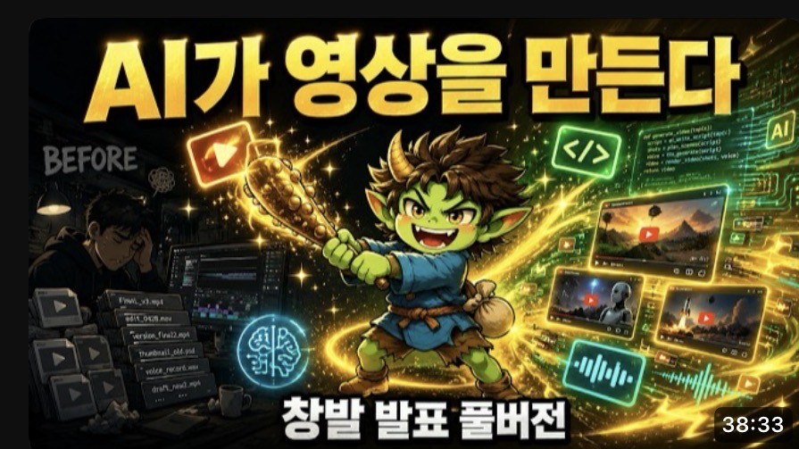
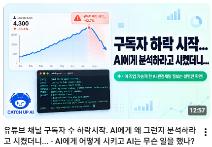
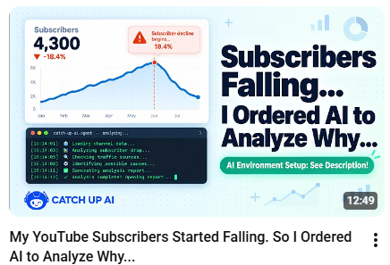

<!-- _class: lead title -->

# 유튜브 채널 살리기, 석 달 뒤
## 사람이 병목이 아니라, 사람이 개입해야 퀄리티가 보장된다

  

    
    
지난 6/26 창발 발표 「AI 시대의 크리에이터」 — 이 발표의 1편

  

  

    
    
▶ 6/26 발표 영상 (38:33)

  

  

    
    
📄 오늘 슬라이드 (PDF)

  

**박창수 · Catch Up AI** · Builders Lounge 5차 모임 · 2026-09-16

<!--
(0:30) 6월 26일 창발 발표 「AI 시대의 크리에이터」의 2편입니다. 그 뒤 석 달 동안 유튜브 채널 살리기를 계속했고, 오늘은 그 과정과 결과를 말씀드립니다. 몇 달 전에는 AI 와 일하면서 「사람이 병목이다」라고 생각해서 그런 영상까지 만들었습니다. 그런데 계속 같이 일해 보니 반대였습니다 — 사람이 병목이 아니라, 사람이 개입해야 퀄리티가 보장된다. 그걸 어떻게 깨닫게 됐는지가 오늘 이야기입니다. (썸네일을 누르면 6/26 영상, QR 은 각각 영상과 오늘 슬라이드)
-->

---

<!-- _class: phase -->

## 0. 지난 발표가 멈춘 자리 — 6/26 의 마지막 표

| Phase | 기간 | 개월 | 조회/월 | **신규 구독/월** | 비고 (6/26) |
|---|---|---:|---:|---:|---|
| P2 외부 기술 전달 | 24/03/20 ~ 25/03/31 | 12.4 | 5,751 | **+231** | 핵심 성장기 |
| P3 라이브 방송 | 25/04/01 ~ 26/02/23 | 10.8 | 4,730 | +125 | 전환 후 하락 |
| P4 AI 영상 제작 | 26/02/24 ~ 26/06/23 | 3.9 | 2,398 | **+18** | *"진행 중"* (발표 시점) |
| 발표 이후 전체 | 26/06/24 ~ 26/09/13 | 2.7 | 3,343 | +11 | 마이너스 주 포함 |
| **→ 최근 6주** | **26/08/03 ~ 26/09/13** | 1.4 | **4,844** | **+20** | 오늘 (9/15) |

> 조회는 P3 수준을 **넘었다** (발표 시점 대비 2.02배). **구독은 아직 아니다** — +18 → +20. 그 사이에 무엇이 있었나.

<!--
(0:40) 6월에 이 표로 끝냈습니다 — P4, AI 영상 제작, 월 18명, "진행 중". 그때가 채널이 제일 안 좋을 때였고, 발표 뒤에는 구독이 마이너스인 주까지 나왔습니다. 그래서 「몰락해 가는 채널 살리기」를 시작했습니다. 석 달 뒤, 어제(9/13)까지 데이터로 두 줄을 붙였습니다. 최근 6주는 조회가 월 4,800 — 라이브 시절 4,730 을 넘었습니다. 그런데 구독은 월 20명 — 발표 때 18명과 거의 그대로입니다. 오늘 얘기는 이 두 줄 사이에 있었던 일입니다.
-->

---

## 1. 바닥 — 5개월 횡보, 그리고 마이너스

<!--
(0:55) 6월 26일 창발 발표 때는 이 횡보가 계속되던 중이었고, 그나마 구독자가 살짝씩 올라가던 때였습니다. 그 뒤로 마이너스가 됐습니다. 이때부터 「몰락해 가는 유튜브 채널 되살리기」 프로젝트가 시작됐습니다. 그러다 8월 말부터 효과가 나타나기 시작했습니다. 그동안 어떤 노력을 했는지 분석하고, AI 와 같이 유튜브 스튜디오와 유튜브 API 로 데이터를 받아서 그 노력이 어떻게 나타나고 어떻게 증명되는지 확인한 것이 이번 작업입니다. AI 와 그 작업을 한 과정은 따로 정리해서 유튜브 영상으로 올렸습니다 — 오늘은 그 데이터가 말해 준 것만 이야기합니다.
-->

---

<!-- _class: ops -->

## 2. 그래서 두 가지를 바꿨다

| | 작전 1 · 자막 | 작전 2 · 내용의 질 |
|---|---|---|
| 언제 | **7월 14일 ~** | **7월 19일 ~** (7/10 마지막 요약본 → 7/19 첫 단일 주제) |
| 무엇 | 영어 AI 세미나 → **한국어 자막** · 한국어 AI 세미나 → **영어 자막** | 매주 만들던 3시간 라이브 **요약 영상을 끊고**, 한 편에 정보 하나 · 내용에 힘을 쓴다 |
| 왜 | 한국인에게 영어 영상, 미국인에게 한국어 영상은 **늘 보던 유튜브와 달라 이질감**을 준다 — 그것이 **구독 해지의 원인 중 하나**라고 판단 | 요약본은 시청자에게 도움이 될 정보가 효율적으로 전달되지 않는 형식 |
| 지금 | 영어 세미나는 **멤버 전용으로 먼저**, 2주에 2편씩 공개 — 대부분 아직 멤버 전용이라 **효과는 더 지켜봐야 한다** | 7/19 부터 단일 주제 영상 — 효과는 다음 장부터 |

<!--
(0:50) 7월 중순에 두 가지를 바꿨습니다. 하나는 자막입니다. 한국 분들에게 영어 영상, 미국 분들에게 한국어 영상은 평소 보던 유튜브와 너무 달라서 이질감을 주고, 그게 구독 해지의 원인 중 하나라고 봤습니다. 그래서 영어로 진행된 AI 세미나에는 한국어 자막을, 한국어 세미나에는 영어 자막을 달아 올렸습니다. 영어 세미나는 처음엔 멤버 전용으로 올리고 2주에 두 편씩 공개하는 정책이라 대부분 아직 멤버 전용입니다 — 그래서 이건 효과가 나타날 시기가 아니고, 조금 더 지켜봐야 합니다. 다른 하나는 내용의 질입니다. 매주 3시간 라이브를 요약하는 영상을 만들고 있었는데, 시청자에게 도움이 될 정보가 효율적으로 전달되지 않는 형식이라고 판단해서 끊었습니다. 그 대신 영상 한 편에 정보 하나를 담기로 했고, 내용에도 신경을 쓰기 시작했습니다.
-->
---

<!-- _class: tracks -->

## 3. 제 채널에 올라가는 영상은 세 부류

| | ① AI 로 만든 영상 | ② AI 세미나 녹화 | ③ 라이브 방송 |
|---|---|---|---|
| 무엇 | AI 를 생활에 더 잘 쓰는 법을 배우며 **알게 된 것을 공유** | 시애틀 AI 세미나에 **직접 가서 녹화** | **매주 일요일 3시간**, AI 로 내 일을 처리하는 과정 그대로 |
| 어떻게 | 학습·프로젝트 기록이 **전부 텍스트** → 그 기록으로 AI 가 영상 제작 | 녹화 → AI 로 **자막** → 업로드 | 1년 반째 · 한국 일 21:00 / 시애틀 일 05:00 |
| 언어 | 한국어판 만든 뒤 **영어판도 그대로** → 한 주제에 **항상 두 편** | 대부분 **영어 세미나 → 한국어 자막** · AI4PKM · Builders Lounge 는 **한국어 → 영어 자막** | 한국어 · 자막 없음 |
| 지금 | **작전 2 의 대상** | **작전 1 의 대상** — 영어 세미나는 멤버 전용 먼저, 순차 공개 · 대부분 아직 멤버 전용 | 매주 최소 3시간, 계획을 세워 집중해서 AI 작업을 하게 되는 효과 |

<!--
(0:55) 숫자를 보기 전에 제 채널에 올라가는 영상이 세 부류라는 걸 먼저 말씀드려야 합니다. 첫째, AI 로 만든 영상 — 제가 AI 를 생활에 더 잘 쓰는 법을 배우면서 알게 된 것을 공유하는 영상입니다. 학습과 프로젝트를 AI 와 하면서 그 과정이 전부 텍스트로 남기 때문에, 그 기록을 바탕으로 AI 가 영상을 쉽게 만듭니다. 그래서 한국어판을 만들면 영어판도 그대로 만들어서, 한 주제에 항상 두 편이 올라갑니다. 둘째, 시애틀 AI 세미나 녹화입니다. 대부분 영어 행사라 한국어 자막을 달고, AI4PKM 이나 Builders Lounge 처럼 한국어로 진행되는 건 영어 자막을 답니다. 이건 두 판으로 나눌 수 없어서 자막으로 갑니다. 이 부류가 작전 1 의 대상입니다 — 아까 말씀드린 대로 영어 세미나는 멤버 전용으로 먼저 올라가서 아직 대부분 멤버 전용입니다. 첫째 부류인 AI 로 만든 영상이 작전 2 의 대상이고요. 셋째, 1년 반째 매주 일요일 3시간 하는 라이브 방송 — 한국 시간 밤 9시, 시애틀 새벽 5시입니다. 제가 AI 로 제 일을 처리하는 과정을 그대로 보여 드리는 건데, 개인적으로는 매주 최소 3시간은 계획 세워 집중해서 AI 작업을 하게 되는 효과가 있습니다. 한국어로만 하고 자막은 없습니다.
-->

---

<!-- _class: score -->

## 3. 석 달 동안 87편 — 부류 · 언어별 성적

| 부류 | 언어 | 편수 | 구독 | **편당 구독** | 비고 |
|---|---|---:|---:|---:|---|
| ① AI 로 만든 영상 | 🇰🇷 한국어판 | 16 | 39 | **2.44** | 작전 2 의 대상 |
| ① AI 로 만든 영상 | 🇺🇸 영어판 | 14 | 7 | **0.50** | 같은 내용, 언어만 다름 |
| ② 세미나 녹화 | 🇺🇸 영어 세미나 · 한국어 자막 | **34** | **3** | **0.09** | 대부분 아직 **멤버 전용** → 판단 보류 |
| ② 세미나 녹화 | 🇰🇷 한국어 행사 · 영어 자막 | 8 | 19 | **2.38** | BL · AI4PKM · 광복절 |
| ③ 라이브 방송 원본 | 🇰🇷 한국어 | 15 | 11 | 0.73 | 매주 3시간 |

- 합계 **87편 · 구독 79** (26/06/24 ~ 09/10) · 한/영 짝 13쌍에서 영어판은 조회 **45%** · 구독 **24%** · 시청 국가 KR **74%**
- 영어판은 자란다 (새 편 첫 달 조회 ≈20 → ≈85) — 그래도 비중은 **41% → 16%**, 한국어가 더 빨리 자랐다

<!--
(1:00) 이제 석 달 87편의 성적입니다. AI 로 만든 영상은 한국어판이 16편에 구독 39명, 편당 2.4명. 같은 내용의 영어판은 14편에 7명, 편당 0.5명입니다. 세미나 녹화는 갈립니다 — 영어 세미나에 한국어 자막을 단 34편은 구독 3명인데, 대부분 아직 멤버 전용이라 이 숫자로 판단하지 않습니다. 반면 한국어 행사에 영어 자막을 단 8편은 편당 2.4명으로 AI 제작 한국어판과 같은 수준입니다. 라이브 원본 15편은 편당 0.7명. 언어를 보면, 같은 내용을 한국어·영어로 올린 13쌍에서 영어판은 조회가 절반, 구독은 4분의 1이고 시청 국가는 74% 가 한국입니다. 아직 한국인 채널입니다. 영어판이 요즘 늘어나는 느낌이 있었는데 반은 맞았습니다 — 새 영어 영상의 첫 달 조회는 넉 달 새 4배가 됐지만, 한국어가 더 빨리 자라서 비중은 41% 에서 16% 로 줄었습니다.
-->
---

<!-- _class: verdict -->

## 4. 가설이 틀렸다 — 데이터가 검증했다

**가설: 사람이 녹화·편집한 영상이 AI 로 제작한 영상보다 인기 있을 것이다**
근거 — 사람들은 아직 **AI 가 만든 영상에 거부감**이 있을 것이다

| | 1차 판정 | 2차 판정 |
|---|---|---|
| 사람 녹화·편집 vs AI 제작 — 구독 전환율 | **1.71배** | **0.86배** |
| 판정 | 가설이 **맞는 듯** | 가설이 **틀렸다** |

- **내용만 좋으면 AI 로 제작한 영상도 구독 전환에서 뒤지지 않는다**
- 결론 → **앞으로도 AI 로 영상을 계속 만든다**

<!--
(0:50) 여기서 전할 것이 두 가지입니다. 첫째, 제 가설이 틀렸다는 게 데이터로 검증됐습니다. 가설은 「사람이 녹화하고 편집한 영상이 AI 로 제작한 영상보다 인기 있을 것이다」 — 사람들이 아직 AI 가 만든 영상에 거부감이 있을 거라고 봤습니다. AI 가 1차로 분석한 자료에는 가설이 맞는 것처럼 나왔습니다. 사람이 녹화·편집한 영상의 구독 전환율이 AI 제작 영상보다 1.71배였으니까요. 그런데 다시 분석해 보니 0.86배 — 오히려 조금 적게 나왔습니다. 이 데이터로는 제 가설이 틀렸습니다. AI 로 제작한 영상도 내용만 좋으면 구독 전환율에서 사람이 직접 녹화하고 편집한 영상에 뒤지지 않습니다. 그래서 앞으로도 계속 AI 로 영상을 만들어도 되겠다는 결론을 얻었습니다.
-->

---

<!-- _class: verdict -->

## 4. 사람의 개입은 병목이 아니라, 퀄리티의 조건

- AI 의 **1차 분석**을 보다가 **이상한 점을 발견** — AI 제작 영상과 사람 녹화 영상의 **구분이 잘못**돼 있었다
- 바로잡아 다시 분석 → **2차 판정** 0.86배
- **AI 에게만 맡겼다면 틀린 답**을 말했을 것
- 「사람의 개입이 병목」이라던 예전 인사이트가 허물어진 자리 — **사람이 개입해야 퀄리티가 보장된다**

AI 와 데이터를 분석한 과정과 인사이트 — 기술 영상 (한국어 · 영어) 썸네일을 누르거나 QR 로

<!--
(0:50) 둘째는 이 과정에서 나온 겁니다. 「사람의 개입이 병목이다」라던 예전 제 인사이트가 허물어졌습니다. AI 가 1차로 분석한 내용을 보다가 제가 이상한 점을 발견했습니다 — AI 로 제작한 영상과 사람이 녹화·편집한 영상을 구분하는 작업을 AI 가 처음에 잘못했던 겁니다. 그걸 바로잡아 다시 분석하게 했더니 2차 판정이 나왔습니다. 즉 사람의 개입 없이 AI 에게만 맡겼다면 결과물은 틀린 것을 말했을 겁니다. 사람의 개입이 병목이 아니라, 사람이 개입해야 퀄리티가 보장된다 — AI 와 일하면서 조금씩 느껴 온 이 생각이 증명된 순간이었습니다. AI 와 데이터를 분석한 기술적인 과정과 거기서 얻은 인사이트는 이미 영상으로 올려 뒀습니다 — 한국어판, 영어판, QR 로 가시면 됩니다.
-->
---

<!-- _class: effect -->

## 5. 작전 2 (영상 퀄리티 제고) 의 효과 — 그리고 한계

| | 전환 전 · 라이브 요약 33편 | 전환 후 · 단일 주제 16편 | |
|---|---:|---:|---:|
| 편당 조회 | 63 | **148** | **2.36배** |
| 편당 구독 | 0.97 | 1.25 | 1.29배 |
| 구독 피드 유입 | 23회 | 73회 | 3.17배 |
| **유튜브 검색 유입** | 8.9회 | **6.8회** | **0.76배 ⬇** |

- 검색 유입이 줄었다 = **새로운 사람보다 기존 구독자가 보는 비율이 더 커졌다**
- 작전 1 자막 달기 · 작전 2 영상 퀄리티 제고에 이어, **새로운 사람을 더 많이 끌어들이는 작전 3** 을 생각하고 있다
- 이번 분석은 **구독자 증가율 중심**이었다 — 제대로 하려면 영상별 **조회수 · 시청 시간 · 수익**까지 종합해야 한다
- → **앱으로 개발**해 데이터로 내 채널 현황을 쉽게 분석할 수 있게 할 계획

<!--
(1:00) 작전 2, 영상 퀄리티 제고의 효과는 분명했습니다 — 편당 조회 2.36배, 편당 구독 1.29배. 그런데 유입 경로를 보면 구독 피드에서 3배 늘었고 유튜브 검색은 오히려 0.76배로 줄었습니다. 검색 유입이 줄었다는 건 새로운 사람이 보는 것보다 기존 구독자 분들이 보는 비율이 더 커졌다는 뜻입니다. 그래서 작전 1 자막 달기, 작전 2 영상 퀄리티 제고에 이어, 새로운 사람들을 더 많이 끌어들이기 위한 작전 3 을 생각하고 있습니다. 그리고 한계 하나 — 이번 분석은 구독자 증가율을 중심으로 했습니다. 더 제대로 하려면 영상별 조회수와 시청 시간, 수익까지 종합해서 봐야 합니다. 이건 앞으로 애플리케이션으로 개발해서, 데이터로 제 채널 현황을 쉽게 분석할 수 있게 할 계획입니다.
-->
---

## 6. 시차 — 작전 시작 후 6주 동안 0, 그다음 2주에 급등

<!--
(0:55) 주 단위로 풀면 이렇습니다. 7월에 작전 1·2 를 시작했는데 그 뒤 6주 동안 순증이 0 근처였고, 8월 24일 주에 16명, 그다음 주 12명, 9월 둘째 주는 13일까지 3명. 평균으로 보면 "편당 1.29배"지만 시계열로 보면 6주 0 + 2주 급등입니다. 평균은 전환점을 지웁니다. 그 주에 올라간 세 편이 구독의 76% 였고, 광고 수익도 8월이 관측 최고였습니다.
-->

---

<!-- _class: retention -->

## 7. 시청 지속률로 본 퀄리티 제고 효과

- 구독 0 이던 6주 — 데이터만 보면 「효과 없음」, 지속률로 보면 **16% → 27%** 의 **「아직 미숙」**
- **퀄리티는 마음먹는다고 올라가지 않았다 — 꾸준한 노력이 필요했고, 효과는 텀을 두고 나타났다**
- AI 의 데이터 분석만으로는 안 나온 읽기 — **사람의 정성적 평가**가 들어가 검증 지표를 찾았다

<!--
(1:05) 6주 동안 아무 일도 없었던 게 아니었습니다. AI 는 처음에 「작전 2 는 6주간 무효였고 8월 말 주제 선택이 다였다」고 읽었습니다. 저는 다르게 봤습니다 — 퀄리티를 올리자고 마음먹는다고 곧바로 올라가는 게 아니라, 꾸준히 노력한 결과가 텀을 두고 나타난 거라고요. 이건 검증할 수 있는 주장입니다. 퀄리티가 정말 올라갔다면 구독보다 먼저 시청 지속률이 움직였어야 하니까요. 그래서 안 쓰던 지표를 꺼냈습니다. 형식을 바꾼 직후엔 오히려 16%로 떨어졌다가, 6주 뒤 27%로 뛰었고 그 뒤에 구독이 따라왔습니다. 구독 0 이던 6주는 효과가 없던 기간이 아니라 아직 서툴던 기간이었습니다. 이 읽기는 AI 의 데이터 분석만으로는 안 나옵니다 — 사람의 정성적 평가가 들어가야 어떤 지표로 검증할지가 보입니다.
-->
---

<!-- _class: cases -->

## 8. 퀄리티 제고 노력의 사례들

| | AI 가 만든 것 | 사람이 바로 잡은 방법 |
|---|---|---|
| ① **팩트체크** | 요양보호사 영상 초안에 **없는 숫자 3개** — "2002년 시급 $7" · "90% 이상이 한 노조 소속" · "세 배 넘게 올랐다" | 팩트체크가 필요한 대목이라 판단 → **재조사 지시** → 조사 문서 전수 검색에 근거 없음 → **삭제**. 오류 메시지는 안 뜬다 — 사람이 봐야 잘못된 정보가 영상에 안 담긴다 |
| ② **이해하기 쉽게** | 슬라이드 내용과 설명이 **사람이 읽고 이해하기 어렵다** — 보고 나면 무슨 이야기인지 정리가 안 된다 | 같은 내용을 **사람이 이해하기 쉬운 구성·표현**으로 고친다 (이 발표 자료도 그렇게 고쳤다) |
| ③ **자막 STT** | Whisper 전사가 **고유명사에서 자주 틀린다** — beginner's school (business school) · 룰을 내면 (룰루레몬은) · 밸런스 (배런스, Barron's) · 날레스 (애널리시스) — 한 편 146행 중 **52행** | ⑴ Whisper 전사 → ⑵ 세미나 자료를 AI 에 주고 이름·회사·용어 수정 → ⑶ 전체 검토 후 **확실치 않은 곳 표시** → ⑷ 그 부분은 **내가 직접 듣고** 바로잡음 → ⑸ 틀리기 쉬운 용어를 **용어집**으로 → ⑹ 다음 영상부터 **Skill 이 자동 반영** |

<!--
(1:10) 퀄리티를 올리려고 사람이 개입한 사례 셋입니다. 첫째, 팩트체크. 요양보호사 영상 초안에 "2002년엔 시급 7달러였다", "90% 이상이 한 노조 소속이다", "세 배 넘게 올랐다"는 숫자가 있었습니다. 팩트체크가 필요한 대목이라고 판단해서 재조사를 시켰더니, 조사 문서 전체를 뒤져도 근거가 없었습니다. AI 가 지어낸 겁니다. 오류 메시지는 안 뜹니다 — 사람이 봐야 잘못된 정보가 영상에 안 담깁니다. 둘째, AI 가 만든 슬라이드와 설명은 사람이 읽고 이해하기 어렵게 나오는 경우가 많습니다. 영상을 보고 나면 무슨 이야기였는지 정리가 안 되죠. 같은 내용이라도 사람이 이해하기 쉽게 다시 구성해야 합니다 — 오늘 이 자료도 그렇게 고쳤습니다. 셋째, 자막입니다. 음성을 글로 옮기는 STT 를 먼저 하는데, 고유명사를 많이 틀립니다. 비즈니스 스쿨이 비기너스 스쿨로, 룰루레몬이 "룰을 내면"으로, 배런스가 밸런스로 — 한 편에서 146행 중 52행을 고쳤습니다. 그래서 절차를 만들었습니다. Whisper 로 전사하고, 세미나 자료를 AI 에 최대한 줘서 이름·회사·용어를 고치게 하고, 전체를 검토해서 확실치 않은 곳을 표시하게 한 뒤, 그 부분은 제가 직접 듣고 바로잡습니다. 거기서 나온 전문 용어와 약어는 용어집으로 만들어서, 다음 영상부터는 Skill 이 자동으로 반영합니다.
-->
---

## 9. 이번 조사를 통해 배운 것

> ## 사람이 병목이 아니라,
> ## **사람이 개입해야 퀄리티가 보장된다.**

- 지난 발표 "기록이 AI 를 강하게 만든다" → 이번: **AI 가 기록하고 그 기록으로 2차 생성물을 만드는 과정 모두** 사람이 검증하는 **Human Touch** 가 퀄리티를 보장한다
- 숫자 하나 **18% → 16% → 27%** — 퀄리티 제고 노력을 시작하고 **6주 뒤에야 결과가 나오기 시작**했다 → **꾸준한 노력**이 필요하다
- 다음 작전 3 — 검색 유입 **0.76배**, 새로운 사람이 검색으로 오는 비율이 줄었다 → **새로운 사람을 더 유인할 방법**을 고민 중

<!--
(1:00) 한 문장으로 닫겠습니다. 사람이 병목이 아니라, 사람이 개입해야 퀄리티가 보장된다. 지난 발표에서 기록이 AI 를 강하게 만든다고 했는데, 이번에 배운 건 그다음입니다 — AI 가 기록하고, 그 기록으로 AI 가 2차 생성물을 만드는 과정 모두 사람이 검증하는 Human Touch 가 필요하고, 그것이 퀄리티를 보장합니다. 가져가실 숫자는 18, 16, 27 — 시청 지속률입니다. 영상 퀄리티 제고 노력을 시작하고 6주 뒤에야 결과가 나오기 시작했습니다. 꾸준한 노력이 필요합니다. 그리고 다음 작전 3 — 이번 조사로 검색 유입이 0.76배, 새로운 사람이 검색으로 들어오는 비율이 줄었다는 걸 알게 됐습니다. 새로운 사람을 더 유인할 방법을 고민하고 있습니다.
-->
---

<!-- _class: lead closing -->

# 조사한 내용은 GitHub 에 공개되어 있습니다

  

    
    
<b>조사 자료 전체</b> — 데이터 파이프라인 · 가설 판정 · 87편 인벤토리 · 스크립트 
    <a href="https://github.com/solkit70/CatchUpAI_VL/tree/main/Topics/YouTube-Channel-Revival-With-AI" target="_blank" rel="noopener">github.com/solkit70/CatchUpAI_VL/tree/main/Topics/YouTube-Channel-Revival-With-AI</a>

  

  

    
    
<b>오늘 발표 자료 (PDF)</b> 
    <a href="https://github.com/solkit70/CatchUpAI_VL/blob/main/Topics/YouTube-Channel-Revival-With-AI/05-Slide-Deck/slides/presentation-0916.pdf" target="_blank" rel="noopener">…/05-Slide-Deck/slides/presentation-0916.pdf</a>

  

**YouTube** youtube.com/@catchupai · **catchupai.net**

<!--
(0:15) 오늘 보여드린 숫자와 코드는 전부 깃허브에 있습니다. 왼쪽 QR 이 조사 자료 전체, 오른쪽이 오늘 발표 자료 PDF 입니다. 틀린 판정도 지우지 않고 남겨 뒀습니다. 감사합니다.
-->
